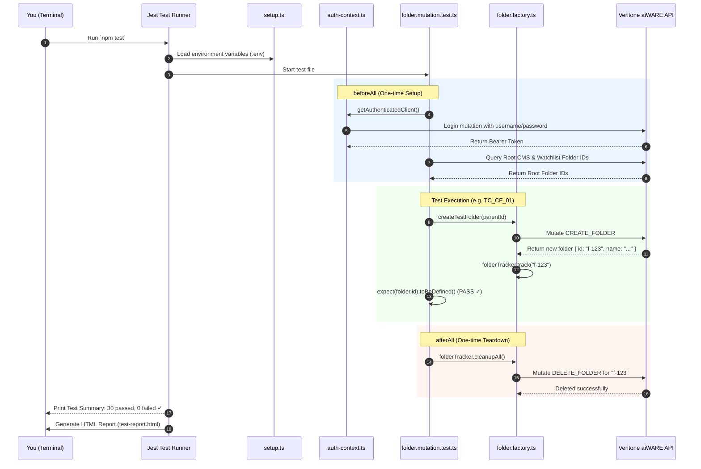

# 🎓 Beginner's Guide: How the Automated GraphQL Test Suite Works

> **Author:** Senior QA / Test Automation Engineer  
> **Target Audience:** Absolute Beginner (No prior test automation experience required!)  
> **Codebase Location:** [`tests/`](file:///home/huycao/Coding/Examples/Test-With-Jest/Codebase/tests)

---

## 🌟 Welcome! Introduction from Your Senior Tester

Hello and welcome to test automation! 

If you are looking at the [`tests/`](file:///home/huycao/Coding/Examples/Test-With-Jest/Codebase/tests) folder and feeling intimidated by words like *Jest, GraphQL, Mutations, Factories, and Teardown*, take a deep breath. 

At its core, **what this test folder does is very simple**:
> It is an **automated inspection robot** that tests a cloud system (Veritone aiWARE). It pretends to be a user who logs into the system, creates virtual folders, renames them, moves them around, and deletes them—checking every single time whether the system behaved properly or broke.

Instead of a human clicking buttons in a browser for 3 hours, this test suite does all of that in **a few seconds** and prints a nice green checkmark `✓` for everything that works.

Let’s break down how this entire machine works piece by piece!

---

## ☕ The Big Picture: Real-World Analogies

To understand this codebase, let's use three everyday analogies:

```
┌────────────────────────────────────────────────────────────────────────┐
│                        THE RESTAURANT ANALOGY                          │
├────────────────────────────────────────────────────────────────────────┤
│ 1. The API (Application Programming Interface):                        │
│    The waiter who takes your order to the kitchen and brings back food.│
│                                                                        │
│ 2. GraphQL:                                                            │
│    A custom order menu. Instead of ordering a fixed combo, you say:   │
│    "Give me only the burger bun and cheese, no onions."                │
│    (You ask only for the exact data fields you want back).             │
│                                                                        │
│ 3. Jest:                                                               │
│    The Health & Food Inspector with a clipboard.                       │
│    The inspector checks: "Is the food hot? (expect(temp).toBe(100))"   │
│    If yes -> PASS. If no -> FAIL.                                      │
│                                                                        │
│ 4. TypeScript:                                                         │
│    A smart grammar/spell-checker that spots mistakes before you run.   │
└────────────────────────────────────────────────────────────────────────┘
```

---

## 🗺️ Map of the Kingdom: Folder Structure

Here is how the [`tests/`](file:///home/huycao/Coding/Examples/Test-With-Jest/Codebase/tests) directory is organized:

```
tests/
├── setup.ts                 <-- ⏰ Morning Routine (Runs before anything else)
│
├── helpers/                 <-- 🛠️ Tools & Plumbers (Does the heavy lifting)
│   ├── graphql-client.ts    <-- 📞 The Telephone (Sends requests over the internet)
│   └── auth-context.ts      <-- 🪪 The Security Badge (Logs in & gets an access token)
│
├── graphql/                 <-- 📜 The Script / Dictionary
│   └── folder/
│       ├── mutations.ts     <-- ✏️ Actions that CHANGE data (create, update, delete)
│       └── queries.ts       <-- 🔍 Actions that READ data (find, check)
│
├── factories/               <-- 🏭 The Data Toy Factory & Janitor
│   └── folder.factory.ts    <-- Creates test folders & cleans them up when done
│
└── folder/                  <-- 📋 The Actual Exam Papers (Test Cases)
    └── folder.mutation.test.ts
```

---

## 🏛️ The Golden Rule of Test Architecture

There is a core software testing design principle used in this codebase:

> **"Tests should describe behavior; helpers should hide infrastructure."**

When you open a test file like [`folder.mutation.test.ts`](file:///home/huycao/Coding/Examples/Test-With-Jest/Codebase/tests/folder/folder.mutation.test.ts), you want to read simple English statements like:
- *"Create a folder named Project A"*
- *"Check that it exists"*
- *"Delete it"*

You **do NOT** want to see 50 lines of messy HTTP headers, JSON parsing, login tokens, and network error handlers repeated in every single test. All of that messy plumbing is tucked away inside `helpers/` and `factories/`.

---

## 🔍 Layer-by-Layer Walkthrough

Let's examine each file from the bottom up (from infrastructure up to the actual test cases).

---

### 1. `setup.ts` — The Morning Routine
- **File:** [`tests/setup.ts`](file:///home/huycao/Coding/Examples/Test-With-Jest/Codebase/tests/setup.ts)
- **What it is:** The setup script configured in [`jest.config.js`](file:///home/huycao/Coding/Examples/Test-With-Jest/Codebase/jest.config.js).
- **What it does:**
  1. **Loads Environment Variables (`dotenv.config()`):** Reads your secret credentials (like your API URL, username, and password) from your private `.env` file so you don't hardcode passwords in the code.
  2. **Cleans Mocks (`beforeEach(() => jest.clearAllMocks())`):** Wipes the slate clean before each test so tests don't interfere with one another.

---

### 2. `helpers/graphql-client.ts` — The Delivery Courier
- **File:** [`tests/helpers/graphql-client.ts`](file:///home/huycao/Coding/Examples/Test-With-Jest/Codebase/tests/helpers/graphql-client.ts)
- **What it does:** 
  It is the delivery driver between Jest and the Veritone cloud server.
- **Key Functions:**
  - `createGraphQLClient(endpointUrl, defaultHeaders)`: Builds a client.
  - `client.query(...)`: Sends a GraphQL query (to read data).
  - `client.mutate(...)`: Sends a GraphQL mutation (to write/change data).
- **How it works under the hood:**
  It uses the standard modern JavaScript `fetch()` command to send an HTTP `POST` request with JSON containing `{ query: "...", variables: { ... } }`. If the server responds with an error, it bundles the error into a clean object so the test can inspect it.

---

### 3. `helpers/auth-context.ts` — The Security Badge & VIP Pass
- **File:** [`tests/helpers/auth-context.ts`](file:///home/huycao/Coding/Examples/Test-With-Jest/Codebase/tests/helpers/auth-context.ts)
- **What it does:**
  Most APIs don't let random strangers touch their database. You need to log in first!
- **Key Functions:**
  - `login()`: Takes the username and password from `.env`, sends a `USER_LOGIN` mutation to the API, and gets back a **Bearer Token** (like an electronic hotel keycard).
  - **Session Caching (`cachedSession`):** A senior tester optimization! Instead of logging into the server before every single one of our 50 tests (which would take forever and hammer the server), we log in **once**, save the token in memory, and reuse it for all tests.
  - `getAuthenticatedClient()`: Returns both the logged-in client (with `Authorization: Bearer <token>` attached to every request) and the user's session details (User ID, Organization ID).

---

### 4. `graphql/folder/` — The Dictionary of GraphQL Queries & Mutations
- **Files:** 
  - [`mutations.ts`](file:///home/huycao/Coding/Examples/Test-With-Jest/Codebase/tests/graphql/folder/mutations.ts)
  - [`queries.ts`](file:///home/huycao/Coding/Examples/Test-With-Jest/Codebase/tests/graphql/folder/queries.ts)
- **What it is:**
  In GraphQL, requests are strings written in GraphQL syntax. Instead of cluttering our test files with large strings, we define them here as constants:
  - `CREATE_FOLDER`: Tells the API to make a new folder.
  - `UPDATE_FOLDER`: Tells the API to rename a folder.
  - `MOVE_FOLDER`: Tells the API to move a folder into a different parent folder.
  - `DELETE_FOLDER`: Tells the API to delete a folder.
  - `CHECK_ROOT_FOLDERS`: Asks the API what top-level root folders exist.

---

### 5. `factories/folder.factory.ts` — The Smart Toy Factory & The Janitor
- **File:** [`tests/factories/folder.factory.ts`](file:///home/huycao/Coding/Examples/Test-With-Jest/Codebase/tests/factories/folder.factory.ts)
- This file does **two crucial jobs**:

#### Job A: The Factory (`buildFolderInput`, `createTestFolder`)
Imagine writing 30 tests, and in every test you have to think up a folder name, description, and parent ID. That's tedious!
The factory generates unique test data automatically:
```typescript
name: `Test-Folder-${Date.now()}-${Math.floor(Math.random() * 1000)}`
```
Because it uses the current timestamp (`Date.now()`), the folder name is **guaranteed to be unique**. If two tests run at the same time, their folder names will never clash!

#### Job B: The Janitor (`FolderTracker` & `cleanupAll`)
This is a hallmark of senior test design. 
- **The Problem:** If tests create 50 folders in the database and don't delete them, the database gets clogged with thousands of garbage folders.
- **The Solution:** Whenever `createTestFolder` creates a folder, it quietly hands the folder ID to `folderTracker.track(folder.id)`.
- When all tests finish, `folderTracker.cleanupAll(client)` runs automatically, loops through every created folder in reverse order, and deletes them!
- **Result:** Zero pollution left behind in the database.

---

### 6. `folder/folder.mutation.test.ts` — The Test Suite (The Exam)
- **File:** [`tests/folder/folder.mutation.test.ts`](file:///home/huycao/Coding/Examples/Test-With-Jest/Codebase/tests/folder/folder.mutation.test.ts)
- This is the main test file! It contains **6 suites** covering the full lifecycle of folders:

```
┌──────────────────────────────────────────────────────────────┐
│                    FOLDER LIFECYCLE SUITES                   │
├──────────────────────────────────────────────────────────────┤
│ Suite 1: createRootFolders (Bootstrap root CMS/Watchlist)    │
│ Suite 2: createFolder      (Normal subfolders & edge cases)  │
│ Suite 3: updateFolder      (Rename & change descriptions)    │
│ Suite 4: moveFolder        (Single folder relocation)        │
│ Suite 5: moveFolders       (Batch multi-folder relocation)   │
│ Suite 6: deleteFolder      (Removal & cleanup)               │
└──────────────────────────────────────────────────────────────┘
```

---

## 🎬 Anatomy of a Test: The 4 A's

Every professional test case follows the **AAA (or 4 A's)** pattern:
1. **Arrange:** Get everything ready (create parent folder, prepare inputs).
2. **Act:** Do the action we want to test (call the API).
3. **Assert:** Check that the outcome matches our expectations (`expect(...)`).
4. **Annul (Teardown):** Clean up the data created so future tests start fresh.

### Let's look at real code from the test suite:

```typescript
it("TC_CF_01: Happy Path Single Folder Creation Under CMS Root", async () => {
  // 1. ARRANGE: Prepare the input data
  const input = buildFolderInput({
    parentId: rootCmsId,
    name: "Documents-Folder",
  });

  // 2. ACT: Call the API mutation
  const response = await client.mutate(CREATE_FOLDER, { input });

  // 3. ASSERT: Verify the API responded correctly
  expect(response.errors).toBeUndefined();               // No errors allowed!
  expect(response.data.createFolder.name).toBe("Documents-Folder"); // Name must match!
  expect(response.data.createFolder.id).toBeDefined();   // Server must assign an ID!
});
```

---

## 🔄 Complete Execution Flow (What Happens When You Type `npm test`)

Here is the entire journey of a test run from start to finish:



---

## 💡 What Makes This Test Suite "Senior Level"?

If you are learning testing, take note of these 5 industry best practices used here:

| Practice | Why it matters | Where to find it in this codebase |
| :--- | :--- | :--- |
| **1. Zero Hardcoded Passwords** | Security! Credentials live in `.env`, not in GitHub. | [`setup.ts`](file:///home/huycao/Coding/Examples/Test-With-Jest/Codebase/tests/setup.ts) |
| **2. Auth Token Caching** | Speed! We log in once instead of before every test. | [`auth-context.ts`](file:///home/huycao/Coding/Examples/Test-With-Jest/Codebase/tests/helpers/auth-context.ts) |
| **3. Automated Teardown** | Cleanliness! Test databases don't get littered with test junk. | [`folder.factory.ts`](file:///home/huycao/Coding/Examples/Test-With-Jest/Codebase/tests/factories/folder.factory.ts) |
| **4. Independent Tests** | Reliability! Tests don't depend on each other's state; any test can run in isolation. | [`folder.mutation.test.ts`](file:///home/huycao/Coding/Examples/Test-With-Jest/Codebase/tests/folder/folder.mutation.test.ts) |
| **5. Negative Testing** | Completeness! We test both sunny day (valid data) and rainy day scenarios (duplicate names, invalid IDs, missing fields). | [`folder.mutation.test.ts`](file:///home/huycao/Coding/Examples/Test-With-Jest/Codebase/tests/folder/folder.mutation.test.ts) |

---

## 🚀 How to Run the Tests Yourself

Open your terminal in [`Test-With-Jest/Codebase`](file:///home/huycao/Coding/Examples/Test-With-Jest/Codebase) and try these commands:

1. **Run all tests once:**
   ```bash
   npm test
   ```
2. **Run tests in interactive watch mode (re-runs when you save a file):**
   ```bash
   npm run test:watch
   ```
3. **Run tests and view code coverage:**
   ```bash
   npm run test:coverage
   ```
4. **View the visual HTML report:**
   After tests complete, open `test-report.html` in your browser to see an interactive dashboard of all passed and failed tests!

---

## 🎓 Summary Cheat Sheet for Beginners

- **Jest** is our test engine and judge.
- **`setup.ts`** configures the testing environment before tests start.
- **`graphql-client.ts`** is the telephone that calls the API.
- **`auth-context.ts`** is the security pass so the API knows who we are.
- **`folder.factory.ts`** builds test data with unique names and remembers to delete them afterwards.
- **`folder.mutation.test.ts`** is the actual list of test questions and answers.
