# `citest` Complete Workflow Graph

Here is the complete visualization of the workflow from scratch when running the integration tests in the `citest` directory. It maps the execution from the initial npm command through Jest's initialization, global setup, test sequencing, individual test execution against the live GraphQL server, and finally, teardown.

```mermaid
flowchart TD
    %% Define styles
    classDef startEnd fill:#f9f,stroke:#333,stroke-width:2px;
    classDef config fill:#e1f5fe,stroke:#03a9f4,stroke-width:1px;
    classDef setup fill:#e8f5e9,stroke:#4caf50,stroke-width:1px;
    classDef test fill:#fff3e0,stroke:#ff9800,stroke-width:1px;
    classDef server fill:#fce4ec,stroke:#e91e63,stroke-width:2px;

    %% Workflow Steps
    Start(["Start: npm run citest"]):::startEnd --> JestInit["Jest Framework Initialization"]:::config
    JestInit --> Config["Load jest.config.js"]:::config
    
    subgraph GlobalSetup ["Global Environment Initialization"]
        Config --> GlobalSetupFile["jest.global.setup.js"]:::setup
        GlobalSetupFile --> MockServer["Start Ayrshare Mock Server<br/>(if AYRSHARE_MOCK=1)"]:::setup
        MockServer --> ConnectGQL["Connect to Live GraphQL Server<br/>using testconfig.json credentials"]:::setup
        ConnectGQL --> FetchFlags["Fetch featureFlags<br/>and set global variables"]:::setup
        FetchFlags --> ReturnSetup["Return Control to Jest"]:::setup
    end
    
    ReturnSetup --> SequencerInit["Initialize Test Sequencer"]:::config
    
    subgraph TestSequencing ["citest-sequencer.js"]
        SequencerInit --> Discover["Discover all matching spec files"]
        Discover --> SortPhase["Sort Tests"]
        SortPhase --> CheckPinned{"Is Test Pinned First?<br/>e.g., auditLog.platform.spec.js"}
        CheckPinned -- Yes --> PinFirst["Move to Start"]
        CheckPinned -- No --> KeepOrder["Keep Order"]
        PinFirst --> ShardingPhase["Shard Tests across processes"]
        KeepOrder --> ShardingPhase
        ShardingPhase --> ColocatePhase["Co-locate specific tests<br/>in the last shard<br/>e.g., orgInviteAppRole"]
    end
    
    ColocatePhase --> SuiteInit["Test Suites Execution"]:::test
    
    subgraph TestExecutionPhase ["Test Execution Phase"]
        SuiteInit --> Evaluate["Evaluate itif / describeif<br/>using global feature flags"]:::test
        Evaluate --> BuildQuery["Build Queries/Mutations<br/>via tools/graphql-api/ client<br/>or helper modules"]:::test
        BuildQuery --> Request(("Send Request to<br/>Live core-graphql-server")):::server
        Request --> Assert["Assert GraphQL Response Data<br/>& Check Side Effects"]:::test
        Assert --> LoopCheck{"More Tests in Shard?"}:::test
        LoopCheck -- Yes --> Evaluate
    end
    
    LoopCheck -- No --> GlobalTeardownInit["Initialize Global Teardown"]:::config
    
    subgraph GlobalTeardown ["Environment Cleanup"]
        GlobalTeardownInit --> GlobalTeardownFile["jest.global.teardown.js"]:::setup
        GlobalTeardownFile --> CloseMock["Close Ayrshare Mock Server"]:::setup
        CloseMock --> Cleanup["Clean up resources"]:::setup
    end
    
    Cleanup --> End(["End: Report Test Results"]):::startEnd
```

## Detailed Breakdown

1. **Start & Configuration**: The test suite is invoked via `npm run citest`. Jest starts and loads `jest.config.js`, which defines aliases, transforms, and test ignorations.
2. **Global Setup**: Jest executes `jest.global.setup.js` *before* any tests run. This script connects to the live GraphQL server using credentials, fetches the current feature flags, and stores them on the `global` object. It also starts mock servers (like Ayrshare) if requested via environment variables.
3. **Test Sequencing (`citest-sequencer.js`)**: Before tests are distributed to worker processes, Jest uses the custom sequencer. It ensures specific critical tests (like `auditLog.platform.spec.js`) run first, shards the tests appropriately, and pins mutually exclusive tests (that share the same super-admin token) into the same final shard so they run sequentially instead of concurrently.
4. **Execution Phase**: Inside the test suites (located in folders like `orgInvite`, `package`, `sideEffect`), tests use variables like `global.enableRBACFeature` alongside `itif()` helper methods to determine if they should run. The tests leverage the `tools/graphql-api/` typed client to interact with the API. 
5. **Global Teardown**: Finally, `jest.global.teardown.js` executes, ensuring that spawned mock servers are gracefully closed down to prevent port hanging.
