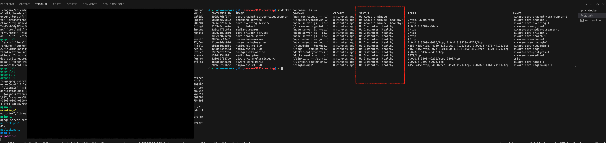
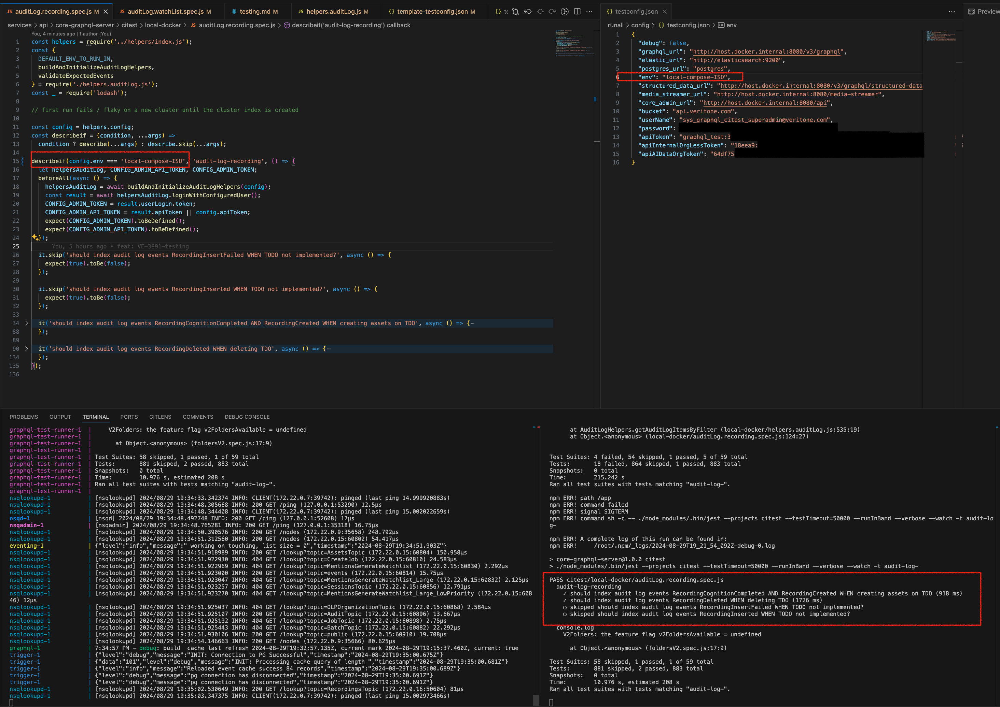
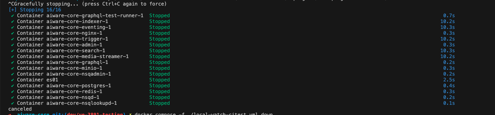
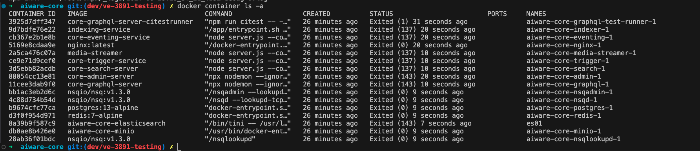
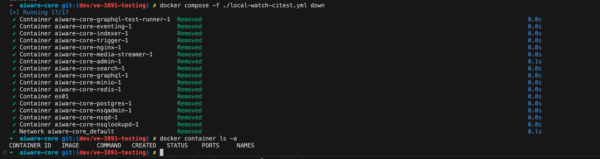
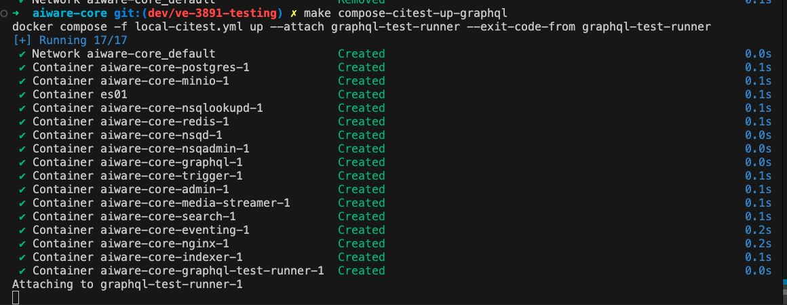
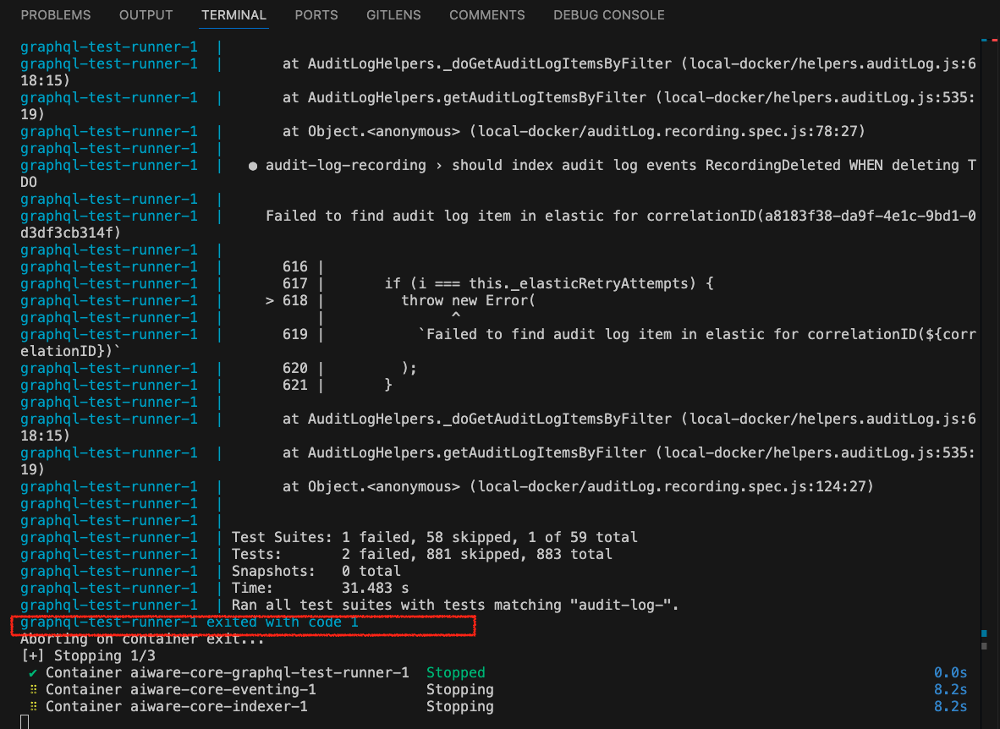
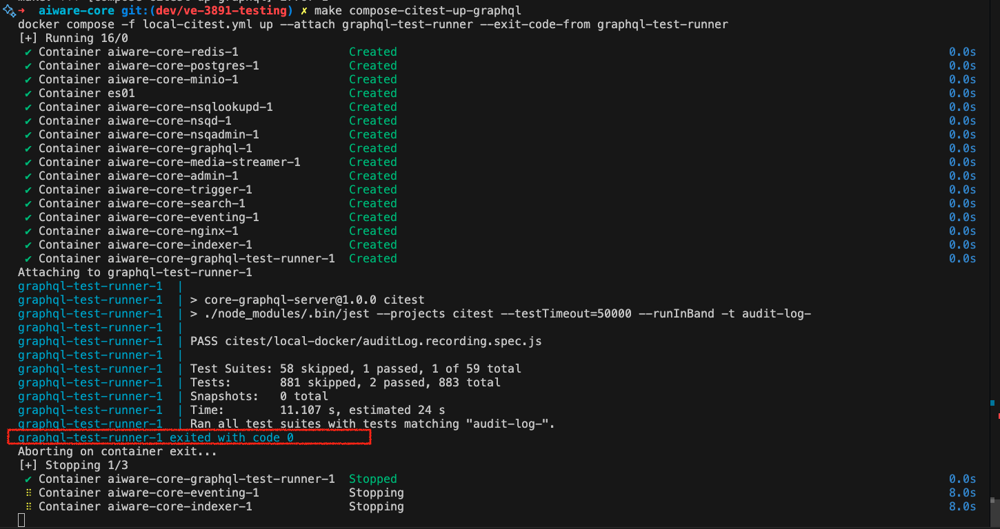

# ci-testing-with-local-docker-compose

## engineering-setup

### prerequisites

1. docker compose at a version higher than `v2.27.1`

```sh
docker compose version
```

2. enough host resources dedicated to docker
3. run

```sh
docker buildx ls
# if this errors or is not returned then upgrade your version of docker
```

### vocabulary

1. host: `this is your machine`
2. docker, docker runtime: `this is the vitually hosted docker runtime hosted by the host machine running a container runtime ... containerd, docker, ...`
3. docker container, container: `this is a running docker image running in the docker runtime, in production this could be a non docker runtime like ai13s or k8s ...`
4. docker image, image: `this is a snapshot of assets on the host disk to be ran as a container`
5. buildkit, this is the modernized version of `docker build` it includes the ability to setup specific build runners and build based on a defined file "bake" either with HCL or JSON, more info here [buildkit](https://docs.docker.com/build/buildkit/), the command will go like `docker buildx ...` but `docker build ...` continues to be supported

### options-to-assist-in-engineering-integration-test-locally

* option details are laid out below within the various sections

1. [docker-compose-common-setup](#docker-compose-common-setup)
1. The intent of this section is to allow for node to be used from the host machine to execute on the containers.  Whether it's to stand up `core-graphql-server` on the host with host version of node to communicate with postgres in a container or it's to run `citest` from within `./services/api/core-graphqlserver` on the host with node to test the docker virtual hosted containers.
2. [docker-compose-watch-with-test-runner](#docker-compose-watch-with-test-runner)
1. The intent of this section is to stand up a container runtime where you can develop against the container runtime and have the files mounted on the host to the container runtime.  The services that are setup will be restarted on file changes within the host machine including the `citest` runner.
3. [docker-compose-watch-with-out-test-runner](#docker-compose-watch-with-out-test-runner)
1. The intent of this section is to stand up a container runtime where you can develop against the container runtime and have the files mounted on the host to the container runtime.  The services that are setup will be restarted on file changes within the host machine.
4. [docker-compose-citest-smoke](#docker-compose-citest-smoke)
1. The intent of this section is to have zero volume mounts for the services so that the docker images can be tested to the fullest on a single architectured machine in a docker compose environment.  This doesn't represent the full `ai13s` environment and additional testing will be needed in that regard to test the potential escapes that could happen with `ai13s`.

#### comments-regarding-volume-mounts

This file [local-watch](https://github.com/veritone/aiware-core/blob/master/local-watch.yml) for say [graphql](https://github.com/veritone/aiware-core/blob/master/local-watch.yml#L73).

What's occurring in this case is that the host machine is mounted and bound to the containers file system for the files listed here: [graphql-volume-mounts](https://github.com/veritone/aiware-core/blob/master/local-watch.yml#L77).

Which means we are overriding the containers files (which in some cases can be bad as it's not equal to what the docker image / container was built with) but in other cases like engineering could be good because we want the snapshot of things like `node_modules` because the Dockerfile can consistently reproduce these dependency during build (`docker build -t <some_tag> .` or in our case with compose `make compose-build` or `make compose-build-nc` <= we are snapshotting the state of things on the machine to the docker image minus any ignores in `.dockerignore`).  In our case `node_modules` are ignored via `.gitignore` and `.dockerignore` and this is best practice for reproduction of state for node dependencies within docker images along with any concepts as in node for utilizing package locking mechanics (`yarn install --frozen-lockfile`, `npm ci`, ...).  Whereas the host machine can drift because the engineer can do things out of the ordinary for whatever reason, meaning run `npm i <some_random_package>` or `npm update <some_random_package>` and not commit `package-lock.json` or `package.json` as an example and that can lead to works on my machine type of scenarios.

Regarding comments about the less volume mount side of the fence in the case of `local.yml` there are no volume mounts to files on host machine eg.) therefore when running `make compose-citest-up` the `citest` files are from the docker image snapshot built with `make compose-build` and can be more attributable to what would be released (as long as there are no staged / changed / not pushed files on local this would be equivalent to head of branch on origin).  In some cases you may want to bind the `citest` to local files and in that case use `make compose-citest-watch-up` OR `make compose-watch-citest-up`.

#### docker-compose-common-setup

1. Setup local, please refer to the ROOT README.md section `## Develop locally`, specifically on external dependency with repository realtime

* please be advised that every so often to pull the realtime repo as it's currently out of band of this repository but is a dependency for these test
* team to discuss moving `aiware-data` / `aiware-core` dependencies from `realtime` repository into `aiware-core` repository

2. run, from the root of this cloned repository `aiware-core`

```sh
cp ./runall/config/.env-template .env
# or manually adjust ./env

source .env
```

3. Setup for harbor integration by logging into harbor.

* use `devaudit` credentials
* this requires VPN to Veritone VPN
* if this is not feasible please see next step

```sh
docker login harbor5.ops.veritone.com --username devaudit --password u<REDACTED>p

# OR
# modify .env and source .env
# OR per terminal session
export HARBOR_SECRET=u<REDACTED>p
env | grep HARBOR_SECRET
make harbor-login

#OR
docker login harbor5.ops.veritone.com --username devaudit --password ${HARBOR_SECRET}
```

5. To setup environment on a go forward please look to run the below or integrate the environment variables to `.env` from `./runall/config/.env-template` manually.

```sh
cp ./runall/config/.env-template ./.env
```

6. The default setup for compose and dockerfiles are to call harbor `harbor5.ops.veritone.com`.  If wanting to switch this to call into Docker hub.  The previous setup for harbor login can be bypassed.
7. The default setup for compose and dockerfiles are to call harbor `harbor5.ops.veritone.com`.  If wanting to switch this to call into Docker hub then change the variables within `./.env`. The previous setup for harbor login can be bypassed.

* `DOCKER_BASE_IMAGE_ORIGIN=docker.io/`
* `VERITONE_BASE_IMAGE_ORIGIN=registry.central.aiware.com/`

```sh
export VERITONE_REGISTRY_CENTRAL_USERNAME=<a-reg-central-username>
export VERITONE_REGISTRY_CENTRAL_PASSWORD=<a-reg-central-password>
docker login registry.central.aiware.com --username ${VERITONE_REGISTRY_CENTRAL_USERNAME} --password ${VERITONE_REGISTRY_CENTRAL_PASSWORD}
# OR
make registry-central-login
```

8. citest with vNext Dockerfile

* the files `Dockerfile` and `Dockerfile.vnext` are very similar they differ in the runner stage addition and `Dockerfile.vnext` removes secrets from the layers (this could not be done without additional adjustments to Jenkins builds) and the default registry pulling from harbor pull through cache vs direct to docker hub
* it's best to test against `Dockerfile` image (do not run this step, specifically the setting of `./.env` variable `COMPOSE_DOCKERFILE` if wanting to use the `Dockerfile` image) until Jenkins can be shimmed out from publishing (it does take longer to build `Dockerfile` as the unit test run inline)
  * `COMPOSE_DOCKERFILE=Dockerfile.vnext`

```sh
# NOTE: the Dockerfile is typically setup to run unit test in line of the build vs Dockerfile.vnext sets up a runner and defers unit test to using the runner ... see local-ut.yml and run that for unit test

cat ./.env | grep COMPOSE_DOCKERFILE
docker compose -f local.yml -f local-citest.yml build --no-cache

# see what is going to be ran
docker compose -f local.yml -f local-citest.yml config
# test what is to be ran
docker compose -f local.yml -f local-citest.yml up --dry-run
# run it
docker compose -f local.yml -f local-citest.yml up --attach citest-runner --exit-code-from citest-runner
docker compose -f local-all.yml down
unset COMPOSE_DOCKERFILE
cat ./.env | grep COMPOSE_DOCKERFILE

# OR
cat ./.env | grep COMPOSE_DOCKERFILE
SERVICE=graphql make compose-build-t-nc
make compose-citest-up
make compose-down
unset COMPOSE_DOCKERFILE
cat ./.env | grep COMPOSE_DOCKERFILE
```

#### docker-compose-watch-with-test-runner

1. setup configurations

* the command below will create a file at `./runall/config/secrets/testconfig.json` at this time replace `<REPLACE_ME>` within that file manually and correlate to secrets that we us for stage etc...
* additionally if wanting to isolate test change the env to `local-compose-ISO` otherwise the default env is `local-compose` this will run `citest` depending on filter setup within `.env` `COMPOSE_CITEST_FILTER`.  
* You may also find that setting the property `debug` within `./runall/config/secrets/testconfig.json` to `true` helps with additional context while debugging test.

```sh
# from root of this repository
make compose-citest-setup
```

2. build with docker compose

* Depending on what you're trying to accomplish replace this section where it states `compose-watch-citest` with `compose-citest-watch`.  In the case of `compose-citest-watch` you want to use the containers that most resemble the deployed runtime with minimal volume mounts, but if you want the test to rerun when files are changed/touched.  In the scenario where `compose-watch-citest` is used as this has hooks for restarting the other applications and may not exactly behave as it were in a deployed environment as the Entrypoints and Commands have been modified to help in restarting the services.

```sh
# from root of this repository
make compose-build

# ASIDE OR see more on `--no-cache` but will attempt to rebuild layers even if cached on local disk
make compose-build-nc

# ASIDE OR to target a specific container image within compose file if the build fails for some reason this allows to build without building all container images
SERVICE=elasticsearch make compose-build-t
# OR
SERVICE=elasticsearch make compose-build-t-nc
```

3. start containers

* This will start the container images within `./local.yml` and `local-citest.yml` including a test runner in watch host file mode.

```sh
# from root of this repository
docker compose -f local-watch.yml -f local-citest-watch.yml up

# OR
make compose-watch-citest-up
```



4. start citest in watch mode

* This will start the container images within `./local.yml` and `local-citest-watch.yml` including a test runner in watch host file mode.

```sh
# from root of this repository
make compose-citest-watch-up

# tail test runner in new terminal
make compose-citest-logs
```

5. start containers and citest in watch mode

* This will start the container images within `./local-watch.yml` and `local-citest.yml` including a test runner.  The containers within are in watch mode and changes to files will restart those respective services. What this means is that when the containers become healthy at any point touching these files will cause the servers / test runner to be restarted.  In some cases like graphql where flyway is running please wait for steady state in the logs prior to touching the test files for a rerun (eventually we can change the lock mechanism to abide appropriately in fturue).

```sh
docker logs aiware-core-graphql-test-runner-1 -f

# OR
make compose-citest-logs
```

6. writing test

* add / modify a spec file in `./services/api/core-graphql-server/citest/local-docker`
* `./services/api/core-graphql-server/citest/local-docker/auditLog.authentiation.spec.js` has a `it` test named `TEMPLATE` as a good starting place to copy from
* the setup is watching this folder for changes and will rerun the citest on changes
* some of the services are set to restart on file changes

7. isolating a test

* To isolate a test change the `./runall/config/secrets/testconfig.json` env to `local-compose-ISO` then within the spec file change the predicate on the `describeif`, see screenshot.
* When making changes to test with the `./services/core-graphql-server/citest` folder the test will rerun or if just wanting a rerun just touch the file in some way.
* If needing to further isolate some jest decorators may help like `it.only` ...



8. tearing down

* run `Ctrl+c` to stop the `make compose-up` or `make compose-citest-up` terminal, any other containers tailing should close automatically
* the volume data will not go away so if running `make compose-up` or `make compose-citest-up` again all data from a previous run will be persisted

```sh
# the containers are still available and can be verified by running the below
docker container ls -a
```




8. cleaning up

```sh
# run the following to destroy the containers
make compose-down
# the containers will not longer be available and can be verified with the next command
docker container ls -a

# OR
make compose-cleanup
```



9. cleaning up volumes

* The data from these runs exist within docker volumes.  To purge these volumes to allow for a clean state follow the below commands.  When completed data from previous runs is gone.

```sh
# will show all volmes
docker volume ls
# the following command will show volumes that are not associated with any container eg.) `docker compose down` has been ran
docker volume ls -f dangling=true


# the above command must show volumes as dangling if it does then the following command can be ran to purge the volumes
make compose-cleanup
# OR
docker volume prune -a -f

# OR
make compose-cleanup
```

10. full system purge

* only run as a last resort as this removes everything docker related images, volumes, containers

```sh
docker system prune -a --volumes -f
```

#### docker-compose-watch-with-out-test-runner

This document will not go into the detail as above but suffice it that to get this going then run the following.

1. setup for testing, must add file to `./service/api/core-graphql-server/testconfig.json` and populate with secrets.

```sh
# make sure if running previous up command to tear that down first mileage may vary but always good to start with a clean slate
#############################################
# OPTION 1
#############################################
make compose-build
#OR
make compose-build-nc

make compose-up

#############################################
# OPTION 1
#############################################
make compose-watch-up

#############################################
# OPTION 2
#############################################
nvm use v20
npm install pnpm@10.34.1 turbo --global
pnpm install

# test files are located in ./service/api/core-graphql-server/citest/local-docker

# will run the whole describe block for authentication spec
pnpm --filter core-graphql-server run citest -- -t 'audit-log-auth'

# target specific test that matches the regex ... end the string with '$' targeting a specific test and not the group of test
pnpm --filter core-graphql-server run citest -- -t 'audit-log-organization should index audit log when fetching integration settings$'

# target spec of test for all of audit log
pnpm --filter core-graphql-server run citest -- -t 'audit-log'

# Please see above section `docker-compose-watch-with-test-runner` with more details on tear down decisions and substitue file name in that case
```

#### docker-compose-citest-smoke

* running this is to test the Docker image and container without any overrides to the entrypoint or command to test as closely as possible to a production environment and understand the health on single execution

1. make sure starting with clean slate in some way at minimal `make compose-down` has been ran for any previous runs.  It is recommended to run `make compose-cleanup` to destroy any previous volume data.
2. setup local, please refer to the ROOT README.md section `## Develop locally`

* please be advised that every so often to pull the realtime repo as it's currently out of band of this repository but is a dependency for these test

3. setup configurations

* the command below will create a file at `./runall/config/secrets/testconfig.json` at this time replace `<REPLACE_ME>` within that file manually and correlate to secrets that we us for stage etc...
* additionally if wanting to isolate test change the env to `local-compose-ISO` otherwise the default env is `local-compose` this will run `citest` depending on filter setup within `.env` `COMPOSE_CITEST_FILTER`.

```sh
# from root of this repository
make compose-citest-setup
```

4. build with docker compose

```sh
make compose-build

# ASIDE OR see more on `--no-cache` but will attempt to rebuild layers even if cached on local disk
# RECOMMENDED IF FINAL TESTING: In running this way you are full capturing the current state of the docker image
# This is the recommended approach outside of a full ci machine to verify changes
make compose-build-nc

# ASIDE OR to target a specific container image within compose file if the build fails for some reason this allows to build without building all container images
SERVICE=elasticsearch make compose-build-t
# OR no-cache
SERVICE=elasticsearch make compose-build-t-nc
```

5. start containers

* This will start the container images within `./local.yml` AND `./local-citest.yml` including a test runner.  This is a heavy task but will show a exit code from the test runner.  If needing something more efficient for and engineering cycle see above watch sections.  This is intended for a CI server but for repro here or if wanting to quickly come into a branch and quickly see if there are issues.

```sh
# from root of this repository
make compose-citest-up
```

* start

* error

* success


# audit log tests

The audit log specs run in two tiers instead of being skipped wholesale by an env var (the old
`CITEST_AUDIT_LOGS` gate is gone).

`@nightly` means: **still-important coverage that we can afford to learn about a day late** rather
than on the PR. The PR tier is reserved for what must not regress unnoticed for even one merge. The
criteria for drawing that line are per-suite and expected to change over time — the tag itself
implies nothing about runtime, flakiness, or subject area.

For the audit-log suite the current basis is whether the asserted events are **always-on**.

A nightly spec carries the tag on its top-level `describe` title:

```js
describeif(config.env === DEFAULT_ENV_TO_RUN_IN, 'audit-log-asset @nightly', () => { ... });
```

Which tier runs them is decided by the jest `-t` filter:

* **PR CI** — `.github/scripts/run-ci-test-shard.sh` filters with `^(?!.*@nightly).*(<include-list>)`,
  so `@nightly` specs are excluded.
* **Nightly CI** — `.github/workflows/nightly-citest.yaml` (schedule + `workflow_dispatch`) calls the
  citest runner with `nightly: true`, which sets `NIGHTLY=true` in the container; the shard script then
  drops the exclusion so the `@nightly` specs run.
* **Locally** — `npm run citest` runs everything (no filter), which is the closest equivalent to what
  nightly CI covers. `npm run citest:nightly:tagged` runs **only** the `@nightly`-tagged specs — a
  subset, not the nightly tier. Either way a path goes after `--`, e.g.
  `npm run citest -- citest/local-docker/auditLog.asset.spec.js`.

To move a spec to the nightly tier, add `@nightly` to its top-level `describe` title — no other
wiring is needed. Removing the tag moves it back to the PR tier.

The tag also works on a nested `describe` or an individual `it`, since `-t` matches the full test
name. Only tag an individual test if nothing else in the suite depends on it — it does not run in
the PR tier, so a later test relying on its side effects would pass nightly and fail the PR.
