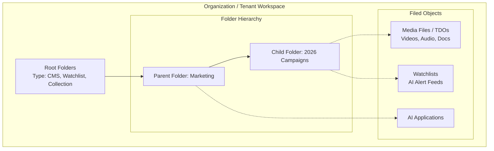
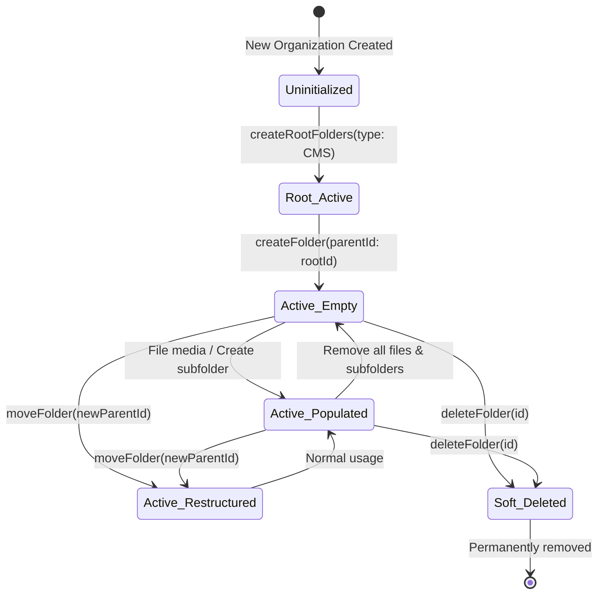
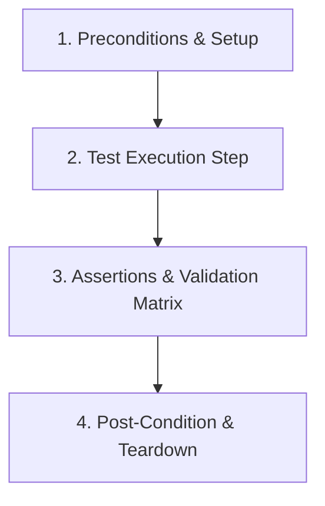

# Folder Testing Guide & Senior QA Report

> **Audience**: New QA Engineers & Testers joining the project  
> **Target Service**: GraphQL Folder Service (`core-graphql-server`)  
> **Folder Path**: [`citest/tools/graphql-api/test/folder`](file:///home/huycao/Coding/Examples/core-graphql-server/citest/tools/graphql-api/test/folder)  
> **Last Updated**: September 17, 2026  

---

## Table of Contents
1. [What is Folder in this system](#1-what-is-folder-in-this-system)
   - [1.1 Why system needs folder?](#11-why-system-needs-folder)
   - [1.2 What are functions of folders?](#12-what-are-functions-of-folders)
   - [1.3 Main specifications of the folder](#13-main-specifications-of-the-folder)
   - [1.4 Life-cycle of a Folder](#14-life-cycle-of-a-folder)
2. [What are mutations of Folders](#2-what-are-mutations-of-folders)
   - [Group 1: Root Folder Initialization](#group-1-root-folder-initialization)
   - [Group 2: Folder CRUD Operations](#group-2-folder-crud-operations)
   - [Group 3: Hierarchy & Reparenting Operations](#group-3-hierarchy--reparenting-operations)
   - [Group 4: Cross-Organization Sharing](#group-4-cross-organization-sharing)
3. [Tests's workflow of each mutation](#3-testss-workflow-of-each-mutation)
4. [Main code service relating to tests of folder's mutation](#4-main-code-service-relating-to-tests-of-folders-mutation)

---

## 1. What is Folder in this system

### 1.1 Why system needs folder?

If you are new to the project, think of this GraphQL system as a **massive digital enterprise library**:
- Every day, thousands of media files (videos, audio recordings, documents called **TDOs**), AI alert feeds (**Watchlists**), and AI tools (**Applications**) are uploaded and processed.
- Without folders, all these files would be dumped into one giant, unorganized pile. Users would not be able to find their projects, and organizations would risk exposing private media to the wrong people.

The system needs folders for three main reasons:
1. **Organization & Structure**: Groups related files into neat projects and sub-projects (just like Google Drive or Windows Folders).
2. **Tenant Privacy (Multi-Tenancy)**: Guarantees that Company A's files and folders are strictly separated from Company B's files.
3. **Security & Access Control**: Allows company admins to decide exactly who can view, edit, or delete files (e.g., only the HR team can open the "HR Interviews" folder).



---

### 1.2 What are functions of folders?

Folders in this system perform five core functions:

1. **Content Containers**: Act as virtual buckets holding child subfolders, media files (TDOs), watchlists, and AI applications.
2. **Hierarchical Navigation**: Enable multi-level tree structures (`Root -> Parent -> Child -> Grandchild`) so users can browse items intuitively.
3. **Security Boundaries (RBAC & OLP)**: Enforce permissions. Users need specific rights (e.g., `AIWARE_FOLDER_CREATE`, `AIWARE_FOLDER_UPDATE`) or Access Control Entries (ACEs) to interact with a folder.
4. **Cross-Tenant Collaboration**: Allow an organization to safely share a specific folder with a partner organization without giving them access to the rest of the workspace.
5. **Search & Filter Scope**: Allow Elasticsearch and search queries to narrow down search results to a specific folder branch.

---

### 1.3 Main specifications of the folder

#### 1. Core Data Attributes
Each folder in the database contains the following key fields:

| Field Name | Type | Description |
| :--- | :--- | :--- |
| `id` | `ID!` | Unique identifier (GUID) for the folder. |
| `name` | `String!` | Display name of the folder (e.g., `"Q3 Financial Reports"`). |
| `description` | `String` | Optional text describing what is stored inside the folder. |
| `parentId` / `parent` | `ID` / `Folder` | Points to the parent folder. For top-level root folders, this is `null`. |
| `treeObjectId` | `ID` | Internal tree identifier used to track hierarchy paths. |
| `rootFolderTypeId` | `RootFolderType` | The category of root folder: `cms` (media), `watchlist` (AI alerts), or `collection`. |
| `status` | `FolderStatus` | Lifecycle status (`Active` or `Deleted`). |
| `ownerId` | `ID` | The user ID who created the folder (`null` for organization-wide root folders). |
| `orderIndex` | `Int` | Integer used for custom sorting in Folder V1 (deprecated in Folder V2). |
| `entityTags` | `[EntityTag]` | Custom key-value metadata tags attached to the folder. |

#### 2. Folder V1 vs Folder V2 Specifications

The system supports two folder engine architectures:

| Specification | Folder V1 (Legacy) | Folder V2 (Modern Standard) |
| :--- | :--- | :--- |
| **Database Table** | `tree_object` | `v2_folder` |
| **Hierarchy Depth Limit** | Default capped at **5 levels** | **Uncapped** (supports deep nested trees 10+ levels) |
| **Sorting Mechanism** | Manual `orderIndex` column | Dynamic indexing (no `orderIndex` needed) |
| **Performance** | Slower recursive tree queries | High-performance nested set queries |
| **Application Filing** | Not supported | Supported via `fileApplication` / `unfileApplication` |
| **Deleting**| Soft delete | Hard delete |
---

### 1.4 Life-cycle of a Folder

Just like an order in an e-commerce store goes from `Pending -> Paid -> Shipped`, a folder moves through distinct lifecycle states:



#### Lifecycle State Rules for Testers

| Lifecycle State | Plain English Meaning | Allowed Operations | Prohibited Operations | Expected Error if Prohibited |
| :--- | :--- | :--- | :--- | :--- |
| **1. Uninitialized** | Brand new company account; no root folders exist yet. | `createRootFolders`, `rootFolders` (returns empty list `[]`) | `createFolder` (no parent exists yet) | `InvalidInput` (Missing parent) |
| **2. Root Active** | Root folders (`CMS`, `Watchlist`) are created. They are permanent anchors. | `createFolder(parentId: rootId)`, `folder(id: rootId)` | `deleteFolder(rootId)`, `moveFolder(rootId)` | `PermissionDenied` or `InvalidInput` (Roots cannot be deleted/moved) |
| **3. Active (Empty)** | A custom subfolder exists with no files or subfolders inside. | `updateFolder`, `createFolder` (child), `moveFolder`, `deleteFolder`, file items | Unfiling items that don't exist | `NotFound` |
| **4. Active (Populated)** | A folder that currently holds subfolders or media files. | `updateFolder`, `moveFolder`, `deleteFolder`, file/unfile items | Moving folder into its own child (circular loop!) | `InvalidInput` / `ResourceConflict` |
| **5. Soft-Deleted (V1)** | Folder has been deleted. It is marked deleted in the database. | None (read-only for audit logs) | `folder(id)`, `updateFolder`, `moveFolder`, `createFolder(parentId: deletedId)` | `NotFound` or `ResourceNotFound` |

---

## 2. What are mutations of Folders

In GraphQL, a **Mutation** is a request that creates, updates, or deletes data (unlike a **Query**, which only reads data).

Below are the core folder mutations, organized into 4 logical groups:

---

### Group 1: Root Folder Initialization
* **Group Function**: Sets up the permanent, top-level root folders for an organization when onboarding.

#### Mutation 1: `createRootFolders`
* **Main Function**: Generates the standard root anchor folders (`CMS`, `Watchlist`, `Collection`) for an organization.
* **Required Parameters**:
  * `rootFolderType`: `RootFolderType!` (Enum: `cms`, `watchlist`, or `collection`).
* **Expected Result / Output**:
  * Returns an array of `Folder` objects:
    ```json
    [
      {
        "id": "11111111-2222-3333-4444-555555555555",
        "name": "Root CMS Folder",
        "rootFolderTypeId": "cms",
        "organizationId": "org-guid",
        "ownerId": null
      }
    ]
    ```
* **Tester Notes**:
  * **Idempotency**: Calling this mutation multiple times for the same org does NOT create duplicate roots; it safely returns the existing root folders.
  * **Permissions**: Must be run by an Admin with the `AIWARE_FOLDER_CREATE` permission right.

---

### Group 2: Folder CRUD Operations
* **Group Function**: Provides standard Create, Read, Update, and Delete operations for managing subfolders.

#### Mutation 2: `createFolder` / `createFolderBasic`
* **Main Function**: Creates a new subfolder under an existing parent or root folder.
* **Required Parameters (`input: CreateFolder!`)**:
  * `name`: `String!` *(Required: Name of the folder, e.g. `"Marketing 2026"`)*
  * `parentId`: `ID!` *(Required: GUID of the parent folder)*
  * `description`: `String` *(Optional: Details about folder contents)*
  * `rootFolderType`: `RootFolderType` *(Optional: Inherits from parent if omitted)*
  * `entityTags`: `[EntityTagInput]` *(Optional: Custom key-value tags)*
* **Expected Result / Output**:
  * Returns the newly created `Folder` object:
    ```json
    {
      "id": "66666666-7777-8888-9999-000000000000",
      "name": "Marketing 2026",
      "description": "Campaign media assets",
      "status": "Active",
      "parent": { "id": "parent-folder-guid" },
      "createdDateTime": "2026-09-17T16:00:00Z"
    }
    ```

#### Mutation 3: `updateFolder`
* **Main Function**: Renames an existing folder, updates its description, or modifies its metadata tags.
* **Required Parameters (`input: UpdateFolder!`)**:
  * `id`: `ID!` *(Required: GUID of the folder to modify)*
  * `name`: `String` *(Optional: New folder name)*
  * `description`: `String` *(Optional: New description)*
  * `entityTags`: `[EntityTagInput]` *(Optional: Updated tags)*
* **Expected Result / Output**:
  * Returns the updated `Folder` object with new attributes and updated `modifiedDateTime`.

#### Mutation 4: `deleteFolder`
* **Main Function**: Soft-deletes a folder from the hierarchy so it is no longer visible in user views.
* **Required Parameters (`input: DeleteFolder!`)**:
  * `id`: `ID!` *(Required: GUID of the folder to delete)*
  * `orderIndex`: `Int` *(Optional: Legacy V1 parameter, ignored in V2)*
* **Expected Result / Output**:
  * Returns `DeletePayload`:
    ```json
    {
      "id": "folder-guid",
      "message": "Folder deleted successfully"
    }
    ```

---

### Group 3: Hierarchy & Reparenting Operations
* **Group Function**: Reorganizes folder structures by moving folders to different parent folders.

#### Mutation 5: `moveFolder`
* **Main Function**: Moves a single folder and its entire subtree of child folders/files from one parent folder to another.
* **Required Parameters (`input: MoveFolder`)**:
  * `folderId`: `ID` *(The folder being moved)*
  * `fromFolderId`: `ID` *(Current parent folder ID)*
  * `toFolderId`: `ID` *(New destination parent folder ID)*
* **Expected Result / Output**:
  * Returns the moved `Folder` object showing the updated `parent { id }`.

#### Mutation 6: `moveFolders` (Bulk Move)
* **Main Function**: Moves multiple folders to a destination parent folder in a single request.
* **Required Parameters (`input: MoveFolders`)**:
  * `folderIds`: `[ID!]!` *(Array of folder GUIDs to move)*
  * `newParentFolderId`: `ID!` *(Target destination parent folder GUID)*
* **Expected Result / Output**:
  * Returns `MoveFoldersPayload`:
    ```json
    {
      "validFolderIds": ["folder-id-1", "folder-id-2"],
      "invalidFolderIds": [],
      "message": "Folders moved successfully"
    }
    ```

---

### Group 4: Cross-Organization Sharing
* **Group Function**: Manages sharing folder access between two separate tenant organizations.

#### Mutation 7: `shareFolder`
* **Main Function**: Grants `Read` or `Write` access on a folder to another organization.
* **Required Parameters (`input: ShareFolderInput`)**:
  * `folderId`: `ID!` *(Folder GUID to share)*
  * `sharedWith`: `ShareFolderInputSharedWith` *(Object specifying target org IDs: `{ read: [ID], write: [ID] }`)*
* **Expected Result / Output**:
  * Returns `Folder` object showing updated `sharedWith` list and `sharedAccess` flags.

---

## 3. Tests's workflow of each mutation

Every automated test in this project follows a strict 4-stage QA workflow:



Here is the exact testing workflow for each core folder mutation:

---

### Workflow 1: `createRootFolders`
1. **Preconditions**:
   - Create a fresh isolated test organization using `setupTestOrgAndUser`.
   - Obtain an Admin authorization header (`adminOptions`).
2. **Execution Steps**:
   - Call `gqlClient.sdk.createRootFolders({ rootFolderType: RootFolderType.Cms }, adminOptions)`.
3. **Assertions & Validation Matrix**:
   - **Happy Path**: Response status is `200 OK`; returned array contains folder with `rootFolderTypeId: "cms"` and `ownerId: null`.
   - **Idempotency Check**: Run `createRootFolders` a second time; assert the returned ID matches the first run without creating a duplicate.
   - **Multi-Tenant Isolation**: Query `rootFolders` as Org B; assert Org B cannot see Org A's root folder.
   - **Role Restriction**: Run as a restricted user with zero permissions; assert server returns `PermissionDenied`.
4. **Teardown**:
   - Safely delete test organization in `afterAll` using `safe('delete testOrg', ...)`.

---

### Workflow 2: `createFolder` / `createFolderBasic`
1. **Preconditions**:
   - Test Org created; Root CMS folder initialized (`rootFolderId`).
2. **Execution Steps**:
   - Call `gqlClient.sdk.createFolderBasic({ input: { name: "Test Subfolder", parentId: rootFolderId } }, adminOptions)`.
3. **Assertions & Validation Matrix**:
   - **Happy Path**: Folder is created; `id` is a valid UUID; `parent.id == rootFolderId`; `status == "Active"`.
   - **Multi-Level Depth**: Create child under child (`Root -> Level 1 -> Level 2 -> Level 3`); verify all nested levels resolve correctly.
   - **Negative - Missing Name**: Send `name: ""`; assert server returns `GraphQL validation error` or `InvalidInput`.
   - **Negative - Invalid Parent**: Send `parentId: "00000000-0000-0000-0000-000000000000"`; assert `NotFound` or `InvalidInput`.
   - **Security - Cross-Org Creation**: Pass a `parentId` belonging to Org B while authenticated as Org A; assert `PermissionDenied` or `NotFound`.
4. **Teardown**:
   - Subfolders are automatically cleaned up when the test organization is deleted.

---

### Workflow 3: `updateFolder`
1. **Preconditions**:
   - Active subfolder created (`targetFolderId`).
2. **Execution Steps**:
   - Call `gqlClient.sdk.updateFolder({ input: { id: targetFolderId, name: "Renamed Folder", description: "Updated description" } }, adminOptions)`.
3. **Assertions & Validation Matrix**:
   - **Happy Path**: Returned folder reflects new name `"Renamed Folder"` and new description.
   - **Query Verification**: Query `folder(id: targetFolderId)`; assert the new name is persisted in the database.
   - **Negative - Non-Existent ID**: Send random UUID; assert error `NotFound`.
   - **Security - Cross-Org Update**: User from Org B attempts to update Org A's folder; assert `PermissionDenied`.
4. **Teardown**:
   - Handled during suite organization cleanup.

---

### Workflow 4: `deleteFolder`
1. **Preconditions**:
   - Active subfolder created (`subFolderId`).
2. **Execution Steps**:
   - Call `gqlClient.sdk.deleteFolder({ input: { id: subFolderId } }, adminOptions)`.
3. **Assertions & Validation Matrix**:
   - **Happy Path**: Response contains `message: "Folder deleted successfully"`.
   - **Query Verification**: Call `folder(id: subFolderId)`; assert result returns `null` or `NotFound`.
   - **System Guard (Root Protection)**: Attempt `deleteFolder(id: rootFolderId)`; assert operation is rejected with `PermissionDenied` or `InvalidInput` (Root folders can never be deleted).
   - **Negative - Repeat Delete**: Call `deleteFolder` on an already deleted folder; assert error `NotFound`.
4. **Teardown**:
   - Cleaned up automatically.

---

### Workflow 5: `moveFolder`
1. **Preconditions**:
   - Create Root Folder $\to$ Parent Folder A and Parent Folder B.
   - Create Child Folder under Parent A (`childFolderId`).
2. **Execution Steps**:
   - Call `gqlClient.sdk.moveFolder({ input: { folderId: childFolderId, fromFolderId: parentAId, toFolderId: parentBId } }, adminOptions)`.
3. **Assertions & Validation Matrix**:
   - **Happy Path**: Returned folder shows `parent.id == parentBId`.
   - **Subtree Verification**: Verify files inside `childFolder` remain intact after the move.
   - **Negative - Circular Move**: Attempt to move Parent A into Child Folder; assert server rejects with `InvalidInput` or `ResourceConflict` (A folder cannot become its own subfolder!).
   - **Security - Cross-Org Move**: Attempt to move folder into a parent belonging to another org; assert `PermissionDenied`.
4. **Teardown**:
   - Cleaned up with test org.

---

### Workflow 6: `moveFolders` (Bulk Move)
1. **Preconditions**:
   - Create Destination Parent Folder.
   - Create two valid subfolders (`folder1Id`, `folder2Id`).
2. **Execution Steps**:
   - Call `gqlClient.sdk.moveFolders({ input: { folderIds: [folder1Id, folder2Id, "invalid-uuid"], newParentFolderId: destParentId } }, adminOptions)`.
3. **Assertions & Validation Matrix**:
   - **Partial Success**: `validFolderIds` contains `[folder1Id, folder2Id]`; `invalidFolderIds` contains `["invalid-uuid"]`.
   - **State Verification**: Query both valid folders; assert their `parentId` updated to `destParentId`.
4. **Teardown**:
   - Cleaned up with test org.

---

### Workflow 7: `shareFolder`
1. **Preconditions**:
   - Create Org A (Owner Org) with Folder A.
   - Create Org B (Partner Org).
2. **Execution Steps**:
   - Authenticated as Org A Admin, call `gqlClient.sdk.shareFolder({ input: { folderId: folderAId, sharedWith: { read: [orgBId] } } }, adminOrgAOptions)`.
3. **Assertions & Validation Matrix**:
   - **Sharing Verification**: Authenticated as Org B User, query `folder(id: folderAId)`; assert Org B can now read Folder A.
   - **Write Restriction**: Org B User attempts `updateFolder` on Folder A; assert `PermissionDenied` (Org B was only granted `Read`).
   - **Revocation**: Org A Admin updates share removing Org B; assert Org B immediately loses access (`PermissionDenied`).
4. **Teardown**:
   - Clean up both Org A and Org B in `afterAll`.

---

## 4. Main code service relating to tests of folder's mutation

The folder test suite relies on a modular architecture divided into **Core Test Harness Services** and **Domain Spec Test Files**.

### 4.1 Core Test Harness Infrastructure & Helpers

| Service / Helper File | Relative File Path | Primary Function in Folder Tests |
| :--- | :--- | :--- |
| **Typed GraphQL SDK** | [`src/gql/gql.ts`](file:///home/huycao/Coding/Examples/core-graphql-server/citest/tools/graphql-api/src/gql/gql.ts) | Auto-generated TypeScript client providing fully typed mutation functions (e.g., `gqlClient.sdk.createFolder(...)`). |
| **GraphQL Client Utility** | [`src/graphqlUtil.ts`](file:///home/huycao/Coding/Examples/core-graphql-server/citest/tools/graphql-api/src/graphqlUtil.ts) | Manages HTTP transport, session tokens, multi-auth headers, and error handling. |
| **Isolated Superadmin Provisioner** | [`test/helpers/superadminSession.ts`](file:///home/huycao/Coding/Examples/core-graphql-server/citest/tools/graphql-api/test/helpers/superadminSession.ts) | Creates a single-use superadmin per test suite to prevent parallel test runs from invalidating each other's auth sessions. |
| **Org & User Factory** | [`test/helpers/organization.helper.ts`](file:///home/huycao/Coding/Examples/core-graphql-server/citest/tools/graphql-api/test/helpers/organization.helper.ts) | Provisions clean test organizations and mints ready-to-use user headers (`adminOptions`, `regularOptions`, `restrictedOptions`). |
| **RBAC Cache Poller** | [`test/helpers/rbacPropagation.ts`](file:///home/huycao/Coding/Examples/core-graphql-server/citest/tools/graphql-api/test/helpers/rbacPropagation.ts) | Smartly polls backend Redis caches when permissions change to prevent asynchronous timing test flakiness. |
| **Safe Teardown Guard** | [`src/helpers/commonHelper.ts`](file:///home/huycao/Coding/Examples/core-graphql-server/citest/tools/graphql-api/src/helpers/commonHelper.ts) | Wraps cleanup calls in `safe('description', ...)` in `afterAll` blocks so one failing cleanup does not abort the entire teardown. |
| **Extracted Folder Queries** | [`src/queries/extracted/folders.ts`](file:///home/huycao/Coding/Examples/core-graphql-server/citest/tools/graphql-api/src/queries/extracted/folders.ts) | Raw GraphQL mutation and query document definitions used by the code generator. |

---

### 4.2 Folder Spec Test Suite Files

All folder tests live under [`citest/tools/graphql-api/test/folder`](file:///home/huycao/Coding/Examples/core-graphql-server/citest/tools/graphql-api/test/folder):

| Spec Test File | What It Tests | Key Test Cases & Coverage |
| :--- | :--- | :--- |
| [`folders.spec.ts`](file:///home/huycao/Coding/Examples/core-graphql-server/citest/tools/graphql-api/test/folder/folders.spec.ts) | **Folder V1 Core Operations** | Tests V1 subfolder CRUD, updating metadata, moving folders, content templates, and listing child watchlists. |
| [`foldersV2.spec.ts`](file:///home/huycao/Coding/Examples/core-graphql-server/citest/tools/graphql-api/test/folder/foldersV2.spec.ts) | **Folder V2 Engine & Filing** | Tests modern V2 folders, filing/unfiling AI applications (`fileApplication`), and dynamic V1/V2 feature toggling. |
| [`folderNonOlp.spec.ts`](file:///home/huycao/Coding/Examples/core-graphql-server/citest/tools/graphql-api/test/folder/folderNonOlp.spec.ts) | **Comprehensive Non-OLP Matrix** | Exhaustive 62-case matrix (`A1` to `A62`) validating positive paths, negative inputs, invalid parent IDs, and bulk moves. |
| [`folderConversion.spec.ts`](file:///home/huycao/Coding/Examples/core-graphql-server/citest/tools/graphql-api/test/folder/folderConversion.spec.ts) | **V1 ↔ V2 Migration Parity** | Asserts root folder stability and verifies folder hierarchies survive V1 $\leftrightarrow$ V2 engine conversions. |
| [`folderMultiOrg.spec.ts`](file:///home/huycao/Coding/Examples/core-graphql-server/citest/tools/graphql-api/test/folder/folderMultiOrg.spec.ts) | **Multi-Tenant Isolation** | Proves that a user belonging to multiple organizations maintains completely separate, isolated root folders in each org. |
| [`folderUserRootTreeObjectId.spec.ts`](file:///home/huycao/Coding/Examples/core-graphql-server/citest/tools/graphql-api/test/folder/folderUserRootTreeObjectId.spec.ts) | **Root Folder Idempotency** | Confirms that repeated calls to `createRootFolders` return existing IDs rather than creating duplicate records. |
| [`folderSearchContent.spec.ts`](file:///home/huycao/Coding/Examples/core-graphql-server/citest/tools/graphql-api/test/folder/folderSearchContent.spec.ts) | **Elasticsearch Indexing** | Verifies media files filed inside folders are indexed properly and protected against cross-org search visibility. |
| [`watchlist.spec.ts`](file:///home/huycao/Coding/Examples/core-graphql-server/citest/tools/graphql-api/test/folder/watchlist.spec.ts) | **Watchlist Folder Integration** | Tests filing and moving AI watchlists into specific root and subfolders. |
| [`RBAC/folderOlp.spec.ts`](file:///home/huycao/Coding/Examples/core-graphql-server/citest/tools/graphql-api/test/folder/RBAC/folderOlp.spec.ts) | **Object-Level Permissions (OLP)** | Exhaustive 51-case matrix (`FO1` to `FO51`) testing ACE access grants (Read, Write, Delete) on individual folders. |
| [`RBAC/folderInherit.spec.ts`](file:///home/huycao/Coding/Examples/core-graphql-server/citest/tools/graphql-api/test/folder/RBAC/folderInherit.spec.ts) | **Permission Inheritance** | Tests the `@authInherit` directive to verify whether child folders copy ACE permissions from parent folders on creation. |
| [`RBAC/folderShare.spec.ts`](file:///home/huycao/Coding/Examples/core-graphql-server/citest/tools/graphql-api/test/folder/RBAC/folderShare.spec.ts) | **Cross-Organization Sharing** | Tests the full lifecycle of sharing folders between separate tenant accounts (`shareFolder`). |
| [`RBAC/folderSwitchOLP.spec.ts`](file:///home/huycao/Coding/Examples/core-graphql-server/citest/tools/graphql-api/test/folder/RBAC/folderSwitchOLP.spec.ts) | **Live Security Policy Migration** | Tests live migration of an organization from Non-OLP to OLP security mode without breaking folder permissions. |
| [`RBAC/folderAdminRbac.spec.ts`](file:///home/huycao/Coding/Examples/core-graphql-server/citest/tools/graphql-api/test/folder/RBAC/folderAdminRbac.spec.ts) | **Admin Auth Groups** | Tests creation and assignment of custom administrative authorization groups for folder administration. |
| [`RBAC/folderUserRbac.spec.ts`](file:///home/huycao/Coding/Examples/core-graphql-server/citest/tools/graphql-api/test/folder/RBAC/folderUserRbac.spec.ts) | **Restricted User JWTs** | Validates folder access boundaries for restricted users holding scoped JWT tokens. |

---
*Report maintained under [`citest/tools/graphql-api/test/folder/Sumarrize.md`](file:///home/huycao/Coding/Examples/core-graphql-server/citest/tools/graphql-api/test/folder/Sumarrize.md).*
