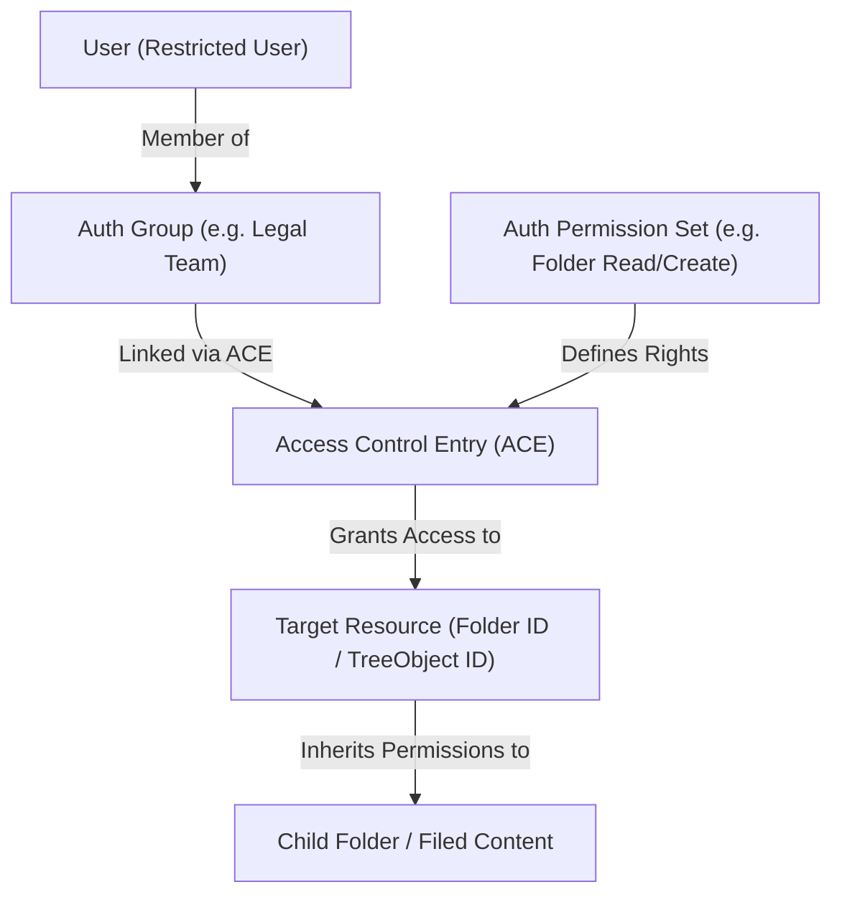
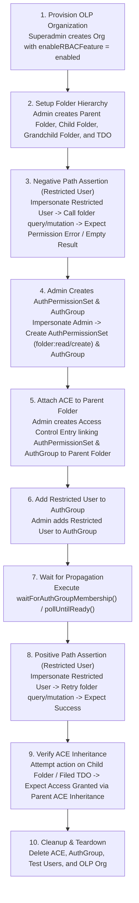

# Object-Level Permissions (OLP) in System and Folder OLP Testing

## 1. Object-Level Permissions (OLP) Architecture

### 1. What is Object-Level Permissions (OLP)?
Object-Level Permissions (OLP), also referred to as Fine-Grained Access Control, is an authorization mechanism where access control rules are evaluated at the individual resource instance level (e.g. a specific `Folder`, `TDO`, or `SDO`) rather than relying solely on coarse-grained organization-wide roles.

Key building blocks of OLP in this system include:

1. **Resource Objects**: The target entities being protected, such as a specific `Folder` (identified by `id` / `treeObjectId`), `TDO` (Temporal Data Object), `SDO` (Structured Data Object), or `Application`.
2. **Auth Group (`AuthGroup`)**: A collection of organization users grouped together for authorization purposes.
3. **Auth Permission Set (`AuthPermissionSet`)**: A named set of granular permissions (`read`, `create`, `update`, `delete`, `owner`, `share`) for specific resource types (`AuthResourceType.folder`, `AuthResourceType.tdo`, etc.).
4. **Access Control Entry (ACE)**: An active rule linking an `AuthPermissionSet` and an `AuthGroup` (or user) directly to a target resource ID (`resourceId`).
5. **Feature Flag (`enableRBACFeature`)**: Metadata property on the Organization (`orgInput.metadata.features.enableRBACFeature = 'enabled'`). When enabled, GraphQL resolvers enforce OLP checks on protected resources.

#### High-Level OLP Authorization Model

---

### 2. OLP Mechanics & Permission Evaluation

When a GraphQL query or mutation is executed in an OLP-enabled organization, the backend performs instance-level authorization checks:

- **Default Security Stance (Default Deny)**: In an OLP organization, users without administrative roles or explicit ACE grants receive zero default access ("Default Deny"). Restricted Users cannot view, create, move, or delete folders without matching ACE grants.
- **Read Operations (`rootFolders`, `childFolders`, `folderOverview`)**: The GraphQL engine filters folder queries, returning only folders where the user's `AuthGroup` has an active `read` or `owner` ACE.
- **Write Operations (`createFolder`, `updateFolder`, `moveFolder`, `deleteFolder`)**: The backend verifies that the user holds the corresponding permission bit (`create`, `update`, `delete`) on the target folder (or parent folder for creation) before executing the mutation.
- **ACE Inheritance (`inheritPermissionSet`)**: When an ACE is attached to a parent folder, child subfolders and content filed within that folder inherit the parent folder's ACE unless permission inheritance is explicitly broken.

#### Comparison Matrix: Non-OLP vs. OLP-Enabled Organizations

| Feature / Behavior | Non-OLP Organization | OLP-Enabled Organization |
| --- | --- | --- |
| **Organization Metadata** | `enableRBACFeature = disabled` | `enableRBACFeature = enabled` |
| **Authorization Level** | Global Org Role (Admin vs Standard User) | Instance-specific Access Control Entries (ACEs) |
| **Standard User Default Access** | Broad access to all folders in Organization | Access restricted to folders with matching ACEs |
| **Restricted User Default Access** | Baseline access granted by system roles | Access blocked by default ("Default Deny") |
| **ACE Inheritance** | Not evaluated | Enforced down parent → child folder tree hierarchy |
| **Multi-User Sharing** | Generic organization visibility | Explicit ACE grants to specific Auth Groups / Users |

---

## 2. Roles based access control test (OLP Focus)

### 1. Strategy of OLP Folder Tests
Testing OLP requires verifying both security enforcement (blocking unauthorized operations) and permission activation (granting access after ACE configuration). The strategy relies on:

1. **Matrix-Driven Test Suites**: Running standard test operation matrices (e.g. `FO1`–`FO51` in `RBAC/folderOlp.spec.ts`) across folder versions (V1 and V2), folder depth levels (Parent, Child, Grandchild), and filed assets (TDOs).
2. **Grant-and-Retry Sequences**:
   - *Phase A (Negative Assertion)*: Impersonate Restricted User -> attempt folder action -> assert failure / `Unauthorized`.
   - *Phase B (Permission Grant)*: Impersonate Org Admin -> create `AuthPermissionSet` & `AuthGroup` -> attach ACE to target folder -> add Restricted User to group.
   - *Phase C (Positive Assertion)*: Impersonate Restricted User -> retry exact folder action -> assert success.
3. **Asynchronous Propagation Wait**: Using `waitForAuthGroupMembership()` and `pollUntilReady()` to wait for backend RBAC memory/index caches to reflect newly granted memberships before executing Phase C assertions.
4. **Dynamic Mode Transition**: Verifying mid-suite org state changes (`folderSwitchOLP.spec.ts`) where an org toggles from Non-OLP to OLP mode, ensuring security rules tighten dynamically.

---

### 2. Reference OLP to Folder Test Files

The table below maps the test files in `citest/tools/graphql-api/test/folder/RBAC/` to their OLP testing responsibilities:

| Test File | OLP Scope & Focus | Key Verification Scenarios |
| --- | --- | --- |
| [`RBAC/folderOlp.spec.ts`](file:///home/huycao/Repos/veritone-drug/core-graphql-server/citest/tools/graphql-api/test/folder/RBAC/folderOlp.spec.ts) | OLP Matrix (`FO1`–`FO51`) | Comprehensive matrix walking V1 and V2 folders under OLP. Exercises negative paths (restricted user denied), ACE grant actions, propagation, and positive path retries across parent/child/grandchild folders and filed TDOs. |
| [`RBAC/folderInherit.spec.ts`](file:///home/huycao/Repos/veritone-drug/core-graphql-server/citest/tools/graphql-api/test/folder/RBAC/folderInherit.spec.ts) | ACE Permission Inheritance | Tests `inheritPermissionSet` flag on parent folders. Asserts that granting an ACE on a parent folder automatically extends read/write rights to descendant subfolders and filed TDOs. |
| [`RBAC/folderSwitchOLP.spec.ts`](file:///home/huycao/Repos/veritone-drug/core-graphql-server/citest/tools/graphql-api/test/folder/RBAC/folderSwitchOLP.spec.ts) | Dynamic OLP Mode Toggle | Verifies system behavior when an organization switches from Non-OLP to OLP mode mid-suite. Confirms immediate enforcement of ACE checks on existing folders. |
| [`RBAC/folderAdminRbac.spec.ts`](file:///home/huycao/Repos/veritone-drug/core-graphql-server/citest/tools/graphql-api/test/folder/RBAC/folderAdminRbac.spec.ts) | OLP Administration | Tests Org Admin creation of `AuthGroup`, `AuthPermissionSet`, and assigning ACEs on specific folder resource IDs. |
| [`RBAC/folderUserRbac.spec.ts`](file:///home/huycao/Repos/veritone-drug/core-graphql-server/citest/tools/graphql-api/test/folder/RBAC/folderUserRbac.spec.ts) | User-Level OLP Rules | End-to-end user-level OLP test suite verifying group-based folder grants, read/write boundaries, and content filing under OLP. |

---

### 3. General OLP Test Workflow

The diagram below illustrates the complete lifecycle of an OLP test case:

#### Step-by-Step Breakdown for Beginner Testers:

1. **Provision OLP Organization (Step 1)**:
   - Superadmin bootstraps a fresh test organization with metadata feature flag `enableRBACFeature = 'enabled'`.
   - Users are created: Org Admin, Regular User, and Restricted User (`roleIds: []`).

2. **Create Test Folder Tree (Step 2)**:
   - Org Admin creates a hierarchy: `Parent Folder` → `Child Folder` → `Grandchild Folder`, and files a `TDO` in `Parent Folder`.

3. **Negative Path Test (Step 3)**:
   - The test impersonates **Restricted User** using JWT session headers.
   - Restricted User attempts to call `folder` query or `createFolder` mutation on `Parent Folder`.
   - **Result**: Operation is rejected with an `Unauthorized` error or empty array because no ACE exists yet.

4. **Grant ACE Permissions (Steps 4–6)**:
   - Context switches back to **Org Admin**.
   - Admin creates an `AuthPermissionSet` defining allowed operations (e.g. `read`, `create`).
   - Admin creates an `AuthGroup` and attaches an ACE linking the `AuthPermissionSet` and `AuthGroup` to `Parent Folder`.
   - Admin adds Restricted User to the `AuthGroup`.

5. **Wait for Propagation (Step 7)**:
   - The test executes `waitForAuthGroupMembership()`, polling the backend until authorization index updates are complete.

6. **Positive Path Assertion (Step 8)**:
   - Context switches back to **Restricted User**.
   - Restricted User retries the exact same `folder` query or `createFolder` mutation on `Parent Folder`.
   - **Result**: Mutation succeeds!

7. **Verify ACE Inheritance & Cleanup (Steps 9–10)**:
   - Restricted User attempts to access `Child Folder` or `Grandchild Folder`.
   - **Result**: Access is granted automatically via `inheritPermissionSet` logic without needing a separate ACE on the child folder.
   - Finally, teardown logic cleans up created ACEs, groups, and test organizations.
