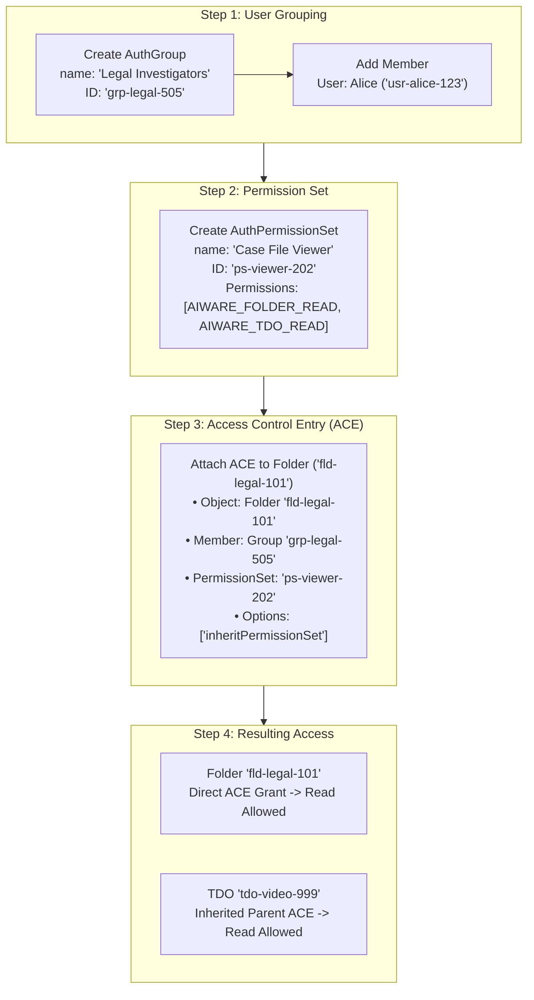

# Concrete Example: How OLP and ACE Work for Folders & TDOs

This document presents a step-by-step, practical example demonstrating how **Object-Level Permissions (OLP)** and **Access Control Entries (ACEs)** govern access to **Folders** and **Temporal Data Objects (TDOs)** in this system.

---

## 1. Scenario Overview

Imagine a media platform used by a law enforcement or media organization. The organization has enabled OLP (`enableRBACFeature = 'enabled'`).

### The Goal:
The organization wants to grant a **Restricted User (Alice)** access to a specific folder containing sensitive video evidence, while keeping all other folders in the system strictly hidden from her.

### The Entities Involved:
1. **Restricted User**: `Alice` (User ID: `usr-alice-123`, `roleIds: []` — zero default roles).
2. **Organization Admin**: `Bob` (User ID: `usr-bob-admin`).
3. **Folder Structure**:
   - `Root Folder (CMS)` (ID: `fld-root-001`)
     - 📁 `Legal Case Files` (Folder ID: `fld-legal-101`)
       - 🎬 `Witness_Deposition.mp4` (TDO ID: `tdo-video-999`)
4. **Target Access**: Alice must be able to view `Legal Case Files` folder AND play/view `Witness_Deposition.mp4` filed inside it.

---

## 2. Step-by-Step OLP & ACE Setup

To grant access, Admin Bob executes three configuration steps via GraphQL mutations:



---

### Step 1: Create Auth Group & Add User

Admin Bob creates an `AuthGroup` named **Legal Investigators** and adds Alice to it:

```graphql
# 1. Create Auth Group
mutation CreateGroup {
  createAuthGroup(input: {
    name: "Legal Investigators"
    description: "Group for legal case review"
  }) {
    id # Returns: "grp-legal-505"
    name
  }
}

# 2. Add Alice to Group
mutation AddMember {
  addAuthGroupMembers(
    groupID: "grp-legal-505"
    members: [
      { id: "usr-alice-123", memberType: User }
    ]
  ) {
    id
  }
}
```

---

### Step 2: Create Auth Permission Set

Admin Bob creates an `AuthPermissionSet` bundling folder read rights (`AIWARE_FOLDER_READ`) and TDO read rights (`AIWARE_TDO_READ`):

```graphql
mutation CreatePermissionSet {
  createAuthPermissionSet(input: {
    name: "Case File Viewer"
    description: "Allows reading folders and filed video assets"
    permissions: [
      AIWARE_FOLDER_READ
      AIWARE_TDO_READ
    ]
  }) {
    id # Returns: "ps-viewer-202"
    name
  }
}
```

---

### Step 3: Attach Access Control Entry (ACE) to the Folder

Admin Bob creates an ACE attaching the permission set (`ps-viewer-202`) and group (`grp-legal-505`) to the folder `fld-legal-101`:

```graphql
mutation AttachACE {
  addACEsToResources(
    resourceType: Folder
    ids: ["fld-legal-101"]
    entries: [
      {
        member: {
          id: "grp-legal-505"
          memberType: AuthGroup
        }
        permissionSetID: "ps-viewer-202"
        options: ["inheritPermissionSet"] # Enables permission inheritance to filed items
      }
    ]
  ) {
    records {
      id # Returns ACE ID: "ace-777"
      objectType # Folder
      objectID   # "fld-legal-101"
      member {
        ... on AuthGroup { id name }
      }
      permissionSet { id }
      options # ["inheritPermissionSet"]
    }
  }
}
```

---

## 3. How the Backend Evaluates Requests (Runtime Walkthrough)

Now let's observe what happens under the hood when Alice sends GraphQL requests to the server.

### Scenario A: BEFORE ACE is Granted (Default Deny)

1. **Request**: Alice executes query `folder(id: "fld-legal-101") { name }`.
2. **Backend Check**:
   - Resolver detects `enableRBACFeature = 'enabled'`.
   - Engine queries database table `auth_ace` for `objectID = 'fld-legal-101'` linked to Alice or her groups.
   - **Result**: `0 ACE records found`.
3. **Response**: Server throws `Unauthorized: Permission Denied for Folder fld-legal-101`.

---

### Scenario B: AFTER ACE is Granted (Direct Folder Access)

1. **Request**: Alice executes query `folder(id: "fld-legal-101") { id name }`.
2. **Backend Check**:
   - Resolver checks Alice's memberships → Alice is in group `grp-legal-505`.
   - Engine queries `auth_ace` table for `objectID = 'fld-legal-101'` AND `member_id = 'grp-legal-505'`.
   - **Match Found**: `ACE ace-777` with permission set `ps-viewer-202` containing `AIWARE_FOLDER_READ`.
3. **Response**: 
   ```json
   {
     "data": {
       "folder": {
         "id": "fld-legal-101",
         "name": "Legal Case Files"
       }
     }
   }
   ```

---

### Scenario C: Accessing Filed Content via ACE Inheritance

1. **Request**: Alice queries the filed video `tdo(id: "tdo-video-999") { id name assetUrl }`.
2. **Backend Check**:
   - Engine checks for a **direct ACE** on `tdo-video-999` → None exists.
   - Engine looks up the parent container of `tdo-video-999` → Parent is `Folder fld-legal-101`.
   - Engine checks `fld-legal-101` for ACEs with option `inheritPermissionSet`.
   - **Match Found**: `ACE ace-777` has `options: ["inheritPermissionSet"]` and permission set `ps-viewer-202` which includes `AIWARE_TDO_READ`.
3. **Response**:
   ```json
   {
     "data": {
       "tdo": {
         "id": "tdo-video-999",
         "name": "Witness_Deposition.mp4",
         "assetUrl": "https://s3.amazonaws.com/evidence/movie.mp4"
       }
     }
   }
   ```

---

## 4. Summary Table of OLP / ACE Component Roles

| Component | Example ID / Value | Purpose in System |
| --- | --- | --- |
| **Protected Resource** | `Folder (fld-legal-101)` | The entity being secured. |
| **Filed Asset** | `TDO (tdo-video-999)` | Asset residing in folder that inherits folder permissions. |
| **User** | `Alice (usr-alice-123)` | Subject requesting access (Restricted User). |
| **Auth Group** | `Legal Team (grp-legal-505)` | Container aggregating users for batch authorization. |
| **Auth Permission Set** | `Case File Viewer (ps-viewer-202)` | Bundle of permissions (`AIWARE_FOLDER_READ`, `AIWARE_TDO_READ`). |
| **Access Control Entry (ACE)** | `ACE ace-777` | The active link binding `grp-legal-505` + `ps-viewer-202` → `fld-legal-101`. |
| **Inheritance Flag** | `inheritPermissionSet` | Option on ACE allowing child folders & filed TDOs to inherit access. |
