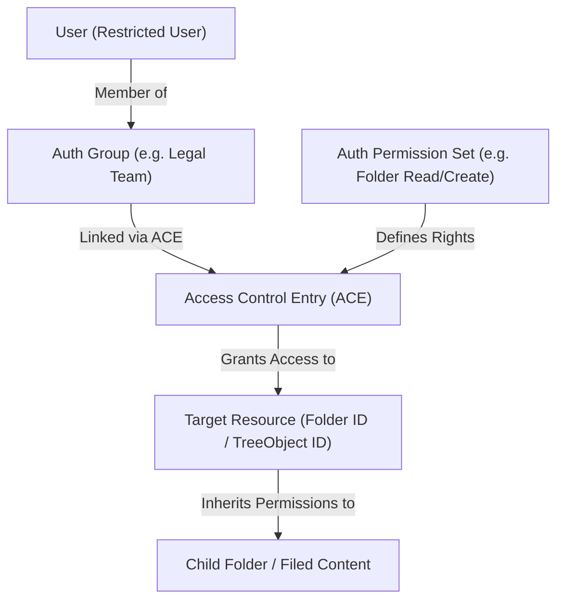
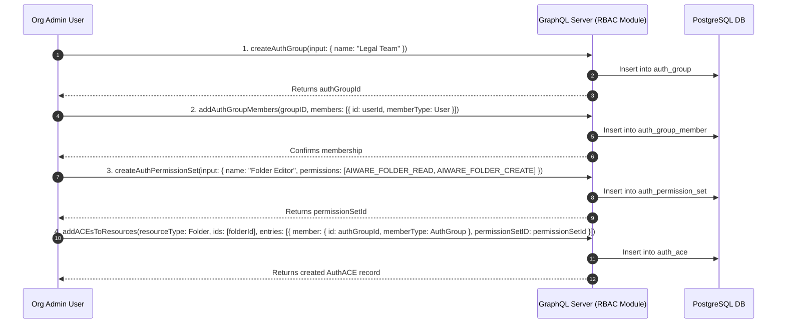
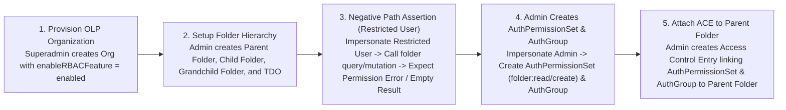
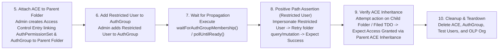
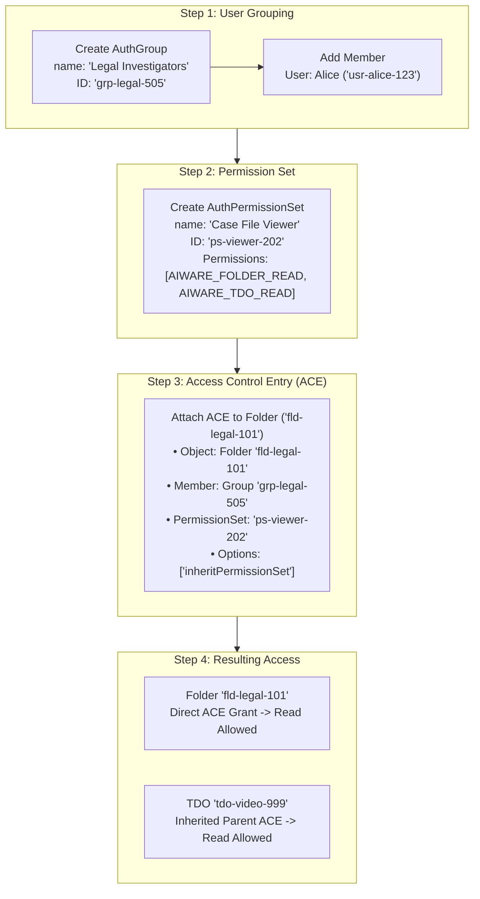

# Object-Level Permissions (OLP) & Access Control Entries (ACE) Complete Guide

> **Document Type**: Comprehensive System Architecture, Test Framework, & Practical Setup Guide  
> **Source Documents**: [`business.OLP.md`](file:///home/huycao/Repos/veritone-drug/core-graphql-server/citest/tools/graphql-api/test/folder/Exploring/business.OLP.md) (Part 1) & [`business.OLP_ACE_Example.md`](file:///home/huycao/Repos/veritone-drug/core-graphql-server/citest/tools/graphql-api/test/folder/Exploring/business.OLP_ACE_Example.md) (Part 2)

---

# Part 1: OLP Architecture, Backend Definition & Test Framework

## 1. Object-Level Permissions (OLP) Architecture

### 1. What is Object-Level Permissions (OLP)?
Object-Level Permissions (OLP), also referred to as Fine-Grained Access Control, is an authorization mechanism where access control rules are evaluated at the individual resource instance level (e.g. a specific `Folder`, `TDO`, or `SDO`) rather than relying solely on coarse-grained organization-wide roles.

Key building blocks of OLP in this system include:

1. **Resource Objects**: The target entities being protected, such as a specific `Folder` (identified by `id` / `treeObjectId`), `TDO` (Temporal Data Object), `SDO` (Structured Data Object), or `Application`.
2. **Auth Group (`AuthGroup`)**: A collection of organization users grouped together for authorization purposes.
3. **Auth Permission Set (`AuthPermissionSet`)**: A named set of granular permissions (`read`, `create`, `update`, `delete`, `owner`, `share`) for specific resource types (`AuthResourceType.folder`, `AuthResourceType.tdo`, etc.).
4. **Access Control Entry (ACE)**: An active rule linking an `AuthPermissionSet` and an `AuthGroup` (or user) directly to a target resource ID (`resourceId`).
5. **Feature Flag (`enableRBACFeature`)**: Metadata property on the Organization (`orgInput.metadata.features.enableRBACFeature = 'enabled'`). When enabled, GraphQL resolvers enforce OLP checks on protected resources.

#### High-Level OLP Authorization Model



---

### 2. OLP Mechanics & Permission Evaluation

When a GraphQL query or mutation is executed in an OLP-enabled organization, the backend performs instance-level authorization checks:

- **Default Security Stance (Default Deny)**: In an OLP organization, users without administrative roles or explicit ACE grants receive zero default access ("Default Deny"). Restricted Users cannot view, create, move, or delete folders without matching ACE grants.
- **Read Operations (`rootFolders`, `childFolders`, `folderOverview`)**: The GraphQL engine filters folder queries, returning only folders where the user's `AuthGroup` has an active `read` or `owner` ACE.
- **Write Operations (`createFolder`, `updateFolder`, `moveFolder`, `deleteFolder`)**: The backend verifies that the user holds the corresponding permission bit (`create`, `update`, `delete`) on the target folder (or parent folder for creation) before executing the mutation.
- **ACE Inheritance (`inheritPermissionSet`)**: When an ACE is attached to a parent folder, child subfolders and content filed within that folder inherit the parent folder's ACE unless permission inheritance is explicitly broken.

#### Comparison Matrix: Non-OLP vs. OLP-Enabled Organizations

| Feature / Behavior | Non-OLP Organization | OLP-Enabled Organization |
| --- | --- | --- |
| **Organization Metadata** | `enableRBACFeature = disabled` | `enableRBACFeature = enabled` |
| **Authorization Level** | Global Org Role (Admin vs Standard User) | Instance-specific Access Control Entries (ACEs) |
| **Standard User Default Access** | Broad access to all folders in Organization | Access restricted to folders with matching ACEs |
| **Restricted User Default Access** | Baseline access granted by system roles | Access blocked by default ("Default Deny") |
| **ACE Inheritance** | Not evaluated | Enforced down parent → child folder tree hierarchy |
| **Multi-User Sharing** | Generic organization visibility | Explicit ACE grants to specific Auth Groups / Users |

---

## 2. System Definition and Setup of OLP

### 1. How OLP is Defined in Backend Codebase Architecture

OLP is defined as a dedicated core module within the server codebase located under [`modules/rbacAuth`](file:///home/huycao/Repos/veritone-drug/core-graphql-server/modules/rbacAuth):

#### 1. GraphQL Schemas & Type Definitions
- [`modules/rbacAuth/rbac.graphql`](file:///home/huycao/Repos/veritone-drug/core-graphql-server/modules/rbacAuth/rbac.graphql): Defines the core GraphQL types representing OLP entities:
  - `type AuthGroup`: Represents an authorization group containing members (`User` or child `Group`).
  - `type AuthPermissionSet`: Defines a named collection of permissions.
  - `type AuthACE`: Represents an Access Control Entry binding an `AuthPermissionSet` and `member` (`AuthGroup` or `User`) to a specific `objectID` and `objectType`.
  - `type AuthACL`: Access Control List query response representing records of ACEs attached to a resource.
- [`modules/rbacAuth/rbac_permissions.graphql`](file:///home/huycao/Repos/veritone-drug/core-graphql-server/modules/rbacAuth/rbac_permissions.graphql): Defines enums for protected resources (`AuthResourceType` including `Folder`, `TDO`, `SDO`, `Application`) and granular permissions (`AuthPermissionType` including `AIWARE_FOLDER_CREATE`, `AIWARE_FOLDER_READ`, `AIWARE_FOLDER_UPDATE`, `AIWARE_FOLDER_DELETE`, `AIWARE_FOLDER_FILE`).

#### 2. Business Logic Layer (BLL) & Data Access Layer (DAL)
- **DAL Layer** ([`modules/rbacAuth/dal`](file:///home/huycao/Repos/veritone-drug/core-graphql-server/modules/rbacAuth/dal)): Contains SQL data mappers (`authPermissionSet.dal.js`, `authGroup.dal.js`, `authACE.dal.js`) that read and write OLP records in PostgreSQL tables (`auth_permission_set`, `auth_group`, `auth_ace`, `auth_group_member`).
- **BLL Layer** ([`modules/rbacAuth/bll/rbacAuth.bll.js`](file:///home/huycao/Repos/veritone-drug/core-graphql-server/modules/rbacAuth/bll/rbacAuth.bll.js)): Implements core authorization methods:
  - `addACEsToResources`: Validates user authority and persists ACE entries linking permissions to resources.
  - `removeACEsFromResources`: Revokes ACE entries from resources.
  - `getACLForResources`: Fetches active ACEs for requested resource IDs.
  - `checkUserResourcePermission`: Resolves whether a given user holds required permissions on a target resource ID, factoring in group memberships and ACE inheritance.

#### 3. Resolver Gatekeeping in Domain Logic
- When a folder operation is invoked (e.g. `createFolder`, `moveFolder` in [`dalFolder.js`](file:///home/huycao/Repos/veritone-drug/core-graphql-server/dal/dalFolder.js) or [`dalFolderV2.js`](file:///home/huycao/Repos/veritone-drug/core-graphql-server/dal/dalFolderV2.js)), the resolver checks:
  ```js
  const useRBACFeature = serviceContext.config.featureFlags.enableRBACFeature || 
    organization.kvp?.features?.enableRBACFeature === 'enabled';
  ```
- If `useRBACFeature` is **true**, the resolver invokes `rbacAuthBll` to perform an OLP check on the specific target `folderId`. If permission is lacking, an `Unauthorized` error is thrown before any database mutation occurs.

---

### 2. How OLP is Configured & Provisioned (System & Test Setup)

Setting up OLP involves enabling the organization feature flag, creating authorization groups and permission sets, and attaching ACE entries to specific resources.

#### 1. Enabling OLP on an Organization
OLP is controlled via Organization metadata key-value pairs (KVP):
```json
{
  "name": "Acme-Corp",
  "metadata": {
    "features": {
      "enableRBACFeature": "enabled",
      "enableRBACFeatureForSDO": "enabled"
    }
  }
}
```
Setting `enableRBACFeature = 'disabled'` turns off OLP checks organization-wide, falling back to legacy role rules.

#### 2. Programmatic OLP Setup Flow (Step-by-Step)

To grant a user OLP access to a specific folder, the system executes 4 consecutive setup steps:



#### 3. Test Harness Provisioning (`rbacHelper.js` & `organization.helper.ts`)
In automated integration tests (e.g. [`RBAC/folderOlp.spec.ts`](file:///home/huycao/Repos/veritone-drug/core-graphql-server/citest/tools/graphql-api/test/folder/RBAC/folderOlp.spec.ts)):
- **Org Setup**: `setupTestOrgAndUser` creates an isolated test organization with `enableRBACFeature: 'enabled'` and provisions Admin, Regular, and Restricted test users.
- **Helper Functions** ([`citest/helpers/rbacHelper.js`](file:///home/huycao/Repos/veritone-drug/core-graphql-server/citest/helpers/rbacHelper.js)):
  - `helpCreateAuthGroup`: Wraps `createAuthGroup` GraphQL mutation.
  - `helpCreateAuthPermissionSet`: Wraps `createAuthPermissionSet` GraphQL mutation.
  - `helpAddACEsToResources`: Wraps `addACEsToResources` GraphQL mutation.
  - `waitForAuthGroupMembership`: Polls the RBAC cache until background group membership index synchronization completes.

---

## 3. Roles Based Access Control Test (OLP Focus)

### 1. Strategy of OLP Folder Tests
Testing OLP requires verifying both security enforcement (blocking unauthorized operations) and permission activation (granting access after ACE configuration). The strategy relies on:

1. **Matrix-Driven Test Suites**: Running standard test operation matrices (e.g. `FO1`–`FO51` in `RBAC/folderOlp.spec.ts`) across folder versions (V1 and V2), folder depth levels (Parent, Child, Grandchild), and filed assets (TDOs).
2. **Grant-and-Retry Sequences**:
   - *Phase A (Negative Assertion)*: Impersonate Restricted User -> attempt folder action -> assert failure / `Unauthorized`.
   - *Phase B (Permission Grant)*: Impersonate Org Admin -> create `AuthPermissionSet` & `AuthGroup` -> attach ACE to target folder -> add Restricted User to group.
   - *Phase C (Positive Assertion)*: Impersonate Restricted User -> retry exact folder action -> assert success.
3. **Asynchronous Propagation Wait**: Using `waitForAuthGroupMembership()` and `pollUntilReady()` to wait for backend RBAC memory/index caches to reflect newly granted memberships before executing Phase C assertions.
4. **Dynamic Mode Transition**: Verifying mid-suite org state changes (`folderSwitchOLP.spec.ts`) where an org toggles from Non-OLP to OLP mode, ensuring security rules tighten dynamically.

---

### 2. Reference OLP to Folder Test Files

The table below maps the test files in `citest/tools/graphql-api/test/folder/RBAC/` to their OLP testing responsibilities:

| Test File | OLP Scope & Focus | Key Verification Scenarios |
| --- | --- | --- |
| [`RBAC/folderOlp.spec.ts`](file:///home/huycao/Repos/veritone-drug/core-graphql-server/citest/tools/graphql-api/test/folder/RBAC/folderOlp.spec.ts) | OLP Matrix (`FO1`–`FO51`) | Comprehensive matrix walking V1 and V2 folders under OLP. Exercises negative paths (restricted user denied), ACE grant actions, propagation, and positive path retries across parent/child/grandchild folders and filed TDOs. |
| [`RBAC/folderInherit.spec.ts`](file:///home/huycao/Repos/veritone-drug/core-graphql-server/citest/tools/graphql-api/test/folder/RBAC/folderInherit.spec.ts) | ACE Permission Inheritance | Tests `inheritPermissionSet` flag on parent folders. Asserts that granting an ACE on a parent folder automatically extends read/write rights to descendant subfolders and filed TDOs. |
| [`RBAC/folderSwitchOLP.spec.ts`](file:///home/huycao/Repos/veritone-drug/core-graphql-server/citest/tools/graphql-api/test/folder/RBAC/folderSwitchOLP.spec.ts) | Dynamic OLP Mode Toggle | Verifies system behavior when an organization switches from Non-OLP to OLP mode mid-suite. Confirms immediate enforcement of ACE checks on existing folders. |
| [`RBAC/folderAdminRbac.spec.ts`](file:///home/huycao/Repos/veritone-drug/core-graphql-server/citest/tools/graphql-api/test/folder/RBAC/folderAdminRbac.spec.ts) | OLP Administration | Tests Org Admin creation of `AuthGroup`, `AuthPermissionSet`, and assigning ACEs on specific folder resource IDs. |
| [`RBAC/folderUserRbac.spec.ts`](file:///home/huycao/Repos/veritone-drug/core-graphql-server/citest/tools/graphql-api/test/folder/RBAC/folderUserRbac.spec.ts) | User-Level OLP Rules | End-to-end user-level OLP test suite verifying group-based folder grants, read/write boundaries, and content filing under OLP. |

---

### 3. General OLP Test Workflow

The diagram below illustrates the complete lifecycle of an OLP test case:





#### Step-by-Step Breakdown for Beginner Testers:

1. **Provision OLP Organization (Step 1)**:
   - Superadmin bootstraps a fresh test organization with metadata feature flag `enableRBACFeature = 'enabled'`.
   - Users are created: Org Admin, Regular User, and Restricted User (`roleIds: []`).

2. **Create Test Folder Tree (Step 2)**:
   - Org Admin creates a hierarchy: `Parent Folder` → `Child Folder` → `Grandchild Folder`, and files a `TDO` in `Parent Folder`.

3. **Negative Path Test (Step 3)**:
   - The test impersonates **Restricted User** using JWT session headers.
   - Restricted User attempts to call `folder` query or `createFolder` mutation on `Parent Folder`.
   - **Result**: Operation is rejected with an `Unauthorized` error or empty array because no ACE exists yet.

4. **Grant ACE Permissions (Steps 4–6)**:
   - Context switches back to **Org Admin**.
   - Admin creates an `AuthPermissionSet` defining allowed operations (e.g. `read`, `create`).
   - Admin creates an `AuthGroup` and attaches an ACE linking the `AuthPermissionSet` and `AuthGroup` to `Parent Folder`.
   - Admin adds Restricted User to the `AuthGroup`.

5. **Wait for Propagation (Step 7)**:
   - The test executes `waitForAuthGroupMembership()`, polling the backend until authorization index updates are complete.

6. **Positive Path Assertion (Step 8)**:
   - Context switches back to **Restricted User**.
   - Restricted User retries the exact same `folder` query or `createFolder` mutation on `Parent Folder`.
   - **Result**: Mutation succeeds!

7. **Verify ACE Inheritance & Cleanup (Steps 9–10)**:
   - Restricted User attempts to access `Child Folder` or `Grandchild Folder`.
   - **Result**: Access is granted automatically via `inheritPermissionSet` logic without needing a separate ACE on the child folder.
   - Finally, teardown logic cleans up created ACEs, groups, and test organizations.

---

# Part 2: Practical Step-by-Step Example (Folders & TDOs)

## 1. Scenario Overview

Imagine a media platform used by a law enforcement or media organization. The organization has enabled OLP (`enableRBACFeature = 'enabled'`).

### The Goal:
The organization wants to grant a **Restricted User (Alice)** access to a specific folder containing sensitive video evidence, while keeping all other folders in the system strictly hidden from her.

### The Entities Involved:
1. **Restricted User**: `Alice` (User ID: `usr-alice-123`, `roleIds: []` — zero default roles).
2. **Organization Admin**: `Bob` (User ID: `usr-bob-admin`).
3. **Folder Structure**:
   - `Root Folder (CMS)` (ID: `fld-root-001`)
     - 📁 `Legal Case Files` (Folder ID: `fld-legal-101`)
       - 🎬 `Witness_Deposition.mp4` (TDO ID: `tdo-video-999`)
4. **Target Access**: Alice must be able to view `Legal Case Files` folder AND play/view `Witness_Deposition.mp4` filed inside it.

---

## 2. Step-by-Step OLP & ACE Setup

To grant access, Admin Bob executes three configuration steps via GraphQL mutations:



---

### Step 1: Create Auth Group & Add User

Admin Bob creates an `AuthGroup` named **Legal Investigators** and adds Alice to it:

```graphql
# 1. Create Auth Group
mutation CreateGroup {
  createAuthGroup(input: {
    name: "Legal Investigators"
    description: "Group for legal case review"
  }) {
    id # Returns: "grp-legal-505"
    name
  }
}

# 2. Add Alice to Group
mutation AddMember {
  addAuthGroupMembers(
    groupID: "grp-legal-505"
    members: [
      { id: "usr-alice-123", memberType: User }
    ]
  ) {
    id
  }
}
```

---

### Step 2: Create Auth Permission Set

Admin Bob creates an `AuthPermissionSet` bundling folder read rights (`AIWARE_FOLDER_READ`) and TDO read rights (`AIWARE_TDO_READ`):

```graphql
mutation CreatePermissionSet {
  createAuthPermissionSet(input: {
    name: "Case File Viewer"
    description: "Allows reading folders and filed video assets"
    permissions: [
      AIWARE_FOLDER_READ
      AIWARE_TDO_READ
    ]
  }) {
    id # Returns: "ps-viewer-202"
    name
  }
}
```

---

### Step 3: Attach Access Control Entry (ACE) to the Folder

Admin Bob creates an ACE attaching the permission set (`ps-viewer-202`) and group (`grp-legal-505`) to the folder `fld-legal-101`:

```graphql
mutation AttachACE {
  addACEsToResources(
    resourceType: Folder
    ids: ["fld-legal-101"]
    entries: [
      {
        member: {
          id: "grp-legal-505"
          memberType: AuthGroup
        }
        permissionSetID: "ps-viewer-202"
        options: ["inheritPermissionSet"] # Enables permission inheritance to filed items
      }
    ]
  ) {
    records {
      id # Returns ACE ID: "ace-777"
      objectType # Folder
      objectID   # "fld-legal-101"
      member {
        ... on AuthGroup { id name }
      }
      permissionSet { id }
      options # ["inheritPermissionSet"]
    }
  }
}
```

---

## 3. How the Backend Evaluates Requests (Runtime Walkthrough)

Now let's observe what happens under the hood when Alice sends GraphQL requests to the server.

### Scenario A: BEFORE ACE is Granted (Default Deny)

1. **Request**: Alice executes query `folder(id: "fld-legal-101") { name }`.
2. **Backend Check**:
   - Resolver detects `enableRBACFeature = 'enabled'`.
   - Engine queries database table `auth_ace` for `objectID = 'fld-legal-101'` linked to Alice or her groups.
   - **Result**: `0 ACE records found`.
3. **Response**: Server throws `Unauthorized: Permission Denied for Folder fld-legal-101`.

---

### Scenario B: AFTER ACE is Granted (Direct Folder Access)

1. **Request**: Alice executes query `folder(id: "fld-legal-101") { id name }`.
2. **Backend Check**:
   - Resolver checks Alice's memberships → Alice is in group `grp-legal-505`.
   - Engine queries `auth_ace` table for `objectID = 'fld-legal-101'` AND `member_id = 'grp-legal-505'`.
   - **Match Found**: `ACE ace-777` with permission set `ps-viewer-202` containing `AIWARE_FOLDER_READ`.
3. **Response**: 
   ```json
   {
     "data": {
       "folder": {
         "id": "fld-legal-101",
         "name": "Legal Case Files"
       }
     }
   }
   ```

---

### Scenario C: Accessing Filed Content via ACE Inheritance

1. **Request**: Alice queries the filed video `tdo(id: "tdo-video-999") { id name assetUrl }`.
2. **Backend Check**:
   - Engine checks for a **direct ACE** on `tdo-video-999` → None exists.
   - Engine looks up the parent container of `tdo-video-999` → Parent is `Folder fld-legal-101`.
   - Engine checks `fld-legal-101` for ACEs with option `inheritPermissionSet`.
   - **Match Found**: `ACE ace-777` has `options: ["inheritPermissionSet"]` and permission set `ps-viewer-202` which includes `AIWARE_TDO_READ`.
3. **Response**:
   ```json
   {
     "data": {
       "tdo": {
         "id": "tdo-video-999",
         "name": "Witness_Deposition.mp4",
         "assetUrl": "https://s3.amazonaws.com/evidence/movie.mp4"
       }
     }
   }
   ```

---

## 4. Summary Table of OLP / ACE Component Roles

| Component | Example ID / Value | Purpose in System |
| --- | --- | --- |
| **Protected Resource** | `Folder (fld-legal-101)` | The entity being secured. |
| **Filed Asset** | `TDO (tdo-video-999)` | Asset residing in folder that inherits folder permissions. |
| **User** | `Alice (usr-alice-123)` | Subject requesting access (Restricted User). |
| **Auth Group** | `Legal Team (grp-legal-505)` | Container aggregating users for batch authorization. |
| **Auth Permission Set** | `Case File Viewer (ps-viewer-202)` | Bundle of permissions (`AIWARE_FOLDER_READ`, `AIWARE_TDO_READ`). |
| **Access Control Entry (ACE)** | `ACE ace-777` | The active link binding `grp-legal-505` + `ps-viewer-202` → `fld-legal-101`. |
| **Inheritance Flag** | `inheritPermissionSet` | Option on ACE allowing child folders & filed TDOs to inherit access. |
