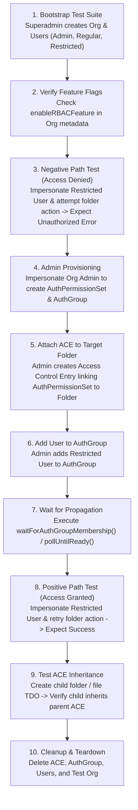

# Roles in system and Role based access Control test

## 1. Roles in system

### 1. Who are users of system?
In this platform, users represent human actors, service integrations, or administrative accounts operating within a multi-tenant hierarchy. System users are categorized into four distinct privilege levels:

1. **Superadmin (System / Platform Administrator)**:
   - Global administrator with cross-tenant privileges across the entire platform.
   - Can create isolated test environments, manage system-wide feature flags, and impersonate any user in any organization via `impersonateUser(userId, organizationGuid)`.
   - Used in test setup/teardown to bootstrap clean test organizations and clean up resources without environment pollution.

2. **Organization Admin (Tenant Administrator)**:
   - Administrator bound to a specific Organization (tenant).
   - Responsible for managing organization users, creating/deleting `AuthGroup` objects, configuring `AuthPermissionSet` rules, and attaching Access Control Entries (ACEs) to specific resources.
   - Has full operational permissions across all folders, watchlists, templates, and content within their own organization.

3. **Standard / Regular Users (CMS Users)**:
   - Operational users with assigned functional roles within an organization:
     - **CMS Editor**: Granted permissions to create, edit, move, update, and manage folders and file content (TDOs, Watchlists, Applications, SDOs).
     - **CMS Viewer**: Granted read-only permissions to query root folders (`rootFolders`), browse folder trees (`childFolders`), and view details (`folderOverview`), but restricted from performing write/delete mutations.

4. **Restricted Users**:
   - Users belonging to an organization who have **no assigned role permissions by default** (`roleIds: []`).
   - In an Object-Level Permission (OLP) enabled organization, a Restricted User starts with **zero access** ("deny by default"). They can only access or modify a resource if an explicit ACE grant is attached to their `AuthGroup` or user ID for that specific resource.

---

### 2. What are roles of system and their accessions
Below is the matrix of system roles and their allowed permissions/actions:

| Role Name | Scope / Context | Key Allowed Permissions & Actions | Restricted Actions & Security Boundaries |
| --- | --- | --- | --- |
| **Superadmin** | Global / Multi-Tenant | • Impersonate any user (`impersonateUser`) • Create and delete Organizations • Manage system feature flags (`enableRBACFeature`) • Execute cross-org superadmin GraphQL queries | None (highest privilege level). |
| **Organization Admin** | Single Organization | • Manage Org users and assign role IDs • Create, update, delete `AuthGroup` & `AuthPermissionSet` • Attach/revoke Access Control Entries (ACEs) • Full CRUD on Org Folders, Watchlists, Content Templates, and TDOs | Cannot access or modify resources belonging to other organizations (tenant isolation enforced). |
| **CMS Editor** *(Standard User)* | Single Org / Assigned Scope | • Query `rootFolders` and folder trees • `createFolder`, `updateFolder`, `moveFolder`, `moveFolders` • File/unfile TDOs, Applications, and Watchlists in folders • Create folder content templates | Cannot manage Auth Groups or Permission Sets. Cannot alter org-wide security policies. Subject to ACE restriction if OLP is enabled. |
| **CMS Viewer** *(Standard User)* | Single Org / Assigned Scope | • Query `rootFolders` • Query `childFolders`, `folderOverview`, `folderSummaryDetails` • Read folder content and filed TDOs | Restricted from all write/delete mutations (`createFolder`, `updateFolder`, `moveFolder`, `deleteFolder`). |
| **Restricted User** | Single Org / Direct Grants Only | • Zero default permissions. • Allowed **ONLY** explicitly granted actions on specific resources where an active ACE exists for their `AuthGroup`. | Blocked from all queries and mutations on folders/resources where no explicit ACE exists (receives `Unauthorized` / `Access Denied`). |

---

## 2. Roles based access control test

### 1. Strategy of Project's tests
The RBAC testing strategy for the GraphQL server enforces strict multi-tenant isolation, fine-grained object-level access verification, and asynchronous permission propagation testing:

1. **Isolated Session & Tenant Impersonation**:
   - Test suites use an **Isolated Superadmin** (`createIsolatedSuperadmin`) to dynamically provision clean test organizations and user accounts.
   - User context is dynamically switched using `impersonateUser(userId, orgGuid)`, generating realistic JWT authorization headers per request without re-authenticating.

2. **Dual-Mode Evaluation (Non-OLP vs. OLP)**:
   - **Non-OLP Mode**: Verifies standard role-based access where regular organization users share baseline access to organization folders.
   - **OLP Mode (Object-Level Permission)**: Verifies fine-grained resource security. Access to a specific `Folder` or `TDO` requires an explicit ACE grant matching the user's `AuthGroup` and `AuthPermissionSet`.

3. **Matrix-Driven Test Suites**:
   - Uses standardized test-case matrices (e.g. `A1`–`A62` in `folderNonOlp.spec.ts` and `FO1`–`FO51` in `RBAC/folderOlp.spec.ts`) to systematically evaluate create, read, update, move, and delete actions across all role types.
   - Tests evaluate positive authorization paths, negative unauthorized paths, invalid inputs, edge cases, and dynamic mode transitions (`folderSwitchOLP.spec.ts`).

4. **Asynchronous Propagation Synchronization**:
   - Uses helper utilities (`waitForAuthGroupMembership`, `pollUntilReady`) to handle backend cache updates and indexing delays after updating Auth Groups or ACEs before asserting access.

---

### 2. Reference RBAC to Folder tests
The table below maps the test specifications in `citest/tools/graphql-api/test/folder/` to their specific RBAC testing responsibilities:

| Test File | RBAC Focus Area | Description & Key Verification Scenarios |
| --- | --- | --- |
| [`RBAC/folderUserRbacSkeleton.spec.ts`](file:///home/huycao/Repos/veritone-drug/core-graphql-server/citest/tools/graphql-api/test/folder/RBAC/folderUserRbacSkeleton.spec.ts) | Test Harness & Bootstrap Skeleton | Validates test organization setup, multi-user role provisioning (Admin, Regular, Restricted), and `useRBACFeature` flag detection. |
| [`RBAC/folderUserRbac.spec.ts`](file:///home/huycao/Repos/veritone-drug/core-graphql-server/citest/tools/graphql-api/test/folder/RBAC/folderUserRbac.spec.ts) | User-Level Permission Enforcement | Comprehensive tests for Regular vs. Restricted User permissions on folder operations (`rootFolders`, `createFolder`, `updateFolder`, `moveFolder`, `deleteFolder`), ACE grants to Auth Groups, and TDO filing. |
| [`RBAC/folderAdminRbac.spec.ts`](file:///home/huycao/Repos/veritone-drug/core-graphql-server/citest/tools/graphql-api/test/folder/RBAC/folderAdminRbac.spec.ts) | Admin RBAC & Group Management | Tests Org Admin capabilities to create `AuthGroup`, create `AuthPermissionSet`, grant ACEs on folders to groups/users, and manage folder structures. |
| [`RBAC/folderOlp.spec.ts`](file:///home/huycao/Repos/veritone-drug/core-graphql-server/citest/tools/graphql-api/test/folder/RBAC/folderOlp.spec.ts) | OLP Matrix (`FO1`–`FO51`) | Systematic matrix walking create/update/move/delete across Owner, Admin, CMS, and Restricted roles in OLP-enabled orgs with explicit ACE grant-then-retry sequences. |
| [`RBAC/folderInherit.spec.ts`](file:///home/huycao/Repos/veritone-drug/core-graphql-server/citest/tools/graphql-api/test/folder/RBAC/folderInherit.spec.ts) | ACE Permission Inheritance | Verifies `inheritPermissionSet` logic where child folders and TDOs filed inside a parent folder automatically inherit parent folder ACE permissions. |
| [`RBAC/folderSwitchOLP.spec.ts`](file:///home/huycao/Repos/veritone-drug/core-graphql-server/citest/tools/graphql-api/test/folder/RBAC/folderSwitchOLP.spec.ts) | Dynamic OLP Mode Switch | Tests system behavior when an organization dynamically switches from Non-OLP to OLP mode mid-suite, ensuring security boundaries immediately tighten. |
| [`folderNonOlp.spec.ts`](file:///home/huycao/Repos/veritone-drug/core-graphql-server/citest/tools/graphql-api/test/folder/folderNonOlp.spec.ts) | Non-OLP Folder Matrix (`A1`–`A62`) | Tests baseline folder permissions and input validation without OLP enforcement. |
| [`folderMultiOrg.spec.ts`](file:///home/huycao/Repos/veritone-drug/core-graphql-server/citest/tools/graphql-api/test/folder/folderMultiOrg.spec.ts) | Multi-Tenant Isolation | Verifies user root folders and folder access are strictly isolated per organization. |

---

### 3. General RBAC test workflow
The workflow diagram below outlines the standard lifecycle of an RBAC test case:

#### Step-by-Step Explanation for Beginners:

1. **Bootstrap Test Environment**:
   - A fresh, isolated superadmin session creates a temporary organization with RBAC enabled.
   - Test users are created with specific roles: Org Admin, Regular CMS User, and Restricted User (with empty `roleIds`).

2. **Impersonate Restricted User (Step 3)**:
   - The test switches authorization headers to impersonate the **Restricted User**.
   - The user attempts a folder action (e.g. `createFolder` or `moveFolder`).
   - **Expected Outcome**: The request fails with an `Unauthorized` or permission error because no ACE has been granted yet.

3. **Admin Grants Permissions (Steps 4–6)**:
   - The test switches context back to the **Org Admin**.
   - The Admin creates an `AuthPermissionSet` (specifying allowed operations like `read`, `create`, `update`), creates an `AuthGroup`, adds the Restricted User to the group, and attaches an ACE to the target `Folder`.

4. **Synchronize Propagation (Step 7)**:
   - Permission changes take a few milliseconds to propagate through memory and caches. The helper `waitForAuthGroupMembership()` polls until the membership is active.

5. **Verify Access Granted (Step 8)**:
   - The test switches back to the **Restricted User** and retries the exact same folder action.
   - **Expected Outcome**: The mutation now succeeds because the backend evaluates the active ACE on the folder.

6. **Verify Inheritance & Cleanup (Steps 9–10)**:
   - The test verifies that subfolders or filed items inherit the parent folder's ACE permissions. Finally, all test entities and the test organization are deleted.