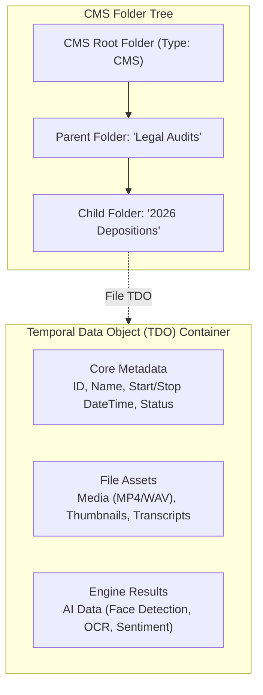
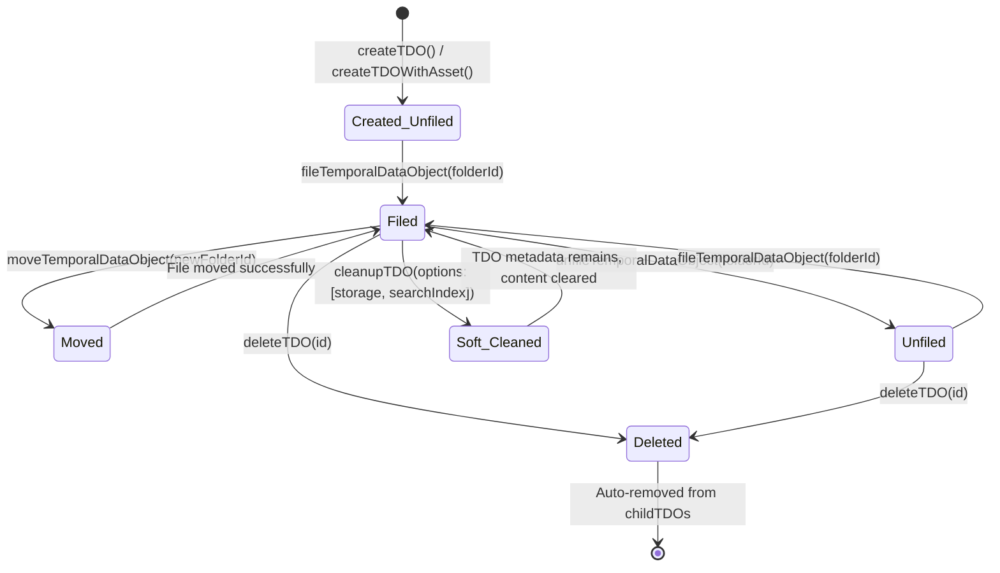
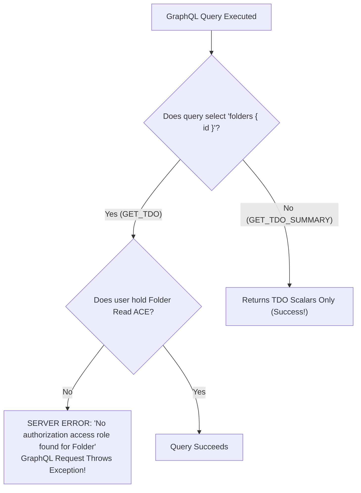
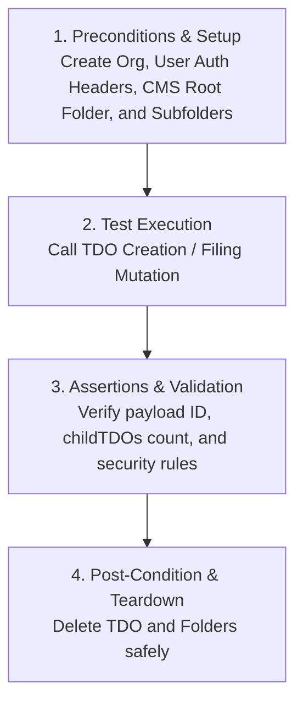

# Temporal Data Objects (TDO) in System and Folder Filing Guide

> **Audience**: Super Beginner QA Engineers & New Testers joining the Veritone GraphQL API testing team  
> **Target Service**: GraphQL Media & Folder Service (`core-graphql-server`)  
> **Related Code Files**: [`citest/tools/graphql-api/src/queries/extracted/tdo.ts`](file:///home/huycao/Repos/veritone-drug/core-graphql-server/citest/tools/graphql-api/src/queries/extracted/tdo.ts), [`src/queries/extracted/folders.ts`](file:///home/huycao/Repos/veritone-drug/core-graphql-server/citest/tools/graphql-api/src/queries/extracted/folders.ts)  
> **Related Test Suites**: [`test/tdo/fileTDO.spec.ts`](file:///home/huycao/Repos/veritone-drug/core-graphql-server/citest/tools/graphql-api/test/tdo/fileTDO.spec.ts), [`test/tdo/tdoRBAC.spec.ts`](file:///home/huycao/Repos/veritone-drug/core-graphql-server/citest/tools/graphql-api/test/tdo/tdoRBAC.spec.ts), [`test/folder/folders.spec.ts`](file:///home/huycao/Repos/veritone-drug/core-graphql-server/citest/tools/graphql-api/test/folder/folders.spec.ts)  
> **Author**: Senior API QA / Automation Lead  

---

## Table of Contents
1. [What is TDO in this system](#1-what-is-tdo-in-this-system)
   - [1.1 Why system needs TDO?](#11-why-system-needs-tdo)
   - [1.2 What are functions of TDO and its relationship with Folders?](#12-what-are-functions-of-tdo-and-its-relationship-with-folders)
   - [1.3 Main specifications of the TDO](#13-main-specifications-of-the-tdo)
   - [1.4 Life-cycle of a TDO & Filing](#14-life-cycle-of-a-tdo--filing)
2. [Core Mutations & Operations of TDO & Folder Filing](#2-core-mutations--operations-of-tdo--folder-filing)
   - [Group 1: TDO CRUD & Cleanup Operations](#group-1-tdo-crud--cleanup-operations)
   - [Group 2: Folder Filing & Reparenting Operations](#group-2-folder-filing--reparenting-operations)
   - [Group 3: Asset & Engine Result Operations](#group-3-asset--engine-result-operations)
3. [Security, RBAC & OLP Boundaries for TDOs in Folders](#3-security-rbac--olp-boundaries-for-tdos-in-folders)
   - [3.1 Folder ACE Inheritance to Filed TDOs](#31-folder-ace-inheritance-to-filed-tdos)
   - [3.2 The Field Projection Trap: `GET_TDO` vs `GET_TDO_SUMMARY`](#32-the-field-projection-trap-get_tdo-vs-get_tdo_summary)
   - [3.3 OLP Migration Freeze (`olpMigration`)](#33-olp-migration-freeze-olpmigration)
4. [Tests's workflow of TDO & Folder Filing Operations](#4-testss-workflow-of-tdo--folder-filing-operations)
   - [4.1 Core Test Workflow](#41-core-test-workflow)
   - [4.2 Detailed Test Workflows by Mutation](#42-detailed-test-workflows-by-mutation)
   - [4.3 Main Code & Test Reference Matrix](#43-main-code--test-reference-matrix)

---

## 1. What is TDO in this system

### 1.1 Why system needs TDO?

If you are a super beginner, think of **Veritone aiWARE** as a massive digital media studio powered by artificial intelligence:
- Every single second, the system ingests live radio broadcasts, TV video feeds, phone call recordings, surveillance footage, and documents.
- In this architecture, a **Temporal Data Object (TDO)** is the primary digital container for a piece of time-based media or asset.
- Without TDOs, the platform would have no structured way to attach raw audio/video files, track playback start/stop timestamps, run AI processing engines (like transcription or face recognition), or organize media into user folders.



---

### 1.2 What are functions of TDO and its relationship with Folders?

In Veritone aiWARE, TDOs and Folders work together like **files inside directories**:

1. **Media Asset Container**: A TDO holds the underlying raw media files (`assets`), engine output JSON (`engineResults`), and job execution details (`jobs`).
2. **CMS Root Scope**: TDOs strictly belong to **CMS Root Folders** (`RootFolderType.Cms` / `rootFolderTypeId: "cms"`). They cannot be filed inside Watchlist or Collection root folders.
3. **Folder Filing (`fileTemporalDataObject`)**: A TDO can be filed into a subfolder. Once filed:
   - The Folder's `childTDOs` query returns the TDO in its `records` array.
   - The TDO's `folders` query returns the parent Folder ID.
4. **Hierarchical Reparenting (`moveTemporalDataObject`)**: A TDO can be moved from an old folder to a new destination folder within the organization.
5. **Unfiling (`unfileTemporalDataObject`)**: Detaches the TDO from a folder without destroying the TDO itself.
6. **Multi-Tenant & Security Boundary**: A TDO inherits access permissions from the parent folder it is filed into.

---

### 1.3 Main specifications of the TDO

#### Complete GraphQL Schema Field Specifications
Below are the 30 fields exposed by the `TemporalDataObject` GraphQL schema, organized into 6 functional sub-tables:

##### 1. Core Metadata & Audit Fields
| Field Name | Type | Description |
| :--- | :--- | :--- |
| `id` | `ID!` | The object's unique ID (GUID). |
| `name` | `String` | Display name of the TDO (e.g., `"Courtroom_Recording_01.mp4"`). |
| `description` | `String` | Text description of the TDO object. |
| `status` | `String` | Ingestion & media status (`Downloaded`, `recording`, `uploaded`, etc.). |
| `isPublic` | `Boolean` | Indicates whether or not media contained in this TDO is public (accessible to all orgs). |
| `source` | `String` | Source system or origin identifier. |
| `createdDateTime` | `DateTime` | Object creation timestamp. Does not change. In seconds since epoch. |
| `createdBy` | `String` | User ID / identity who created the TDO object. |
| `modifiedDateTime` | `DateTime` | Object modification timestamp. In seconds since epoch. |
| `modifiedBy` | `String` | User ID / identity who last modified the TDO object. |
| `organizationId` | `ID!` | The ID of the organization that owns this TDO. |
| `organization` | `Organization` | The organization object that owns this TDO. |

##### 2. Recording Timestamps
| Field Name | Type | Description |
| :--- | :--- | :--- |
| `startDateTime` | `DateTime!` | Recording start time. In seconds since epoch. |
| `stopDateTime` | `DateTime!` | Recording stop time. In seconds since epoch. |

##### 3. Media Assets & Storage
| Field Name | Type | Arguments / Defaults | Description |
| :--- | :--- | :--- | :--- |
| `thumbnailUrl` | `String` | None | Optional URL for a thumbnail or preview image. Signed if stored in Veritone object storage. |
| `previewUrl` | `String` | None | Optional URL for a preview asset. Signed if stored in Veritone object storage. |
| `sourceImageUrl` | `String` | None | Optional URL for a source image. Signed if stored in Veritone object storage. |
| `assets` | `AssetList` | `id: ID`, `assetType: [String!]`, `sourceTaskId: ID`, `offset: Int = 0`, `limit: Int = 30`, `orderBy: AssetOrderBy = createdDateTime`, `orderDirection: OrderDirection = desc`, `includeVirtualMediaAsset: Boolean = true` | Assets this object contains. Can be of any size. Does not support paging. |
| `assetCount` | `Int!` | None | Total count of assets attached to this TDO. |
| `primaryAsset` | `Asset` | `assetType: String!` | Retrieves the primary asset of a given type (e.g. `assetType: "media"`). |
| `details` | `JSONData` | `path: String` | Arbitrary JSON metadata (or sub-path within details, e.g. `veritoneFile.fileName`). |
| `security` | `Security` | None | Security settings for the asset container. |

##### 4. Folder Hierarchy & Relationships
| Field Name | Type | Description |
| :--- | :--- | :--- |
| `folders` | `[Folder!]` | Folders in the TDO folder path, including the filed folder and all parent folders, ordered by proximity from the filed folder to the root folder. |

##### 5. Tasks, Jobs & AI Execution
| Field Name | Type | Arguments / Defaults | Description |
| :--- | :--- | :--- | :--- |
| `tasks` | `TaskList` | `id: ID`, `offset: Int = 0`, `limit: Int = 30`, `hasSourceAsset: Boolean`, `orderBy: [TaskSortField!]`, `dateTimeFilter: [TaskDateTimeFilter]` | Tasks running against this `TemporalDataObject`. |
| `jobs` | `JobList` | `id: ID`, `offset: Int = 0`, `limit: Int = 30`, `orderBy: [JobSortField!]`, `dateTimeFilter: [JobDateTimeFilter!]` | Jobs running against this `TemporalDataObject`. |
| `engineRuns` | `EngineRunList` | `offset: Int = 0`, `limit: Int = 100` | Statuses of the AI engines run on the TDO. |
| `sourceData` | `TDOSourceData` | None | Source metadata (e.g., `scheduledJobId`, `sourceId`). |
| `streams` | `[TDOStreamData!]!` | None | Stream listings if TDO supports streams (returns empty list if none, never null). |
| `streamManifest` | `TDOStreamManifest` | None | Normalized JSON stream manifest contents if this is a segmented TDO. |

##### 6. Security & Access Control
| Field Name | Type | Arguments | Description |
| :--- | :--- | :--- | :--- |
| `addACEs` | `AuthACL` | `entries: [AuthACEPermissionInput!]!` | Adds Access Control Entries (ACEs) directly to the TDO. |

---

### 1.4 Life-cycle of a TDO & Filing

A TDO moves through specific lifecycle states during upload, filing, reparenting, and deletion:



#### Lifecycle Rules for Testers

| State | Description | Allowed Operations | Prohibited Operations / Edge Cases | Expected Behavior / Error |
| :--- | :--- | :--- | :--- | :--- |
| **1. Created (Unfiled)** | TDO exists in database but has not been attached to any folder. | `updateTDO`, `fileTemporalDataObject`, `createAsset`, `deleteTDO` | `unfileTemporalDataObject` (not in folder) | Returns error or no-op |
| **2. Filed** | TDO is filed inside a CMS folder (`childTDOs.count > 0`). | `updateTDO`, `moveTemporalDataObject`, `unfileTemporalDataObject`, `deleteTDO` | Refiling to same folder via `fileTemporalDataObject` | `TDO has already been filed elsewhere.` |
| **3. Moved** | TDO transferred from `oldFolderId` to `newFolderId`. | `folder(id)` on new folder shows TDO; old folder count decreases. | Moving files when `olpMigration = true` | `OLP is being enabled. During the OLP transition, moving files is disabled...` |
| **4. Unfiled** | TDO detached from folder (`folders: []`). | `fileTemporalDataObject` (re-file), `deleteTDO` | Accessing via `folder.childTDOs` | TDO no longer appears in folder records |
| **5. Cleaned / Deleted** | `cleanupTDO` wipes files/search index; `deleteTDO` soft/hard deletes record. | Query audit logs | Querying deleted TDO details | `The requested TDO was not found` / `not_found` |

---

## 2. Core Mutations & Operations of TDO & Folder Filing

The operations for TDOs are split into 3 functional groups:

---

### Group 1: TDO CRUD & Cleanup Operations

#### Mutation 1: `createTDO` / `createTDOWithAsset`
* **Main Function**: Creates a new TDO record (optionally attaching an initial media asset).
* **Required Inputs**:
  * `input.status`: `"uploaded"`
  * `input.startDateTime`: Timestamp integer/float
  * `input.stopDateTime`: Timestamp integer/float
  * `input.parentFolderId`: *(Optional)* Immediately files TDO into specified CMS folder ID upon creation.
* **Output**: Returns `id`, `name`, `startDateTime`, `stopDateTime`, `details`.

#### Mutation 2: `updateTDO`
* **Main Function**: Modifies TDO attributes such as display name or custom details structure.
* **Required Inputs**: `input.id`, `input.name`, `input.details`.
* **Output**: Returns updated TDO payload.

#### Mutation 3: `deleteTDO`
* **Main Function**: Deletes a TDO from the system and automatically removes it from any parent folder's `childTDOs` records.
* **Required Inputs**: `id: ID!`.
* **Output**: Returns `{ id, message }`.

#### Mutation 4: `cleanupTDO`
* **Main Function**: Selectively purges heavy data (engine results, storage files, search index) while preserving the TDO entity record.
* **Required Inputs**: `id: ID!`, `options: [TDOCleanupOption!]` (e.g. `[storage, searchIndex]`).

---

### Group 2: Folder Filing & Reparenting Operations

#### Mutation 5: `fileTemporalDataObject`
* **Main Function**: Files an existing TDO into a target CMS folder.
* **Required Inputs (`input: FileTemporalDataObjectInput!`)**:
  * `tdoId`: `ID!` *(GUID of the TDO)*
  * `folderId`: `ID!` *(GUID or treeObjectId of target folder)*
* **Expected Result**: Returns TDO object with updated `folders` array containing `folderId`.
* **Key QA Validation**: Attempting to refile an already filed TDO throws: `"TDO has already been filed elsewhere."`

#### Mutation 6: `moveTemporalDataObject` / `moveTemporalDataObjectWithFolders`
* **Main Function**: Relocates a filed TDO from an old folder to a new destination folder.
* **Required Inputs (`input: MoveTemporalDataObjectInput!`)**:
  * `tdoId`: `ID!`
  * `oldFolderId`: `ID!`
  * `newFolderId`: `ID!`
* **Expected Result**: TDO's folder reference updates to `newFolderId`; old folder's `childTDOs.count` decreases by 1.

#### Mutation 7: `unfileTemporalDataObject`
* **Main Function**: Detaches a TDO from a folder.
* **Required Inputs (`input: UnfileTemporalDataObjectInput!`)**:
  * `tdoId`: `ID!`
  * `folderId`: `ID!`
* **Expected Result**: TDO remains in database, but `folders` array becomes empty `[]`.

---

### Group 3: Asset & Engine Result Operations

* **`createAsset` / `deleteAsset`**: Manages binary files (WAV, MP4, JSON) attached to a TDO.
* **`getSignedWritableUrl`**: Mints secure S3/GCS pre-signed upload URLs for client-side direct media uploads.
* **`engineResults`**: Queries AI processing output (transcripts, face bounding boxes) associated with a TDO.

---

## 3. Security, RBAC & OLP Boundaries for TDOs in Folders

### 3.1 Folder ACE Inheritance to Filed TDOs

When Object-Level Permissions (OLP) are enabled (`enableRBACFeature = 'enabled'`):
1. **Access Control Entry (ACE) Inheritance**: If an Admin attaches an ACE granting `Read` or `Write` access on a **Parent Folder** to an `AuthGroup`, any TDO filed inside that folder automatically inherits those permissions.
2. **Filing Authorization (`AIWARE_FOLDER_FILE`)**: To file a TDO into a folder, the user must hold the `AIWARE_FOLDER_FILE` or folder write permission on the target folder.

---

### 3.2 The Field Projection Trap: `GET_TDO` vs `GET_TDO_SUMMARY`

As a senior tester, you **must watch out for this critical GraphQL authorization trap**:



* **The Problem**: The standard `GET_TDO` query requests child fields: `temporalDataObject { id name folders { id } assets { records { id } } }`. Resolving `folders` triggers a backend permission evaluation for the **Folder** resource type.
* **The Trap**: If a Restricted User has permission to read the TDO itself, but **does not hold a Folder Read ACE** on the parent folder, the server returns an authorization error for `Folder`, causing `graphql-request` to throw a client-side exception!
* **The Solution**: In test suites verifying TDO access without folder permissions, use **`GET_TDO_SUMMARY`** (which selects scalar fields only and omits `folders`).

---

### 3.3 OLP Migration Freeze (`olpMigration`)

When an organization is undergoing live migration to OLP (`olpMigration = true`):
- **Moving Files Disabled**: The backend explicitly blocks `moveTemporalDataObject` requests.
- **Why?** During live migration, moving a TDO into a new folder set could strip existing ACE grants and lock users out of their media assets.
- **Expected Error**:
  ```text
  OLP is being enabled. During the OLP transition, moving files is disabled because it can lead to resources without ACEs being locked out
  ```

---

## 4. Tests's workflow of TDO & Folder Filing Operations

### 4.1 Core Test Workflow

Every TDO and filing test follows the standard 4-stage QA execution pattern:



---

### 4.2 Detailed Test Workflows by Mutation

#### Workflow 1: `fileTemporalDataObject`
1. **Preconditions**:
   - Create CMS Root Folder and subfolder (`folderId`).
   - Create a TDO (`tdoId`).
2. **Execution Steps**:
   - Call `gqlClient.sdk.fileTemporalDataObject({ input: { tdoId, folderId } })`.
3. **Assertions**:
   - **Happy Path**: Returns TDO object; `folder(id: folderId)` returns `childTDOs.count == 1` with `records[0].id == tdoId`.
   - **Negative (Double Filing)**: Re-run `fileTemporalDataObject` with same inputs $\to$ Assert error `"TDO has already been filed elsewhere."`
   - **Negative (Invalid TDO)**: Pass `tdoId: "-123"` $\to$ Assert error `"The requested TDO was not found"`.
4. **Teardown**:
   - Delete TDO via `deleteTDO` and delete folder in `afterAll`.

---

#### Workflow 2: `moveTemporalDataObject`
1. **Preconditions**:
   - Create `folder1` and `folder2`.
   - Create and file TDO in `folder1`.
   - Check `olpMigration` feature flag on organization.
2. **Execution Steps**:
   - Call `gqlClient.sdk.moveTemporalDataObject({ input: { tdoId, oldFolderId: folder1, newFolderId: folder2 } })`.
3. **Assertions**:
   - **Non-OLP / Standard Path**: Success; `folder(id: folder1)` count becomes `0`; `folder(id: folder2)` count becomes `1`.
   - **OLP Migration Path (`olpMigration = true`)**: Assert promise rejects with `/OLP is being enabled. During the OLP transition, moving files is disabled/`.
4. **Teardown**:
   - Clean up TDO and folders.

---

#### Workflow 3: `unfileTemporalDataObject`
1. **Preconditions**:
   - TDO filed in `folderId`.
2. **Execution Steps**:
   - Call `gqlClient.sdk.unfileTemporalDataObject({ input: { tdoId, folderId } })`.
3. **Assertions**:
   - Returned TDO has empty `folders: []`.
   - Querying `folder(id: folderId)` shows `childTDOs.count == 0`.
4. **Teardown**:
   - Delete TDO and folder.

---

### 4.3 Main Code & Test Reference Matrix

Below is the mapping of all TDO and Folder Filing test suites in the codebase:

| Test File Path | Primary Focus | Key Scenarios & Assertions |
| :--- | :--- | :--- |
| [`test/tdo/fileTDO.spec.ts`](file:///home/huycao/Repos/veritone-drug/core-graphql-server/citest/tools/graphql-api/test/tdo/fileTDO.spec.ts) | **TDO Filing Lifecycle** | Tests create TDO, update TDO name, file TDO in folder, double-filing error, move TDO, unfile TDO, and TDO deletion cascade. |
| [`test/tdo/tdoRBAC.spec.ts`](file:///home/huycao/Repos/veritone-drug/core-graphql-server/citest/tools/graphql-api/test/tdo/tdoRBAC.spec.ts) | **TDO RBAC & OLP Security** | Tests TDO creation under CMS root with regular/restricted user options, scalar projection (`temporalDataObjectSummary`), moving TDOs with V2 folder flags, and superadmin teardown. |
| [`test/tdo/recDelTest.spec.ts`](file:///home/huycao/Repos/veritone-drug/core-graphql-server/citest/tools/graphql-api/test/tdo/recDelTest.spec.ts) | **Cascade Deletion & Cleanup** | Tests `cleanupTDO` (clearing storage/search index) and verifying deleted TDOs are purged from parent folder `childTDOs`. |
| [`test/tdo/requestCloneTdos.spec.ts`](file:///home/huycao/Repos/veritone-drug/core-graphql-server/citest/tools/graphql-api/test/tdo/requestCloneTdos.spec.ts) | **Cross-Application Cloning** | Tests cloning TDOs between applications/organizations via `requestClone`. |
| [`test/folder/folders.spec.ts`](file:///home/huycao/Repos/veritone-drug/core-graphql-server/citest/tools/graphql-api/test/folder/folders.spec.ts) | **Folder Child TDO Queries** | Verifies `folder(id)` correctly resolves `childTDOs` counts and records. |
| [`src/queries/extracted/tdo.ts`](file:///home/huycao/Repos/veritone-drug/core-graphql-server/citest/tools/graphql-api/src/queries/extracted/tdo.ts) | **GraphQL Operations Library** | Contains raw GraphQL queries/mutations for TDO, Asset, Engine Results, and Signed URLs. |

---
*Report maintained under [`citest/tools/graphql-api/test/folder/Exploring/business.TDO.md`](file:///home/huycao/Repos/veritone-drug/core-graphql-server/citest/tools/graphql-api/test/folder/Exploring/business.TDO.md).*
