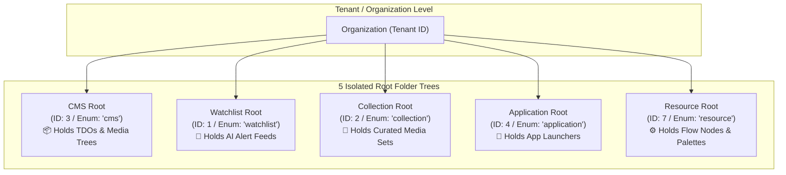
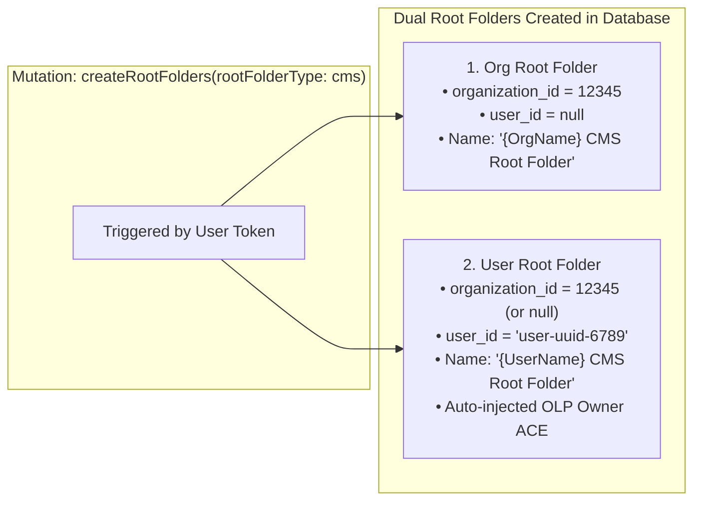
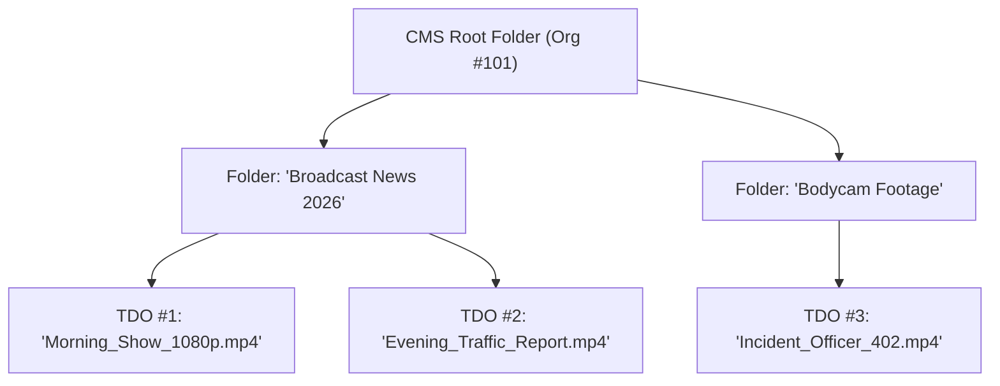
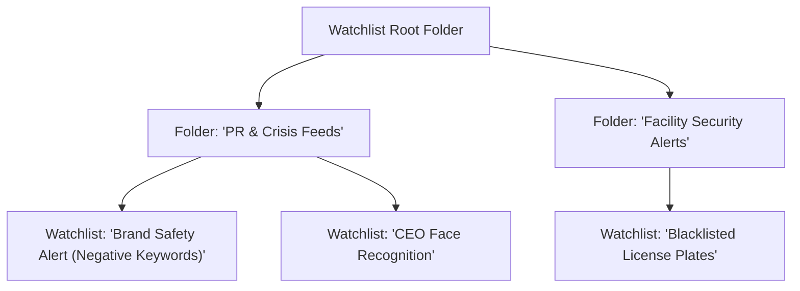
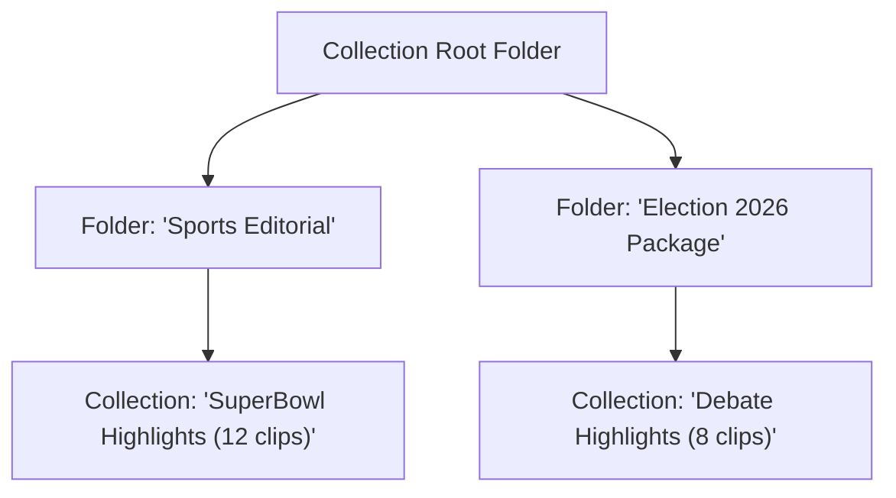
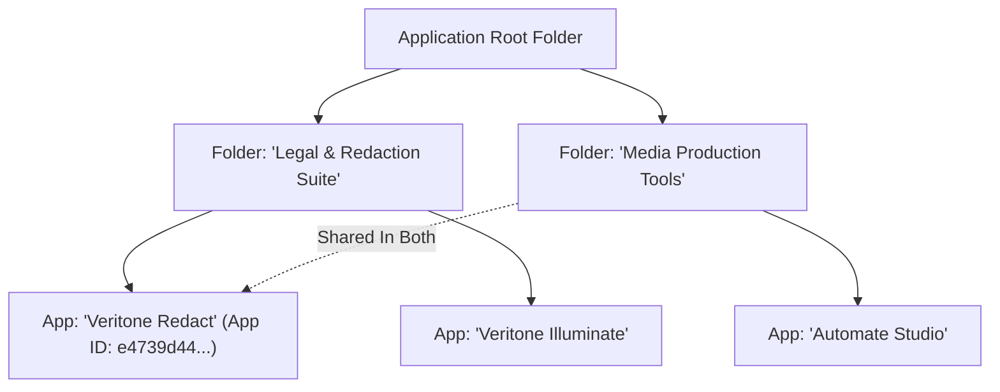
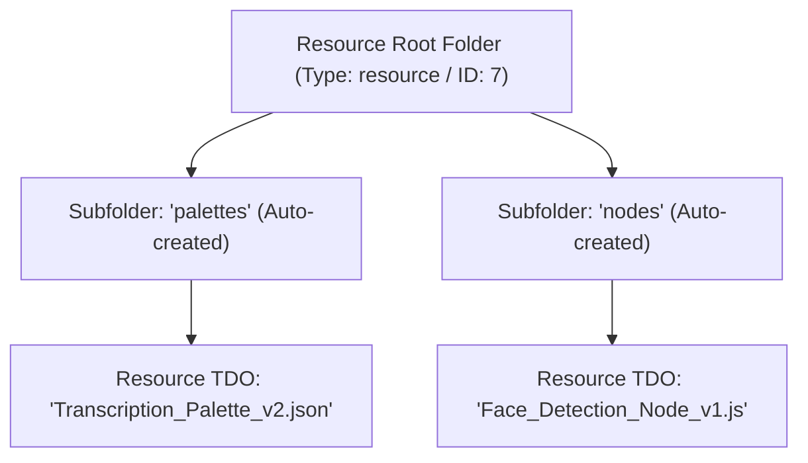
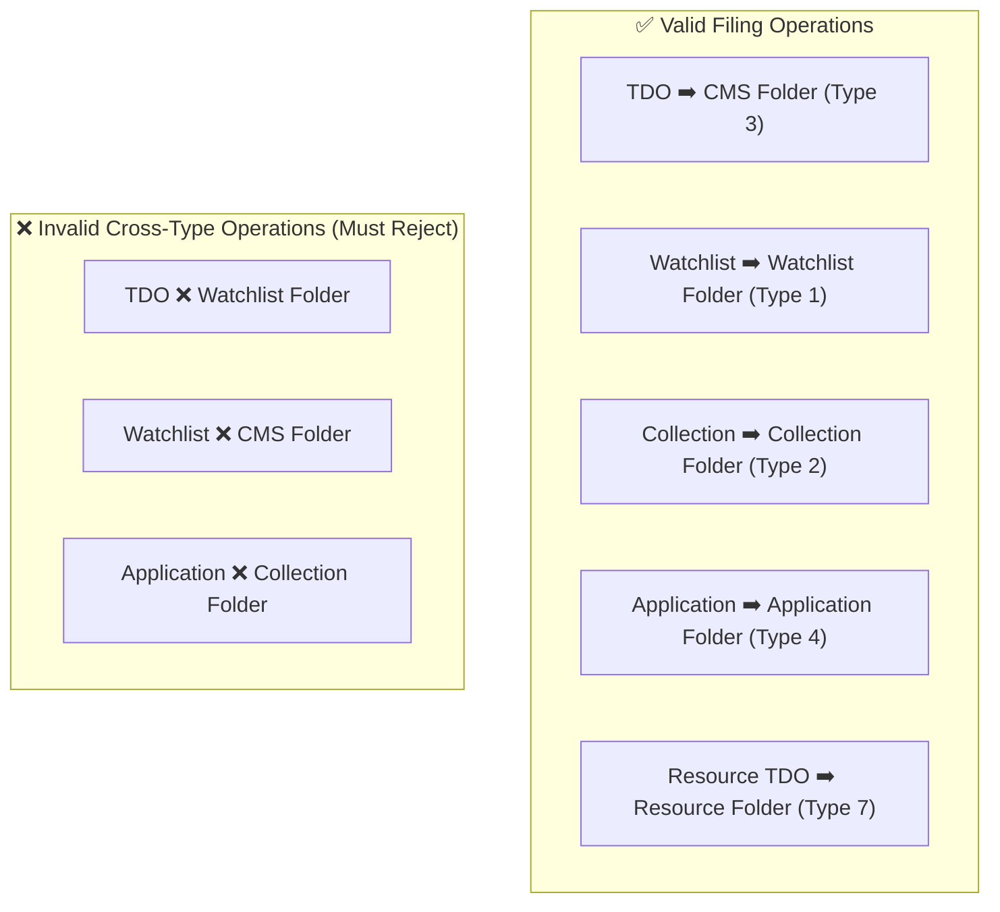

# Root Folder Types in Veritone aiWARE

> **Audience**: Super Beginner QA Engineers & New Testers joining the Veritone GraphQL API testing team  
> **Target Service**: GraphQL Media & Folder Service (`core-graphql-server`)  
> **Related Code Files**: [`citest/tools/graphql-api/src/queries/extracted/folders.ts`](file:///home/huycao/Repos/veritone-drug/core-graphql-server/citest/tools/graphql-api/src/queries/extracted/folders.ts), [`dal/dalFolder.js`](file:///home/huycao/Repos/veritone-drug/core-graphql-server/dal/dalFolder.js), [`schema/schema.graphql`](file:///home/huycao/Repos/veritone-drug/core-graphql-server/schema/schema.graphql)  
> **Related Test Suites**: [`test/folder/folders.spec.ts`](file:///home/huycao/Repos/veritone-drug/core-graphql-server/citest/tools/graphql-api/test/folder/folders.spec.ts), [`test/folder/foldersV2.spec.ts`](file:///home/huycao/Repos/veritone-drug/core-graphql-server/citest/tools/graphql-api/test/folder/foldersV2.spec.ts), [`test/folder/watchlist.spec.ts`](file:///home/huycao/Repos/veritone-drug/core-graphql-server/citest/tools/graphql-api/test/folder/watchlist.spec.ts)  
> **Author**: Senior API QA / Automation Lead  

---

## Table of Contents
1. [Introduction for Super Beginners: What is a Root Folder?](#1-introduction-for-super-beginners-what-is-a-root-folder)
   - [1.1 The Drive & Partition Analogy](#11-the-drive--partition-analogy)
   - [1.2 Why Does aiWARE Separate Root Folders by Type?](#12-why-does-aiware-separate-root-folders-by-type)
   - [1.3 Organization Root vs User Root Folders (The Duality Principle)](#13-organization-root-vs-user-root-folders-the-duality-principle)
   - [1.4 Type ID & Tree Object Mapping Matrix](#14-type-id--tree-object-mapping-matrix)
2. [Deep Dive: The 5 Root Folder Types](#2-deep-dive-the-5-root-folder-types)
   - [2.1 Type 1: `cms` (Content Management System)](#21-type-1-cms-content-management-system)
   - [2.2 Type 2: `watchlist` (AI Alert Rules & Feeds)](#22-type-2-watchlist-ai-alert-rules--feeds)
   - [2.3 Type 3: `collection` (Media Collections & Playlists)](#23-type-3-collection-media-collections--playlists)
   - [2.4 Type 4: `application` (App Categorization & Portals)](#24-type-4-application-app-categorization--portals)
   - [2.5 Type 5: `resource` (Packages, Automate Nodes & Palettes)](#25-type-5-resource-packages-automate-nodes--palettes)
3. [Senior QA Testing Blueprint: Root Folder Verification](#3-senior-qa-testing-blueprint-root-folder-verification)
   - [3.1 Cross-Type Boundary & Containment Rules](#31-cross-type-boundary--containment-rules)
   - [3.2 Auto-Creation & Idempotency Rules](#32-auto-creation--idempotency-rules)
   - [3.3 Object-Level Permission (OLP) & ACE Scoping Rules](#33-object-level-permission-olp--ace-scoping-rules)
   - [3.4 Senior QA Test Case Matrix](#34-senior-qa-test-case-matrix)
4. [/grill-me: Interactive Senior QA Knowledge Check](#4-grill-me-interactive-senior-qa-knowledge-check)

---

## 1. Introduction for Super Beginners: What is a Root Folder?

### 1.1 The Drive & Partition Analogy

If you are new to the platform, think of **Veritone aiWARE** as a huge enterprise cloud operating system. 
In Windows or macOS, you don't just dump audio recordings, system program files, security firewalls, and photo albums into one single folder. You have separate drives or partitions (e.g., `C:\Program Files`, `D:\Media`, `E:\System Backups`).

In aiWARE, **Root Folders** are the top-level anchor containers for the entire system:
* Every organization and user gets dedicated root folders.
* A root folder has **no parent** (it is the top of the tree, `depth = 0`).
* All subfolders, media files, alert rules, applications, and system resources branch downward from these roots.



---

### 1.2 Why Does aiWARE Separate Root Folders by Type?

1. **Strict Type Isolation**: You should never accidentally move an AI alert rule (`Watchlist`) into a video archive folder (`CMS`), or confuse an Automate Studio code node (`Resource`) with a customer video recording (`TDO`).
2. **Specialized Resolver Behavior**: Different root trees resolve different child relationships:
   - `Folder.childTDOs` works inside **CMS** folders.
   - `Folder.childWatchlists` works inside **Watchlist** folders.
   - `Folder.childCollections` works inside **Collection** folders.
   - `Folder.childApplications` works inside **Application** folders.
3. **Security & Permission Scoping**: CMS root folders grant default Object-Level Permissions (OLP Owner ACEs) to creating users, whereas Resource root folders are governed by package and system-level scopes.

---

### 1.3 Organization Root vs User Root Folders (The Duality Principle)

Whenever root folders are created or fetched (via `createRootFolders` or `rootFolders`), the system manages **two distinct root folders** for each type:



* **Organization Root Folder**: Shared workspace root for the company/organization. Visible to all users in the organization who have `AIWARE_FOLDER_READ` permissions.
* **User Root Folder**: Private "My Files" root folder for that specific user. Only accessible by that user (unless explicitly shared).

---

### 1.4 Type ID & Tree Object Mapping Matrix

In the codebase, root folder types are defined across three layers: GraphQL Schema, Database/DAL layer, and Tree Object layer:

| Enum Name in GraphQL (`RootFolderType`) | Numeric ID in DB / DAL (`ROOT_FOLDER_TYPE`) | Primary Child Object Contained | Contained `TREE_OBJECT_TYPE` ID | GraphQL Child Query Field |
| :--- | :---: | :--- | :---: | :--- |
| **`watchlist`** | `1` | Watchlist (AI Alert Rules) | `2` (`WATCHLIST`) | `Folder.childWatchlists` |
| **`collection`** | `2` | Collection (Media Playlists/Sets) | `3` (`COLLECTION`) | `Folder.childCollections` |
| **`cms`** | `3` | TemporalDataObject (TDO / Media) | `5` (`TDO`) | `Folder.childTDOs` |
| **`application`** | `4` | Application (aiWARE Apps) | `6` (`APPLICATION`) | `Folder.childApplications` |
| **`resource`** | `7` | Resource TDOs (Nodes, Palettes) | `5` (`TDO`) | `Folder.childFolders` (Subfolders) |

---

## 2. Deep Dive: The 5 Root Folder Types

---

### 2.1 Type 1: `cms` (Content Management System)

#### 1. Type's Definition
The **CMS Root Folder** is the primary media and document repository root of Veritone aiWARE. It holds all time-based media assets—called **Temporal Data Objects (TDOs)**—including video files, audio recordings, images, PDF documents, transcripts, and AI engine recognition results.

#### 2. Type's Specification
* **GraphQL Enum Value**: `cms` (e.g. `RootFolderType.Cms`).
* **Database / DAL ID**: `ROOT_FOLDER_TYPE.cms = 3`.
* **Database Tables Involved**: `root_folder` (`root_folder_type_id = 3`), `tree_object` (`tree_object_type_id = 4`), `tree_object_closure`.
* **Default Fallback**: In `dalFolder.js`, if `rootFolderType` is omitted from `createFolder`, `moveFolder`, or `folderSummaryDetails`, the system defaults to `'cms'`.
* **OLP Security Rule**: When a User CMS root folder is created, the system automatically assigns default OLP Owner ACEs (`addDefaultACEsToResources`) so the creator has full access.
* **Max Hierarchy Depth**: Configured by `folder.maxDepth` (default: 5 levels deep).
* **Contained Entities**: Standard folders (`tree_object_type_id = 1`) and TDOs (`tree_object_type_id = 5`).
* **Child Filing Operations**:
  - `fileTemporalDataObject(folderId, tdoId)`
  - `unfileTemporalDataObject(folderId, tdoId)`
  - `moveFolder(...)` / `moveFolders(...)`

#### 3. Main Purposes of Type
* **Media Asset Lifecycle**: Organizing raw uploads, recordings, and rendered media into hierarchical business folders.
* **Departmental Isolation**: Allowing departments (e.g., "Legal Compliance", "Marketing", "Security Surveillance") to build deep folder structures for their media.
* **Access Control & Sharing**: Restricting sensitive videos (e.g., internal legal depositions or police bodycam footage) using folder-level ACLs/OLP.

#### 4. Real Examples of Type



##### Step A: Create CMS Root Folders
```graphql
mutation CreateCMSRoots {
  createRootFolders(rootFolderType: cms) {
    id
    name
    rootFolderTypeId
    organizationId
    treeObjectId
  }
}
```

##### Response:
```json
{
  "data": {
    "createRootFolders": [
      {
        "id": "e2a3b4c5-0001-4000-8000-000000000001",
        "name": "Acme Media CMS Root Folder",
        "rootFolderTypeId": 3,
        "organizationId": 101,
        "treeObjectId": "t-e2a3b4c5-0001"
      },
      {
        "id": "e2a3b4c5-0002-4000-8000-000000000002",
        "name": "John Doe CMS Root Folder",
        "rootFolderTypeId": 3,
        "organizationId": 101,
        "treeObjectId": "t-e2a3b4c5-0002"
      }
    ]
  }
}
```

##### Step B: Create a Subfolder and File a Video TDO
```graphql
# 1. Create Subfolder
mutation CreateMediaSubfolder {
  createFolder(input: {
    name: "Broadcast News 2026"
    parentId: "e2a3b4c5-0001-4000-8000-000000000001"
    rootFolderType: cms
  }) {
    id
    name
    parent { id name }
  }
}

# 2. File TDO into Subfolder
mutation FileVideoIntoFolder {
  fileTemporalDataObject(
    folderId: "folder-uuid-news-2026"
    id: "tdo-uuid-morning-show"
  ) {
    id
    name
  }
}
```

---

### 2.2 Type 2: `watchlist` (AI Alert Rules & Feeds)

#### 1. Type's Definition
The **Watchlist Root Folder** is the organizational container for AI monitoring rules and live alert feeds. A Watchlist continuously scans real-time streams (TV, radio, CCTV) and alerts users when specific keywords, human faces, vehicle license plates, or brand logos appear.

#### 2. Type's Specification
* **GraphQL Enum Value**: `watchlist` (e.g. `RootFolderType.Watchlist`).
* **Database / DAL ID**: `ROOT_FOLDER_TYPE.watchlist = 1`.
* **Database Tables Involved**: `root_folder` (`root_folder_type_id = 1`), `tree_object` (`tree_object_type_id = 4`), `watchlist` / `media_platform`.
* **Schema Default in Legacy Signatures**: In `schema.graphql`, several folder operations declare `rootFolderType: RootFolderType = watchlist` by default (e.g., `folderOverview`, `folderSummaryDetails`).
* **Contained Entities**: Watchlist subfolders (`tree_object_type_id = 1`) and Watchlist items (`tree_object_type_id = 2`).
* **Child Filing Operations**:
  - `fileWatchlist(folderId, watchlistId)`
  - `unfileWatchlist(folderId, watchlistId)`
  - `moveWatchlist(...)`
* **Query Resolver**: `Folder.childWatchlists` resolves all watchlists filed under the given folder.

#### 3. Main Purposes of Type
* **Live Alert Organization**: Grouping hundreds of AI detection rules into structured departments (e.g., "Crisis Management", "Brand Safety", "Competitor Tracking").
* **Targeted Alert Dispatch**: Allowing specific teams to subscribe only to the watchlists inside their assigned subfolder.
* **Separation from Media Archives**: Preventing AI detection logic from cluttering standard media search folders.

#### 4. Real Examples of Type



##### Step A: Fetch Watchlist Root Folder
```graphql
query GetWatchlistRoots {
  rootFolders(type: watchlist) {
    id
    name
    rootFolderTypeId
    childWatchlists {
      count
      records {
        id
        name
      }
    }
  }
}
```

##### Step B: File a Watchlist into a Subfolder
```graphql
mutation FileWatchlistToPRFolder {
  fileWatchlist(input: {
    folderId: "folder-uuid-pr-team"
    watchlistId: "wl-uuid-brand-safety"
  }) {
    id
    name
    folders {
      id
      name
    }
  }
}
```

---

### 2.3 Type 3: `collection` (Media Collections & Playlists)

#### 1. Type's Definition
The **Collection Root Folder** is the container for curated sets of assets, playlists, and grouped items created through legacy Collection tools or custom grouping workflows in aiWARE.

#### 2. Type's Specification
* **GraphQL Enum Value**: `collection` (e.g. `RootFolderType.Collection`).
* **Database / DAL ID**: `ROOT_FOLDER_TYPE.collection = 2`.
* **Database Tables Involved**: `root_folder` (`root_folder_type_id = 2`), `tree_object` (`tree_object_type_id = 4`), `collection` table in `media_platform` database.
* **Underlying Module**: Managed via `modules/core-collection-server/model` and `dal/dalCollection.js`.
* **Contained Entities**: Collection subfolders (`tree_object_type_id = 1`) and Collection items (`tree_object_type_id = 3`).
* **Child Filing Operations**:
  - `fileCollection(orgId, parentId, childId, childType, orderIndex)` (invoked during `createCollection`)
  - `unfileCollection(folderId, objectId)`
  - `moveCollection(...)`
* **Query Resolver**: `Folder.childCollections` returns paginated collections filed in that folder.

#### 3. Main Purposes of Type
* **Curated Asset Packages**: Grouping specific clips from different folders into a single broadcast package (e.g. "Highlights of the 2026 World Championship").
* **Editorial Review Sets**: Collating audio/video snippets for legal discovery review without copying or duplicating underlying media files.
* **Legacy aiWARE Collection Support**: Providing backwards compatibility for applications built on the aiWARE Collections framework.

#### 4. Real Examples of Type



##### GraphQL Operation:
```graphql
query GetSportsCollections {
  folder(id: "folder-uuid-sports-editorial") {
    id
    name
    childCollections {
      count
      records {
        id
        name
        description
        image
      }
    }
  }
}
```

---

### 2.4 Type 4: `application` (App Categorization & Portals)

#### 1. Type's Definition
The **Application Root Folder** is the container used to categorize and organize aiWARE software applications, studio tools, and custom micro-frontends into departmental folders or catalog views.

#### 2. Type's Specification
* **GraphQL Enum Value**: `application` (e.g. `RootFolderType.Application`).
* **Database / DAL ID**: `ROOT_FOLDER_TYPE.application = 4`.
* **Database Tables Involved**: `root_folder` (`root_folder_type_id = 4`), `tree_object` (`tree_object_type_id = 4`), `application` table.
* **Contained Entities**: Application subfolders (`tree_object_type_id = 1`) and Application items (`tree_object_type_id = 6`).
* **Idempotent Filing Feature**: `fileApplication` allows an application to be filed multiple times (`allowMultipleParents: true`), meaning the same tool (e.g. "Veritone Redact") can appear in multiple category folders.
* **Child Filing Operations**:
  - `fileApplication(input: { appId, folderId })`
  - `unfileApplication(input: { appId, folderId })`
* **Query Resolver**: `Folder.childApplications` retrieves the applications filed under the folder.

#### 3. Main Purposes of Type
* **Enterprise App Cataloging**: Grouping applications into business categories (e.g., "Legal & Compliance Tools", "Audio Engineering Tools", "Admin Utilities").
* **Departmental Portal Navigation**: Rendering tailored app launcher dashboards based on user department folders.
* **Multi-Tenant App Management**: Allocating specialized internal apps to specific organization branches.

#### 4. Real Examples of Type



##### Step A: Create Application Subfolder and File App
```graphql
# 1. Create Application Subfolder
mutation CreateAppFolder {
  createFolder(input: {
    parentId: "app-root-tree-object-id"
    name: "Legal & Redaction Suite"
    rootFolderType: application
  }) {
    id
    name
  }
}

# 2. File App into Folder
mutation FileRedactApp {
  fileApplication(input: {
    appId: "e4739d44-53d2-4153-b55f-5e246fc989b1"
    folderId: "folder-uuid-legal-apps"
  }) {
    id
    name
  }
}
```

##### Step B: Query Folder with `childApplications`
```graphql
query GetLegalApplications {
  folder(id: "folder-uuid-legal-apps") {
    id
    name
    childApplications {
      count
      records {
        id
        name
        description
      }
    }
  }
}
```

---

### 2.5 Type 5: `resource` (Packages, Automate Nodes & Palettes)

#### 1. Type's Definition
The **Resource Root Folder** is a specialized system-level root container used to house technical assets, Automate Studio flow nodes, custom execution palettes, and engine package templates cleanly separated from regular end-user media.

#### 2. Type's Specification
* **GraphQL Enum Value**: `resource` (e.g. `RootFolderType.Resource`).
* **Database / DAL ID**: `ROOT_FOLDER_TYPE.resource = 7`.
* **Database Tables Involved**: `root_folder` (`root_folder_type_id = 7`), `tree_object` (`tree_object_type_id = 4`).
* **Package Integration (`dal/package.js`)**: When packages or Automate assets are registered, `fileTDOResouceInResourceFolder` automatically ensures the `resource` root folder exists and auto-provisions dedicated category subfolders:
  - `automateNode` resource types are filed into a `nodes` subfolder.
  - `automatePalette` resource types are filed into a `palettes` subfolder.
* **Contained Entities**: Resource subfolders (`tree_object_type_id = 1`) and Resource TDO assets (`tree_object_type_id = 5`).
* **Underlying File Mechanism**: Uses `serviceContext.dal.folder.fileObject` with `TREE_OBJECT_TYPE.TDO` under the resource folder tree.

#### 3. Main Purposes of Type
* **Automate Studio Asset Storage**: Housing workflow node definitions, palette icons, and engine configurations.
* **Separation of System Assets from User Media**: Ensuring that developer scripts, integration connectors, and workflow nodes do not pollute the user's primary CMS video/audio search results.
* **Engine Package Deployment**: Managing technical packages distributed across organizations.

#### 4. Real Examples of Type



##### Automated System Ingestion Workflow (`dal/package.js`):
```typescript
// System automatically resolves/creates resource subfolder and files TDO:
await dal.fileTDOResouceInResourceFolder(
  context,
  'automatePalette', // Maps to subfolder 'palettes'
  { id: 'tdo-palette-uuid', orgId: 101 }
);
```

##### GraphQL Root Query:
```graphql
query GetResourceRootFolders {
  rootFolders(type: resource) {
    id
    name
    rootFolderTypeId
    subfolders {
      id
      name
      childTDOs {
        count
        records {
          id
          name
        }
      }
    }
  }
}
```

---

## 3. Senior QA Testing Blueprint: Root Folder Verification

### 3.1 Cross-Type Boundary & Containment Rules

As a Senior QA engineer, here are the non-negotiable containment rules you must test:



1. **Reparenting Between Different Root Types Is Forbidden**: Moving a subfolder created under a `cms` root to a parent under a `watchlist` root must fail with a validation error.
2. **Type Preservation on Subfolders**: When `createFolder` is called with `rootFolderType: watchlist`, all descendant folders inherit the same type boundary.

---

### 3.2 Auto-Creation & Idempotency Rules

* Calling `createRootFolders(rootFolderType: X)` when root folders already exist **must be idempotent**: it returns the existing root folders without creating duplicates or throwing errors.
* Calling `createRootFolders` under a standard user token must return **2 folders**:
  1. Organization Root Folder (`userId = null`, `organizationId = <orgId>`)
  2. User Root Folder (`userId = <userId>`, `organizationId = <orgId>`)

---

### 3.3 Object-Level Permission (OLP) & ACE Scoping Rules

* **CMS User Roots**: Automatically injected with Owner ACE for the creating user (`addDefaultACEsToResources`).
* **Org Roots**: Governed by Organization-level roles (`AIWARE_FOLDER_CREATE`, `AIWARE_FOLDER_READ`, `AIWARE_FOLDER_ADMIN`).
* **Child Inheritance**: Creating a child folder or filing an item under a root folder inherits ACE permissions down the tree closure unless explicit overrides are applied.

---

### 3.4 Senior QA Test Case Matrix

| Test Case ID | Test Category | Target Root Type | Test Step | Expected API Response |
| :--- | :--- | :--- | :--- | :--- |
| **RF-01** | Root Creation | `cms`, `watchlist`, `collection`, `application`, `resource` | Call `createRootFolders(rootFolderType: <Type>)` on clean org. | Returns array of 2 folders (Org Root & User Root) with correct `rootFolderTypeId`. |
| **RF-02** | Idempotency | `cms` | Call `createRootFolders(rootFolderType: cms)` twice consecutively. | Second call succeeds, returning the same IDs as the first call. |
| **RF-03** | Default Fallback | `cms` | Call `createFolder(input: { parentId: rootId, name: "Sub" })` without specifying `rootFolderType`. | Creates subfolder successfully, defaulting to `rootFolderType: cms`. |
| **RF-04** | Invalid Type Check | Invalid (`unknown_type`) | Call `createRootFolders` with an invalid string / unknown enum. | GraphQL validation error: Value does not exist in `RootFolderType` enum. |
| **RF-05** | Watchlist Filing Isolation | `watchlist` vs `cms` | Attempt to file a Watchlist into a CMS Root Folder via `fileWatchlist`. | Throws validation error; Watchlist cannot be filed in non-watchlist folder tree. |
| **RF-06** | Application Multi-Filing | `application` | Call `fileApplication` on the same `appId` into Folder A, then Folder B. | Both succeed (`allowMultipleParents: true`), `childApplications` returns the app in both folders. |
| **RF-07** | Resource Auto-Subfolder | `resource` | Trigger package ingestion for `automateNode` and `automatePalette`. | Auto-creates `nodes` and `palettes` subfolders under Resource root and files TDOs. |
| **RF-08** | Multi-Tenant Isolation | All 5 Types | User from Org A queries `rootFolders(type: cms)` of Org B. | Returns only Org A folders; strictly 0 leakage across tenant boundaries. |

---