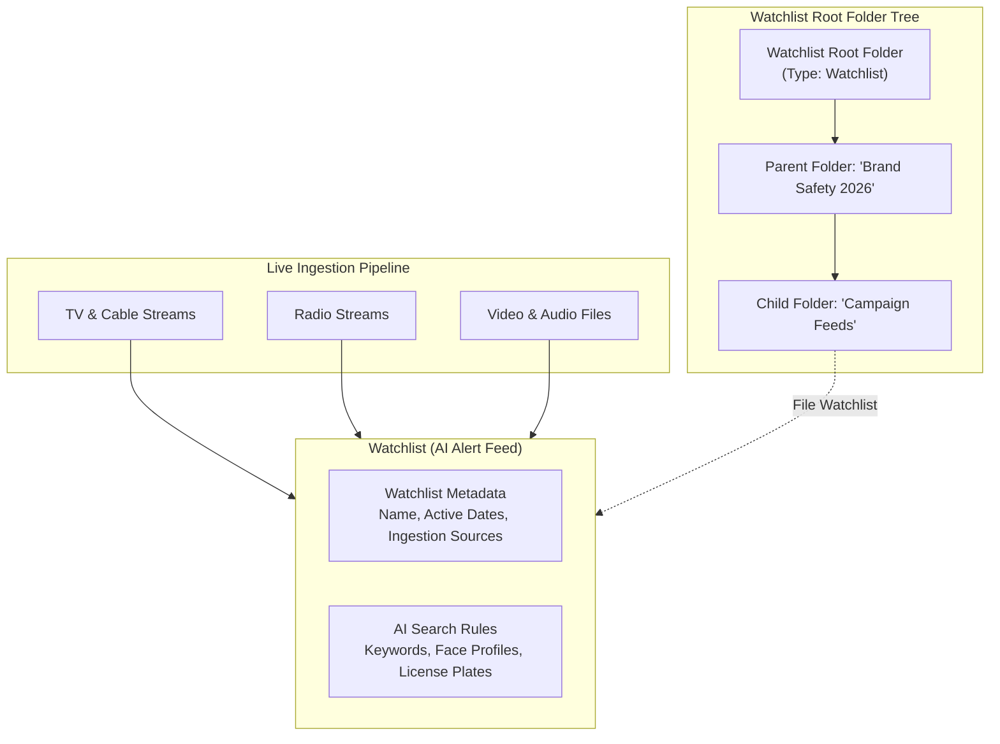
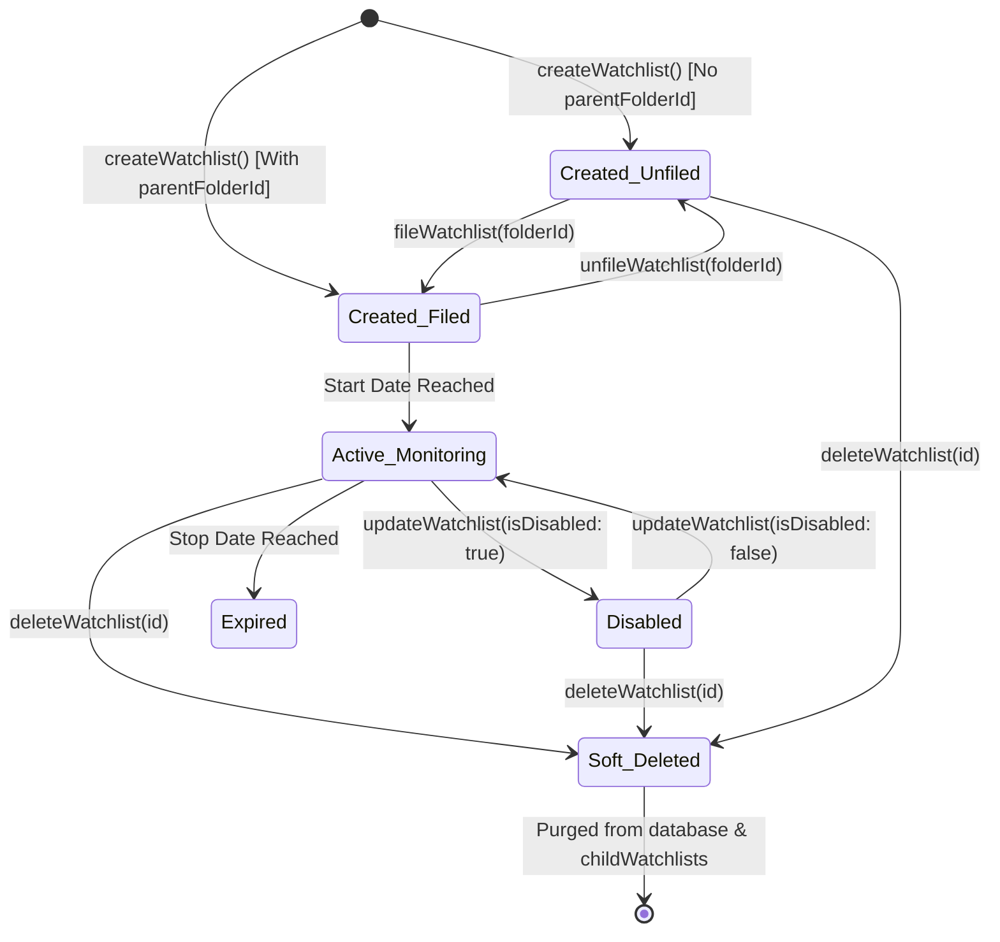
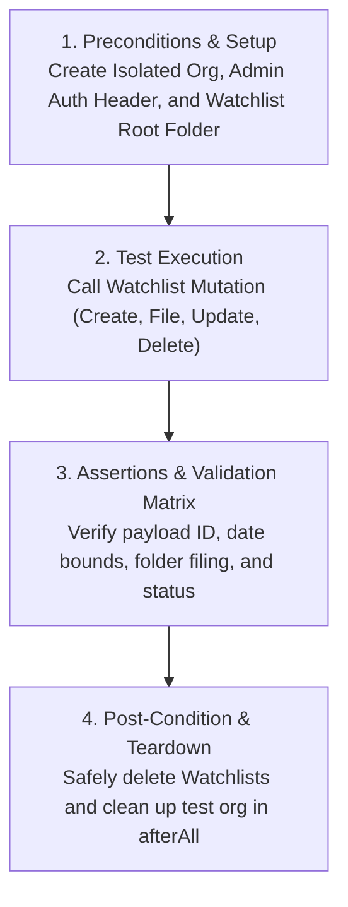

# Watchlists in System and Folder Filing Guide

> **Audience**: Super Beginner QA Engineers & New Testers joining the Veritone GraphQL API testing team  
> **Target Service**: GraphQL Media & Folder Service (`core-graphql-server`)  
> **Related Code Files**: [`citest/tools/graphql-api/src/queries/extracted/folders.ts`](file:///home/huycao/Repos/veritone-drug/core-graphql-server/citest/tools/graphql-api/src/queries/extracted/folders.ts), [`citest/tools/graphql-api/src/gql/gql.ts`](file:///home/huycao/Repos/veritone-drug/core-graphql-server/citest/tools/graphql-api/src/gql/gql.ts)  
> **Related Test Suites**: [`test/folder/watchlist.spec.ts`](file:///home/huycao/Repos/veritone-drug/core-graphql-server/citest/tools/graphql-api/test/folder/watchlist.spec.ts), [`test/folder/folders.spec.ts`](file:///home/huycao/Repos/veritone-drug/core-graphql-server/citest/tools/graphql-api/test/folder/folders.spec.ts)  
> **Author**: Senior API QA / Automation Lead  

---

## Table of Contents
1. [What is Watchlist in this system](#1-what-is-watchlist-in-this-system)
   - [1.1 Why system needs Watchlist?](#11-why-system-needs-watchlist)
   - [1.2 What are functions of Watchlist and its relationship with Folders?](#12-what-are-functions-of-watchlist-and-its-relationship-with-folders)
   - [1.3 Main specifications of the Watchlist](#13-main-specifications-of-the-watchlist)
   - [1.4 Life-cycle of a Watchlist & Filing](#14-life-cycle-of-a-watchlist--filing)
2. [Core Mutations & Operations of Watchlist & Folder Filing](#2-core-mutations--operations-of-watchlist--folder-filing)
   - [Group 1: Watchlist CRUD Operations](#group-1-watchlist-crud-operations)
   - [Group 2: Bulk Watchlist Operations](#group-2-bulk-watchlist-operations)
   - [Group 3: Folder Filing Operations](#group-3-folder-filing-operations)
3. [Security, RBAC & OLP Boundaries for Watchlists in Folders](#3-security-rbac--olp-boundaries-for-watchlists-in-folders)
   - [3.1 Watchlist Root Folder Type Enforcement](#31-watchlist-root-folder-type-enforcement)
   - [3.2 Multi-Tenant Organization Isolation](#32-multi-tenant-organization-isolation)
   - [3.3 Access Control & Administrative Controls](#33-access-control--administrative-controls)
4. [Tests's workflow of Watchlist & Folder Filing Operations](#4-testss-workflow-of-watchlist--folder-filing-operations)
   - [4.1 Core Test Workflow](#41-core-test-workflow)
   - [4.2 Standardized API Test Cases](#42-standardized-api-test-cases)
   - [4.3 Main Code & Test Reference Matrix](#43-main-code--test-reference-matrix)

---

## 1. What is Watchlist in this system

### 1.1 Why system needs Watchlist?

If you are a super beginner, imagine **Veritone aiWARE** as a 24/7 intelligent surveillance tower scanning thousands of live broadcasts, radio streams, TV channels, podcasts, and video uploads simultaneously:
- Thousands of hours of media flow into the system every hour. No human can manually watch or listen to everything to catch important events (e.g. brand mentions, safety threats, or specific faces).
- A **Watchlist** is an automated AI alert rule or monitoring feed. It tells the platform: *"Keep scanning all incoming media and alert me whenever a specific keyword, face, logo, or topic is detected."*
- Without Watchlists, organizations would have no way to automatically track real-time media hits, monitor brand reputation, or trigger automated workflows based on AI engine detections.

---

### 1.2 What are functions of Watchlist and its relationship with Folders?

In Veritone aiWARE, Watchlists and Folders work together like **smart alert feeds inside organizational categories**:

1. **AI Monitoring Scope**: A Watchlist defines which media sources (`sourceIds` / `sourceTypeIds`), search index (`mine` vs `global`), and timeframe (`startDateTime` to `stopDateTime`) to monitor.
2. **Watchlist Root Scope**: Watchlists strictly belong to **Watchlist Root Folders** (`RootFolderType.Watchlist` / `rootFolderTypeId: "watchlist"`). They **cannot** be filed inside CMS or Collection root folders.
3. **Folder Filing (`fileWatchlist`)**: A Watchlist can be filed into a Watchlist subfolder. Once filed:
   - The Folder's `childWatchlists` query returns the Watchlist in its records list.
   - The Watchlist's `folders` query returns the parent Folder ID.
4. **Folder Unfiling (`unfileWatchlist`)**: Detaches the Watchlist from a folder without destroying the Watchlist entity itself.
5. **Categorization & Multi-Tenancy**: Folders allow organizations to group dozens of Watchlists by department or campaign (e.g., "Crisis Management Watchlists" vs "Competitor Analysis Watchlists") while preserving tenant isolation.

---

### 1.3 Main specifications of the Watchlist

#### Complete GraphQL Schema Field Specifications

Below are the key fields exposed by the `Watchlist` GraphQL schema (`citest/tools/graphql-api/src/gql/gql.ts`):

##### Core Attributes & Metadata
| Field Name | Type | Description |
| :--- | :--- | :--- |
| `id` | `ID!` | Unique identifier (GUID) for the Watchlist. |
| `name` | `String!` | Display name of the Watchlist (e.g., `"Q3 Brand Crisis Radar"`). |
| `startDateTime` | `DateTime` | Date and time when the Watchlist takes effect. |
| `stopDateTime` | `DateTime` | Date and time when the Watchlist expires. |
| `isDisabled` | `Boolean` | Flag indicating if the Watchlist is active or administratively disabled. |
| `searchIndex` | `SearchIndex` | Search index scope (`mine` for org-only data, `global` for public media). |
| `organizationId` | `ID!` | The GUID of the organization that owns this Watchlist. |
| `organization` | `Organization!` | The organization entity that owns this Watchlist. |
| `sourceIds` | `[ID]` | List of specific media ingestion source IDs attached directly to the Watchlist. |
| `sourceTypeIds` | `[ID]` | List of source type IDs (e.g., TV, Radio, Web) attached directly to the Watchlist. |
| `combinedSourceTypeIds` | `[ID]` | Aggregated list of all source type IDs, including scheduled sources. |
| `folders` | `[Folder]` | Array of folders where this Watchlist is filed (currently capped at 1 folder). |
| `details` | `JSONData` | Arbitrary JSON metadata (e.g. `programIds`, `marketIds`, `targetAudience`). |
| `createdDateTime` | `DateTime` | Object creation timestamp. |
| `modifiedDateTime` | `DateTime` | Object last modified timestamp. |

---

### 1.4 Life-cycle of a Watchlist & Filing

A Watchlist moves through specific lifecycle states during creation, filing, updating, disabling, and deletion:

#### Lifecycle Rules for Testers

| State | Description | Allowed Operations | Prohibited Operations / Edge Cases | Expected Behavior / Error |
| :--- | :--- | :--- | :--- | :--- |
| **1. Unfiled Watchlist** | Watchlist exists in database but is not filed in any folder. | `updateWatchlist`, `fileWatchlist`, `deleteWatchlist` | `unfileWatchlist` (when not filed) | Returns error or no-op |
| **2. Filed Watchlist** | Watchlist attached to a Watchlist root or subfolder. | `updateWatchlist`, `unfileWatchlist`, `deleteWatchlist` | Filing into CMS Root Folder (`rootFolderType: cms`) | `InvalidInput` / `ResourceConflict` |
| **3. Active Monitoring** | `isDisabled == false` and current time is between `startDateTime` and `stopDateTime`. | `updateWatchlist`, `fileWatchlist`, `unfileWatchlist`, `deleteWatchlist` | Setting `stopDateTime` before `startDateTime` | `The supplied startDateTime must be before the stopDateTime.` |
| **4. Disabled State** | `isDisabled == true` (user-disabled or auto-disabled due to org limits). | `updateWatchlist(isDisabled: false)` to re-enable | Ingesting alerts while disabled | Watchlist halts detection background tasks |
| **5. Deleted State** | Watchlist deleted via `deleteWatchlist`. | Audit log verification | Querying `watchlist(id)` | Throws error `not_found` |

---

## 2. Core Mutations & Operations of Watchlist & Folder Filing

The GraphQL operations for managing Watchlists and their folder relationships are categorized into 3 functional groups:

---

### Group 1: Watchlist CRUD Operations

#### Mutation 1: `createWatchlist`
* **Main Function**: Creates a new Watchlist object with search index, source parameters, and optional folder filing.
* **Key Inputs (`input: CreateWatchlist!`)**:
  * `name`: `String!` *(Required: Name of the Watchlist)*
  * `stopDateTime`: `DateTime` *(Expiration date)*
  * `startDateTime`: `DateTime` *(Optional start date)*
  * `parentFolderId`: `ID` *(Optional: Instantly files Watchlist into target Watchlist folder)*
  * `searchIndex`: `SearchIndex` *(Enum: `mine` or `global`)*
  * `sourceIds`: `[ID]` *(List of source IDs)*
  * `sourceTypeIds`: `[ID]` *(List of source type IDs)*
  * `details`: `JSONData` *(Custom metadata object)*
* **Expected Result**: Returns `Watchlist` object with `id`, `name`, `folders`, and `searchIndex`.

#### Mutation 2: `updateWatchlist`
* **Main Function**: Updates Watchlist parameters (renaming, changing date range, or toggling `isDisabled`).
* **Key Inputs (`input: UpdateWatchlist!`)**:
  * `id`: `ID!` *(Required: GUID of Watchlist)*
  * `name`: `String` *(New name)*
  * `isDisabled`: `Boolean` *(Set `true` to pause, `false` to activate)*
  * `startDateTime`: `DateTime`
  * `stopDateTime`: `DateTime`
* **Expected Result**: Returns modified `Watchlist` payload.

#### Mutation 3: `deleteWatchlist`
* **Main Function**: Deletes a Watchlist from the system and automatically purges it from any parent folder's `childWatchlists`.
* **Key Inputs**: `id: ID!`.
* **Expected Result**: Returns `DeletePayload` containing `{ id, message }`.

---

### Group 2: Bulk Watchlist Operations

#### Mutation 4: `bulkCreateWatchlist`
* **Main Function**: Provisions multiple Watchlists in a single atomic GraphQL request.
* **Key Inputs (`input: BulkCreateWatchlist!`)**:
  * `watchlists`: `[CreateWatchlist!]` *(Array of Watchlist creation input objects)*
* **Expected Result**: Returns `WatchlistList` payload with `records` array containing all newly created Watchlists.

---

### Group 3: Folder Filing Operations

#### Mutation 5: `fileWatchlist`
* **Main Function**: Files an existing Watchlist into a target Watchlist folder.
* **Key Inputs (`input: FileWatchlist!`)**:
  * `watchlistId`: `ID!` *(GUID of Watchlist)*
  * `folderId`: `ID!` *(GUID of target Watchlist folder)*
* **Expected Result**: Returns `Watchlist` object with updated `folders` array containing `folderId`.

#### Mutation 6: `unfileWatchlist`
* **Main Function**: Detaches a Watchlist from its current parent folder.
* **Key Inputs (`input: UnfileWatchlist!`)**:
  * `watchlistId`: `ID!` *(GUID of Watchlist)*
  * `folderId`: `ID!` *(GUID of current folder)*
* **Expected Result**: Returns `Watchlist` object with an empty `folders: []` array.

---

## 3. Security, RBAC & OLP Boundaries for Watchlists in Folders

### 3.1 Watchlist Root Folder Type Enforcement

The Veritone platform enforces strict type boundaries across its folder hierarchy:
1. **Root Folder Type Mismatch**: Watchlists **can only** be filed under folders whose root ancestor is of type `RootFolderType.Watchlist` (`rootFolderTypeId: "watchlist"`).
2. **Rejection Rule**: Attempting to file a Watchlist into a CMS Root Folder (`rootFolderTypeId: "cms"`) or Collection Root Folder results in a GraphQL validation or business logic rejection error.

---

### 3.2 Multi-Tenant Organization Isolation

1. **Strict Tenant Separation**: Watchlists and Watchlist folders are scoped to a single `organizationId`.
2. **Cross-Tenant Guard**: User A in Organization 1 cannot query, file, update, or delete Watchlists belonging to Organization 2.
3. **Isolated Test Provisioning**: Automated test suites use `createIsolatedSuperadmin` to create disposable organizations per suite, preventing parallel test pollution.

---

### 3.3 Access Control & Administrative Controls

1. **Global Media Feature Flag (`globalMedia`)**: Creating Watchlists with `searchIndex: global` requires the organization feature flag `org.kvp.features.globalMedia` to be enabled. Otherwise, the server throws: *"The organization is not provisioned to allow global media access."*
2. **Administrative Disabling**: If a Watchlist generates an abnormally high volume of detections exceeding organization quotas, backend system jobs set `isDisabled: true`.

---

## 4. Tests's workflow of Watchlist & Folder Filing Operations

### 4.1 Core Test Workflow

Every Watchlist automation test suite follows a standard 4-stage execution pattern:

---

### 4.2 Standardized API Test Cases

Below are the official API test cases documented according to the repository test format specification:

---

### Test Case: TC_WL_001 - Create Watchlist with Direct Folder Filing (Happy Path)
**Priority:** High | **Type:** Functional / E2E

**Pre-conditions:**
- Isolated test organization initialized.
- Root Watchlist folder created (`rootFolderId`).

| Step | Action / Step Description | Input Data | Expected Result |
|---|---|---|---|
| 1 | Query `rootFolders` to fetch Watchlist root folder ID | `rootFolderType: Watchlist` | Status 200 OK. Returns `rootFolderId`. |
| 2 | Execute `createWatchlist` mutation specifying `parentFolderId` | `input: { name: "TC_WL_001_Watchlist", parentFolderId: rootFolderId, searchIndex: mine, stopDateTime: "+90 days" }` | Watchlist created successfully. Returns `id`, `name`, and `folders[0].id == rootFolderId`. |
| 3 | Query `watchlist(id)` to verify database state | `id: [createdWatchlistId]` | Returned watchlist matches name and shows active folder reference. |

**Post-conditions:**
- Watchlist is safely deleted during suite teardown.

---

### Test Case: TC_WL_002 - Fail Watchlist Creation on Invalid Date Bounds
**Priority:** High | **Type:** Functional (Negative)

**Pre-conditions:**
- Test organization active.
- Watchlist root folder available.

| Step | Action / Step Description | Input Data | Expected Result |
|---|---|---|---|
| 1 | Attempt `createWatchlist` with `stopDateTime` set earlier than `startDateTime` | `input: { name: "Invalid_Date_WL", startDateTime: "2026-10-01T00:00:00Z", stopDateTime: "2026-09-01T00:00:00Z" }` | Request rejected with error: `"The supplied startDateTime must be before the stopDateTime."` |
| 2 | Attempt `createWatchlist` with `startDateTime` older than organization historical limit | `input: { startDateTime: "10 years ago ISO string" }` | Request rejected with date range restriction error. |

**Post-conditions:**
- No invalid Watchlist record is created in the database.

---

### Test Case: TC_WL_003 - File and Unfile Watchlist in Subfolder
**Priority:** Medium | **Type:** Functional

**Pre-conditions:**
- Watchlist root folder active.
- Subfolder created under Watchlist root (`subFolderId`).
- Unfiled Watchlist created (`watchlistId`).

| Step | Action / Step Description | Input Data | Expected Result |
|---|---|---|---|
| 1 | Call `fileWatchlist` mutation to file Watchlist into `subFolderId` | `input: { watchlistId: watchlistId, folderId: subFolderId }` | Returns Watchlist object with `folders[0].id == subFolderId`. |
| 2 | Query `folder(id: subFolderId)` and check `childWatchlists` | `id: subFolderId` | `childWatchlists.count` equals 1; record ID matches `watchlistId`. |
| 3 | Call `unfileWatchlist` mutation to remove Watchlist from folder | `input: { watchlistId: watchlistId, folderId: subFolderId }` | Returns Watchlist object with empty `folders: []`. |
| 4 | Query `folder(id: subFolderId)` to verify unfiling | `id: subFolderId` | `childWatchlists.count` decreases to 0. |

**Post-conditions:**
- Watchlist remains in unfiled state and is deleted during teardown.

---

### Test Case: TC_WL_004 - Bulk Create Watchlists
**Priority:** High | **Type:** Functional

**Pre-conditions:**
- Watchlist root folder created (`rootFolderId`).

| Step | Action / Step Description | Input Data | Expected Result |
|---|---|---|---|
| 1 | Execute `bulkCreateWatchlist` mutation with array of 2 Watchlist inputs | `watchlists: [{ name: "Bulk_WL_1", parentFolderId: rootFolderId }, { name: "Bulk_WL_2", parentFolderId: rootFolderId }]` | Mutation executes successfully. Returns `bulkCreateWatchlist.records` with length 2. |
| 2 | Assert attributes for each returned Watchlist record | N/A | Both Watchlists display valid IDs and show `folders[0].id == rootFolderId`. |

**Post-conditions:**
- Both bulk Watchlists are cleaned up in `afterAll`.

---

### Test Case: TC_WL_005 - Disable and Re-enable Watchlist
**Priority:** Medium | **Type:** Functional

**Pre-conditions:**
- Active Watchlist created (`watchlistId`).

| Step | Action / Step Description | Input Data | Expected Result |
|---|---|---|---|
| 1 | Execute `updateWatchlist` setting `isDisabled: true` | `input: { id: watchlistId, isDisabled: true }` | Returns Watchlist with `isDisabled == true`. |
| 2 | Query `watchlist(id)` to verify status | `id: watchlistId` | Database state confirms `isDisabled == true`. |
| 3 | Execute `updateWatchlist` setting `isDisabled: false` | `input: { id: watchlistId, isDisabled: false }` | Returns Watchlist with `isDisabled == false`. |

**Post-conditions:**
- Watchlist restored to active state prior to deletion.

---

### Test Case: TC_WL_006 - Delete Watchlist Cascade Cleanup
**Priority:** High | **Type:** Functional / Regression

**Pre-conditions:**
- Active Watchlist created and filed in Watchlist folder (`watchlistId`).

| Step | Action / Step Description | Input Data | Expected Result |
|---|---|---|---|
| 1 | Execute `deleteWatchlist` mutation | `input: { id: watchlistId }` | Returns payload `{ id: watchlistId, message: "Watchlist deleted..." }`. |
| 2 | Query `watchlist(id: watchlistId)` | `id: watchlistId` | Server throws error `not_found`. |
| 3 | Query parent folder `childWatchlists` | `id: folderId` | Watchlist is automatically removed from folder records. |

**Post-conditions:**
- Database entity and folder links are completely cleaned up.

---

### 4.3 Main Code & Test Reference Matrix

Below is the mapping of all Watchlist and Folder Filing test code files in the project:

| Test File Path | Primary Focus | Key Scenarios & Assertions |
| :--- | :--- | :--- |
| [`test/folder/watchlist.spec.ts`](file:///home/huycao/Repos/veritone-drug/core-graphql-server/citest/tools/graphql-api/test/folder/watchlist.spec.ts) | **Watchlist & Folder Filing Test Suite** | Main test spec validating `createWatchlist`, invalid date bounds, `bulkCreateWatchlist`, `updateWatchlist`, disabling Watchlists, `fileWatchlist`, `unfileWatchlist`, and `deleteWatchlist`. |
| [`test/folder/folders.spec.ts`](file:///home/huycao/Repos/veritone-drug/core-graphql-server/citest/tools/graphql-api/test/folder/folders.spec.ts) | **Folder Child Watchlists Queries** | Tests `folder(id)` resolution of `childWatchlists` count and records array. |
| [`src/queries/extracted/folders.ts`](file:///home/huycao/Repos/veritone-drug/core-graphql-server/citest/tools/graphql-api/src/queries/extracted/folders.ts) | **Extracted Folder & Filing Operations** | Contains raw GraphQL definitions for `FILE_WATCHLIST`, `BULK_CREATE_WATCHLIST`, etc. |
| [`src/gql/gql.ts`](file:///home/huycao/Repos/veritone-drug/core-graphql-server/citest/tools/graphql-api/src/gql/gql.ts) | **GraphQL Schema & SDK** | Contains TypeScript definitions for `Watchlist`, `CreateWatchlist`, `FileWatchlist`, `UnfileWatchlist`. |

---
*Report maintained under [`citest/tools/graphql-api/test/folder/Exploring/business.watchlist.md`](file:///home/huycao/Repos/veritone-drug/core-graphql-server/citest/tools/graphql-api/test/folder/Exploring/business.watchlist.md).*
