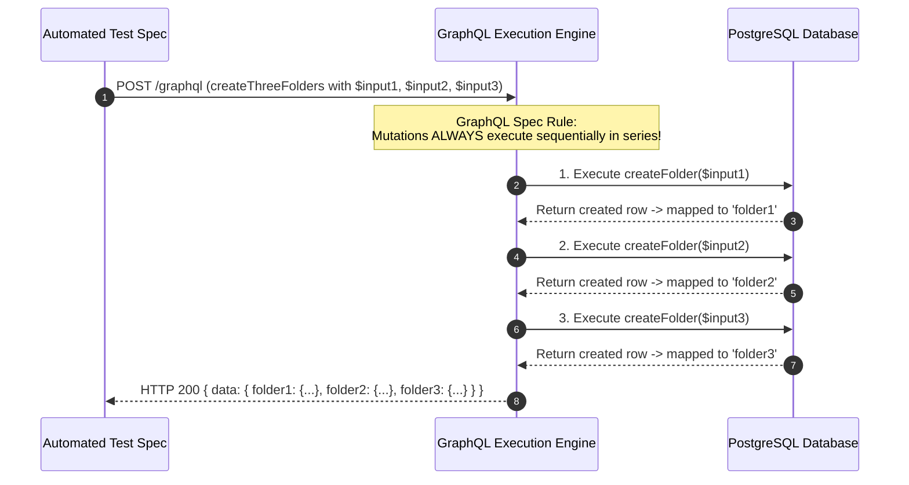

# GraphQL Field Aliasing: How `CREATE_THREE_FOLDERS` Maps to the Server Schema

> **Audience**: Super Beginner QA Engineers & New Testers joining the Veritone GraphQL API testing team  
> **Target File**: [`src/queries/extracted/foldersver2.ts`](file:///home/huycao/Repos/veritone-drug/core-graphql-server/citest/tools/graphql-api/src/queries/extracted/foldersver2.ts)  
> **Server Schema Target**: `createFolder(input: CreateFolder!): Folder`  
> **Author**: Senior API QA / Automation Lead  

---

## Table of Contents
1. [Introduction & Core Concept](#introduction--core-concept)
2. [1. Server Mutation Resolver vs Client Operation Document](#1-server-mutation-resolver-vs-client-operation-document)
3. [2. How the GraphQL Server Executes the Request](#2-how-the-graphql-server-executes-the-request)
4. [3. The Response Structure & Data Mapping](#3-the-response-structure--data-mapping)
5. [4. Key Conceptual Summary & Comparison Matrix](#4-key-conceptual-summary--comparison-matrix)
6. [5. Testing Best Practices for Aliased Mutations](#5-testing-best-practices-for-aliased-mutations)

---

## Introduction & Core Concept

When you write a mutation like:

```typescript
import { gql } from 'graphql-request';

export const CREATE_THREE_FOLDERS = gql`
  mutation createThreeFolders(
    $input1: CreateFolder!
    $input2: CreateFolder!
    $input3: CreateFolder!
  ) {
    folder1: createFolder(input: $input1) {
      id
      treeObjectId
      name
      status
    }
    folder2: createFolder(input: $input2) {
      id
      treeObjectId
      name
      status
    }
    folder3: createFolder(input: $input3) {
      id
      treeObjectId
      name
      status
    }
  }
`;
```

Does this mutation exist on the GraphQL server?

> **Direct Answer**: **YES, it directly calls the server's existing `createFolder` mutation!**  
> However, `createThreeFolders` itself is not a backend resolver name. Instead, it utilizes **GraphQL Field Aliasing** to execute the server's single `createFolder` resolver **three times in one network trip**.

---

## 1. Server Mutation Resolver vs Client Operation Document

Here is the exact mapping between the backend server schema and our client document:

```
                                  CLIENT DOCUMENT (foldersver2.ts)
                                  ═════════════════════════════════
                                  
  SERVER MUTATION RESOLVER                mutation createThreeFolders(
  ────────────────────────                  $input1: CreateFolder!
  createFolder(input: CreateFolder!)        $input2: CreateFolder!
                                            $input3: CreateFolder!
                                          ) {
       ┌───────────────────────────────────── folder1: createFolder(input: $input1) { ... }
       │
       ├───────────────────────────────────── folder2: createFolder(input: $input2) { ... }
       │
       └───────────────────────────────────── folder3: createFolder(input: $input3) { ... }
                                          }
```

### Breakdown of the 4 Key Parts:

1. **`createFolder(input: CreateFolder!)`**:
   The **real backend mutation resolver** implemented in `core-graphql-server`.
2. **`createThreeFolders`**:
   The **client-side operation name**. CodeGen uses this name to generate the method `client.sdk.createThreeFolders(...)` in [`src/gql/gql.ts`](file:///home/huycao/Repos/veritone-drug/core-graphql-server/citest/tools/graphql-api/src/gql/gql.ts).
3. **`folder1:`, `folder2:`, `folder3:` (Field Aliases)**:
   In GraphQL, you cannot query or mutate the same field multiple times in the same selection set without an alias (doing so throws a `"Fields 'createFolder' conflict"` error). Aliases rename each result key in the returned JSON object.
4. **`$input1, $input2, $input3: CreateFolder!`**:
   Three independent input payloads conforming to the server's `CreateFolder` schema type.

---

## 2. How the GraphQL Server Executes the Request

When our automated test sends this request over HTTP, the GraphQL server execution engine follows the official GraphQL specification rules:



### 💡 Why Mutations Execute Sequentially (In Series):
* **Queries**: Are executed in parallel (concurrently) because reads do not cause side effects.
* **Mutations**: Are **guaranteed to execute sequentially** (one after another in order). This prevents race conditions when multiple state changes occur in the same request.

---

## 3. The Response Structure & Data Mapping

Because of the aliases (`folder1:`, `folder2:`, `folder3:`), the server returns a single JSON object where each key corresponds to the alias:

```json
{
  "data": {
    "folder1": {
      "id": "11111111-aaaa-bbbb-cccc-000000000001",
      "treeObjectId": "tree-node-1",
      "name": "QA-Folder-Alpha",
      "status": "active"
    },
    "folder2": {
      "id": "22222222-aaaa-bbbb-cccc-000000000002",
      "treeObjectId": "tree-node-2",
      "name": "QA-Folder-Beta",
      "status": "active"
    },
    "folder3": {
      "id": "33333333-aaaa-bbbb-cccc-000000000003",
      "treeObjectId": "tree-node-3",
      "name": "QA-Folder-Gamma",
      "status": "active"
    }
  }
}
```

---

## 4. Key Conceptual Summary & Comparison Matrix

| Concept | Location | Purpose & Role |
| :--- | :--- | :--- |
| `createFolder` | **Server Schema** | The actual backend mutation function in `core-graphql-server`. |
| `CreateFolder` | **Server Schema** | The input object type requiring `name`, `parentId`, `rootFolderType`, etc. |
| `createThreeFolders` | **Client Test Tool** | The document operation name that produces `sdk.createThreeFolders` in [`src/gql/gql.ts`](file:///home/huycao/Repos/veritone-drug/core-graphql-server/citest/tools/graphql-api/src/gql/gql.ts). |
| `folder1:`, `folder2:`, `folder3:` | **GraphQL Field Aliases** | Allows bundling 3 executions of `createFolder` into **1 single HTTP network round-trip**. |

---

## 5. Testing Best Practices for Aliased Mutations

1. **Use Aliasing for Batch Setup Fixtures**:
   If a test suite needs 3 sibling folders created before running assertions, using aliased mutations sets them all up in 1 network request, making the test suite faster.
2. **Do Not Use Aliasing for Hierarchical (Parent $\rightarrow$ Child) Folders**:
   If Folder 2 needs Folder 1's generated `id` as its `parentId`, you cannot pass it in the same mutation request because `$input2` variables must be provided up front. In that case, use sequential `await sdk.createFolder(...)` calls instead.
