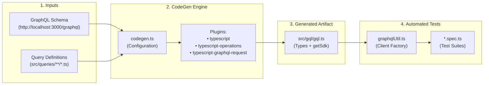
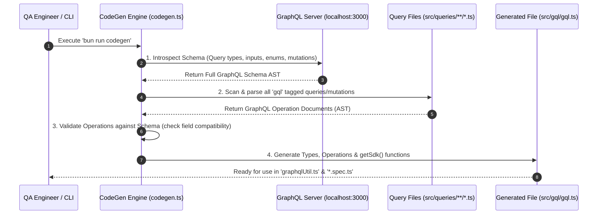
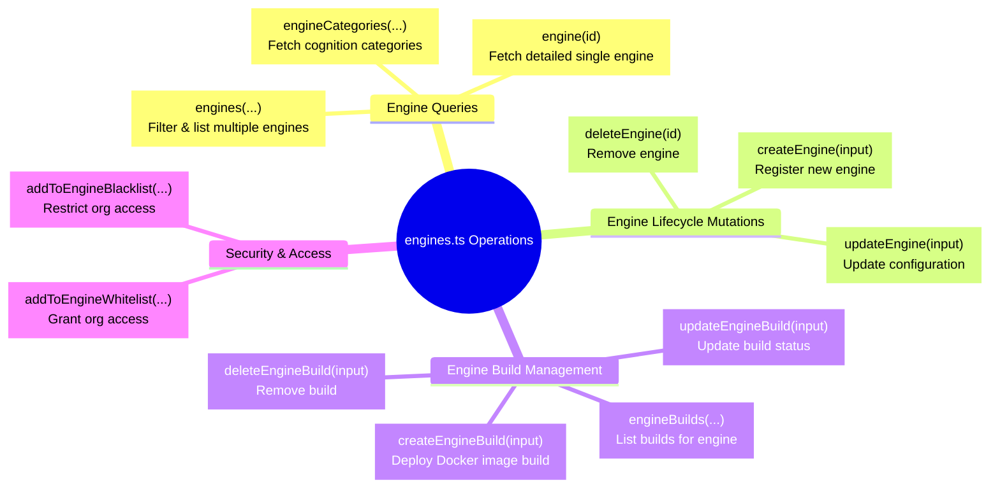
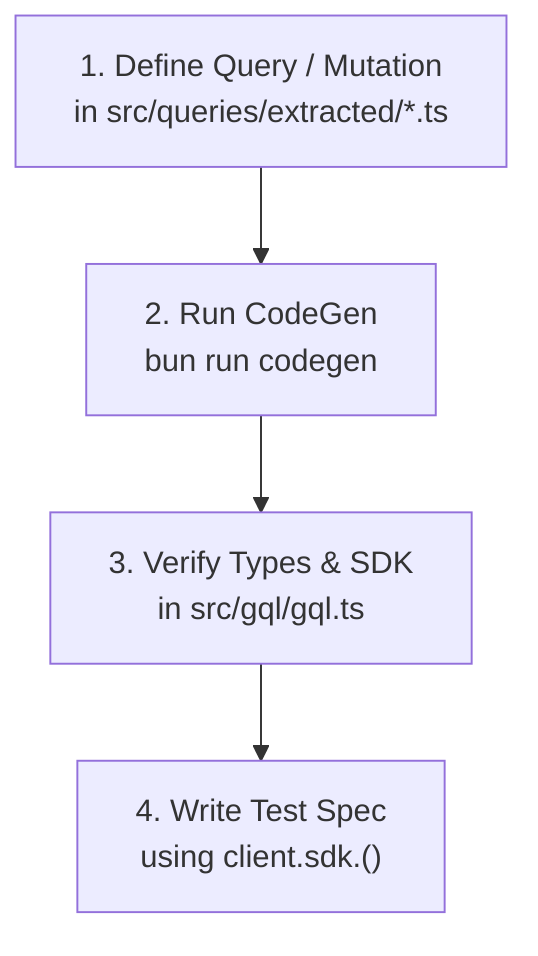

# GraphQL CodeGen Workflow & Architecture Guide

> **Audience**: Super Beginner QA Engineers & New Testers joining the Veritone GraphQL API testing team  
> **Target Tool**: GraphQL Code Generator (`@graphql-codegen/cli`)  
> **Module Path**: [`citest/tools/graphql-api`](file:///home/huycao/Repos/veritone-drug/core-graphql-server/citest/tools/graphql-api)  
> **Author**: Senior API QA / Automation Lead  

---

## Table of Contents
1. [Introduction for Super Beginners: Why do we need CodeGen?](#introduction-for-super-beginners-why-do-we-need-codegen)
2. [1. What is `codegen.ts`?](#1-what-is-codegents)
   - [1.1 Main Features](#11-main-features)
   - [1.2 How Does It Work? (The Step-by-Step Pipeline)](#12-how-does-it-work-the-step-by-step-pipeline)
   - [1.3 Line-by-Line Breakdown of `codegen.ts`](#13-line-by-line-breakdown-of-codegents)
   - [1.4 List of Related Components in the Project & Relationship Matrix](#14-list-of-related-components-in-the-project--relationship-matrix)
3. [2. Additional Deep-Dives](#2-additional-deep-dives)
   - [2.1 What is `gql.ts`?](#21-what-is-gqlts)
   - [2.2 What is `engines.ts`?](#22-what-is-enginests)
4. [3. End-to-End Hands-on Workflow (How to Add & Test a New Query)](#3-end-to-end-hands-on-workflow-how-to-add--test-a-new-query)
5. [4. Common Gotchas & Senior Tester Tips](#4-common-gotchas--senior-tester-tips)

---

## Introduction for Super Beginners: Why do we need CodeGen?

If you are new to API automation, writing GraphQL requests manually can feel like ordering food in a foreign language with no menu:

* ❌ **The Manual Way (Old & Painful)**:
  You write raw GraphQL strings by hand inside your test files:
  ```typescript
  // ⚠️ Prone to typos, zero auto-complete, no idea what fields exist!
  const res = await client.post('/graphql', {
    query: `query { engine(id: "123") { id namme status } }` // typo in 'namme'!
  });
  ```
  If you misspell a field (`namme` instead of `name`), your test fails only at runtime when running against the server. You waste hours debugging simple syntax errors.

* ✅ **The CodeGen Way (Modern & Type-Safe)**:
  **GraphQL Code Generator** (CodeGen) connects to the GraphQL Server, reads all available schemas, reads our query files, and automatically builds a ready-to-use **TypeScript SDK** with 100% type safety and IDE auto-complete:
  ```typescript
  // ✨ Autocomplete pops up, TypeScript checks arguments before running!
  const res = await client.sdk.engine({ id: "123" });
  console.log(res.data.engine?.name); 
  ```

---

## 1. What is `codegen.ts`?

[`codegen.ts`](file:///home/huycao/Repos/veritone-drug/core-graphql-server/citest/tools/graphql-api/codegen.ts) is the **master configuration file** for GraphQL Code Generator (`@graphql-codegen/cli`). It defines the rules, inputs, outputs, and plugins used to generate our test SDK and TypeScript types.



---

### 1.1 Main Features

1. **Automatic Schema Synchronization**:
   Pulls the live GraphQL schema and guarantees that our TypeScript test suite is always in sync with backend API changes.

2. **Automated SDK Generation (`getSdk`)**:
   Converts raw GraphQL query documents into typed TypeScript functions (e.g. `sdk.engines()`, `sdk.createEngine()`, `sdk.me()`).

3. **Compile-Time Safety & Instant IntelliSense**:
   Provides instant IDE auto-completion for query variables, input payloads, and response fields. Any invalid field or wrong parameter type is caught by the compiler before running the tests.

4. **Raw Response Preservation (`rawRequest: true`)**:
   Configured specifically for QA testing so that every SDK call returns full HTTP headers, status code, `data`, and `errors` array, enabling both positive (200 OK) and negative error-handling test assertions.

5. **Multi-Document Scanning**:
   Scans all modular query files across `src/queries/**/*.ts` (e.g., `engines.ts`, `folders.ts`, `auth.ts`, `tdo.ts`) and bundles them into a single centralized SDK.

---

### 1.2 How Does It Work? (The Step-by-Step Pipeline)

When you run `bun run codegen` (or `npm run codegen`), the following 5-phase pipeline executes:



1. **Phase 1: Schema Ingestion**: CodeGen makes an introspection query to `http://localhost:3000/graphql` to fetch all available types, fields, inputs, and mutations.
2. **Phase 2: Document Discovery**: CodeGen glob-matches `src/queries/**/*.ts` to extract every query and mutation defined using `gql` tags.
3. **Phase 3: Validation & Type Mapping**: CodeGen cross-checks the fields requested in our query files with the actual backend schema. If a query requests a non-existent field, CodeGen immediately reports an error.
4. **Phase 4: Plugin Execution**:
   - `typescript`: Generates foundational TypeScript types for all GraphQL scalars, enums, interfaces, and input objects.
   - `typescript-operations`: Generates specific variable and response types for each query (e.g., `EnginesQuery`, `CreateEngineMutationVariables`).
   - `typescript-graphql-request`: Generates SDK wrapper methods inside `getSdk(client)`.
5. **Phase 5: Output Emission**: Writes the consolidated `src/gql/gql.ts` file.

---

### 1.3 Line-by-Line Breakdown of `codegen.ts`

Here is the exact code in [`codegen.ts`](file:///home/huycao/Repos/veritone-drug/core-graphql-server/citest/tools/graphql-api/codegen.ts):

```typescript
import type { CodegenConfig } from '@graphql-codegen/cli';

const config: CodegenConfig = {
  overwrite: true,
  schema: "http://localhost:3000/graphql",
  documents: "src/queries/**/*.ts",
  generates: {
    "src/gql/gql.ts": {
      plugins: [
        "typescript",
        "typescript-operations",
        "typescript-graphql-request"
      ],
      config: {
        rawRequest: true
      }
    }
  }
};

export default config;
```

#### Detailed Explanation of Each Property:

| Property / Line | Value | Beginner Explanation |
| :--- | :--- | :--- |
| `overwrite: true` | `true` | Allows CodeGen to replace the existing `src/gql/gql.ts` on every run without asking for manual confirmation. |
| `schema` | `"http://localhost:3000/graphql"` | The location of the live GraphQL endpoint. CodeGen connects here to read the server's data dictionary (schema). |
| `documents` | `"src/queries/**/*.ts"` | A file search pattern (glob) telling CodeGen where we wrote our GraphQL queries and mutations (e.g. [`engines.ts`](file:///home/huycao/Repos/veritone-drug/core-graphql-server/citest/tools/graphql-api/src/queries/extracted/engines.ts), `folders.ts`). |
| `generates["src/gql/gql.ts"]` | Destination Path | The output file where all generated TypeScript code and SDK helper functions will be written. |
| `plugins` | `typescript` | Plugin #1: Generates base TypeScript types for every GraphQL type, enum, and scalar in the system. |
| `plugins` | `typescript-operations` | Plugin #2: Generates specific types for your exact queries and variables (e.g., `GetEngineQuery`, `CreateEngineInput`). |
| `plugins` | `typescript-graphql-request` | Plugin #3: Generates the `getSdk()` function that wraps `graphql-request` with strongly-typed methods. |
| `config.rawRequest` | `true` | **Crucial for QA!** By default, SDKs only return the `data` payload. `rawRequest: true` forces the SDK to return the complete response `{ data, errors, headers, status }` so testers can assert on error codes and response headers. |

---

### 1.4 List of Related Components in the Project & Relationship Matrix

To understand how the entire testing framework functions together, review this component relationship table:

| Component / File | Role in Project | Relationship & Interaction with Other Components |
| :--- | :--- | :--- |
| [`codegen.ts`](file:///home/huycao/Repos/veritone-drug/core-graphql-server/citest/tools/graphql-api/codegen.ts) | **CodeGen Blueprint** | Configures `@graphql-codegen/cli`. Reads queries from `src/queries/` and target schema, then outputs [`src/gql/gql.ts`](file:///home/huycao/Repos/veritone-drug/core-graphql-server/citest/tools/graphql-api/src/gql/gql.ts). |
| [`package.json`](file:///home/huycao/Repos/veritone-drug/core-graphql-server/citest/tools/graphql-api/package.json) | **Package & Script Registry** | Defines the `"codegen"` script (`graphql-codegen --config codegen.ts`) and manages dependencies (`graphql-request`, `@graphql-codegen/*`). |
| [`src/queries/extracted/`](file:///home/huycao/Repos/veritone-drug/core-graphql-server/citest/tools/graphql-api/src/queries/extracted) | **Query Definitions Library** | Contains domain-specific GraphQL queries and mutations (e.g., [`engines.ts`](file:///home/huycao/Repos/veritone-drug/core-graphql-server/citest/tools/graphql-api/src/queries/extracted/engines.ts), `folders.ts`, `users.ts`, `tdo.ts`). Fed into CodeGen. |
| [`src/gql/gql.ts`](file:///home/huycao/Repos/veritone-drug/core-graphql-server/citest/tools/graphql-api/src/gql/gql.ts) | **Generated SDK & Types** | Generated output containing all TypeScript interfaces, Enums, and the `getSdk` factory function. |
| [`src/graphqlUtil.ts`](file:///home/huycao/Repos/veritone-drug/core-graphql-server/citest/tools/graphql-api/src/graphqlUtil.ts) | **Client & Authentication Manager** | Initializes `GraphQLClient`, creates the SDK instance (`getSdk(client)`), manages auth tokens (Session Token, API Key), and handles file uploads. |
| [`src/testUtils.ts`](file:///home/huycao/Repos/veritone-drug/core-graphql-server/citest/tools/graphql-api/src/testUtils.ts) | **Test Helpers & Resource Builder** | Provides test lifecycle utilities (`createTestContext`, `TestResourceBuilder`) that use `client.sdk` to set up and tear down test data. |
| [`test/**/*.spec.ts`](file:///home/huycao/Repos/veritone-drug/core-graphql-server/citest/tools/graphql-api/test/folder/folders.spec.ts) | **Test Specifications (Specs)** | Actual test suites written by QA engineers. Calls `gqlClient.sdk.<operation>()` to execute test scenarios and assert responses. |

---

## 2. Additional Deep-Dives

### 2.1 What is `gql.ts`?

[`src/gql/gql.ts`](file:///home/huycao/Repos/veritone-drug/core-graphql-server/citest/tools/graphql-api/src/gql/gql.ts) is the **auto-generated central powerhouse** of our testing tool (over 41,000 lines of code).

> ⚠️ **Golden Rule for Testers**: **NEVER edit `src/gql/gql.ts` manually!**  
> Any manual edits will be overwritten the next time `bun run codegen` is executed. Always edit your queries in `src/queries/` and re-run codegen.

#### Key Sections Inside `gql.ts`:

1. **Scalar Mappings & Enums**:
   Defines all GraphQL scalars and enums as TypeScript types:
   ```typescript
   export enum EngineState {
     Active = 'active',
     Paused = 'paused',
     Disabled = 'disabled'
   }
   ```
2. **Input Object Types**:
   Defines the shape of input payloads for mutations:
   ```typescript
   export type CreateEngine = {
     name: Scalars['String']['input'];
     categoryId: Scalars['ID']['input'];
     deploymentModel?: InputMaybe<Scalars['String']['input']>;
     // ...
   };
   ```
3. **Document Strings**:
   Stores the raw query strings extracted from our query files:
   ```typescript
   export const EngineDocumentString = `query engine($id: ID!) { engine(id: $id) { ... } }`;
   ```
4. **The `getSdk` Factory Function**:
   Provides strongly-typed wrapper methods for every query/mutation:
   ```typescript
   export function getSdk(client: GraphQLClient, withWrapper: SdkFunctionWrapper = defaultWrapper) {
     return {
       engine(variables: EngineQueryVariables, requestHeaders?: GraphQLClientRequestHeaders) {
         return withWrapper((wrappedRequestHeaders) => 
           client.rawRequest<EngineQuery>(EngineDocumentString, variables, {...requestHeaders, ...wrappedRequestHeaders}),
           'engine', 'query', variables
         );
       },
       createEngine(variables: CreateEngineMutationVariables, requestHeaders?: GraphQLClientRequestHeaders) {
         // ...
       }
     };
   }
   ```

---

### 2.2 What is `engines.ts`?

[`src/queries/extracted/engines.ts`](file:///home/huycao/Repos/veritone-drug/core-graphql-server/citest/tools/graphql-api/src/queries/extracted/engines.ts) is the **query definition file for the AI Engine subsystem**.

In Veritone aiWARE, an **Engine** is an AI processing unit (such as a transcription engine, facial recognition engine, translation model, or object detection engine). `engines.ts` defines all the GraphQL queries and mutations required to test and manage AI engines.

#### Main Operations Defined in `engines.ts`:



#### Code Snippet Example from `engines.ts`:
```typescript
import { gql } from 'graphql-request';

export const GET_ENGINE = gql`
  query engine($id: ID!) {
    engine(id: $id) {
      id
      name
      createsTDO
      libraryRequired
      categoryId
      state
      deploymentModel
      category {
        id
        name
      }
    }
  }
`;
```

When CodeGen runs, it reads `GET_ENGINE` and automatically creates:
- The TypeScript variable interface: `EngineQueryVariables`
- The TypeScript return interface: `EngineQuery`
- The SDK function: `client.sdk.engine({ id: "..." })`

---

## 3. End-to-End Hands-on Workflow (How to Add & Test a New Query)

Follow this 4-step workflow whenever you need to test a new GraphQL query or mutation:



### Step 1: Write the Query in `src/queries/extracted/`
Open or create a file in [`src/queries/extracted/`](file:///home/huycao/Repos/veritone-drug/core-graphql-server/citest/tools/graphql-api/src/queries/extracted) (e.g., `engines.ts`) and export your query using `gql`:
```typescript
export const GET_ENGINE_SUMMARY = gql`
  query getEngineSummary($id: ID!) {
    engine(id: $id) {
      id
      name
      state
    }
  }
`;
```

### Step 2: Regenerate the SDK
Run the codegen command in your terminal:
```bash
bun run codegen
# or
npm run codegen
```

### Step 3: Check the Generated SDK
Open `src/gql/gql.ts` and verify that `getEngineSummary` now appears as a method on `getSdk`.

### Step 4: Write your Test in `test/**/*.spec.ts`
Use your new typed method inside your test suite:
```typescript
it('should fetch engine summary', async () => {
  const response = await gqlClient.sdk.getEngineSummary({ id: 'test-engine-123' });
  
  expect(response.status).toBe(200);
  expect(response.data?.engine?.name).toBeDefined();
});
```

---

## 4. Common Gotchas & Senior Tester Tips

1. ⚠️ **Schema Endpoint Availability**:
   `codegen.ts` expects the GraphQL server to be running at `http://localhost:3000/graphql`. Ensure your local core server is booted before running `bun run codegen`.
2. ⚠️ **Duplicate Definitions**:
   If the schema contains legacy duplicate types, `bun build` or TypeScript might warn about duplicate identifiers. Check `README.md` if any cleanup is needed.
3. 💡 **Negative Testing with `rawRequest`**:
   Because `rawRequest: true` is enabled in `codegen.ts`, SDK calls will **not throw** unhandled exceptions on GraphQL validation errors. Instead, inspect `response.errors` directly:
   ```typescript
   const res = await gqlClient.sdk.engine({ id: 'invalid-id' });
   expect(res.errors).toBeDefined();
   expect(res.errors?.[0].message).toContain('not found');
   ```
4. 💡 **IDE Auto-Complete**:
   Always use `gqlClient.sdk.` and press `Ctrl + Space` (or `Cmd + Space`) in VS Code to see all available queries and required arguments instantly!
