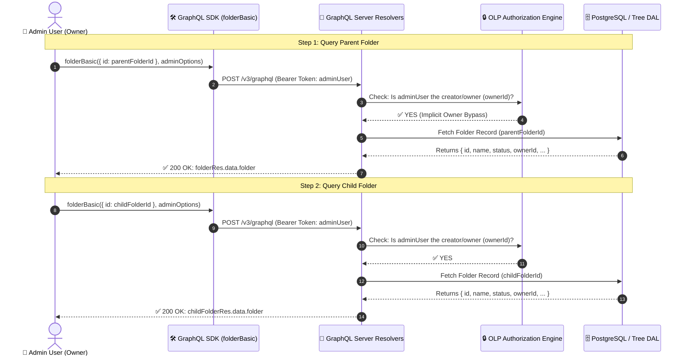
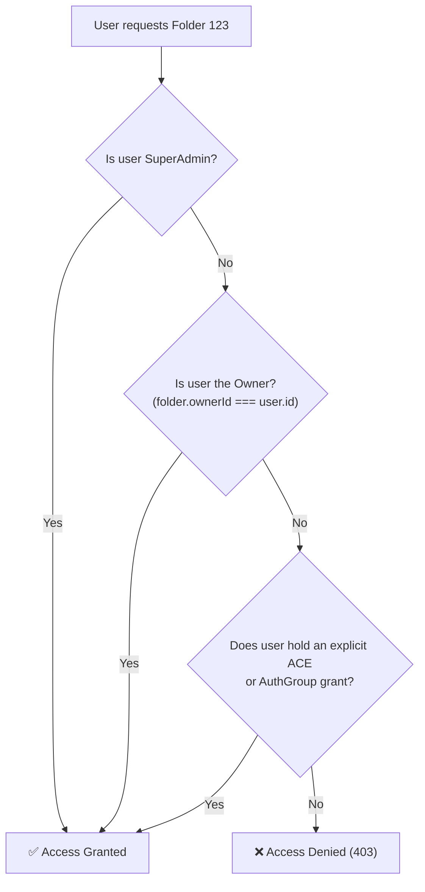

# Divide & Conquer Breakdown: Test Case `FO1` (`folderOlp.spec.ts:L501-L519`)

> **Target Code Block**: [`citest/tools/graphql-api/test/folder/RBAC/folderOlp.spec.ts:L501-L519`](file:///home/huycao/Repos/veritone-drug/core-graphql-server/citest/tools/graphql-api/test/folder/RBAC/folderOlp.spec.ts#L501-L519)  
> **Test Case ID**: `FO1 - owner can get folder and child folder`  
> **Topic**: Verifying Implicit Owner Authorization and Establishing the Positive Control Baseline in RBAC/OLP Testing  
> **Audience**: QA Engineers, Automation Developers, and Backend Engineers

---

## Table of Contents
1. [The Big Picture: What is FO1 and Why is it Test Case #1?](#1-the-big-picture-what-is-fo1-and-why-is-it-test-case-1)
2. [Visual Architecture: How FO1 Interacts with the System](#2-visual-architecture-how-fo1-interacts-with-the-system)
3. [Divide & Conquer: Line-by-Line Breakdown](#3-divide--conquer-line-by-line-breakdown)
   - [Part 1: Querying the Parent Folder (L502–L505)](#part-1-querying-the-parent-folder-l502l505)
   - [Part 2: Asserting Parent Folder Integrity (L506–L509)](#part-2-asserting-parent-folder-integrity-l506l509)
   - [Part 3: Querying the Child Folder (L511–L514)](#part-3-querying-the-child-folder-l511l514)
   - [Part 4: Asserting Child Folder Integrity (L515–L518)](#part-4-asserting-child-folder-integrity-l515l518)
4. [Core Security Concepts Behind FO1](#4-core-security-concepts-behind-fo1)
   - [Concept A: Implicit Owner Rights (No ACE Required)](#concept-a-implicit-owner-rights-no-ace-required)
   - [Concept B: The "Positive Control" Testing Rule](#concept-b-the-positive-control-testing-rule)
   - [Concept C: Sub-tree Hierarchy Access](#concept-c-sub-tree-hierarchy-access)
5. [How to Apply This Pattern in Your Own Project](#5-how-to-apply-this-pattern-in-your-own-project)
6. [Summary Quick-Reference Table](#6-summary-quick-reference-table)

---

# 1. The Big Picture: What is FO1 and Why is it Test Case #1?

In [`folderOlp.spec.ts`](file:///home/huycao/Repos/veritone-drug/core-graphql-server/citest/tools/graphql-api/test/folder/RBAC/folderOlp.spec.ts), **`FO1` is the first functional test case** of the entire test suite.

```typescript
it('FO1 - owner can get folder and child folder', async () => { ... })
```

### 🎯 The Mission of `FO1`:
1. **Verify Owner Privileges**: Confirms that the user who created the folder (`adminUser`, acting as the resource owner) has full read access to both the **parent folder** and its **child folder**.
2. **Establish the "Positive Control Baseline"**: In scientific experiments and QA automation, before you test that unauthorized users are blocked (e.g. `FO5: restricted user cannot get folder`), you must **first prove that the resource actually exists and is healthy for an authorized user**. If `FO1` fails, you know there is a fundamental bug in the folder service or database, not an authorization bug!

---

# 2. Visual Architecture: How FO1 Interacts with the System



---

# 3. Divide & Conquer: Line-by-Line Breakdown

Here is the exact source code of `FO1`:

```typescript
501: it('FO1 - owner can get folder and child folder', async () => {
502:   const folderRes = await gqlClient.sdk.folderBasic(
503:     { id: ctx.testFolderData.parentFolderId },
504:     ctx.adminOptions
505:   );
506:   expect(folderRes?.data?.folder).toBeDefined();
507:   expect(folderRes?.data?.folder?.id).toEqual(
508:     ctx.testFolderData.parentFolderId
509:   );
510: 
511:   const childFolderRes = await gqlClient.sdk.folderBasic(
512:     { id: ctx.testFolderData.childFolderId },
513:     ctx.adminOptions
514:   );
515:   expect(childFolderRes?.data?.folder).toBeDefined();
516:   expect(childFolderRes?.data?.folder?.id).toEqual(
517:     ctx.testFolderData.childFolderId
518:   );
519: });
```

Let's divide it into **4 logical steps**:

---

## Part 1: Querying the Parent Folder (L502–L505)

```typescript
const folderRes = await gqlClient.sdk.folderBasic(
  { id: ctx.testFolderData.parentFolderId },
  ctx.adminOptions
);
```

### What happens here:
1. **Target Resource**: `ctx.testFolderData.parentFolderId` was created in the setup phase (`beforeAll` line 120) by `adminUser`.
2. **Actor & Auth Header**: `ctx.adminOptions` supplies the HTTP headers containing `{ Authorization: 'Bearer <admin_jwt_token>' }`.
3. **The GraphQL Operation**: `gqlClient.sdk.folderBasic` sends this GraphQL query behind the scenes:
   ```graphql
   query folderBasic($id: ID!) {
     folder(id: $id) {
       id
       treeObjectId
       name
       description
       status
       ownerId
       createdDateTime
       modifiedDateTime
       orderIndex
     }
   }
   ```

---

## Part 2: Asserting Parent Folder Integrity (L506–L509)

```typescript
expect(folderRes?.data?.folder).toBeDefined();
expect(folderRes?.data?.folder?.id).toEqual(
  ctx.testFolderData.parentFolderId
);
```

### What is verified:
1. **`toBeDefined()`**: Ensures the GraphQL resolver resolved successfully and didn't return `null`, `undefined`, or throw an error.
2. **`toEqual(...)`**: Confirms that the backend returned the exact folder requested and that the database query mapped the ID correctly.

---

## Part 3: Querying the Child Folder (L511–L514)

```typescript
const childFolderRes = await gqlClient.sdk.folderBasic(
  { id: ctx.testFolderData.childFolderId },
  ctx.adminOptions
);
```

### What happens here:
1. **Target Resource**: `ctx.testFolderData.childFolderId` is a nested subfolder residing directly beneath `parentFolderId`.
2. **The Verification**: Checks whether owner rights automatically allow navigating deeper into the sub-tree hierarchy.

---

## Part 4: Asserting Child Folder Integrity (L515–L518)

```typescript
expect(childFolderRes?.data?.folder).toBeDefined();
expect(childFolderRes?.data?.folder?.id).toEqual(
  ctx.testFolderData.childFolderId
);
```

### What is verified:
1. Confirms the child folder exists, is reachable, and returns the expected ID matching `childFolderId`.
2. Proves that parent-child hierarchy linkages did not break the owner's access.

---

# 4. Core Security Concepts Behind FO1

---

### Concept A: Implicit Owner Rights (No ACE Required)

In Veritone's Object-Level Permission (OLP) model, permissions are evaluated through this hierarchy:



> [!NOTE]
> In `FO1`, the `adminUser` has **no explicit Access Control Entry (ACE)** attached to `parentFolderId`. Access is granted purely through **Owner Rights** (`ownerId === adminUser.userId`).

---

### Concept B: The "Positive Control" Testing Rule

In QA test design, **Negative Tests (Security Denials)** are only meaningful if the **Positive Baseline (Access Grant)** is proven to work.

```
Scenario: You run FO5 (Restricted User is Denied) and it passes (returns 403 / error).
Question: Did it pass because OLP blocked the user, or because the folder was never created in the DB?
Answer: FO1 proves the folder DOES exist and CAN be retrieved. Therefore, when FO5 gets blocked, we are 100% certain it was blocked by authorization rules!
```

---

### Concept C: Sub-tree Hierarchy Access

Folders exist in a hierarchy (`Root -> Parent -> Child -> Grandchild`).  
`FO1` tests both `parentFolderId` and `childFolderId` together in the same test block to ensure that creating nested children inherits the creator's ownership seamlessly down the branch.

---

# 5. How to Apply This Pattern in Your Own Project

Whenever you design an API security test suite for any protected resource (Documents, Dashboards, Projects, Folders, SDOs), always structure your first test case following this pattern:

```typescript
describe('Resource Security & OLP Suite', () => {
  // Step 1: Always write the Positive Owner Baseline Test FIRST
  it('SEC-01: Owner can read their created resource and nested items', async () => {
    // 1. Query as creator/owner
    const response = await apiClient.getResource(
      { id: testData.resourceId },
      ownerAuthHeaders
    );

    // 2. Assert positive availability
    expect(response.data).toBeDefined();
    expect(response.data.id).toEqual(testData.resourceId);
    expect(response.data.ownerId).toEqual(ownerUser.id);
  });

  // Step 2: Then proceed to Negative / Role / Restricted tests...
  it('SEC-02: Unprivileged user cannot read resource without ACE', async () => {
    const query = apiClient.getResource(
      { id: testData.resourceId },
      unprivilegedAuthHeaders
    );
    await expect(query).rejects.toThrow(/Unauthorized|Forbidden/);
  });
});
```

---

# 6. Summary Quick-Reference Table

| Element | Value in `FO1` | Purpose & Meaning |
| :--- | :--- | :--- |
| **Actor** | `adminUser` (`ctx.adminOptions`) | The user who created the folder (Resource Owner). |
| **Target 1** | `ctx.testFolderData.parentFolderId` | Top-level folder under CMS root. |
| **Target 2** | `ctx.testFolderData.childFolderId` | Nested child folder inside parent. |
| **SDK Method** | `gqlClient.sdk.folderBasic` | GraphQL query fetching basic folder metadata. |
| **Auth Mechanism** | **Implicit Owner Privilege** | Creator has full inherent access; no ACE needed. |
| **Assertion 1** | `expect(folder).toBeDefined()` | Proves the resource exists and resolved cleanly. |
| **Assertion 2** | `expect(folder.id).toEqual(expectedId)` | Proves correct record retrieval. |
| **Role in Test Suite** | **Positive Control Baseline** | Proves system health before testing negative restrictions (`FO5`). |
