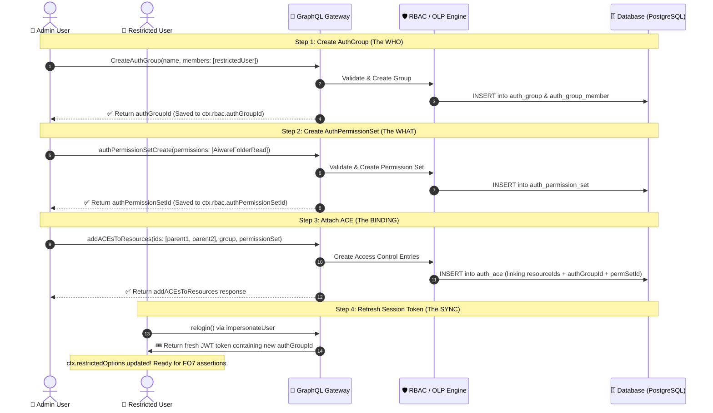

# Divide & Conquer Breakdown: Test Case `FO6` (`folderOlp.spec.ts:L589-L649`)

> **Target Code Block**: [`citest/tools/graphql-api/test/folder/RBAC/folderOlp.spec.ts:L589-L649`](file:///home/huycao/Repos/veritone-drug/core-graphql-server/citest/tools/graphql-api/test/folder/RBAC/folderOlp.spec.ts#L589-L649)  
> **Test Case ID**: `FO6 - Add folder read permission for restricted user`  
> **Topic**: The Canonical 4-Step OLP Access Grant Workflow (AuthGroup + PermissionSet + ACE + Token Refresh)  
> **Audience**: QA Engineers, Test Automation Developers, and Backend Engineers

---

## Table of Contents
1. [The Big Picture: What is FO6 and Why is it the Pivot Point of OLP?](#1-the-big-picture-what-is-fo6-and-why-is-it-the-pivot-point-of-olp)
2. [The 4-Step OLP Formula (Visual Model)](#2-the-4-step-olp-formula-visual-model)
3. [Visual Sequence Diagram: What Happens in the System](#3-visual-sequence-diagram-what-happens-in-the-system)
4. [Divide & Conquer: Line-by-Line Breakdown](#4-divide--conquer-line-by-line-breakdown)
   - [Step 1: Create the AuthGroup (The WHO - L590–L607)](#step-1-create-the-authgroup-the-who---l590l607)
   - [Step 2: Create the AuthPermissionSet (The WHAT - L608–L621)](#step-2-create-the-authpermissionset-the-what---l608l621)
   - [Step 3: Attach the ACE to Resources (The WHERE / Binding - L622–L642)](#step-3-attach-the-ace-to-resources-the-where--binding---l622l642)
   - [Step 4: Relogin & Sync User Session (The Token Refresh - L643–L648)](#step-4-relogin--sync-user-session-the-token-refresh---l643l648)
5. [Key Senior QA Insights & Design Decisions](#5-key-senior-qa-insights--design-decisions)
6. [Real-World Analogy: The Office RFID Badge](#6-real-world-analogy-the-office-rfid-badge)
7. [How to Apply This in Your Own Project (Reusable Helper)](#7-how-to-apply-this-in-your-own-project-reusable-helper)
8. [Summary Quick-Reference Table](#8-summary-quick-reference-table)

---

# 1. The Big Picture: What is FO6 and Why is it the Pivot Point of OLP?

In the test progression:
- **`FO5`** established the **"Default Deny"** baseline by proving that `restrictedUser` gets an error (`403 / No authorization access`) when trying to view `parentFolderId`.
- **`FO6`** is the **pivot point**: The administrator constructs and attaches a granular "key" (**Access Control Entry / ACE**) to grant `restrictedUser` read-only access to `parentFolderId` and `parentFolderId2`.
- **`FO7`** (the next test) will immediately follow up and prove that `restrictedUser` can now successfully read the parent folder!

```
[FO5: Default Deny] ───► [FO6: Admin Grants ACE] ───► [FO7: Verify Access Unlocked]
(Blocked with 403)        (WHO + WHAT + WHERE + Relogin)   (200 OK: Read Success)
```

---

# 2. The 4-Step OLP Formula (Visual Model)

In Veritone's Object-Level Permission (OLP) system, you **never grant raw permissions directly to a database row**. Instead, you follow a clean, auditable 4-step pipeline:

```
+-----------------------------------------------------------------------------------------------+
|                                    THE 4-STEP OLP FORMULA                                     |
|                                                                                               |
|   1. WHO                           2. WHAT                        3. WHERE (BINDING)          |
|   AuthGroup                        AuthPermissionSet              addACEsToResources          |
|   ┌─────────────────────────┐      ┌────────────────────────┐     ┌───────────────────────┐   |
|   │ Group: "Read Group"     │  +   │ Permissions:           │ ══► │ Target:               │   |
|   │ Member: restrictedUser  │      │ [AiwareFolderRead]     │     │ parentFolderId        │   |
|   └─────────────────────────┘      └────────────────────────┘     │ parentFolderId2       │   |
|                                                                   └───────────────────────┘   |
|                                                │                                              |
|                                                ▼                                              |
|                                    4. TOKEN SYNC: relogin()                                   |
|                                    (Mints fresh JWT session reflecting the new AuthGroup)     |
+-----------------------------------------------------------------------------------------------+
```

---

# 3. Visual Sequence Diagram: What Happens in the System



---

# 4. Divide & Conquer: Line-by-Line Breakdown

Here is the exact source code of `FO6`:

```typescript
589: it('FO6 - Add folder read permission for restricted user', async () => {
590:   // admin create new authGroup
591:   const authGroupRes = await gqlClient.sdk.CreateAuthGroup(
592:     {
593:       input: {
594:         name: `${citestMarker}-folder-read-group-${uuidv4()}`,
595:         description: 'citest folder read group',
596:         members: [
597:           {
598:             id: ctx.restrictedUser.userId,
599:             memberType: AuthGroupMemberType.User
600:           }
601:         ]
602:       }
603:     },
604:     ctx.adminOptions
605:   );
606:   expect(authGroupRes?.data?.authGroupCreate).toBeDefined();
607:   ctx.rbac.authGroupId = authGroupRes?.data?.authGroupCreate?.id;
608: 
609:   // admin creates permission set
610:   const permSetRes = await gqlClient.sdk.authPermissionSetCreate(
611:     {
612:       input: {
613:         name: `${citestMarker}-folder-read-permission-${uuidv4()}`,
614:         description: 'citest folder read permission',
615:         permissions: [AuthPermissionType.AiwareFolderRead]
616:       }
617:     },
618:     ctx.adminOptions
619:   );
620:   expect(permSetRes?.data?.authPermissionSetCreate).toBeDefined();
621:   ctx.rbac.authPermissionSetId =
622:     permSetRes?.data?.authPermissionSetCreate?.id;
623: 
624:   // add ACEs to target folders
625:   await gqlClient.sdk.addACEsToResources(
626:     {
627:       resourceType: AuthResourceType.Folder,
628:       ids: [
629:         ctx.testFolderData.parentFolderId,
630:         ctx.testFolderData.parentFolderId2
631:       ],
632:       entries: [
633:         {
634:           member: {
635:             id: ctx.rbac.authGroupId,
636:             memberType: AuthGroupMemberType.Group
637:           },
638:           permissionSetID: ctx.rbac.authPermissionSetId
639:         }
640:       ]
641:     },
642:     ctx.adminOptions
643:   );
644: 
645:   // relogin restricted user
646:   ctx.restrictedOptions = await ctx.relogin(
647:     ctx.restrictedUser.userId,
648:     ctx.testOrg.guid
649:   );
650: });
```

Let's divide it into its **4 distinct steps**:

---

## Step 1: Create the AuthGroup (The WHO - L590–L607)

```typescript
const authGroupRes = await gqlClient.sdk.CreateAuthGroup(
  {
    input: {
      name: `${citestMarker}-folder-read-group-${uuidv4()}`,
      description: 'citest folder read group',
      members: [
        {
          id: ctx.restrictedUser.userId,
          memberType: AuthGroupMemberType.User
        }
      ]
    }
  },
  ctx.adminOptions
);
expect(authGroupRes?.data?.authGroupCreate).toBeDefined();
ctx.rbac.authGroupId = authGroupRes?.data?.authGroupCreate?.id;
```

### What happens here:
1. **The Concept of `AuthGroup`**: An authorization group represents a collection of users (e.g. *"Legal Reviewers"*, *"Auditors"*).
2. **Actor**: Admin executes this mutation (`ctx.adminOptions`) because standard or restricted users are not authorized to create authorization groups.
3. **Members Payload**: Adds `ctx.restrictedUser.userId` as a member with type `AuthGroupMemberType.User`.
4. **State Persistence**: `ctx.rbac.authGroupId = ...` stores the newly generated group ID in the shared test context so subsequent test cases can reuse or modify it.

---

## Step 2: Create the AuthPermissionSet (The WHAT - L608–L621)

```typescript
const permSetRes = await gqlClient.sdk.authPermissionSetCreate(
  {
    input: {
      name: `${citestMarker}-folder-read-permission-${uuidv4()}`,
      description: 'citest folder read permission',
      permissions: [AuthPermissionType.AiwareFolderRead]
    }
  },
  ctx.adminOptions
);
expect(permSetRes?.data?.authPermissionSetCreate).toBeDefined();
ctx.rbac.authPermissionSetId =
  permSetRes?.data?.authPermissionSetCreate?.id;
```

### What happens here:
1. **The Concept of `AuthPermissionSet`**: A named, reusable bundle of granular capabilities.
2. **Granular Permissions**: We specifically pass `[AuthPermissionType.AiwareFolderRead]`.
   - It grants **Read-Only** access.
   - It deliberately does **not** grant `AiwareFolderUpdate`, `AiwareFolderDelete`, or `AiwareFolderCreate` (those are tested in later stages).
3. **State Persistence**: `ctx.rbac.authPermissionSetId = ...` stores the permission set ID in context.

---

## Step 3: Attach the ACE to Resources (The WHERE / Binding - L622–L642)

```typescript
await gqlClient.sdk.addACEsToResources(
  {
    resourceType: AuthResourceType.Folder,
    ids: [
      ctx.testFolderData.parentFolderId,
      ctx.testFolderData.parentFolderId2
    ],
    entries: [
      {
        member: {
          id: ctx.rbac.authGroupId,
          memberType: AuthGroupMemberType.Group
        },
        permissionSetID: ctx.rbac.authPermissionSetId
      }
    ]
  },
  ctx.adminOptions
);
```

### What happens here:
This is where the magic happens. `addACEsToResources` binds the **WHO** (`authGroupId`) to the **WHAT** (`authPermissionSetId`) on the **WHERE** (`parentFolderId` & `parentFolderId2`).

### 🔍 Key Parameters Explained:
* **`resourceType: AuthResourceType.Folder`**: Tells the backend security layer that the target IDs belong to the Folder subsystem.
* **`ids: [parentFolderId, parentFolderId2]`**: Demonstrates **batch granting**. A single mutation applies the ACE to multiple folder IDs at the same time.
* **`entries[0].member`**: Sets `id: authGroupId` with `memberType: AuthGroupMemberType.Group`. (Best practice: always bind ACEs to Groups rather than raw user IDs).
* **`entries[0].permissionSetID`**: Connects our `AiwareFolderRead` permission set.

---

## Step 4: Relogin & Sync User Session (The Token Refresh - L643–L648)

```typescript
ctx.restrictedOptions = await ctx.relogin(
  ctx.restrictedUser.userId,
  ctx.testOrg.guid
);
```

### 💡 Why is this Step Mandatory?
* When `restrictedUser` logged in earlier (in `beforeAll`), their JWT session token was minted with `authGroupIds: []`.
* Even though the Admin just added the user to `authGroupId` in the database, the **existing JWT session token still thinks the user has no groups**!
* Calling `ctx.relogin(...)` impersonates the user, generates a fresh JWT token whose context payload contains the new `authGroupId`, and updates `ctx.restrictedOptions`.
* Now, in `FO7`, when `restrictedUser` sends a folder request, the backend unpacks the JWT, finds `authGroupId`, checks the ACE on `parentFolderId`, and grants access!

---

# 5. Key Senior QA Insights & Design Decisions

### 1. Why create an `AuthGroup` instead of adding the ACE directly to the User ID?
While Veritone OLP allows adding ACEs directly to a `User` ID, enterprise production systems manage permissions via **Groups** (e.g. Active Directory / Okta groups). Testing the `Group` binding path validates both group membership resolution and ACE evaluation in one realistic integration flow.

### 2. Why attach the ACE to *both* `parentFolderId` and `parentFolderId2`?
In setup, the Admin created two sibling parent folders (`parentFolderId` and `parentFolderId2`). Attaching the ACE to both folders allows subsequent tests (like `FO7`) to verify that multi-resource grants work consistently across separate folder instances.

### 3. Why are unique names generated with `uuidv4()`?
Names like `${citestMarker}-folder-read-group-${uuidv4()}` ensure test runs never collide with each other in multi-threaded CI test pipelines or leave conflicting unique index keys in the database.

---

# 6. Real-World Analogy: The Office RFID Badge

```
+-----------------------------------------------------------------------------------------------+
|  OFFICE BUILDING ANALOGY                                                                      |
|                                                                                               |
|  1. The User: Bob (Restricted User)                                                          |
|                                                                                               |
|  2. Create Group (Step 1):                                                                   |
|     HR creates a department called "Legal Contractors" and assigns Bob to it.                 |
|                                                                                               |
|  3. Create Permission Set (Step 2):                                                          |
|     Building Security defines a badge policy called "Daytime Door Unlock Only".               |
|                                                                                               |
|  4. Add ACE (Step 3):                                                                        |
|     Security programs Room 101 and Room 102 doors:                                            |
|     "Anyone in 'Legal Contractors' with 'Daytime Door Unlock' can open these doors."          |
|                                                                                               |
|  5. Re-encode Keycard / Relogin (Step 4):                                                     |
|     Bob swipes his badge at the kiosk to download his new department credentials.             |
|     Now Bob can walk up to Room 101 and the door clicks open (FO7)!                          |
+-----------------------------------------------------------------------------------------------+
```

---

# 7. How to Apply This in Your Own Project (Reusable Helper)

You can encapsulate this entire 4-step workflow into a clean helper function for your test projects:

```typescript
import { v4 as uuidv4 } from 'uuid';
import { AuthGroupMemberType, AuthPermissionType, AuthResourceType } from '@api/src/gql';
import { GraphqlClient } from '@api/src/graphqlUtil';

export interface GrantResourceAccessInput {
  resourceType: AuthResourceType;
  resourceIds: string[];
  userId: string;
  permissions: AuthPermissionType[];
  adminHeaders: Record<string, string>;
  reloginFn: (userId: string) => Promise<Record<string, string>>;
}

/**
 * Reusable helper that creates a Group, creates a PermissionSet,
 * attaches the ACE to target resources, and refreshes the user's token.
 */
export async function grantResourceAccess(
  gqlClient: GraphqlClient,
  input: GrantResourceAccessInput
): Promise<{
  authGroupId: string;
  permissionSetId: string;
  userHeaders: Record<string, string>;
}> {
  const { resourceType, resourceIds, userId, permissions, adminHeaders, reloginFn } = input;

  // 1. Create AuthGroup
  const groupRes = await gqlClient.sdk.CreateAuthGroup(
    {
      input: {
        name: `test-group-${uuidv4()}`,
        members: [{ id: userId, memberType: AuthGroupMemberType.User }]
      }
    },
    adminHeaders
  );
  const authGroupId = groupRes.data.authGroupCreate.id;

  // 2. Create PermissionSet
  const permRes = await gqlClient.sdk.authPermissionSetCreate(
    {
      input: {
        name: `test-perm-${uuidv4()}`,
        permissions
      }
    },
    adminHeaders
  );
  const permissionSetId = permRes.data.authPermissionSetCreate.id;

  // 3. Attach ACE to Target Resources
  await gqlClient.sdk.addACEsToResources(
    {
      resourceType,
      ids: resourceIds,
      entries: [
        {
          member: { id: authGroupId, memberType: AuthGroupMemberType.Group },
          permissionSetID: permissionSetId
        }
      ]
    },
    adminHeaders
  );

  // 4. Refresh User Session Token
  const userHeaders = await reloginFn(userId);

  return { authGroupId, permissionSetId, userHeaders };
}
```

---

# 8. Summary Quick-Reference Table

| Step | Operation | Mutation Name | Key Input | Actor | Output Stored In |
| :--- | :--- | :--- | :--- | :--- | :--- |
| **1. WHO** | Create Authorization Group | `CreateAuthGroup` | `members: [{ id: userId }]` | Admin | `ctx.rbac.authGroupId` |
| **2. WHAT** | Create Permission Set | `authPermissionSetCreate` | `permissions: [AiwareFolderRead]` | Admin | `ctx.rbac.authPermissionSetId` |
| **3. WHERE** | Attach ACE to Folders | `addACEsToResources` | `ids: [parentFolder1, parentFolder2]` | Admin | Applied to Resources |
| **4. SYNC** | Refresh User Session | `ctx.relogin()` | `userId`, `organizationGuid` | SuperAdmin (Impersonate) | `ctx.restrictedOptions` |
| **Next Step** | **Verify Access (FO7)** | `folderBasic` | `id: parentFolderId` | Restricted User | ✅ Expected: 200 OK |
