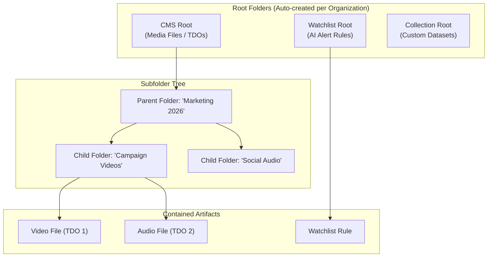
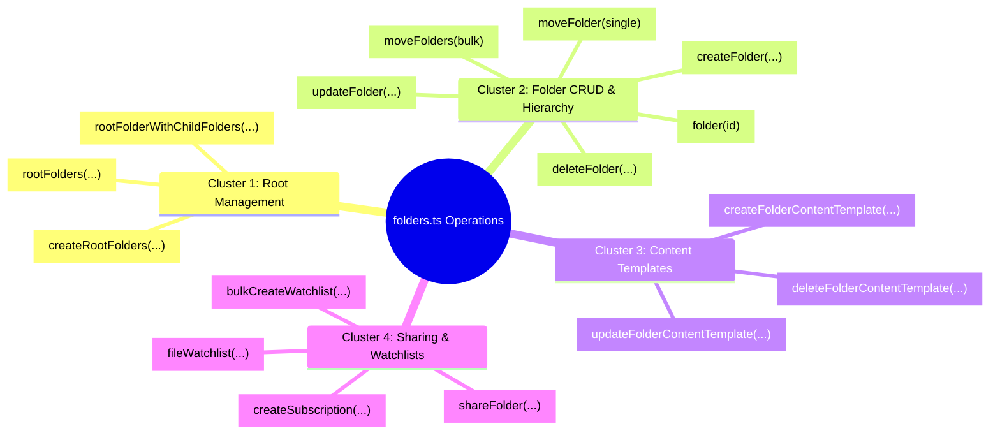

# Deep-Dive: `src/queries/extracted/folders.ts`

> **Audience**: Super Beginner QA Engineers & New Testers joining the Veritone GraphQL API testing team  
> **Target File**: [`citest/tools/graphql-api/src/queries/extracted/folders.ts`](file:///home/huycao/Repos/veritone-drug/core-graphql-server/citest/tools/graphql-api/src/queries/extracted/folders.ts)  
> **Related Test Suites**: [`test/folder/folders.spec.ts`](file:///home/huycao/Repos/veritone-drug/core-graphql-server/citest/tools/graphql-api/test/folder/folders.spec.ts), [`foldersV2.spec.ts`](file:///home/huycao/Repos/veritone-drug/core-graphql-server/citest/tools/graphql-api/test/folder/foldersV2.spec.ts)  
> **Author**: Senior API QA / Automation Lead  

---

## Table of Contents
1. [Introduction for Super Beginners: What is `folders.ts`?](#introduction-for-super-beginners-what-is-foldersts)
2. [1. The 4 Functional Clusters of Operations](#1-the-4-functional-clusters-of-operations)
   - [Cluster 1: Root Folder Management](#cluster-1-root-folder-management)
   - [Cluster 2: Folder CRUD & Hierarchy Reparenting](#cluster-2-folder-crud--hierarchy-reparenting)
   - [Cluster 3: Content Templates & Structured Data (SDO)](#cluster-3-content-templates--structured-data-sdo)
   - [Cluster 4: Multi-Tenant Sharing & Watchlist Filing](#cluster-4-multi-tenant-sharing--watchlist-filing)
3. [2. Detailed Operation Anatomy & Code Breakdown](#2-detailed-operation-anatomy--code-breakdown)
   - [2.1 Initializing Roots: `CREATE_ROOT_FOLDERS`](#21-initializing-roots-create_root_folders)
   - [2.2 Creating Subfolders: `CREATE_FOLDER`](#22-creating-subfolders-create_folder)
   - [2.3 Deep Querying: `GET_FOLDER`](#23-deep-querying-get_folder)
   - [2.4 Reparenting: `MOVE_FOLDER` vs `MOVE_FOLDERS`](#24-reparenting-move_folder-vs-move_folders)
4. [3. Senior QA Knowledge & Essential Project Facts](#3-senior-qa-knowledge--essential-project-facts)
   - [Fact 1: The Dual-ID Concept (`id` vs `treeObjectId`)](#fact-1-the-dual-id-concept-id-vs-treeobjectid)
   - [Fact 2: Multi-Tenant Organization Isolation](#fact-2-multi-tenant-organization-isolation)
   - [Fact 3: Root Types (`cms`, `watchlist`, `collection`)](#fact-3-root-types-cms-watchlist-collection)
   - [Fact 4: Soft Deletion (`status: Deleted`)](#fact-4-soft-deletion-status-deleted)
5. [4. Complete End-to-End Test Walkthrough](#4-complete-end-to-end-test-walkthrough)

---

## Introduction for Super Beginners: What is `folders.ts`?

In Veritone aiWARE, **Folders** are the organizational backbone of the platform. Think of them like Google Drive or Windows Folders, but designed for enterprise AI workflows:
* They hold **media files** (videos, audio recordings, documents called **TDOs**).
* They hold **AI alert rules** (called **Watchlists**).
* They hold **AI applications** and custom metadata templates.

[`src/queries/extracted/folders.ts`](file:///home/huycao/Repos/veritone-drug/core-graphql-server/citest/tools/graphql-api/src/queries/extracted/folders.ts) is the master library containing all **23 GraphQL queries and mutations** used to test every folder feature across the platform.



---

## 1. The 4 Functional Clusters of Operations

The 23 operations in `folders.ts` are logically divided into 4 clusters:



---

## 2. Detailed Operation Anatomy & Code Breakdown

### 2.1 Initializing Roots: `CREATE_ROOT_FOLDERS`

Before an organization can store subfolders, its top-level root folders must exist:

```typescript
export const CREATE_ROOT_FOLDERS = gql`
  mutation createRootFolders($rootFolderType: RootFolderType!) {
    createRootFolders(rootFolderType: $rootFolderType) {
      id
      description
      treeObjectId
      rootFolderTypeId
      organizationId
      name
    }
  }
`;
```

* **Inputs**: `$rootFolderType` can be `RootFolderType.Cms`, `RootFolderType.Watchlist`, or `RootFolderType.Collection`.
* **Output in CodeGen**: `client.sdk.createRootFolders({ rootFolderType: RootFolderType.Cms })`.

---

### 2.2 Creating Subfolders: `CREATE_FOLDER`

Used to create user-defined folders under a parent folder or root folder:

```typescript
export const CREATE_FOLDER = gql`
  mutation createFolder($input: CreateFolder!) {
    createFolder(input: $input) {
      id
      treeObjectId
      name
      description
      status
      parent {
        id
      }
      entityTags {
        tagKey
        tagValue
      }
      rootFolderTypeId
    }
  }
`;
```

* **`parentId`**: The GUID of the parent folder. If creating directly under root, this is the root folder's ID.
* **`entityTags`**: Key-value pairs attached to the folder for categorization (e.g. `{ tagKey: "department", tagValue: "finance" }`).

---

### 2.3 Deep Querying: `GET_FOLDER`

Fetches complete folder metadata including its child subfolders and contained media files (TDOs):

```typescript
export const GET_FOLDER = gql`
  query folder($id: ID!) {
    folder(id: $id) {
      id
      treeObjectId
      name
      description
      status
      parent {
        id
      }
      subfolders {
        id
        treeObjectId
        name
      }
      childTDOs {
        count
        records {
          id
          name
        }
      }
      contentTemplates {
        id
        sdoId
        schemaId
      }
    }
  }
`;
```

---

### 2.4 Reparenting: `MOVE_FOLDER` vs `MOVE_FOLDERS`

Moving folders from one parent to another (e.g. dragging a folder into a new directory):

* **Single Move (`MOVE_FOLDER`)**:
  ```typescript
  export const MOVE_FOLDER = gql`
    mutation moveFolder($input: MoveFolder) {
      moveFolder(input: $input) {
        id
        treeObjectId
        name
        parent {
          id
          treeObjectId
        }
      }
    }
  `;
  ```
* **Bulk Move (`MOVE_FOLDERS`)**:
  Moves multiple folders simultaneously to a new target parent and returns `validFolderIds` vs `invalidFolderIds` for error reporting.

---

## 3. Senior QA Knowledge & Essential Project Facts

### Fact 1: The Dual-ID Concept (`id` vs `treeObjectId`)
In the Veritone Folder database architecture:
* **`id` (Folder ID)**: The primary database UUID for the folder record.
* **`treeObjectId` (Tree Object ID)**: The hierarchical node pointer used by the closure table / tree index to navigate parent-child relationships efficiently.
* 💡 **QA Rule**: In tests, when checking if a child belongs to a parent, compare `folder.parent.id` or `folder.parent.treeObjectId`.

### Fact 2: Multi-Tenant Organization Isolation
Never run folder tests in a shared default organization without isolation. Each test spec uses [`createIsolatedSuperadmin(gqlClient)`](file:///home/huycao/Repos/veritone-drug/core-graphql-server/citest/tools/graphql-api/test/helpers/superadminSession.ts) to generate a temporary, private organization so tests do not collide or see each other's folders.

### Fact 3: Root Types (`cms`, `watchlist`, `collection`)
* `cms`: Contains digital media files (videos, audios, transcripts).
* `watchlist`: Contains AI engine alert configurations (e.g. face recognition watchlists).
* `collection`: Contains grouped entity datasets.

### Fact 4: Soft Deletion (`status: Deleted`)
When you call `deleteFolder`, the database does not erase the row immediately. Instead, it marks `status: 'Deleted'`. Testers should verify both that `deleteFolder` succeeds and that querying `folder(id)` either returns null or reflects the deleted status.

---

## 4. Complete End-to-End Test Walkthrough

Here is how a senior QA engineer writes a complete test using the operations from `folders.ts`:

```typescript
import { createGraphqlClient, AuthType } from '../../src/graphqlUtil';
import { RootFolderType } from '../../src/gql';

describe('Folder Management Automation Spec', () => {
  let client: any;
  let rootFolderId: string;
  let createdFolderId: string;

  beforeAll(async () => {
    // 1. Initialize client
    client = await createGraphqlClient(AuthType.SESSION_TOKEN);

    // 2. Fetch or create CMS Root Folder
    const rootRes = await client.sdk.rootFolders({ type: RootFolderType.Cms });
    rootFolderId = rootRes.data.rootFolders?.[0]?.id;
  });

  afterAll(async () => {
    // Teardown: Clean up created folder
    if (createdFolderId) {
      await client.sdk.deleteFolder({ input: { id: createdFolderId } });
    }
  });

  it('should create a child folder under CMS root and query it back', async () => {
    // 1. Create subfolder
    const createRes = await client.sdk.createFolder({
      input: {
        name: `Automated-QA-Folder-${Date.now()}`,
        description: 'Created by automated integration test',
        parentId: rootFolderId,
        rootFolderTypeId: RootFolderType.Cms
      }
    });

    expect(createRes.status).toBe(200);
    expect(createRes.errors).toBeUndefined();
    createdFolderId = createRes.data.createFolder?.id!;
    expect(createdFolderId).toBeDefined();

    // 2. Query the folder details
    const getRes = await client.sdk.folder({ id: createdFolderId });
    expect(getRes.status).toBe(200);
    expect(getRes.data.folder?.name).toBe(createRes.data.createFolder?.name);
    expect(getRes.data.folder?.parent?.id).toBe(rootFolderId);
  });
});
```
