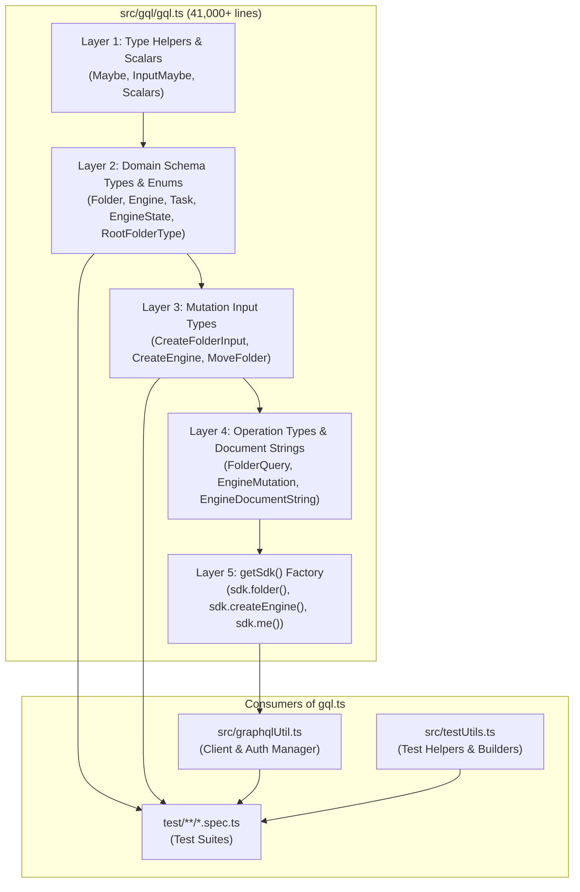

# Deep-Dive: `src/gql/gql.ts` (Generated Types & SDK Engine)

> **Audience**: Super Beginner QA Engineers & New Testers joining the Veritone GraphQL API testing team  
> **Target File**: [`citest/tools/graphql-api/src/gql/gql.ts`](file:///home/huycao/Repos/veritone-drug/core-graphql-server/citest/tools/graphql-api/src/gql/gql.ts)  
> **Module Path**: [`citest/tools/graphql-api`](file:///home/huycao/Repos/veritone-drug/core-graphql-server/citest/tools/graphql-api)  
> **Author**: Senior API QA / Automation Lead  

---

## Table of Contents
1. [Introduction for Super Beginners: What is `gql.ts`?](#introduction-for-super-beginners-what-is-gqlts)
2. [1. Architectural Anatomy of `gql.ts` (The 5 Layers)](#1-architectural-anatomy-of-gqlts-the-5-layers)
   - [Layer 1: TypeScript Helpers & Scalars](#layer-1-typescript-helpers--scalars)
   - [Layer 2: Domain Types & Enums](#layer-2-domain-types--enums)
   - [Layer 3: Mutation Input Object Types](#layer-3-mutation-input-object-types)
   - [Layer 4: Operation Types & GraphQL Document Strings](#layer-4-operation-types--graphql-document-strings)
   - [Layer 5: The `getSdk` Factory & `rawRequest` Engine](#layer-5-the-getsdk-factory--rawrequest-engine)
3. [2. Deep-Dive into Key Components](#2-deep-dive-into-key-components)
   - [2.1 Custom Scalars & Type Safety](#21-custom-scalars--type-safety)
   - [2.2 Enums: Eliminating Magic Strings](#22-enums-eliminating-magic-strings)
   - [2.3 The `getSdk` Method & `rawRequest` Structure](#23-the-getsdk-method--rawrequest-structure)
4. [3. Component Relationship & Usage Matrix](#3-component-relationship--usage-matrix)
5. [4. Practical Code Walkthroughs for QA Testers](#4-practical-code-walkthroughs-for-qa-testers)
   - [Example 1: Executing a Query with Auto-Complete](#example-1-executing-a-query-with-auto-complete)
   - [Example 2: Executing a Mutation with Input Validation](#example-2-executing-a-mutation-with-input-validation)
   - [Example 3: Asserting Negative Errors with `rawRequest: true`](#example-3-asserting-negative-errors-with-rawrequest-true)
6. [5. Senior Tester Golden Rules & Troubleshooting](#5-senior-tester-golden-rules--troubleshooting)

---

## Introduction for Super Beginners: What is `gql.ts`?

If [`codegen.ts`](file:///home/huycao/Repos/veritone-drug/core-graphql-server/citest/tools/graphql-api/codegen.ts) is the **factory blueprint**, then [`src/gql/gql.ts`](file:///home/huycao/Repos/veritone-drug/core-graphql-server/citest/tools/graphql-api/src/gql/gql.ts) is the **master product** generated by the factory.

At over **41,000 lines of code**, `gql.ts` contains the entire universe of our GraphQL API translated into TypeScript:
* Every database entity (Folders, Engines, Jobs, Tasks, Users, Organizations, TDOs).
* Every enum and constant (Statuses, Types, Roles, Permissions).
* Every query and mutation input payload.
* A complete, strongly-typed **Software Development Kit (SDK)** callable directly in test files.



---

## 1. Architectural Anatomy of `gql.ts` (The 5 Layers)

`gql.ts` is organized sequentially from bottom-level primitive types up to high-level SDK functions.

### Layer 1: TypeScript Helpers & Scalars (Lines 1–25)

These utility types handle nullable fields, optional arguments, and map GraphQL scalar types to TypeScript types:

```typescript
export type Maybe<T> = T | null;
export type InputMaybe<T> = Maybe<T>;
export type Exact<T extends { [key: string]: unknown }> = { [K in keyof T]: T[K] };

/** All built-in and custom scalars, mapped to their actual values */
export type Scalars = {
  ID: { input: string; output: string; }
  String: { input: string; output: string; }
  Boolean: { input: boolean; output: boolean; }
  Int: { input: number; output: number; }
  Float: { input: number; output: number; }
  BigInt: { input: any; output: any; }
  DateTime: { input: any; output: any; }
  JSONData: { input: any; output: any; }
  Time: { input: any; output: any; }
  UploadedFile: { input: any; output: any; }
};
```

* **Beginner Tip**: In GraphQL, any field without an exclamation mark (`!`) can return `null`. The `Maybe<T>` utility ensures TypeScript forces you to check if a field exists before accessing nested properties (preventing `"Cannot read properties of null"` runtime crashes).

---

### Layer 2: Domain Types & Enums (Lines 26 – ~35,000)

This is the largest section of the file. It contains exact TypeScript interfaces for every type and enum defined on the GraphQL server.

#### 1. Enums (Fixed choice lists):
```typescript
export enum RootFolderType {
  Cms = 'cms',
  Collection = 'collection',
  Watchlist = 'watchlist'
}

export enum EngineState {
  Active = 'active',
  Disabled = 'disabled',
  Paused = 'paused'
}
```

#### 2. Object Types (Entities):
```typescript
export type Folder = {
  __typename?: 'Folder';
  id: Scalars['ID']['output'];
  name: Scalars['String']['output'];
  description?: Maybe<Scalars['String']['output']>;
  parent?: Maybe<Folder>;
  parentId?: Maybe<Scalars['ID']['output']>;
  treeObjectId?: Maybe<Scalars['ID']['output']>;
  rootFolderTypeId?: Maybe<RootFolderType>;
  status?: Maybe<FolderStatus>;
  childFolders?: Maybe<FolderConnection>;
};
```

---

### Layer 3: Mutation Input Object Types (Lines ~25,000 – ~38,000)

When sending data to the server to create or update entities, GraphQL requires specific input objects. `gql.ts` provides strict types for all mutation inputs:

```typescript
export type CreateFolderInput = {
  name: Scalars['String']['input'];
  description?: InputMaybe<Scalars['String']['input']>;
  parentId?: InputMaybe<Scalars['ID']['input']>;
  rootFolderTypeId?: InputMaybe<RootFolderType>;
};

export type MoveFolder = {
  folderId: Scalars['ID']['input'];
  targetParentId: Scalars['ID']['input'];
};
```

* **Why this matters for QA**: If you miss a required input field (like `name` in `CreateFolderInput`), TypeScript will highlight your code in red before you even run the test!

---

### Layer 4: Operation Types & GraphQL Document Strings (Lines ~38,000 – ~41,000)

For every query and mutation defined in `src/queries/extracted/*.ts`, CodeGen creates:
1. **Variable Type**: The parameters needed to execute the query.
2. **Response Type**: The exact shape of data returned by the query.
3. **Document String**: The GraphQL query string sent over HTTP.

```typescript
// 1. Variable interface
export type FolderQueryVariables = Exact<{
  id: Scalars['ID']['input'];
}>;

// 2. Response interface
export type FolderQuery = {
  __typename?: 'Query';
  folder?: {
    __typename?: 'Folder';
    id: string;
    name: string;
    description?: string | null;
    treeObjectId?: string | null;
    parent?: { __typename?: 'Folder'; id: string; name: string } | null;
  } | null;
};

// 3. Document string
export const FolderDocumentString = `
  query folder($id: ID!) {
    folder(id: $id) {
      id
      name
      description
      treeObjectId
      parent {
        id
        name
      }
    }
  }
`;
```

---

### Layer 5: The `getSdk` Factory & `rawRequest` Engine (Lines ~41,000 – 41,919)

At the very bottom of `gql.ts` sits the `getSdk` function. It takes a `GraphQLClient` instance and wraps every operation into a callable TypeScript method.

```typescript
export type SdkFunctionWrapper = <T>(
  action: (requestHeaders?: GraphQLClientRequestHeaders) => Promise<T>,
  operationName: string,
  operationType?: string,
  variables?: any
) => Promise<T>;

const defaultWrapper: SdkFunctionWrapper = (action) => action();

export function getSdk(client: GraphQLClient, withWrapper: SdkFunctionWrapper = defaultWrapper) {
  return {
    folder(variables: FolderQueryVariables, requestHeaders?: GraphQLClientRequestHeaders): Promise<{
      data: FolderQuery;
      errors?: GraphQLError[];
      extensions?: any;
      headers: Headers;
      status: number;
    }> {
      return withWrapper(
        (wrappedRequestHeaders) =>
          client.rawRequest<FolderQuery>(
            FolderDocumentString,
            variables,
            { ...requestHeaders, ...wrappedRequestHeaders }
          ),
        'folder',
        'query',
        variables
      );
    },
    // ... hundreds of other operations (createFolder, engines, jobs, etc.)
  };
}

export type Sdk = ReturnType<typeof getSdk>;
```

---

## 2. Deep-Dive into Key Components

### 2.1 Custom Scalars & Type Safety

GraphQL supports default scalars (`String`, `Int`, `Float`, `Boolean`, `ID`) and custom server scalars (`DateTime`, `JSONData`, `UploadedFile`).

In `gql.ts`, scalars are separated into `input` (what you send) and `output` (what the server returns):
* `Scalars['ID']['input']` $\rightarrow$ string
* `Scalars['DateTime']['output']` $\rightarrow$ ISO timestamp or number
* `Scalars['JSONData']['input']` $\rightarrow$ structured JSON object / dictionary

---

### 2.2 Enums: Eliminating Magic Strings

Without `gql.ts`, testers often write string literals that are easy to misspell:
```typescript
// ❌ Dangerous (typo causes silent failure or 400 error):
await client.query(`...`, { type: 'watclist' }); 

// ✅ Safe & Refactor-Proof:
import { RootFolderType } from '../../src/gql';
await client.sdk.createFolder({
  input: {
    name: 'My Watchlist Folder',
    rootFolderTypeId: RootFolderType.Watchlist // IDE autocomplete prevents typos!
  }
});
```

---

### 2.3 The `getSdk` Method & `rawRequest` Structure

Because `codegen.ts` has `rawRequest: true` enabled, every SDK method returns an envelope with 5 distinct properties:

```typescript
const response = await gqlClient.sdk.folder({ id: '123' });
```

| Property | Type | Description | QA Assertion Use Case |
| :--- | :--- | :--- | :--- |
| `response.status` | `number` | HTTP Status code (e.g. `200`, `401`, `500`) | Verify HTTP protocol success: `expect(response.status).toBe(200);` |
| `response.data` | `FolderQuery` | The returned GraphQL payload | Verify business data: `expect(response.data.folder?.name).toBe('Finance');` |
| `response.errors` | `GraphQLError[] \| undefined` | Array of GraphQL validation/permission errors | Verify negative test cases: `expect(response.errors?.[0].message).toContain('Unauthorized');` |
| `response.headers` | `Headers` | HTTP response headers | Inspect tracing IDs or rate-limiting headers. |
| `response.extensions` | `any` | Execution metrics / tracing info | Performance tracking & server metadata. |

---

## 3. Component Relationship & Usage Matrix

How `gql.ts` interacts across the entire test repository:

| File / Component | How it uses `gql.ts` | Example Code |
| :--- | :--- | :--- |
| [`src/graphqlUtil.ts`](file:///home/huycao/Repos/veritone-drug/core-graphql-server/citest/tools/graphql-api/src/graphqlUtil.ts) | Imports `getSdk` and attaches it to `GraphqlClient` instances. | `const sdk = getSdk(client);`<br/>`gqlClient.sdk = sdk;` |
| [`src/testUtils.ts`](file:///home/huycao/Repos/veritone-drug/core-graphql-server/citest/tools/graphql-api/src/testUtils.ts) | Uses `client.sdk` and Enums (`EngineState`, `TaskStatus`) to build test fixtures. | `await this.context.gqlClient.sdk.engines({ state: EngineState.Active });` |
| [`test/folder/folders.spec.ts`](file:///home/huycao/Repos/veritone-drug/core-graphql-server/citest/tools/graphql-api/test/folder/folders.spec.ts) | Imports domain Enums & uses `isolatedSuperadmin.client.sdk` to run test assertions. | `import { RootFolderType } from '../../src/gql';`<br/>`const res = await client.sdk.folder({ id });` |
| [`codegen.ts`](file:///home/huycao/Repos/veritone-drug/core-graphql-server/citest/tools/graphql-api/codegen.ts) | Destination target for compilation. | `"src/gql/gql.ts": { plugins: [...] }` |

---

## 4. Practical Code Walkthroughs for QA Testers

### Example 1: Executing a Query with Auto-Complete

```typescript
import { createGraphqlClient, AuthType } from '../../src/graphqlUtil';

describe('Folder Query Testing', () => {
  it('should fetch folder details by ID', async () => {
    // 1. Create authenticated client
    const client = await createGraphqlClient(AuthType.SESSION_TOKEN);

    // 2. Call the strongly-typed query
    const res = await client.sdk.folder({ id: 'f1a2b3c4-5678-90ab-cdef-1234567890ab' });

    // 3. Assert on response
    expect(res.status).toBe(200);
    expect(res.data.folder).toBeDefined();
    expect(res.data.folder?.name).toBe('Marketing Videos');
    expect(res.errors).toBeUndefined();
  });
});
```

---

### Example 2: Executing a Mutation with Input Validation

```typescript
import { RootFolderType } from '../../src/gql';

it('should create a new child folder', async () => {
  const createRes = await client.sdk.createFolder({
    input: {
      name: 'Q3 Product Launches',
      description: 'Contains high-priority campaign assets',
      parentId: parentFolderId,
      rootFolderTypeId: RootFolderType.Cms
    }
  });

  expect(createRes.status).toBe(200);
  expect(createRes.data.createFolder?.id).toBeDefined();
  expect(createRes.data.createFolder?.name).toBe('Q3 Product Launches');
});
```

---

### Example 3: Asserting Negative Errors with `rawRequest: true`

Because `rawRequest: true` prevents GraphQL errors from throwing unhandled exceptions, you can easily test negative scenarios and permission restrictions:

```typescript
it('should return permission error when deleting root folder without superadmin rights', async () => {
  // Execute mutation with standard user token
  const deleteRes = await standardUserClient.sdk.deleteFolder({
    id: rootFolderId
  });

  // Verify HTTP status is 200 (GraphQL standard) but errors array contains the rejection
  expect(deleteRes.status).toBe(200);
  expect(deleteRes.data?.deleteFolder).toBeNull();
  expect(deleteRes.errors).toBeDefined();
  expect(deleteRes.errors?.[0].message).toContain('Access denied');
});
```

---

## 5. Senior Tester Golden Rules & Troubleshooting

### Rule 1: Never Edit `gql.ts` Directly
If you need a new query or an extra field on an existing query:
1. Open the relevant file in [`src/queries/extracted/`](file:///home/huycao/Repos/veritone-drug/core-graphql-server/citest/tools/graphql-api/src/queries/extracted) (e.g., `folders.ts`, `engines.ts`).
2. Add the field to the `gql` template tag.
3. Run `bun run codegen`.
4. `gql.ts` will regenerate automatically with your new fields!

### Rule 2: Safe Optional Chaining (`?.`)
In GraphQL, fields can be `null` if the user lacks read permissions or if the record does not exist. Always use optional chaining when traversing data:
```typescript
// ✅ Good:
const parentName = res.data?.folder?.parent?.name;

// ❌ Bad (can crash if parent is null):
const parentName = res.data.folder.parent.name;
```

### Rule 3: Leverage IDE IntelliSense
Whenever you type `client.sdk.` in VS Code or your IDE, press `Ctrl + Space` (or `Cmd + Space` on Mac). A dropdown list of all available operations and required parameter shapes will appear instantly.
