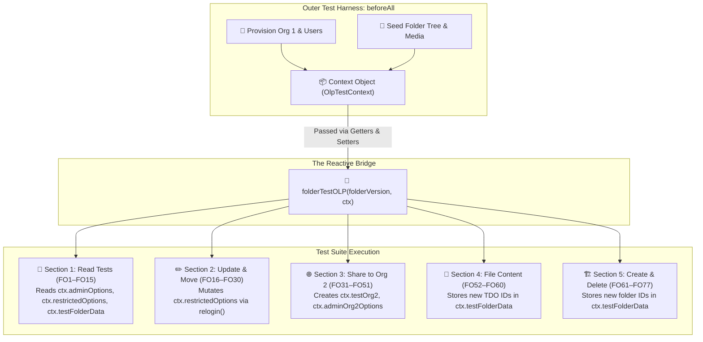

# Comprehensive Guide to `OlpTestContext` & Its Attributes

> **Target File**: [`citest/tools/graphql-api/test/folder/RBAC/folderOlpREP.spec.ts:L479-L497`](file:///home/huycao/Repos/veritone-drug/core-graphql-server/citest/tools/graphql-api/test/folder/RBAC/folderOlpREP.spec.ts#L479-L497)  
> **Topic**: Deep dive into the `OlpTestContext` interface, explaining its architecture, purpose, and listing all 17 attributes and nested properties across the test suite.  
> **Audience**: QA Engineers, Automation Developers, and Backend Engineers

---

## Table of Contents
1. [The Big Picture: What is `OlpTestContext`?](#1-the-big-picture-what-is-olptestcontext)
2. [Visual Architecture: The Reactive Context Bridge](#2-visual-architecture-the-reactive-context-bridge)
3. [Full Attribute Catalog (All 17 Attributes Explained)](#3-full-attribute-catalog-all-17-attributes-explained)
   - [Category 1: Tenant & Setup Objects (`testSetup`, `testSetup2`, `testOrg`, `testOrg2`)](#category-1-tenant--setup-objects)
   - [Category 2: User Persona Objects (`adminUser`, `adminUser2`, `regularUser`, `restrictedUser`)](#category-2-user-persona-objects)
   - [Category 3: Auth Headers & Request Options (`adminOptions`, `restrictedOptions`, etc.)](#category-3-auth-headers--request-options)
   - [Category 4: Shared Data Dictionaries (`testFolderData`, `rbac`)](#category-4-shared-data-dictionaries)
   - [Category 5: Dynamic Session Method (`relogin`)](#category-5-dynamic-session-method)
4. [Deep Dive into the Nested Dictionaries](#4-deep-dive-into-the-nested-dictionaries)
   - [A. Sub-attributes of `testFolderData`](#a-sub-attributes-of-testfolderdata)
   - [B. Sub-attributes of `rbac`](#b-sub-attributes-of-rbac)
5. [Why Getters and Setters are Used with `OlpTestContext`](#5-why-getters-and-setters-are-used-with-olptestcontext)
6. [How to Apply this Context Pattern in Your Project](#6-how-to-apply-this-context-pattern-in-your-project)
7. [Master Quick-Reference Table](#7-master-quick-reference-table)

---

# 1. The Big Picture: What is `OlpTestContext`?

In a complex, multi-stage integration test suite like [`folderOlpREP.spec.ts`](file:///home/huycao/Repos/veritone-drug/core-graphql-server/citest/tools/graphql-api/test/folder/RBAC/folderOlpREP.spec.ts), tests span across **multiple files, nested `describe` blocks, multiple organizations, and changing token states**.

```typescript
interface OlpTestContext {
  testSetup: any;
  testSetup2: any;
  testOrg: any;
  testOrg2: any;
  adminUser: any;
  adminUser2: any;
  regularUser: any;
  restrictedUser: any;
  adminOptions: any;
  adminOptions2: any;
  regularOptions: any;
  restrictedOptions: any;
  adminOrg2Options: any;
  regularUserOrg2Options: any;
  testFolderData: any;
  rbac: any;
  relogin: (userId: string, organizationGuid: string) => Promise<any>;
}
```

### 🎯 The Purpose of `OlpTestContext`:
1. **Single Source of Truth**: Acts as the central vehicle that carries all live database IDs, user credentials, JWT tokens, and helper methods from the outer setup harness into every individual test case.
2. **Two-Way Reactive State Synchronization**: Allows child test cases (like `FO6` or `FO54`) to modify shared state (e.g. refreshing a user's token or adding a second organization) without polluting global variables.

---

# 2. Visual Architecture: The Reactive Context Bridge



---

# 3. Full Attribute Catalog (All 17 Attributes Explained)

---

## Category 1: Tenant & Setup Objects

These attributes store organization-level provisioning results.

```typescript
testSetup: any;
testSetup2: any;
testOrg: any;
testOrg2: any;
```

### 1. `testSetup`
* **What it is**: The raw return object from `setupTestOrgAndUser` for **Organization 1**.
* **Contains**: `{ org: Organization, listOptions: UserOption[] }`.
* **Purpose**: Stores the initial tenant's metadata and the array of created users. Used during teardown to iterate over and delete all Org 1 users.

### 2. `testSetup2`
* **What it is**: The raw return object from `setupTestOrgAndUser` for **Organization 2** (External Tenant).
* **Initialized in**: Section 3 (`share folder to other organization` `beforeAll`).
* **Purpose**: Stores the secondary tenant's user list for teardown and cross-tenant validation.

### 3. `testOrg`
* **What it is**: The primary **Organization 1** object.
* **Contains**: `{ id: '12345', guid: 'org-guid-...', name: 'citest-org-...', status: 'active' }`.
* **Purpose**: Represents the main tenant where all target folders and media assets are seeded.

### 4. `testOrg2`
* **What it is**: The secondary **Organization 2** object.
* **Initialized in**: Section 3 `beforeAll` (`ctx.testOrg2 = org2`).
* **Purpose**: Used to test cross-organization sharing (`shareFolder`) and multi-tenant data isolation.

---

## Category 2: User Persona Objects

These attributes store the user profile objects for all test personas.

```typescript
adminUser: any;
adminUser2: any;
regularUser: any;
restrictedUser: any;
```

### 5. `adminUser`
* **Role**: Primary Administrator (Owner) of Org 1.
* **Contains**: `{ userId: '...', userName: '...first-admin-user...', email: '...', requestOptions: { ... } }`.
* **Purpose**: Represents the creator/owner of all initial test folders and media files.

### 6. `adminUser2`
* **Role**: Secondary Administrator of Org 1.
* **Contains**: `{ userId: '...', userName: '...second-admin-user...', email: '...', requestOptions: { ... } }`.
* **Purpose**: Proves that administrator privileges apply organization-wide, even if the admin did not personally create the folder.

### 7. `regularUser`
* **Role**: Standard Corporate User (`CMS Viewer` role).
* **Contains**: `{ userId: '...', userName: '...first-regular-user...', email: '...', requestOptions: { ... } }`.
* **Purpose**: Represents standard day-to-day employees to verify non-admin capabilities and boundaries.

### 8. `restrictedUser`
* **Role**: Zero-Privilege User (0 Roles + Stripped of default groups).
* **Contains**: `{ userId: '...', userName: '...first-restrict-user...', email: '...', requestOptions: { ... } }`.
* **Purpose**: The primary **OLP Test Probe**. Starts with zero access ("Default Deny") and is incrementally granted explicit ACEs.

---

## Category 3: Auth Headers & Request Options

These attributes contain the HTTP request headers (`{ Authorization: 'Bearer <jwt_token>' }`) used to authenticate GraphQL calls as specific personas.

```typescript
adminOptions: any;
adminOptions2: any;
regularOptions: any;
restrictedOptions: any;
adminOrg2Options: any;
regularUserOrg2Options: any;
```

### 9. `adminOptions`
* **User**: `adminUser` (Org 1 Owner).
* **Usage**: Used for administrative mutations: creating folders, creating AuthGroups, granting ACEs, and deleting resources.

### 10. `adminOptions2`
* **User**: `adminUser2` (Org 1 Second Admin).
* **Usage**: Used to verify non-owner admin operations (e.g. `FO2: admin get folder`, `FO18: admin update folder`).

### 11. `regularOptions`
* **User**: `regularUser` (CMS Viewer).
* **Usage**: Used to test viewer access, moving folders, and unfiling owned content.  
* **Dynamic Mutation**: Updated via `ctx.regularOptions = await ctx.relogin(...)` in `FO54` when granted organization-level TDO permissions.

### 12. `restrictedOptions`
* **User**: `restrictedUser` (Zero-Role Probe).
* **Usage**: The most frequently mutated option in the entire suite.  
* **Dynamic Mutation**: Re-assigned after every permission grant (e.g. `FO6`, `FO22`, `FO63`, `FO71`) via `ctx.relogin()` or `waitForAuthGroupMembership`.

### 13. `adminOrg2Options`
* **User**: `org2-admin-user` (Org 2 Administrator).
* **Usage**: Used to verify cross-organization access (e.g. viewing shared folders from Org 1 in `FO35.1`, uploading Org 2 content into Org 1's folder in `FO47`).

### 14. `regularUserOrg2Options`
* **User**: `org2-regular-user` (Org 2 Standard User).
* **Usage**: Used for secondary tenant edge-case validations (e.g. `FO76.2: cannot delete empty root folder in Org 2`).

---

## Category 4: Shared Data Dictionaries

These two dictionary objects store dynamic resource IDs generated during setup and test execution.

```typescript
testFolderData: any;
rbac: any;
```

---

## Category 5: Dynamic Session Method

```typescript
relogin: (userId: string, organizationGuid: string) => Promise<any>;
```

### 17. `relogin`
* **Signature**: `(userId: string, organizationGuid: string) => Promise<Record<string, string>>`
* **How it works**: Uses the superadmin token (`superToken`) to call `impersonateUser(superToken, userId, orgGuid)` and returns fresh HTTP headers:
  ```typescript
  { Authorization: 'Bearer <newly_minted_jwt_token>' }
  ```
* **Why it's essential**: When an admin adds a user to an `AuthGroup` or grants an ACE, the database updates immediately, but the user's **existing session token is unaware**. Calling `ctx.relogin()` mints a fresh token that encodes the new authorization state.

---

# 4. Deep Dive into the Nested Dictionaries

---

## A. Sub-attributes of `testFolderData`

`testFolderData` is a key-value dictionary that collects every folder and media ID created across all 77 tests:

| Sub-Attribute Name | Created In | Resource Type | Description / Purpose |
| :--- | :--- | :--- | :--- |
| `rootFolderId` | `beforeAll` (Setup) | Folder (Root) | Org 1 Shared CMS Root Folder (no owner ID). |
| `treeObjectId` | `beforeAll` (Setup) | String | Tree-structure pointer for Org 1 Root Folder (`v2`). |
| `rootFolderId2` | `beforeAll` (Setup) | Folder (Root) | Admin User's private CMS Root Folder. |
| `treeObjectId2` | `beforeAll` (Setup) | String | Tree-structure pointer for Admin Root Folder (`v2`). |
| `parentFolderId` | `beforeAll` (Setup) | Folder | Main Parent Folder 1 under Root (Primary OLP target). |
| `parentFolderId2` | `beforeAll` (Setup) | Folder | Sibling Parent Folder 2 (Used for batch ACE grant tests). |
| `childFolderId` | `beforeAll` (Setup) | Folder | Child Folder 1 inside Parent Folder 1. |
| `childFolderId2` | `FO12` | Folder | Second Child Folder created by Admin to test inheritance. |
| `grandChildFolderId` | `beforeAll` (Setup) | Folder | Grandchild Folder inside Child Folder 1 (3rd tier). |
| `tdoId` | `beforeAll` (Setup) | TDO (Media) | Video media file filed inside Parent Folder 1. |
| `childTdoId` | `beforeAll` (Setup) | TDO (Media) | Video media file filed inside Child Folder 1. |
| `grandChildTdoId` | `beforeAll` (Setup) | TDO (Media) | Video media file filed inside Grandchild Folder 1. |
| `childTdoId2` | `FO12` | TDO (Media) | Video media file filed inside Child Folder 2. |
| `rootFolderIdOrg2` | Section 3 `beforeAll` | Folder (Root) | Org 2 Shared CMS Root Folder. |
| `treeObjectIdOrg2` | Section 3 `beforeAll` | String | Tree pointer for Org 2 Root Folder. |
| `sharedOrgTdoId` | `FO47` | TDO (Media) | Media file uploaded by Org 2 inside Org 1's shared folder. |
| `defaultUserTdoId` | `FO27` | TDO (Media) | Media file created by `regularUser`. |
| `defaultUserFiledTdoId` | `FO55` | TDO (Media) | Media file created and filed by `regularUser`. |
| `restrictedUserFiledTdoId`| `FO53` | TDO (Media) | Media file created by `restrictedUser` to test filing block. |
| `defaultUserCreatedFolderId` | `FO61` | Folder | Child folder created by `regularUser`. |
| `restrictedUserCreatedFolderId` | `FO64` | Folder | Child folder created by `restrictedUser` after ACE grant. |
| `restrictedUserCreatedChildFolderId` | `FO64` | Folder | Grandchild folder created by `restrictedUser`. |
| `newFolderId` | `FO43` / `FO72` | Folder | Disposable folder created for deletion assertions. |

---

## B. Sub-attributes of `rbac`

`rbac` is a key-value dictionary that stores generated authorization entity IDs:

| Sub-Attribute Name | Created In | Entity Type | Permissions Granted |
| :--- | :--- | :--- | :--- |
| `authGroupId` | `FO6` | `AuthGroup` | Contains `restrictedUser` as member. |
| `authPermissionSetId` | `FO6` / `FO22` / `FO71` | `AuthPermissionSet` | Evolving permission set (`AiwareFolderRead`, `Update`, `Delete`). |
| `TDOPermissionSetId` | `FO10` | `AuthPermissionSet` | `[AiwareTdoRead]` (Media Read permission). |
| `TDOCreatePermissionSetId` | `FO53` | `AuthPermissionSet` | `[AiwareTdoCreate, Delete, Read, Search, Update]`. |
| `TDOFilePermissionSetId` | `FO54` | `AuthPermissionSet` | `[AiwareTdoRead, Create, Delete, Search, Update]` for `regularUser`. |
| `folderCreatePermissionSetId` | `FO63` | `AuthPermissionSet` | `[AiwareFolderUpdate, Read, Create, File]` on folder. |
| `createPermissionSetId` | `FO63` | `AuthPermissionSet` | `[AiwareFolderCreate]` on Organization level. |

---

# 5. Why Getters and Setters are Used with `OlpTestContext`

In lines 221–289 of `folderOlpREP.spec.ts`, the context is passed into `folderTestOLP` like this:

```typescript
folderTestOLP(folderVersion, {
  get testOrg() { return testOrg; },
  set testOrg2(v: any) { testOrg2 = v; },
  get testOrg2() { return testOrg2; },
  
  get restrictedOptions() { return restrictedOptions; },
  set restrictedOptions(v: any) { restrictedOptions = v; },

  get testFolderData() { return testFolderData; },
  get rbac() { return rbac; },
  relogin
});
```

### 💡 The Problem with Plain Objects in JavaScript:
If you pass a plain object `{ restrictedOptions }`:
- When `FO6` updates `ctx.restrictedOptions = newHeaders`, only the local property changes.
- Subsequent tests reading `restrictedOptions` from the parent scope or other blocks would receive the **stale initial token**.

### 🌟 The Getter/Setter Solution:
* **`get restrictedOptions()`**: Dynamically reads the live variable from the outer scope every time `ctx.restrictedOptions` is accessed.
* **`set restrictedOptions(v)`**: Writes directly back to the outer scoped variable when updated inside a child test!

---

# 6. How to Apply this Context Pattern in Your Project

You can use this clean, type-safe context pattern in any multi-stage API integration test:

```typescript
export interface FeatureTestContext {
  // 1. Tenants
  primaryOrg: any;
  secondaryOrg?: any;

  // 2. Auth Headers
  adminHeaders: Record<string, string>;
  viewerHeaders: Record<string, string>;
  restrictedHeaders: Record<string, string>;

  // 3. Resource & Security State Dictionaries
  resourceData: Record<string, string>;
  securityData: Record<string, string>;

  // 4. Session Refresher
  relogin: (userId: string) => Promise<Record<string, string>>;
}
```

---

# 7. Master Quick-Reference Table

| Attribute | TypeScript Type | Assigned By | Primary Purpose |
| :--- | :--- | :--- | :--- |
| **`testSetup`** | `SetupResult` | `setupTestOrgAndUser` (Setup) | Holds Org 1 provisioning metadata and user list for teardown. |
| **`testSetup2`** | `SetupResult` | `setupTestOrgAndUser` (Section 3) | Holds Org 2 provisioning metadata and user list for teardown. |
| **`testOrg`** | `Organization` | `testSetup.org` (Setup) | Primary Organization under test. |
| **`testOrg2`** | `Organization` | `testSetup2.org` (Section 3) | Secondary Organization for cross-tenant sharing. |
| **`adminUser`** | `User` | `testSetup.listOptions` | Org 1 Owner / Primary Administrator. |
| **`adminUser2`** | `User` | `testSetup.listOptions` | Org 1 Second Administrator (Non-owner admin). |
| **`regularUser`** | `User` | `testSetup.listOptions` | CMS Viewer user (Normal business persona). |
| **`restrictedUser`** | `User` | `testSetup.listOptions` | Zero-privilege user (The OLP test probe). |
| **`adminOptions`** | `Headers` | `adminUser.requestOptions` | Auth headers for Owner / Admin 1 operations. |
| **`adminOptions2`** | `Headers` | `adminUser2.requestOptions` | Auth headers for Admin 2 operations. |
| **`regularOptions`** | `Headers` | `regularUser.requestOptions` | Auth headers for CMS Viewer operations (Mutated in FO54). |
| **`restrictedOptions`** | `Headers` | `restrictedUser.requestOptions` | Auth headers for Restricted user (Mutated across all grant tests). |
| **`adminOrg2Options`** | `Headers` | `org2Admin.requestOptions` | Auth headers for Org 2 Administrator. |
| **`regularUserOrg2Options`** | `Headers` | `org2Regular.requestOptions` | Auth headers for Org 2 Regular user. |
| **`testFolderData`** | `Record<string, any>` | Dynamic dictionary | Stores all generated Folder IDs and TDO Media IDs. |
| **`rbac`** | `Record<string, any>` | Dynamic dictionary | Stores all generated `AuthGroup` IDs and `AuthPermissionSet` IDs. |
| **`relogin`** | `Function` | Defined in Harness | Generates fresh JWT tokens via superadmin impersonation. |
