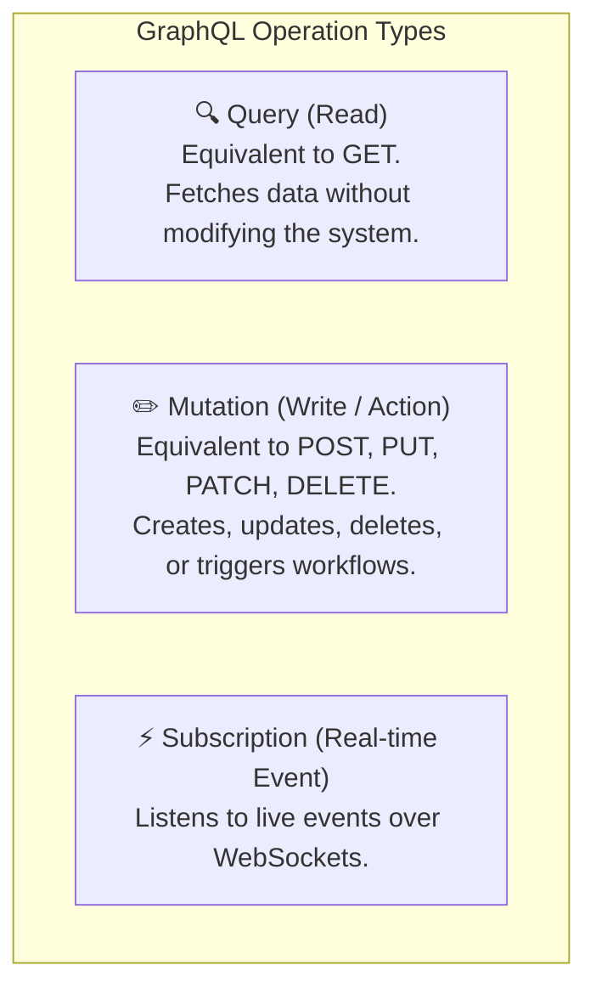

# Authoring Queries & Mutations in `src/queries/extracted/`

> **Audience**: Super Beginner QA Engineers & New Testers joining the Veritone GraphQL API testing team  
> **Target Directory**: [`citest/tools/graphql-api/src/queries/extracted`](file:///home/huycao/Repos/veritone-drug/core-graphql-server/citest/tools/graphql-api/src/queries/extracted)  
> **Module Path**: [`citest/tools/graphql-api`](file:///home/huycao/Repos/veritone-drug/core-graphql-server/citest/tools/graphql-api)  
> **Author**: Senior API QA / Automation Lead  

---

## Table of Contents
1. [Introduction for Super Beginners: Queries vs Mutations vs Subscriptions](#introduction-for-super-beginners-queries-vs-mutations-vs-subscriptions)
2. [1. Directory Structure & Categorization Strategy](#1-directory-structure--categorization-strategy)
3. [2. How to Author a GraphQL Query (Read Operations)](#2-how-to-author-a-graphql-query-read-operations)
   - [2.1 Anatomy of a Query Document](#21-anatomy-of-a-query-document)
   - [2.2 Querying Single Records vs Lists (Pagination & Filters)](#22-querying-single-records-vs-lists-pagination--filters)
   - [2.3 Querying Nested Relationships](#23-querying-nested-relationships)
4. [3. How to Author a GraphQL Mutation (Write / Modify Operations)](#3-how-to-author-a-graphql-mutation-write--modify-operations)
   - [3.1 Anatomy of a Mutation Document](#31-anatomy-of-a-mutation-document)
   - [3.2 The Importance of Input Objects (`$input`)](#32-the-importance-of-input-objects-input)
   - [3.3 What Fields to Request in Mutation Return Payloads](#33-what-fields-to-request-in-mutation-return-payloads)
5. [4. The 5 Golden Rules for Writing Operations in This Project](#4-the-5-golden-rules-for-writing-operations-in-this-project)
6. [5. Critical Facts & Senior QA Insights](#5-critical-facts--senior-qa-insights)
7. [6. Complete Hands-on Tutorial: Adding a New Query & Running CodeGen](#6-complete-hands-on-tutorial-adding-a-new-query--running-codegen)

---

## Introduction for Super Beginners: Queries vs Mutations vs Subscriptions

In REST APIs, you use different HTTP verbs (`GET`, `POST`, `PUT`, `DELETE`). In GraphQL, everything is sent as an HTTP `POST` request to `/graphql`, but the operation type tells the server what to do:



* **Query**: `"Give me the details of folder 123."` (Safe, idempotent, read-only).
* **Mutation**: `"Create a new folder called 'Q3 Reports'."` or `"Delete engine build 456."` (State-changing).
* **Subscription**: `"Notify me whenever a job task finishes processing."` (Event stream).

All our reusable queries and mutations live in [`src/queries/extracted/`](file:///home/huycao/Repos/veritone-drug/core-graphql-server/citest/tools/graphql-api/src/queries/extracted).

---

## 1. Directory Structure & Categorization Strategy

We organize queries domain-by-domain so tests can easily find and share operations:

```
citest/tools/graphql-api/src/queries/extracted/
├── auth.ts             # Logins, tokens, session management
├── users.ts            # User CRUD, roles, permissions
├── organizations.ts    # Multi-tenant organization CRUD & policies
├── folders.ts          # Folder CRUD, tree hierarchy, sharing, templates
├── engines.ts          # AI Engines, builds, whitelists, categories
├── tdo.ts              # Temporal Data Objects, media assets, upload URLs
├── jobs.ts             # Engine jobs, tasks, clusters
├── scheduledJobs.ts    # Periodic & recurring job schedules
├── flows.ts            # aiWARE Automate workflows & packages
├── mentions.ts         # Watchlists, AI alerts, cognitive mentions
├── destination.ts      # Distribution center & export targets
└── index.ts            # Master re-export file for all categories
```

> 💡 **Tip**: If you are working on a new feature area (e.g. `billing.ts`), create a new file in `src/queries/extracted/` and export it in [`index.ts`](file:///home/huycao/Repos/veritone-drug/core-graphql-server/citest/tools/graphql-api/src/queries/extracted/index.ts).

---

## 2. How to Author a GraphQL Query (Read Operations)

### 2.1 Anatomy of a Query Document

Here is a standard query from [`engines.ts`](file:///home/huycao/Repos/veritone-drug/core-graphql-server/citest/tools/graphql-api/src/queries/extracted/engines.ts):

```typescript
import { gql } from 'graphql-request';

export const GET_ENGINE = gql`
  query engine($id: ID!) {
    engine(id: $id) {
      id
      name
      state
      deploymentModel
      category {
        id
        name
      }
    }
  }
`;
```

Let's dissect each part:

```
export const GET_ENGINE = gql`
  query engine($id: ID!) {       <-- 1. Operation Type & Name + Variable Definition
    engine(id: $id) {            <-- 2. Schema Query Field & Argument Passing
      id                         <-- 3. Selected Return Fields (Leaf Nodes)
      name
      state
      category {                 <-- 4. Nested Relationship
        id
        name
      }
    }
  }
`;
```

1. **`export const GET_ENGINE`**: The JavaScript variable exported for testing.
2. **`gql` tag**: The template tag from `graphql-request` (or `graphql-tag`). CodeGen searches for this tag to identify GraphQL operations.
3. **`query engine($id: ID!)`**:
   - `query`: The operation type.
   - `engine`: The operation name. **This exact name determines the generated SDK method: `client.sdk.engine(...)`!**
   - `($id: ID!)`: Variable definition. `$id` is required (`!`) and must be a GraphQL `ID`.
4. **`engine(id: $id)`**: Calls the schema resolver for `engine` passing the `$id` variable.
5. **Field Selection**: You only ask for the specific fields you need.

---

### 2.2 Querying Single Records vs Lists (Pagination & Filters)

When querying multiple items, always include filtering and pagination arguments:

```typescript
export const GET_ENGINES = gql`
  query engines(
    $id: ID
    $ids: [ID!]
    $categoryId: String
    $state: [EngineState]
    $limit: Int
    $offset: Int = 0
  ) {
    engines(
      id: $id
      ids: $ids
      categoryId: $categoryId
      state: $state
      limit: $limit
      offset: $offset
    ) {
      count
      offset
      limit
      records {
        id
        name
        state
      }
    }
  }
`;
```

* **`records`**: The list of engine entities.
* **`count`**: The total number of records matching the filter (essential for pagination assertions).
* **`offset: Int = 0`**: Default variable value if not provided by the caller.

---

### 2.3 Querying Nested Relationships

GraphQL allows fetching related entities in a single round-trip:

```typescript
export const GET_FOLDER_TREE = gql`
  query folderWithTree($id: ID!) {
    folder(id: $id) {
      id
      name
      parent {
        id
        name
      }
      childFolders {
        records {
          id
          name
          status
        }
      }
    }
  }
`;
```

---

## 3. How to Author a GraphQL Mutation (Write / Modify Operations)

### 3.1 Anatomy of a Mutation Document

Here is a standard mutation from [`folders.ts`](file:///home/huycao/Repos/veritone-drug/core-graphql-server/citest/tools/graphql-api/src/queries/extracted/folders.ts):

```typescript
import { gql } from 'graphql-request';

export const CREATE_FOLDER = gql`
  mutation createFolder($input: CreateFolderInput!) {
    createFolder(input: $input) {
      id
      name
      description
      parentId
      rootFolderTypeId
      treeObjectId
      status
    }
  }
`;
```

---

### 3.2 The Importance of Input Objects (`$input`)

Modern GraphQL APIs bundle mutation parameters into a single input object (`$input: CreateFolderInput!`).

* **Why?** Bundling inputs prevents breaking API changes when adding optional parameters in the future.
* **In CodeGen**: CodeGen generates a strict TypeScript interface `CreateFolderInput` in [`gql.ts`](file:///home/huycao/Repos/veritone-drug/core-graphql-server/citest/tools/graphql-api/src/gql/gql.ts). When calling `client.sdk.createFolder({ input: { ... } })`, your IDE guarantees all required fields are provided.

---

### 3.3 What Fields to Request in Mutation Return Payloads

As a senior tester, always request the fields you need to assert:
1. **The ID**: Required to verify creation and for subsequent cleanup in `afterAll()`.
2. **The modified fields**: E.g. `name`, `status`, `description` to assert that the database actually saved your values.
3. **Hierarchy identifiers**: E.g. `parentId`, `treeObjectId` for folder reparenting tests.

---

## 4. The 5 Golden Rules for Writing Operations in This Project

Follow these rules to ensure zero build errors and clean SDK generation:

| Rule | Description | Bad Example ❌ | Good Example ✅ |
| :--- | :--- | :--- | :--- |
| **Rule 1: Always Name Operations** | CodeGen uses the operation name to name the SDK method. | `query { engines { id } }` | `query engines { engines { id } }` |
| **Rule 2: Never Use String Interpolation** | Always use GraphQL `$variables`. String interpolation breaks AST caching and type generation. | `query { engine(id: "${id}") }` | `query engine($id: ID!) { engine(id: $id) }` |
| **Rule 3: Match Schema Types Exactly** | Variable types in `$variable: Type` must match the schema exactly (`ID!`, `String`, `[EngineState]`). | `query engine($id: String)` (if schema expects `ID!`) | `query engine($id: ID!)` |
| **Rule 4: Export with `gql` Tag** | CodeGen scans for template literals tagged with `gql`. | `const Q = "query ..."` | `export const Q = gql`query ...`` |
| **Rule 5: Re-export in `index.ts`** | Keep the library modular and centralized. | Forgetting to export from `index.ts` | Adding `export * from './myFeature';` in `index.ts` |

---

## 5. Critical Facts & Senior QA Insights

### Fact 1: How Operation Names Map to `client.sdk`
The name you give right after `query` or `mutation` determines the method name in `gql.ts`:
* `query getEngineSummary($id: ID!)` $\rightarrow$ `client.sdk.getEngineSummary(...)`
* `mutation deleteFolder($id: ID!)` $\rightarrow$ `client.sdk.deleteFolder(...)`

### Fact 2: Preserving Raw Error Responses (`rawRequest: true`)
Because CodeGen is configured with `rawRequest: true`:
```typescript
// When testing a negative test case (e.g. Unauthorized or Not Found):
const res = await client.sdk.deleteEngine({ id: 'invalid-id' });

// It will NOT crash or throw an uncaught exception!
// Instead, inspect the errors array directly:
expect(res.errors).toBeDefined();
expect(res.errors?.[0].message).toContain('Engine not found');
```

### Fact 3: Reusing Queries Across Tests
Never define ad-hoc GraphQL strings inside individual `.spec.ts` test files. By adding queries to `src/queries/extracted/`, any QA engineer or AI agent on the team can reuse them with full type safety!

---

## 6. Complete Hands-on Tutorial: Adding a New Query & Running CodeGen

Let's walk through adding a new operation step-by-step:

### Step 1: Create or Update Query File
Open [`src/queries/extracted/engines.ts`](file:///home/huycao/Repos/veritone-drug/core-graphql-server/citest/tools/graphql-api/src/queries/extracted/engines.ts) and append your new query:

```typescript
export const GET_ACTIVE_ENGINES_COUNT = gql`
  query activeEnginesCount($categoryId: String) {
    engines(state: [active], categoryId: $categoryId, limit: 1) {
      count
    }
  }
`;
```

### Step 2: Ensure it is Exported
Check that `src/queries/extracted/index.ts` includes:
```typescript
export * from './engines';
```

### Step 3: Run the CodeGen Command
In your terminal (from `citest/tools/graphql-api`):
```bash
bun run codegen
```
*CodeGen will connect to `http://localhost:3000/graphql`, parse your new query, and update `src/gql/gql.ts`.*

### Step 4: Use in Your Test Spec
In your test file:
```typescript
import { createGraphqlClient, AuthType } from '../../src/graphqlUtil';

describe('Engine Count Test', () => {
  it('should retrieve active engines count', async () => {
    const client = await createGraphqlClient(AuthType.SESSION_TOKEN);

    // Call the new generated SDK method with instant autocomplete!
    const res = await client.sdk.activeEnginesCount({ categoryId: 'cognition' });

    expect(res.status).toBe(200);
    expect(res.data.engines?.count).toBeGreaterThan(0);
  });
});
```
