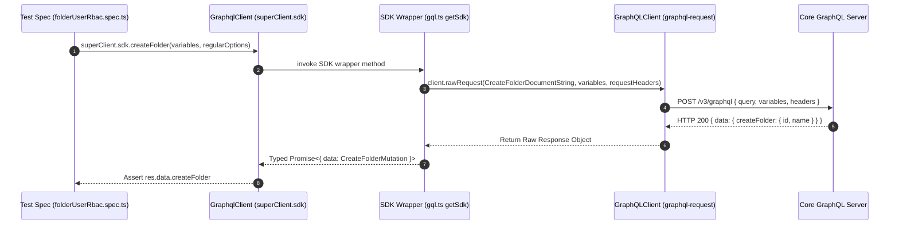

# How Integration Tests Use Generated SDK Components in `folderUserRbac.spec.ts`

> **Audience**: Super Beginner QA Engineers & New Testers joining the Veritone GraphQL API testing team  
> **Target Spec File**: [`test/folder/RBAC/folderUserRbac.spec.ts`](file:///home/huycao/Repos/veritone-drug/core-graphql-server/citest/tools/graphql-api/test/folder/RBAC/folderUserRbac.spec.ts)  
> **SDK Source File**: [`src/gql/gql.ts`](file:///home/huycao/Repos/veritone-drug/core-graphql-server/citest/tools/graphql-api/src/gql/gql.ts)  
> **Client Utility File**: [`src/graphqlUtil.ts`](file:///home/huycao/Repos/veritone-drug/core-graphql-server/citest/tools/graphql-api/src/graphqlUtil.ts)  
> **Author**: Senior API QA Lead  

---

## Table of Contents
1. [Introduction & Core Concept](#1-introduction--core-concept)
2. [The 3-Tier SDK Architecture & Flow](#2-the-3-tier-sdk-architecture--flow)
3. [SDK Plumbing & Client Initialization](#3-sdk-plumbing--client-initialization)
4. [User Impersonation & Header-Based Context Swapping](#4-user-impersonation--header-based-context-swapping)
5. [Categorized SDK Call Walkthrough in `folderUserRbac.spec.ts`](#5-categorized-sdk-call-walkthrough-in-folderuserrbacspects)
   - [A. User & Identity Operations](#a-user--identity-operations)
   - [B. Folder & TDO Operations](#b-folder--tdo-operations)
   - [C. RBAC & Access Control List (ACL) Operations](#c-rbac--access-control-list-acl-operations)
   - [D. Data Registry & Structured Data (SDO) Operations](#d-data-registry--structured-data-sdo-operations)
6. [SDK Typed Calls vs Raw `superClient.query()` Comparison](#6-sdk-typed-calls-vs-raw-superclientquery-comparison)
7. [Best Practices for QA Automation Engineers](#7-best-practices-for-qa-automation-engineers)

---

## 1. Introduction & Core Concept

When automated test cases interact with the Veritone GraphQL API, they rarely construct raw GraphQL HTTP POST payloads manually. Instead, tests invoke strongly-typed TypeScript methods via an **SDK (Software Development Kit)**.

### What is `src/gql/gql.ts`?
[`src/gql/gql.ts`](file:///home/huycao/Repos/veritone-drug/core-graphql-server/citest/tools/graphql-api/src/gql/gql.ts) is an auto-generated file created by **GraphQL Code Generator** (`@graphql-codegen/cli`). It parses all GraphQL document files in [`src/queries/extracted/`](file:///home/huycao/Repos/veritone-drug/core-graphql-server/citest/tools/graphql-api/src/queries/extracted) and generates:
1. **TypeScript Interfaces & Types**: Auto-generated definitions for inputs, payloads, and enums (e.g., `RootFolderType`, `AuthResourceType`, `AuthPermissionType`).
2. **Document AST Strings**: Serialized GraphQL query and mutation strings.
3. **The `getSdk(client)` Function**: A factory function that wraps a standard `GraphQLClient` instance and exposes strongly-typed async methods corresponding to every GraphQL operation.

---

## 2. The 3-Tier SDK Architecture & Flow

The overall architecture connecting a test spec to the backend GraphQL server follows a 3-tier structure:



---

## 3. SDK Plumbing & Client Initialization

How does `superClient.sdk` get attached to our test setup?

In [`src/graphqlUtil.ts`](file:///home/huycao/Repos/veritone-drug/core-graphql-server/citest/tools/graphql-api/src/graphqlUtil.ts), the helper function `createGraphqlClient()` initializes the client:

```typescript
// 1. Create raw underlying HTTP GraphQL client
const client = new GraphQLClient(gqlClient.url);

// 2. Wrap it with generated getSdk from gql.ts
gqlClient.sdk = getSdk(client);
```

In [`folderUserRbac.spec.ts`](file:///home/huycao/Repos/veritone-drug/core-graphql-server/citest/tools/graphql-api/test/folder/RBAC/folderUserRbac.spec.ts#L66-L72), tests create `superClient`:

```typescript
const bootstrapClient = await createGraphqlClient(AuthType.SESSION_TOKEN, env);
isolatedSuperadmin = await createIsolatedSuperadmin(bootstrapClient);
superClient = isolatedSuperadmin.client;
```

Now, any call to `superClient.sdk.<methodName>()` has complete IDE autocompletion, compile-time type checking, and automatic response typing.

---

## 4. User Impersonation & Header-Based Context Swapping

Role-Based Access Control (RBAC) testing requires verifying what an **Admin**, a **Regular User**, or a **Restricted User** can or cannot do.

Instead of instantiating multiple `GraphQLClient` connections for every user, the SDK supports **per-request header overrides** via its second parameter (`requestHeaders?: GraphQLClientRequestHeaders`).

### How Header Swapping Works in `getSdk`

In [`src/gql/gql.ts`](file:///home/huycao/Repos/veritone-drug/core-graphql-server/citest/tools/graphql-api/src/gql/gql.ts#L40685-L40700):

```typescript
createFolder(variables: CreateFolderMutationVariables, requestHeaders?: GraphQLClientRequestHeaders) {
  return withWrapper(
    (wrappedRequestHeaders) =>
      client.rawRequest<CreateFolderMutation>(
        CreateFolderDocumentString,
        variables,
        { ...requestHeaders, ...wrappedRequestHeaders } // <-- Merges caller-provided options!
      ),
    'createFolder',
    'mutation',
    variables
  );
}
```

### Usage in `folderUserRbac.spec.ts`:

```typescript
// Impersonate different users to get their requestOptions (containing their auth token/headers)
adminOptions = adminUser?.requestOptions;
regularOptions = regularUser?.requestOptions;
restrictOptions = restrictUser?.requestOptions;

// 1. Execute SDK call AS REGULAR USER:
const res1 = await superClient.sdk.createFolder(
  { input: { name: 'My Folder', parentId: rootId, rootFolderType: RootFolderType.Cms } },
  regularOptions // <-- User 1 Context
);

// 2. Execute SDK call AS ADMIN USER:
const res2 = await superClient.sdk.deleteFolder(
  { input: { id: folderId, orderIndex: 0 } },
  adminOptions // <-- User 2 Context
);
```

---

## 5. Categorized SDK Call Walkthrough in `folderUserRbac.spec.ts`

Here is how each category of SDK calls is used throughout [`folderUserRbac.spec.ts`](file:///home/huycao/Repos/veritone-drug/core-graphql-server/citest/tools/graphql-api/test/folder/RBAC/folderUserRbac.spec.ts):

### A. User & Identity Operations

| SDK Method | Code Location | Purpose in Test Spec |
| :--- | :--- | :--- |
| `superClient.sdk.meBasic()` | [`L81`](file:///home/huycao/Repos/veritone-drug/core-graphql-server/citest/tools/graphql-api/test/folder/RBAC/folderUserRbac.spec.ts#L81) | Verifies currently authenticated user identity and retrieves `superUserId`. |
| `superClient.sdk.deleteUser()` | [`L116`](file:///home/huycao/Repos/veritone-drug/core-graphql-server/citest/tools/graphql-api/test/folder/RBAC/folderUserRbac.spec.ts#L116) | Cleanup fixture in `afterAll()` to remove test users created during setup. |

---

### B. Folder & TDO Operations

| SDK Method | Code Location | Purpose in Test Spec |
| :--- | :--- | :--- |
| `superClient.sdk.rootFolders()` | [`L151`](file:///home/huycao/Repos/veritone-drug/core-graphql-server/citest/tools/graphql-api/test/folder/RBAC/folderUserRbac.spec.ts#L151) | Fetches CMS root folder ID (`RootFolderType.Cms`) for a specific user context. |
| `superClient.sdk.createFolder()` | [`L165`](file:///home/huycao/Repos/veritone-drug/core-graphql-server/citest/tools/graphql-api/test/folder/RBAC/folderUserRbac.spec.ts#L165) | Creates a child folder under the specified parent folder. |
| `superClient.sdk.createTDO()` | [`L186`](file:///home/huycao/Repos/veritone-drug/core-graphql-server/citest/tools/graphql-api/test/folder/RBAC/folderUserRbac.spec.ts#L186) | Creates a Temporal Data Object (media/file container) inside a folder. |
| `superClient.sdk.folderBasic()` | [`L208`](file:///home/huycao/Repos/veritone-drug/core-graphql-server/citest/tools/graphql-api/test/folder/RBAC/folderUserRbac.spec.ts#L208) | Retrieves basic folder details by ID to verify read authorization. |
| `superClient.sdk.temporalDataObject()` | [`L215`](file:///home/huycao/Repos/veritone-drug/core-graphql-server/citest/tools/graphql-api/test/folder/RBAC/folderUserRbac.spec.ts#L215) | Retrieves a specific TDO by ID. |
| `superClient.sdk.temporalDataObjects()` | [`L242`](file:///home/huycao/Repos/veritone-drug/core-graphql-server/citest/tools/graphql-api/test/folder/RBAC/folderUserRbac.spec.ts#L242) | Lists all accessible TDOs with pagination parameters (`offset`, `limit`). |
| `superClient.sdk.moveTemporalDataObject()` | [`L753`](file:///home/huycao/Repos/veritone-drug/core-graphql-server/citest/tools/graphql-api/test/folder/RBAC/folderUserRbac.spec.ts#L753) | Tests negative/positive permission checks when moving a TDO across folders. |
| `superClient.sdk.deleteTDO()` | [`L467`](file:///home/huycao/Repos/veritone-drug/core-graphql-server/citest/tools/graphql-api/test/folder/RBAC/folderUserRbac.spec.ts#L467) | Deletes a TDO object during cleanup. |
| `superClient.sdk.deleteFolder()` | [`L496`](file:///home/huycao/Repos/veritone-drug/core-graphql-server/citest/tools/graphql-api/test/folder/RBAC/folderUserRbac.spec.ts#L496) | Deletes a folder object during cleanup. |

---

### C. RBAC & Access Control List (ACL) Operations

| SDK Method | Code Location | Purpose in Test Spec |
| :--- | :--- | :--- |
| `superClient.sdk.GetResourcesACL()` | [`L229`](file:///home/huycao/Repos/veritone-drug/core-graphql-server/citest/tools/graphql-api/test/folder/RBAC/folderUserRbac.spec.ts#L229) | Fetches Access Control Entries (ACEs) for resources (`AuthResourceType.Tdo`, `AuthResourceType.Folder`). |
| `superClient.sdk.CreateAuthGroup()` | [`L565`](file:///home/huycao/Repos/veritone-drug/core-graphql-server/citest/tools/graphql-api/test/folder/RBAC/folderUserRbac.spec.ts#L565) | Creates a custom Auth Group for permission assignment tests. |
| `superClient.sdk.authGroupAddMembers()` | [`L585`](file:///home/huycao/Repos/veritone-drug/core-graphql-server/citest/tools/graphql-api/test/folder/RBAC/folderUserRbac.spec.ts#L585) | Adds a user to an Auth Group (`AuthGroupMemberType.User`). |
| `superClient.sdk.authGroupRemoveMembers()` | [`L736`](file:///home/huycao/Repos/veritone-drug/core-graphql-server/citest/tools/graphql-api/test/folder/RBAC/folderUserRbac.spec.ts#L736) | Removes a user from an Auth Group. |
| `superClient.sdk.authPermissionSetCreate()` | [`L603`](file:///home/huycao/Repos/veritone-drug/core-graphql-server/citest/tools/graphql-api/test/folder/RBAC/folderUserRbac.spec.ts#L603) | Creates a custom Permission Set defining precise actions (e.g. `AuthPermissionType.AiwareTdoCreate`). |
| `superClient.sdk.addACEsToResources()` | [`L646`](file:///home/huycao/Repos/veritone-drug/core-graphql-server/citest/tools/graphql-api/test/folder/RBAC/folderUserRbac.spec.ts#L646) | Grants permissions by attaching an Auth Group and Permission Set to a resource ID. |
| `superClient.sdk.removeACEsFromResource()` | [`L490`](file:///home/huycao/Repos/veritone-drug/core-graphql-server/citest/tools/graphql-api/test/folder/RBAC/folderUserRbac.spec.ts#L490) | Removes ACE entries from a resource. |

---

### D. Data Registry & Structured Data (SDO) Operations

| SDK Method | Code Location | Purpose in Test Spec |
| :--- | :--- | :--- |
| `superClient.sdk.createDataRegistry()` | [`L266`](file:///home/huycao/Repos/veritone-drug/core-graphql-server/citest/tools/graphql-api/test/folder/RBAC/folderUserRbac.spec.ts#L266) | Creates a Data Registry container for custom schemas. |
| `superClient.sdk.createSchema()` | [`L286`](file:///home/huycao/Repos/veritone-drug/core-graphql-server/citest/tools/graphql-api/test/folder/RBAC/folderUserRbac.spec.ts#L286) | Defines and publishes a Structured Data Schema. |
| `superClient.sdk.createStructuredData()` | [`L314`](file:///home/huycao/Repos/veritone-drug/core-graphql-server/citest/tools/graphql-api/test/folder/RBAC/folderUserRbac.spec.ts#L314) | Instantiates a Structured Data Object (SDO) under a schema. |
| `superClient.sdk.structuredData()` | [`L341`](file:///home/huycao/Repos/veritone-drug/core-graphql-server/citest/tools/graphql-api/test/folder/RBAC/folderUserRbac.spec.ts#L341) | Fetches an SDO by ID and schemaId. |
| `superClient.sdk.createFolderContentTemplate()` | [`L354`](file:///home/huycao/Repos/veritone-drug/core-graphql-server/citest/tools/graphql-api/test/folder/RBAC/folderUserRbac.spec.ts#L354) | Links an SDO template to a Folder. |
| `superClient.sdk.updateFolderContentTemplate()` | [`L374`](file:///home/huycao/Repos/veritone-drug/core-graphql-server/citest/tools/graphql-api/test/folder/RBAC/folderUserRbac.spec.ts#L374) | Modifies a Folder Content Template association. |
| `superClient.sdk.deleteFolderContentTemplate()` | [`L471`](file:///home/huycao/Repos/veritone-drug/core-graphql-server/citest/tools/graphql-api/test/folder/RBAC/folderUserRbac.spec.ts#L471) | Cleans up a Folder Content Template. |

---

## 6. SDK Typed Calls vs Raw `superClient.query()` Comparison

While 95%+ of operations in `folderUserRbac.spec.ts` use `superClient.sdk`, there are occasional fallbacks to raw `superClient.query()`.

### Comparison Matrix

| Feature / Aspect | `superClient.sdk.<method>()` | Raw `superClient.query(gqlString)` |
| :--- | :--- | :--- |
| **Type Safety** | 🟢 **100% Typed** (Inputs & Outputs validated at compile time) | 🔴 **Untyped** (Returns `any`) |
| **Autocompletion** | 🟢 Full IDE autocompletion for variables & fields | 🔴 None (Raw string template) |
| **Query Source** | Extracted `.ts` query files in `src/queries/extracted/` | Inline string or dynamic runtime GQL |
| **Use Case in Tests** | Standard CRUD, RBAC, Folder, and TDO operations | Schema Introspection (`__type`) or inline query tests |

### Example from `folderUserRbac.spec.ts`:

1. **SDK Usage (Standard)**:
   ```typescript
   const res = await superClient.sdk.createFolder({ input: { ... } }, regularOptions);
   // res.data.createFolder is fully typed!
   ```

2. **Raw `query()` Usage (Fallback)**:
   ```typescript
   // Introspection check for RBAC feature flag (L73-L79)
   const introspectionRes: any = await superClient.query(`
     {
       __type(name: "AuthPermissionSet") {
         name
       }
     }`);
   useRBACFeature = _.has(introspectionRes, '__type.name');
   ```

---

## 7. Best Practices for QA Automation Engineers

1. **Always Prefer `superClient.sdk` Methods**:
   Unless you are specifically testing an invalid/malformed raw query payload, always use `superClient.sdk` to catch schema mismatch issues early at compile time.
2. **Pass Impersonation Headers as 2nd Argument**:
   When testing RBAC permissions, pass `requestOptions` (e.g. `adminOptions`, `regularOptions`, `restrictedRegularOptions`) directly into the SDK method call:
   ```typescript
   await superClient.sdk.someMethod(variables, targetUserOptions);
   ```
3. **Use Generated Enums**:
   Do not hardcode strings for GraphQL enums. Import generated enums from `@api/src/gql` (e.g. `RootFolderType.Cms`, `AuthResourceType.Folder`, `AuthGroupMemberType.User`).
4. **Assert Defined Response Data**:
   Always verify `res.data` before asserting nested fields:
   ```typescript
   const res = await superClient.sdk.folderBasic({ id: folderId }, regularOptions);
   expect(res.data.folder).toBeDefined();
   expect(res.data.folder?.id).toEqual(folderId);
   ```
