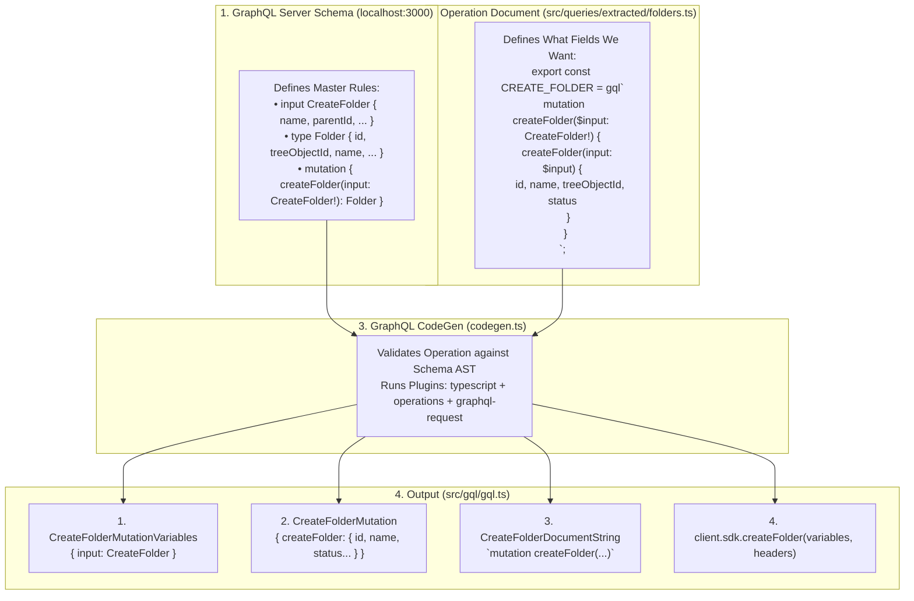

Searched for "CreateFolderMutation"
Searched for "export type CreateFolderMutation ="
Viewed gql.ts:30910-30935

## Part 1: How `src/queries` Defines the Folder Schema to `src/gql/gql.ts`

To understand how [`src/queries/extracted/folders.ts`](file:///home/huycao/Repos/veritone-drug/core-graphql-server/citest/tools/graphql-api/src/queries/extracted/folders.ts) generates types and SDK methods in [`src/gql/gql.ts`](file:///home/huycao/Repos/veritone-drug/core-graphql-server/citest/tools/graphql-api/src/gql/gql.ts), consider the **3-way bridge**:



### The 4 Items Generated in `gql.ts` from `CREATE_FOLDER`:

1. **The Input Variable Type**:
   ```typescript
   export type CreateFolderMutationVariables = Exact<{
     input: CreateFolder;
   }>;
   ```
2. **The Response Payload Type**:
   ```typescript
   export type CreateFolderMutation = {
     __typename?: 'Mutation';
     createFolder?: {
       __typename?: 'Folder';
       id: string;
       treeObjectId: string;
       name?: string | null;
       description?: string | null;
       status?: FolderStatus | null;
       parent?: { __typename?: 'Folder'; id: string } | null;
       // ...
     } | null;
   };
   ```
3. **The Constant Document String**:
   ```typescript
   export const CreateFolderDocumentString = `
     mutation createFolder($input: CreateFolder!) {
       createFolder(input: $input) { id treeObjectId name ... }
     }
   `;
   ```
4. **The Callable SDK Function on `getSdk`**:
   ```typescript
   createFolder(variables: CreateFolderMutationVariables, requestHeaders?: GraphQLClientRequestHeaders) {
     return withWrapper(
       (wrappedRequestHeaders) => client.rawRequest<CreateFolderMutation>(
         CreateFolderDocumentString, variables, { ...requestHeaders, ...wrappedRequestHeaders }
       ),
       'createFolder',
       'mutation',
       variables
     );
   }
   ```

---

## Part 2: Instructions to Create 3 New Folders Continuously

Depending on your QA test goal, there are two standard ways to create 3 folders:

### Pattern A: Sequential / Nested Creation using `client.sdk.createFolder` (Standard QA Workflow)
This is the most common pattern in tests like [`folderUserRbac.spec.ts`](file:///home/huycao/Repos/veritone-drug/core-graphql-server/citest/tools/graphql-api/test/folder/RBAC/folderUserRbac.spec.ts):

#### Step 1: Create 3 Folders Sequentially in Test Spec
```typescript
it('should create 3 folders continuously (Parent -> Child -> Grandchild)', async () => {
  // Folder 1: Parent under CMS Root
  const res1 = await superClient.sdk.createFolder({
    input: {
      name: `${citestMarker}-Level-1-${uuidv4()}`,
      description: 'First folder',
      parentId: cmsRootFolderId,
      rootFolderType: RootFolderType.Cms
    }
  }, regularOptions);
  const folder1Id = res1.data?.createFolder?.id!;
  expect(folder1Id).toBeDefined();

  // Folder 2: Child under Folder 1
  const res2 = await superClient.sdk.createFolder({
    input: {
      name: `${citestMarker}-Level-2-${uuidv4()}`,
      description: 'Second folder nested in Level 1',
      parentId: folder1Id,
      rootFolderType: RootFolderType.Cms
    }
  }, regularOptions);
  const folder2Id = res2.data?.createFolder?.id!;
  expect(folder2Id).toBeDefined();

  // Folder 3: Grandchild under Folder 2
  const res3 = await superClient.sdk.createFolder({
    input: {
      name: `${citestMarker}-Level-3-${uuidv4()}`,
      description: 'Third folder nested in Level 2',
      parentId: folder2Id,
      rootFolderType: RootFolderType.Cms
    }
  }, regularOptions);
  const folder3Id = res3.data?.createFolder?.id!;
  expect(folder3Id).toBeDefined();
});
```

---

### Pattern B: Defining a Single Multi-Folder Mutation in `src/queries/extracted/folders.ts` using GraphQL Aliases
If you want a **single GraphQL network request** that creates 3 folders simultaneously on the server:

#### Step 1: Add the Mutation to [`src/queries/extracted/folders.ts`](file:///home/huycao/Repos/veritone-drug/core-graphql-server/citest/tools/graphql-api/src/queries/extracted/folders.ts)
Open `folders.ts` and append:

```typescript
export const CREATE_THREE_FOLDERS = gql`
  mutation createThreeFolders(
    $input1: CreateFolder!
    $input2: CreateFolder!
    $input3: CreateFolder!
  ) {
    folder1: createFolder(input: $input1) {
      id
      treeObjectId
      name
      status
    }
    folder2: createFolder(input: $input2) {
      id
      treeObjectId
      name
      status
    }
    folder3: createFolder(input: $input3) {
      id
      treeObjectId
      name
      status
    }
  }
`;
```

#### Step 2: Regenerate the SDK
Run the CodeGen command from `citest/tools/graphql-api`:
```bash
bun run codegen
```
CodeGen will read `CREATE_THREE_FOLDERS` and automatically add `client.sdk.createThreeFolders(...)` into `src/gql/gql.ts`.

#### Step 3: Execute in Your Test File
```typescript
it('should create 3 folders in a single batch request', async () => {
  const batchRes = await superClient.sdk.createThreeFolders({
    input1: {
      name: `${citestMarker}-Batch-Folder-1`,
      parentId: cmsRootFolderId,
      rootFolderType: RootFolderType.Cms
    },
    input2: {
      name: `${citestMarker}-Batch-Folder-2`,
      parentId: cmsRootFolderId,
      rootFolderType: RootFolderType.Cms
    },
    input3: {
      name: `${citestMarker}-Batch-Folder-3`,
      parentId: cmsRootFolderId,
      rootFolderType: RootFolderType.Cms
    }
  }, regularOptions);

  expect(batchRes.status).toBe(200);
  expect(batchRes.data?.folder1?.id).toBeDefined();
  expect(batchRes.data?.folder2?.id).toBeDefined();
  expect(batchRes.data?.folder3?.id).toBeDefined();
});
```

---

### Summary Table: Which Pattern to Use?

| Scenario | Pattern | Advantage |
| :--- | :--- | :--- |
| **Parent $\rightarrow$ Child $\rightarrow$ Grandchild hierarchy** | **Pattern A (Sequential `sdk.createFolder`)** | Folder 2 requires Folder 1's `id` as `parentId`, so requests must run in series. |
| **Bulk sibling folders (1 network round-trip)** | **Pattern B (GraphQL Aliased Mutation)** | Creates 3 independent folders under the same root in a single HTTP request. |