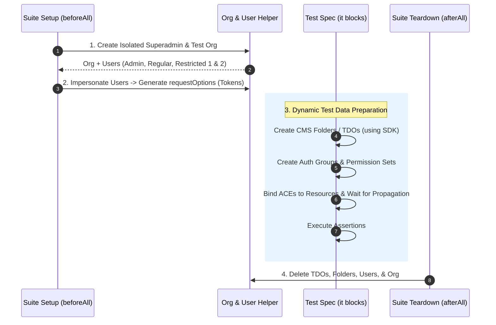

# Test Data Preparation Strategies in `folderUserRbac.spec.ts`

> **Audience**: Super Beginner QA Engineers & Automation Engineers joining the Veritone GraphQL API testing team  
> **Target Spec File**: [`test/folder/RBAC/folderUserRbac.spec.ts`](file:///home/huycao/Repos/veritone-drug/core-graphql-server/citest/tools/graphql-api/test/folder/RBAC/folderUserRbac.spec.ts)  
> **Helper Modules**:  
> - [`src/helpers/organization.helper.ts`](file:///home/huycao/Repos/veritone-drug/core-graphql-server/citest/tools/graphql-api/src/helpers/organization.helper.ts)  
> - [`src/helpers/superadminSession.ts`](file:///home/huycao/Repos/veritone-drug/core-graphql-server/citest/tools/graphql-api/src/helpers/superadminSession.ts)  
> - [`src/helpers/rbacPropagation.ts`](file:///home/huycao/Repos/veritone-drug/core-graphql-server/citest/tools/graphql-api/src/helpers/rbacPropagation.ts)  
> **Author**: Senior API QA Lead  

---

## Table of Contents
1. [Overview & Data Lifecycle Architecture](#1-overview--data-lifecycle-architecture)
2. [Suite-Level Bootstrapping (`beforeAll`)](#2-suite-level-bootstrapping-beforeall)
   - [A. Superadmin Session Isolation](#a-superadmin-session-isolation)
   - [B. Multi-Role Organization Provisioning](#b-multi-role-organization-provisioning)
   - [C. User Impersonation & Token Swapping](#c-user-impersonation--token-swapping)
3. [Dynamic Resource Data Preparation](#3-dynamic-resource-data-preparation)
   - [A. Folder & TDO Hierarchy Creation](#a-folder--tdo-hierarchy-creation)
   - [B. Data Registries, Schemas & SDO Provisioning](#b-data-registries-schemas--sdo-provisioning)
   - [C. Collision Prevention & Unique Naming](#c-collision-prevention--unique-naming)
4. [RBAC & Access Control Data Preparation](#4-rbac--access-control-data-preparation)
   - [A. Custom Auth Groups & Permission Sets](#a-custom-auth-groups--permission-sets)
   - [B. Access Control Entry (ACE) Binding](#b-access-control-entry-ace-binding)
   - [C. Asynchronous RBAC Propagation Handling](#c-asynchronous-rbac-propagation-handling)
   - [D. Default Auth Group Stripping & Cleanup Restoration](#d-default-auth-group-stripping--cleanup-restoration)
5. [Teardown & Cleanup Strategies (`afterAll`)](#5-teardown--cleanup-strategies-afterall)
6. [Summary Reference Matrix for QA Engineers](#6-summary-reference-matrix-for-qa-engineers)

---

## 1. Overview & Data Lifecycle Architecture

In integration and Role-Based Access Control (RBAC) testing, test cases cannot rely on pre-existing static database records. Static data leads to flaky tests, ordering dependencies, and data contamination across parallel runs.

[`folderUserRbac.spec.ts`](file:///home/huycao/Repos/veritone-drug/core-graphql-server/citest/tools/graphql-api/test/folder/RBAC/folderUserRbac.spec.ts) uses a **4-phase automated data lifecycle**:



---

## 2. Suite-Level Bootstrapping (`beforeAll`)

Before any individual test case runs, the suite provisions an isolated environment containing an Organization and 4 distinct user accounts.

### A. Superadmin Session Isolation

To prevent test execution from modifying global superadmin tokens or polluting shared state:

```typescript
// Line 66-71
const bootstrapClient = await createGraphqlClient(AuthType.SESSION_TOKEN, env);
isolatedSuperadmin = await createIsolatedSuperadmin(bootstrapClient);
superClient = isolatedSuperadmin.client;
```

`createIsolatedSuperadmin` generates a temporary, single-use superadmin token (`isolatedSuperadmin.token`). All administrative setup commands execute through `superClient`.

---

### B. Multi-Role Organization Provisioning

The suite uses `setupTestOrgAndUser(...)` to dynamically provision an Organization containing specific user personas:

```typescript
// Line 85
testSetup = await setupTestOrgAndUser(superClient, createOrgAndUserInput);
testOrg = testSetup.org;
```

`createOrgAndUserInput` defines 4 distinct users:
1. **`-admin-user-`**: Organization Admin (has administrative access to manage groups, permissions, and delete resources).
2. **`-regular-user-`**: Standard User (has standard read/write access to CMS objects).
3. **`-first-restrict-user-`**: Restricted User 1 (used for negative authorization tests).
4. **`-second-restrict-user-`**: Restricted User 2 (used for cross-user resource isolation checks).

---

### C. User Impersonation & Token Swapping

To execute GraphQL requests *as* a specific user (without destroying the client connection), `folderUserRbac.spec.ts` uses the `impersonateUser` helper:

```typescript
// Line 51-61
async function impersonateUser(userId: string, organizationGuid: string): Promise<Record<string, string>> {
  const impersonated = await impersonateUserHelper(
    isolatedSuperadmin.token,
    userId,
    organizationGuid
  );
  return impersonated.requestOptions; // <-- Returns header object with User Session Token!
}
```

This populates `adminOptions`, `regularOptions`, `restrictOptions`, and `secondRestrictOptions`, which are passed as the 2nd argument to SDK methods:

```typescript
// Example: Creating folder AS REGULAR USER
await superClient.sdk.createFolder({ input: { ... } }, regularOptions);
```

---

## 3. Dynamic Resource Data Preparation

### A. Folder & TDO Hierarchy Creation

Tests dynamically build folder trees and Temporal Data Objects (TDOs) on demand:

1. **Find Root CMS Folder**:
   ```typescript
   // Line 151
   const rootFoldersRes = await superClient.sdk.rootFolders({ rootFolderType: RootFolderType.Cms }, regularOptions);
   cmsRootFolderId = rootFoldersRes.data.rootFolders[0]?.id;
   ```
2. **Create Target Folder**:
   ```typescript
   // Line 165
   const createFolderRes = await superClient.sdk.createFolder({
     input: {
       name: `${citestMarker}-folder-${uuidv4()}`,
       parentId: cmsRootFolderId,
       rootFolderType: RootFolderType.Cms
     }
   }, regularOptions);
   ```
3. **Create Target TDO Inside Folder**:
   ```typescript
   // Line 186
   const res = await superClient.sdk.createTDO({
     input: {
       status: 'uploaded',
       name: `${citestMarker}-tdo-${uuidv4()}`,
       parentFolderId: newFolderId,
       startDateTime: 1476726655,
       stopDateTime: 1476726655
     }
   }, regularOptions);
   ```

---

### B. Data Registries, Schemas & SDO Provisioning

When testing metadata and Structured Data Objects (SDO):

1. **Create Data Registry**: `superClient.sdk.createDataRegistry(...)` (Line 266)
2. **Create & Publish Schema**: `superClient.sdk.createSchema({ input: { dataRegistryId, status: 'published', definition: { ... } } }, adminOptions)` (Line 286)
3. **Instantiate SDO**: `superClient.sdk.createStructuredData({ input: { schemaId, data: { name: 'test SDO' } } }, regularOptions)` (Line 314)
4. **Bind SDO to Folder/TDO**:
   - `createFolderContentTemplate({ input: { folderId, sdoId, schemaId } })` (Line 354)
   - Or inline when creating TDO: `createTDO({ input: { contentTemplates: [{ sdoId, schemaId }] } })` (Line 393)

---

### C. Collision Prevention & Unique Naming

Every dynamically generated resource includes two key elements:
- `citestMarker` (`citest-should-delete`): Enables fallback cleanup scripts to identify orphaned test data.
- `uuidv4()` (`uuidv4()`): Guarantees unique names across concurrent test executions.

```typescript
const folderName = `${citestMarker}-folder-${uuidv4()}`;
```

---

## 4. RBAC & Access Control Data Preparation

RBAC tests require setting up permission models (Groups, Permission Sets, ACEs) before asserting access rights.

### A. Custom Auth Groups & Permission Sets

1. **Create Auth Group**:
   ```typescript
   // Line 565
   const groupRes = await superClient.sdk.CreateAuthGroup({
     input: { name: `${citestMarker}-auth-group-${uuidv4()}` }
   }, adminOptions);
   ```
2. **Add Users to Group**:
   ```typescript
   // Line 585
   await superClient.sdk.authGroupAddMembers({
     id: newAuthGroup.id,
     members: [{ id: regularUserId, memberType: AuthGroupMemberType.User }]
   }, adminOptions);
   ```
3. **Create Permission Set**:
   ```typescript
   // Line 603
   const permRes = await superClient.sdk.authPermissionSetCreate({
     input: {
       name: `${citestMarker}-perm-set-${uuidv4()}`,
       permissions: [
         AuthPermissionType.AiwareTdoCreate,
         AuthPermissionType.AiwareTdoRead,
         AuthPermissionType.AiwareFolderRead
       ]
     }
   }, adminOptions);
   ```

---

### B. Access Control Entry (ACE) Binding

To grant an Auth Group or User access to a specific Folder or TDO:

```typescript
// Line 646
await superClient.sdk.addACEsToResources({
  ids: [newFolderId],
  resourceType: AuthResourceType.Folder,
  entries: [
    {
      member: { id: newAuthGroup.id, memberType: AuthGroupMemberType.Group },
      permissionSetID: newAuthPermissionSet.id
    }
  ]
}, adminOptions);
```

---

### C. Asynchronous RBAC Propagation Handling

Because RBAC permission changes are synchronized asynchronously across microservices in the backend, permissions may not be effective immediately after the `addACEsToResources` mutation returns.

The suite uses propagation helpers from `rbacPropagation.ts`:

```typescript
// Line 745
const restrictedRegularOptions = await waitForAuthGroupMembership(
  superClient,
  () => impersonateUser(regularUserId, testOrg.guid),
  { expectAbsent: defaultGroupIds, label: 'regular user' }
);
```

`waitForAuthGroupMembership` continuously polls the user's session token until the expected group memberships/permissions are reflected in the JWT claims.

---

### D. Default Auth Group Stripping & Cleanup Restoration

To test negative authorization (e.g. verifying that a user *cannot* perform an action without a permission):

1. **Strip Default Groups**: Remove user from default organization groups using `authGroupRemoveMembers`.
2. **Poll for Propagation**: `waitForAuthGroupMembership(..., { expectAbsent: defaultGroupIds })`.
3. **Execute Assertion**: Expect mutation call to reject with permission error.
4. **Restore Groups in `finally` Block**:
   ```typescript
   // Line 787
   finally {
     for (const groupId of defaultGroupIds) {
       await superClient.sdk.authGroupAddMembers({ id: groupId, members: [...] }, adminOptions);
     }
     await safe('restore regular user default groups', () =>
       waitForAuthGroupMembership(superClient, () => impersonateUser(regularUserId, testOrg.guid), {
         expectPresent: defaultGroupIds,
         timeoutMs: 20000
       })
     );
   }
   ```
   > 💡 **Why `finally` + `safe()` matters**: Using `finally` guarantees that default groups are restored even if the test assertion fails. Wrapping in `safe()` prevents teardown errors from replacing the actual test failure message.

---

## 5. Teardown & Cleanup Strategies (`afterAll`)

To maintain environment hygiene, `folderUserRbac.spec.ts` implements thorough cleanup in `afterAll()`:

```typescript
afterAll(async () => {
  // 1. Delete all test users
  if (testSetup?.listOptions?.length) {
    await safe('delete users', async () => {
      for (const user of testSetup.listOptions) {
        await superClient.sdk.deleteUser({ id: user.userId });
      }
    });
  }

  // 2. Delete test organization
  if (testOrg?.id) {
    await safe('delete organization', () =>
      helpers.deleteOrganization(superClient.authUrl, testOrg.id, isolatedSuperadmin.token)
    );
  }

  // 3. Clean up superadmin session token
  await safe('cleanup isolated superadmin', () => isolatedSuperadmin.cleanup());
});
```

---

## 6. Summary Reference Matrix for QA Engineers

| Data Prep Task | Helper / SDK Call | File Reference |
| :--- | :--- | :--- |
| **Superadmin Token Isolation** | `createIsolatedSuperadmin(bootstrapClient)` | [`superadminSession.ts`](file:///home/huycao/Repos/veritone-drug/core-graphql-server/citest/tools/graphql-api/src/helpers/superadminSession.ts) |
| **Org & User Setup** | `setupTestOrgAndUser(superClient, input)` | [`organization.helper.ts`](file:///home/huycao/Repos/veritone-drug/core-graphql-server/citest/tools/graphql-api/src/helpers/organization.helper.ts) |
| **User Impersonation** | `impersonateUserHelper(token, userId, orgGuid)` | [`commonHelper.ts`](file:///home/huycao/Repos/veritone-drug/core-graphql-server/citest/tools/graphql-api/src/helpers/commonHelper.ts) |
| **Folder / TDO Fixtures** | `sdk.createFolder()`, `sdk.createTDO()` | [`folderUserRbac.spec.ts:L165`](file:///home/huycao/Repos/veritone-drug/core-graphql-server/citest/tools/graphql-api/test/folder/RBAC/folderUserRbac.spec.ts#L165) |
| **RBAC Group & ACE Fixtures** | `sdk.CreateAuthGroup()`, `sdk.addACEsToResources()` | [`folderUserRbac.spec.ts:L565`](file:///home/huycao/Repos/veritone-drug/core-graphql-server/citest/tools/graphql-api/test/folder/RBAC/folderUserRbac.spec.ts#L565) |
| **RBAC Propagation Wait** | `waitForAuthGroupMembership(superClient, ...)` | [`rbacPropagation.ts`](file:///home/huycao/Repos/veritone-drug/core-graphql-server/citest/tools/graphql-api/src/helpers/rbacPropagation.ts) |
| **Fault-Tolerant Teardown** | `safe('label', async () => { ... })` | [`commonHelper.ts`](file:///home/huycao/Repos/veritone-drug/core-graphql-server/citest/tools/graphql-api/src/helpers/commonHelper.ts) |
