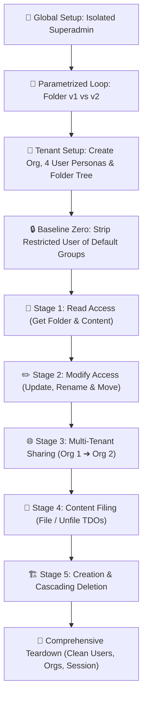
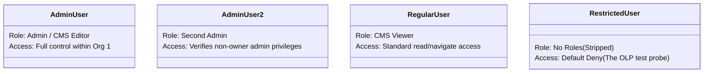

Viewed api-test-case-format.md:1-800
Viewed folderOlp.spec.ts:1-800
Viewed folderOlp.spec.ts:800-1599
Viewed folderOlp.spec.ts:1600-2257
Listed directory graphql-api
Listed directory src
Listed directory helpers
Viewed organization.helper.ts:1-134
Viewed superadminSession.ts:1-191
Viewed rbacPropagation.ts:1-254
Viewed commonHelper.ts:1-44
Viewed graphqlUtil.ts:1-273
Viewed business.OLP.md:1-100

Welcome to the world of API & RBAC/OLP testing!

Think of [`folderOlp.spec.ts`](file:///home/huycao/Repos/veritone-drug/core-graphql-server/citest/tools/graphql-api/test/folder/RBAC/folderOlp.spec.ts) as an **end-to-end security proving ground**. Its purpose is to verify that **Object-Level Permissions (OLP)** (also known as fine-grained access control) work properly across all folder operations in the system.

Here is the breakdown designed for beginners, structured into the 4 requested sections.

---

# 1. Workflow of Progression

The test file follows a progressive **"Zero-Access $\rightarrow$ Incremental Rights Expansion $\rightarrow$ Cross-Tenant Isolation $\rightarrow$ Full Lifecycle Teardown"** story.



---

### Step-by-Step Execution Lifecycle

| Phase | What Happens | Why It's Done |
| :--- | :--- | :--- |
| **0. Global Setup** | Creates a throwaway **Isolated Superadmin** session using [`createIsolatedSuperadmin`](file:///home/huycao/Repos/veritone-drug/core-graphql-server/citest/tools/graphql-api/test/helpers/superadminSession.ts). | Prevents deleting test organizations from accidentally invalidating the shared CI superadmin token. |
| **1. Dual-Version Matrix** | Runs all tests twice via `describe.each(['v1', 'v2'])`. | Validates backwards compatibility for legacy folders (`v1`) and tree-based folders (`v2`). |
| **2. Organization & User Provisioning** | Calls [`setupTestOrgAndUser`](file:///home/huycao/Repos/veritone-drug/core-graphql-server/citest/tools/graphql-api/test/helpers/organization.helper.ts) with `enableRBACFeature: 'enabled'`. Creates 4 personas (`adminUser`, `adminUser2`, `regularUser`, `restrictedUser`). | Builds an isolated sandbox with distinct user privilege tiers. |
| **3. Seed Folder Tree** | Admin user creates root folders, parent folders, child folders, and files sample video media (`TDO`s) inside them. | Sets up the target folder structure to test access against. |
| **4. Strip Default Access** | Removes `restrictedUser` from any default groups and waits for session sync via [`waitForAuthGroupMembership`](file:///home/huycao/Repos/veritone-drug/core-graphql-server/citest/tools/graphql-api/test/helpers/rbacPropagation.ts). | Enforces a true **"Default Deny"** baseline for testing granular grants. |
| **5. Stage 1: Read Progression** | - Verifies Admin/CMS user can view folders.<br>- Verifies Restricted User is blocked (HTTP 403 / `No authorization access`).<br>- Grants `AiwareFolderRead` & `AiwareTdoRead` via **Access Control Entries (ACEs)**.<br>- Verifies Restricted User can now read parent folder and shared content. | Tests that permissions are denied by default and unlocked strictly when explicit ACEs are granted. |
| **6. Stage 2: Update & Move Progression** | - Verifies Admins can rename/move folders.<br>- Tests folder hierarchy rules (e.g., cannot move a parent folder into its own child).<br>- Verifies Restricted User cannot edit until granted `AiwareFolderUpdate`. | Proves mutation safety and checks that write rights are checked independently of read rights. |
| **7. Stage 3: Cross-Org Sharing** | - Creates a 2nd organization (`Org2`).<br>- Verifies standard users cannot cross org boundaries.<br>- SuperAdmin shares folder with Read-only / Write permissions.<br>- Verifies Org 2 can see shared folder and add their own content, but Org 1 cannot see Org 2's private items. | Tests multi-tenant isolation and collaborative cross-organization access control. |
| **8. Stage 4: Filing & Unfiling Content** | - Tests filing and unfiling media items (`TDO`s) into folders.<br>- Tests user permission boundaries on content owned by other users. | Ensures folder organization mutations require valid permissions on both the folder and the media asset. |
| **9. Stage 5: Creation & Deletion** | - Grants `AiwareFolderCreate` / `AiwareFolderDelete`.<br>- Tests user creating subfolders and deleting owned folders.<br>- Tests root folder deletion protections and folder cascade deletion. | Ensures users cannot destroy shared root folders or delete folders without explicit deletion rights. |
| **10. Teardown** | Loops through all created users and deletes them, soft-deletes both test organizations, and tears down the isolated superadmin. | Leaves the database clean with zero orphaned records or memory leaks. |

---

# 2. Components of Progression

Understanding the core building blocks helps demystify the entire test suite:

### 1. The Core OLP (Object-Level Permission) Building Blocks

```
+-------------------------------------------------------------------------+
|                                  ACE                                    |
|                       (Access Control Entry)                            |
|                                                                         |
|   [WHO]                      [WHAT]                         [WHERE]     |
|  AuthGroup / User   +   AuthPermissionSet    ===>    Target Resource ID |
| (restrictedUser)       (AiwareFolderRead)                (Folder 123)   |
+-------------------------------------------------------------------------+
```

1. **Target Resource (`AuthResourceType`)**: The object being protected (e.g. `AuthResourceType.Folder`, `AuthResourceType.Tdo`, `AuthResourceType.Organization`).
2. **Auth Group (`AuthGroup`)**: A container of users who share permissions.
3. **Auth Permission Set (`AuthPermissionSet`)**: A bundle of capabilities (e.g., `AiwareFolderRead`, `AiwareFolderCreate`, `AiwareFolderUpdate`, `AiwareFolderDelete`, `AiwareFolderFile`).
4. **Access Control Entry (ACE)**: The "glue" record connecting an `AuthGroup` or `User` to a specific resource ID with an `AuthPermissionSet`.

---

### 2. The 4 User Personas

Each test suite uses 4 simulated users to compare behavior across permission levels:



* **`adminUser`**: The owner/creator of the initial test data.
* **`adminUser2`**: A secondary administrator to verify that admin rights apply organization-wide, not just to the creator.
* **`regularUser` (CMS Viewer)**: Represents normal day-to-day business users who have app roles but no admin rights.
* **`restrictedUser`**: Has zero roles. It starts with **no access to anything** and is incrementally granted permissions via ACEs to prove that each permission bit works.

---

### 3. The Dynamic Context Object (`OlpTestContext`)

Because tests run in nested sub-suites, data (such as folder IDs, user tokens, and permission set IDs) is shared using a TypeScript context object with **getters and setters**:

```typescript
interface OlpTestContext {
  testSetup: any;
  testOrg: any;
  adminUser: any;
  restrictedUser: any;
  adminOptions: any;       // Headers with Admin Bearer Token
  restrictedOptions: any; // Headers with Restricted User Bearer Token
  testFolderData: any;    // Holds parentFolderId, childFolderId, tdoId, etc.
  rbac: any;              // Holds authGroupId, authPermissionSetId, etc.
  relogin: (userId: string, orgGuid: string) => Promise<any>;
}
```

---

### 4. Cache Propagation & Authz Probing

> [!NOTE]
> When permissions or group memberships change in the backend, Redis caches and user session tokens do not update instantaneously.

The test file handles this in two ways:
1. **`waitForAuthGroupMembership`**: Repeatedly re-logs in the user until the session token confirms the new group memberships.
2. **Authz Probing Loop (e.g., FO71)**: Before deleting a real test folder, it creates and deletes a disposable "probe" folder to ensure the authorization cache has warmed up.

---

# 3. Related Files and Their Functions

Here is the map of all supporting files and how they work together:

```
citest/tools/graphql-api/
├── test/
│   ├── folder/RBAC/
│   │   └── folderOlp.spec.ts            <-- [Target Spec File]
│   └── helpers/
│       ├── organization.helper.ts       <-- Creates test Orgs, Users & Auth Headers
│       ├── superadminSession.ts         <-- Creates isolated throwaway SuperAdmin
│       └── rbacPropagation.ts           <-- Handles async Redis cache polling
└── src/
    ├── graphqlUtil.ts                   <-- GraphQL Client & Token Management
    ├── gql/gql.ts                       <-- Auto-generated typed SDK queries & mutations
    └── helpers/
        ├── commonHelper.ts              <-- safe() cleanup & impersonateUser()
        └── index.ts                     <-- System configuration & helper utilities
```

### File Details

1. **[`folderOlp.spec.ts`](file:///home/huycao/Repos/veritone-drug/core-graphql-server/citest/tools/graphql-api/test/folder/RBAC/folderOlp.spec.ts)**
   * **Role**: The main test spec containing ~77 individual test scenarios covering Read, Update, Move, Share, File, Create, and Delete operations for both Folder `v1` and `v2`.

2. **[`organization.helper.ts`](file:///home/huycao/Repos/veritone-drug/core-graphql-server/citest/tools/graphql-api/test/helpers/organization.helper.ts)**
   * **Function**: `setupTestOrgAndUser(gqlClient, input)`
   * **Role**: Provisions a new Organization with custom feature flags (`enableRBACFeature: 'enabled'`), creates users, and logs them in to generate ready-to-use HTTP request headers (`requestOptions`).

3. **[`superadminSession.ts`](file:///home/huycao/Repos/veritone-drug/core-graphql-server/citest/tools/graphql-api/test/helpers/superadminSession.ts)**
   * **Function**: `createIsolatedSuperadmin(bootstrapClient)`
   * **Role**: Creates a brand-new, single-use superadmin user and organization. This prevents CI shard test cross-talk where deleting a test org could kill the global superadmin session token.

4. **[`rbacPropagation.ts`](file:///home/huycao/Repos/veritone-drug/core-graphql-server/citest/tools/graphql-api/test/helpers/rbacPropagation.ts)**
   * **Functions**: `waitForAuthGroupMembership`, `pollUntilReady`
   * **Role**: Polls the backend until asynchronous Redis cache invalidations settle, eliminating race conditions and flaky tests.

5. **[`commonHelper.ts`](file:///home/huycao/Repos/veritone-drug/core-graphql-server/citest/tools/graphql-api/src/helpers/commonHelper.ts)**
   * **Functions**:
     * `safe(label, fn)`: Runs teardown actions inside a `try/catch` block so a failure in one cleanup step does not stop subsequent cleanup steps.
     * `impersonateUser(superToken, userId, orgGuid)`: Generates a fresh session token for any user without needing their raw password.

6. **[`graphqlUtil.ts`](file:///home/huycao/Repos/veritone-drug/core-graphql-server/citest/tools/graphql-api/src/graphqlUtil.ts)**
   * **Function**: `createGraphqlClient(AuthType, env)`
   * **Role**: Initialises the GraphQL client and exposes the typed `gqlClient.sdk` methods.

7. **[`gql.ts`](file:///home/huycao/Repos/veritone-drug/core-graphql-server/citest/tools/graphql-api/src/gql/gql.ts)** (and [`codegen.ts`](file:///home/huycao/Repos/veritone-drug/core-graphql-server/citest/tools/graphql-api/codegen.ts))
   * **Role**: Auto-generated GraphQL SDK created via GraphQL Code Generator. Provides full TypeScript types and auto-complete for all mutations, queries, and enums (`AuthPermissionType`, `AuthResourceType`, etc.).

---

# 4. Skeleton Example for Future Reuse

When you need to write a new OLP test (e.g., for **SDO**, **Watchlists**, **Collections**, or **Custom Applications**), you can copy and adapt this clean starter template:

```typescript
import { v4 as uuidv4 } from 'uuid';

import { helpers } from '@api/src/helpers';
import { impersonateUser, safe } from '@api/src/helpers/commonHelper';
import { waitForAuthGroupMembership } from '@api/test/helpers/rbacPropagation';
import {
  createGraphqlClient,
  AuthType,
  GraphqlClient
} from '@api/src/graphqlUtil';
import { setupTestOrgAndUser } from '@api/test/helpers/organization.helper';
import { createIsolatedSuperadmin } from '@api/test/helpers/superadminSession';
import {
  AuthGroupMemberType,
  AuthPermissionType,
  AuthResourceType,
  OrganizationStatus
} from '@api/src/gql';

const config = helpers.config;
const citestMarker = (global as any).citestMarker ?? 'citest-should-delete';

let gqlClient: GraphqlClient;
let isolatedSuperadmin: Awaited<ReturnType<typeof createIsolatedSuperadmin>>;
let superToken: string;

describe('citest_custom_feature: OLP test suite', () => {
  // -------------------------------------------------------------
  // 1. GLOBAL BOOTSTRAP: Isolated Superadmin
  // -------------------------------------------------------------
  beforeAll(async () => {
    gqlClient = await createGraphqlClient(AuthType.SESSION_TOKEN, config.env);
    isolatedSuperadmin = await createIsolatedSuperadmin(gqlClient);
    superToken = isolatedSuperadmin.token;
  });

  afterAll(async () => {
    await safe('cleanup isolated superadmin', () =>
      isolatedSuperadmin.cleanup()
    );
  });

  // -------------------------------------------------------------
  // 2. TEST CONTEXT & HOOKS
  // -------------------------------------------------------------
  describe('Feature OLP Progression', () => {
    let testSetup: any;
    let testOrg: any;
    let adminUser: any;
    let restrictedUser: any;
    let adminOptions: Record<string, string>;
    let restrictedOptions: Record<string, string>;
    let targetResourceId: string;
    let authGroupId: string;
    let permissionSetId: string;

    // Helper to refresh tokens after permission/group changes
    async function relogin(userId: string, orgGuid: string) {
      const imp = await impersonateUser(superToken, userId, orgGuid);
      return imp.requestOptions;
    }

    beforeAll(async () => {
      const isoClient = isolatedSuperadmin.client;

      // Provision Organization with OLP enabled & 2 test users
      testSetup = await setupTestOrgAndUser(isoClient, {
        orgInput: {
          name: `${citestMarker}-org-${uuidv4()}`,
          businessUnit: 'Testing',
          metadata: {
            features: { enableRBACFeature: 'enabled' }
          }
        },
        userInputs: [
          {
            name: `${citestMarker}-admin-${uuidv4()}@localhost`,
            password: 'testPassword',
            roleIds: ['032218c3-d47e-4287-9d16-7bb867c01266'] // Admin
          },
          {
            name: `${citestMarker}-restricted-${uuidv4()}@localhost`,
            password: 'testPassword',
            roleIds: [] // Zero roles
          }
        ]
      });

      testOrg = testSetup.org;
      adminUser = testSetup.listOptions.find((u: any) => u.userName.includes('admin'));
      restrictedUser = testSetup.listOptions.find((u: any) => u.userName.includes('restricted'));

      adminOptions = adminUser.requestOptions;
      restrictedOptions = restrictedUser.requestOptions;

      // Seed target resource as Admin (e.g. create a Folder / Item)
      const folderRes = await gqlClient.sdk.createFolder(
        {
          input: {
            name: `${citestMarker}-target-folder-${uuidv4()}`,
            description: 'OLP target'
          }
        },
        adminOptions
      );
      targetResourceId = folderRes.data.createFolder.id;

      // Strip default AuthGroup memberships from restricted user to establish "Default Deny"
      const meRes = await gqlClient.sdk.me({}, restrictedOptions);
      const defaultGroupIds = meRes?.data?.me?.authGroupIds ?? [];

      if (defaultGroupIds.length > 0) {
        await Promise.all(
          defaultGroupIds.map((id: string) =>
            gqlClient.sdk.authGroupRemoveMembers(
              { id, memberIds: [restrictedUser.userId] },
              adminOptions
            )
          )
        );

        // Wait for session cache to confirm removal
        restrictedOptions = await waitForAuthGroupMembership(
          gqlClient,
          () => relogin(restrictedUser.userId, testOrg.guid),
          { expectAbsent: defaultGroupIds, label: 'restricted user' }
        );
      }
    });

    afterAll(async () => {
      // Cleanup users and org
      for (const user of testSetup?.listOptions ?? []) {
        await safe(`delete user ${user.userId}`, () =>
          gqlClient.sdk.deleteUser(
            { id: user.userId },
            helpers.requestOptions(superToken).headers
          )
        );
      }

      if (testOrg?.id) {
        await safe(`delete testOrg ${testOrg.id}`, () =>
          isolatedSuperadmin.client.sdk.updateOrganization(
            { input: { id: testOrg.id, status: OrganizationStatus.Deleted } },
            isolatedSuperadmin.options
          )
        );
      }
    });

    // -------------------------------------------------------------
    // 3. PROGRESSIVE TEST STEPS
    // -------------------------------------------------------------

    it('Step 1: Admin can access resource', async () => {
      const res = await gqlClient.sdk.folderBasic(
        { id: targetResourceId },
        adminOptions
      );
      expect(res?.data?.folder?.id).toEqual(targetResourceId);
    });

    it('Step 2: Restricted user is denied by default (Default Deny)', async () => {
      const query = gqlClient.sdk.folderBasic(
        { id: targetResourceId },
        restrictedOptions
      );
      await expect(query).rejects.toThrow(/No authorization access|not_allowed/);
    });

    it('Step 3: Grant READ permission via AuthGroup + ACE', async () => {
      // 1. Create Auth Group with restricted user as member
      const groupRes = await gqlClient.sdk.CreateAuthGroup(
        {
          input: {
            name: `${citestMarker}-read-group-${uuidv4()}`,
            members: [
              { id: restrictedUser.userId, memberType: AuthGroupMemberType.User }
            ]
          }
        },
        adminOptions
      );
      authGroupId = groupRes?.data?.authGroupCreate?.id;

      // 2. Create Permission Set for Folder Read
      const permRes = await gqlClient.sdk.authPermissionSetCreate(
        {
          input: {
            name: `${citestMarker}-perm-read-${uuidv4()}`,
            permissions: [AuthPermissionType.AiwareFolderRead]
          }
        },
        adminOptions
      );
      permissionSetId = permRes?.data?.authPermissionSetCreate?.id;

      // 3. Bind Permission Set to target resource via ACE
      await gqlClient.sdk.addACEsToResources(
        {
          resourceType: AuthResourceType.Folder,
          ids: [targetResourceId],
          entries: [
            {
              member: { id: authGroupId, memberType: AuthGroupMemberType.Group },
              permissionSetID: permissionSetId
            }
          ]
        },
        adminOptions
      );

      // 4. Refresh restricted user session
      restrictedOptions = await relogin(restrictedUser.userId, testOrg.guid);
    });

    it('Step 4: Restricted user can now access the resource', async () => {
      const res = await gqlClient.sdk.folderBasic(
        { id: targetResourceId },
        restrictedOptions
      );
      expect(res?.data?.folder?.id).toEqual(targetResourceId);
    });
  });
});
```

---

### Summary Checklist for Writing OLP Tests
1. **Always isolate the superadmin** via `createIsolatedSuperadmin`.
2. **Enable the RBAC feature flag** on the test organization.
3. **Strip default groups** from your restricted user to verify "Default Deny".
4. **Follow the ACE formula**: `AuthGroup` + `AuthPermissionSet` $\rightarrow$ `addACEsToResources`.
5. **Always relogin/refresh the session token** after updating groups or ACEs so the session picks up the new permissions.
6. **Wrap all teardown steps in `safe()`** so test cleanup is resilient.