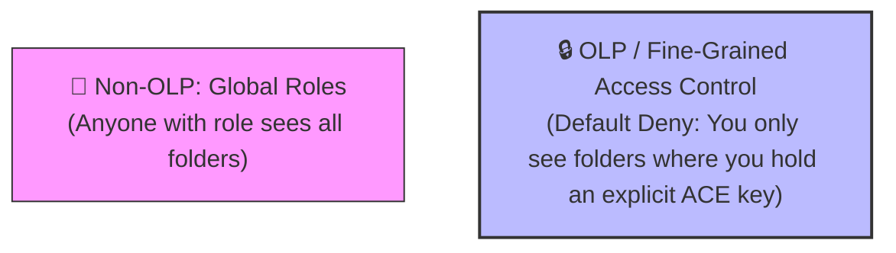
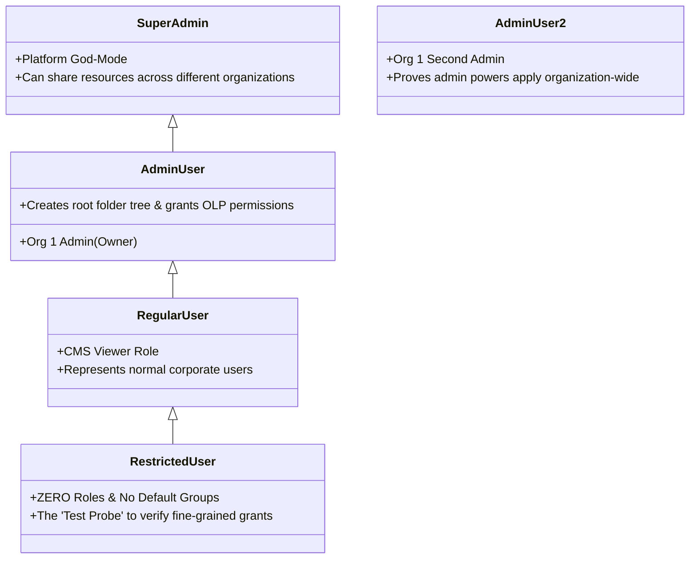
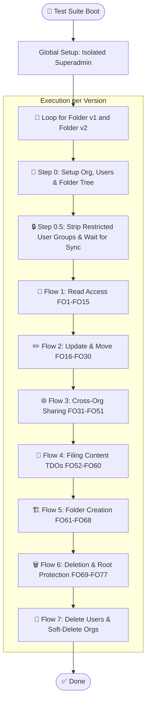
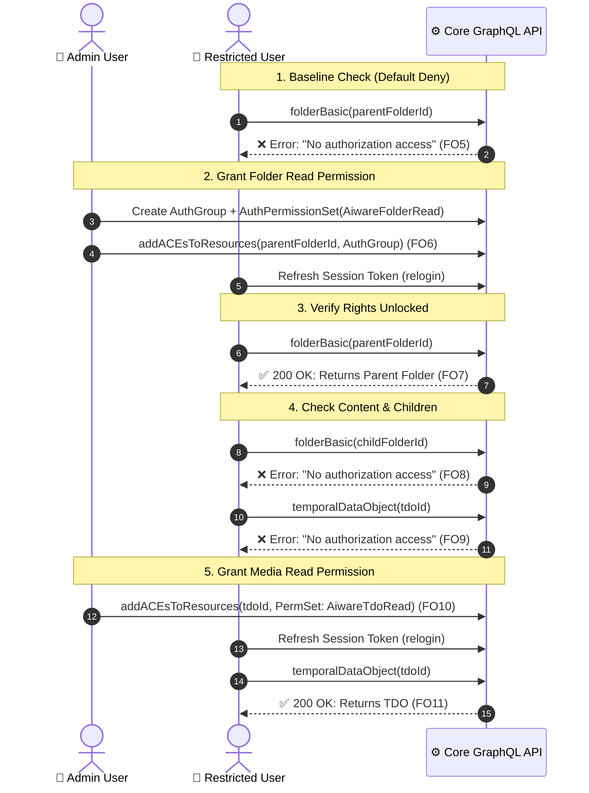
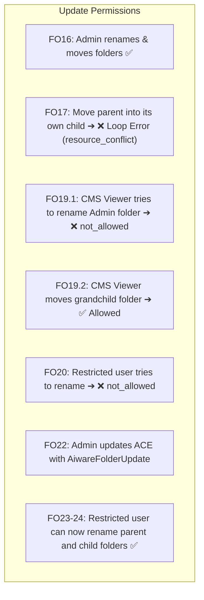
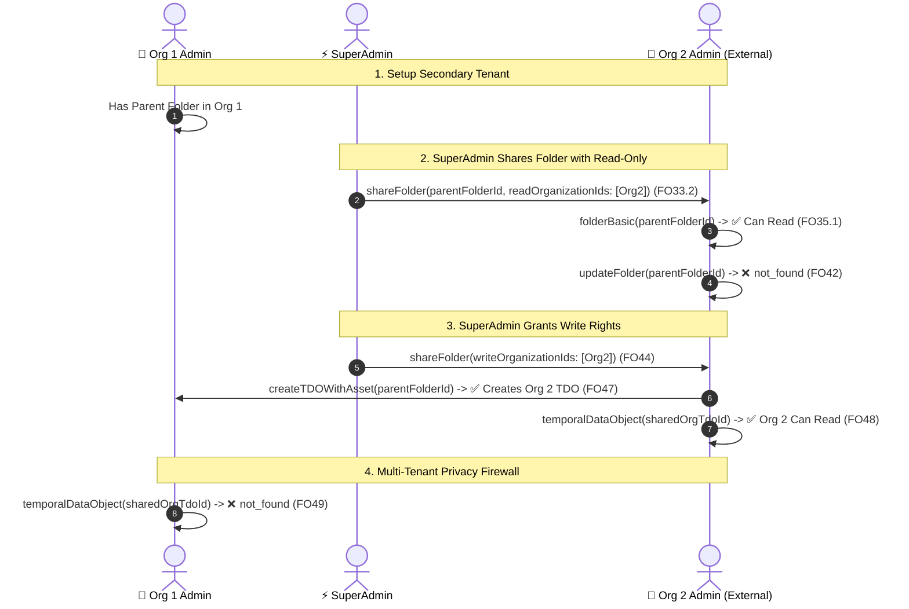
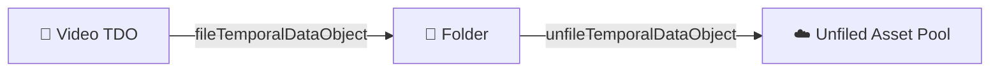
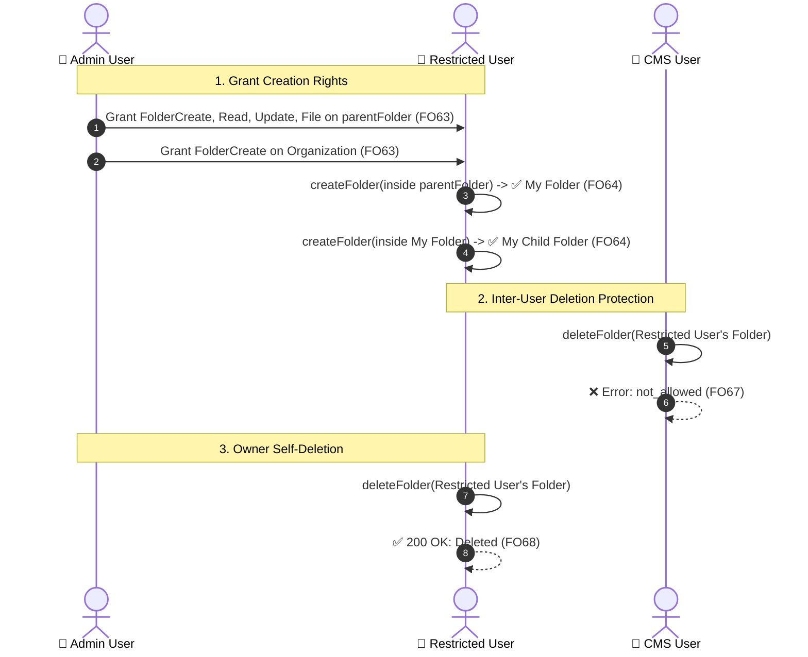
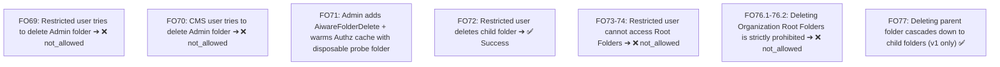
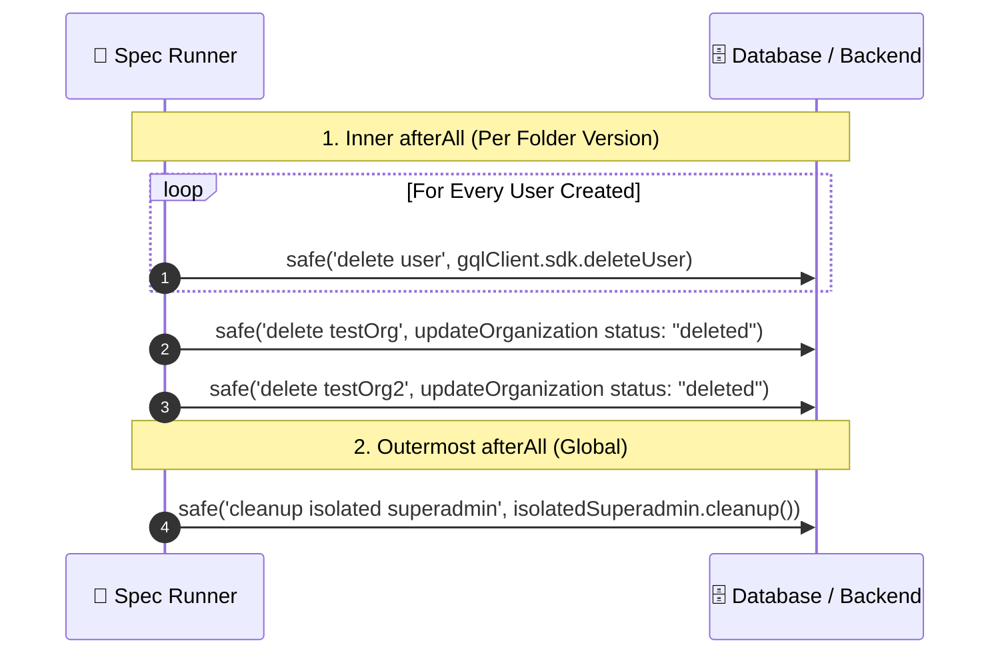

# Comprehensive Beginner's Guide to `folderOlp.spec.ts`

> **File Under Test**: [`citest/tools/graphql-api/test/folder/RBAC/folderOlp.spec.ts`](file:///home/huycao/Repos/veritone-drug/core-graphql-server/citest/tools/graphql-api/test/folder/RBAC/folderOlp.spec.ts)  
> **Topic**: Complete Deep Dive into Every Flow & Test Case for Object-Level Permissions (OLP)  
> **Audience**: Super Beginner to Intermediate QA Engineers & Developers

---

## Table of Contents
1. [The Big Picture: What is This Test File Doing?](#1-the-big-picture-what-is-this-test-file-doing)
2. [The Cast of Characters & The Test Playground](#2-the-cast-of-characters--the-test-playground)
3. [The Core OLP Formula (ACE, Permissions, Resources)](#3-the-core-olp-formula-ace-permissions-resources)
4. [Master Workflow Map](#4-master-workflow-map)
5. [Deep Dive into Every Single Flow](#5-deep-dive-into-every-single-flow)
   - [Flow 0: Global Setup & Baseline "Default Deny"](#flow-0-global-setup--baseline-default-deny)
   - [Flow 1: Reading Folders & Content (FO1 – FO15)](#flow-1-reading-folders--content-fo1--fo15)
   - [Flow 2: Updating, Renaming & Moving Folders (FO16 – FO30)](#flow-2-updating-renaming--moving-folders-fo16--fo30)
   - [Flow 3: Cross-Tenant Sharing & Multi-Organization Isolation (FO31 – FO51)](#flow-3-cross-tenant-sharing--multi-organization-isolation-fo31--fo51)
   - [Flow 4: Filing & Unfiling Media Content (TDOs) (FO52 – FO60)](#flow-4-filing--unfiling-media-content-tdos-fo52--fo60)
   - [Flow 5: Folder Creation & Sub-tree Ownership (FO61 – FO68)](#flow-5-folder-creation--sub-tree-ownership-fo61--fo68)
   - [Flow 6: Folder Deletion & Root Protection (FO69 – FO77)](#flow-6-folder-deletion--root-protection-fo69--fo77)
   - [Flow 7: The Teardown & Cleanup Protocol](#flow-7-the-teardown--cleanup-protocol)
6. [Master Test Case Reference Table (FO1 – FO77)](#6-master-test-case-reference-table-fo1--fo77)
7. [Senior Tester Insights: Why the Code is Written This Way](#7-senior-tester-insights-why-the-code-is-written-this-way)

---

# 1. The Big Picture: What is This Test File Doing?

Imagine a corporate cloud drive (like Google Drive or Dropbox for enterprises). 
- In a simple system (**Non-OLP / Role-Based**), if you have the "Employee" role, you can see **every folder** in the entire company.
- In a secure enterprise system (**OLP / Object-Level Permissions**), having an account gives you **zero access by default**. You can only see or touch a specific folder if an administrator explicitly hands you a "key" (**Access Control Entry / ACE**) to that exact folder instance.

[`folderOlp.spec.ts`](file:///home/huycao/Repos/veritone-drug/core-graphql-server/citest/tools/graphql-api/test/folder/RBAC/folderOlp.spec.ts) is a 2,250+ line automated test suite that verifies this security model across every possible user action: **Viewing, Editing, Moving, Creating, Filing Media, Sharing across Companies, and Deleting Folders**.



---

# 2. The Cast of Characters & The Test Playground

To test permissions realistically, the test file simulates a full ecosystem:

### 🏢 The Two Organizations
1. **`testOrg` (Org 1)**: The primary tenant where the folders and media live.
2. **`testOrg2` (Org 2)**: A secondary external company used to test cross-organization sharing and data isolation.

### 👤 The 5 User Personas



### 🌳 The Initial Folder Tree Hierarchy (Created by Admin)

```
[Org 1: Root Folder (CMS)]
│
├── [Parent Folder 1] (Admin Owned)
│   ├── 📄 TDO 1 (Video File)
│   │
│   └── [Child Folder 1]
│       ├── 📄 Child TDO 1
│       │
│       └── [Grandchild Folder 1]
│           └── 📄 Grandchild TDO 1
│
└── [Parent Folder 2] (Admin Owned - for multi-folder ACE checks)
```

---

# 3. The Core OLP Formula (ACE, Permissions, Resources)

Everything in OLP revolves around this equation:

$$\text{Access Control Entry (ACE)} = \text{WHO (Auth Group / User)} + \text{WHAT (Permission Set)} + \text{WHERE (Target Resource)}$$

```
+-----------------------------------------------------------------------------------------+
|                                    ACCESS CONTROL ENTRY (ACE)                           |
|                                                                                         |
|   1. WHO                             2. WHAT                         3. WHERE           |
|   AuthGroup / User                   AuthPermissionSet               Target Resource ID |
|   (e.g., "restrictedUser")    +      (e.g., "AiwareFolderRead") ===> ("parentFolderId") |
+-----------------------------------------------------------------------------------------+
```

### Key Permission Types used in this file:
* `AiwareFolderRead`: Allows viewing the folder and listing its metadata.
* `AiwareFolderUpdate`: Allows renaming and modifying folder properties.
* `AiwareFolderCreate`: Allows creating new subfolders inside this folder.
* `AiwareFolderDelete`: Allows deleting this folder.
* `AiwareFolderFile`: Allows putting files/media items into this folder.
* `AiwareTdoRead` / `AiwareTdoCreate`: Permissions for media files (Temporal Data Objects).

---

# 4. Master Workflow Map

Here is the high-level progression across all stages in `folderOlp.spec.ts`:



---

# 5. Deep Dive into Every Single Flow

---

## Flow 0: Global Setup & Baseline "Default Deny"

### 1. The Isolated Superadmin
Before any tests run, [`createIsolatedSuperadmin(gqlClient)`](file:///home/huycao/Repos/veritone-drug/core-graphql-server/citest/tools/graphql-api/test/helpers/superadminSession.ts) creates a **single-use, throwaway superadmin**.  
* *Why?* If we used the global superadmin session and deleted our test organization at the end, the server would kill the global session token, crashing all other tests running in parallel on the CI server.

### 2. Dual-Version Parameterization
```typescript
describe.each(['v1', 'v2'])('OLP Folder %s', (folderVersion: string) => { ... })
```
The entire test suite executes **twice**:
- `v1`: Tests legacy relational folders.
- `v2`: Tests high-performance hierarchical tree folders (`treeObjectId`).

### 3. Creating the Playground (`beforeAll`)
1. Calls `setupTestOrgAndUser` with feature flag `enableRBACFeature: 'enabled'`.
2. Creates the 4 personas (`adminUser`, `adminUser2`, `regularUser`, `restrictedUser`).
3. Admin builds the folder hierarchy: Root $\rightarrow$ Parent Folder 1 $\rightarrow$ Child Folder 1 $\rightarrow$ Grandchild Folder 1 (with video TDOs in each).

### 4. Stripping Default Auth Groups (The "Default Deny" Reset)
When new users are created, the system may place them in default organization groups.  
```typescript
it('should removes restricted users from default AGs', async () => { ... })
```
The test strips all default groups from `restrictedUser` and calls `waitForAuthGroupMembership(...)` to poll the Redis cache until the session token confirms the user has **zero permissions**.

---

## Flow 1: Reading Folders & Content (FO1 – FO15)

This flow proves that read permissions are blocked by default and only unlocked when explicit ACEs are granted.



### Key Tests in this Flow:
- **FO1 – FO4**: Verify Admin and CMS Viewer (`regularUser`) can view folders and files naturally.
- **FO5**: Proves `restrictedUser` gets an authorization error when trying to view `parentFolderId`.
- **FO6**: Admin creates an `AuthGroup`, an `AuthPermissionSet` with `AiwareFolderRead`, and attaches an ACE to `parentFolderId`.
- **FO7**: `restrictedUser` can now view `parentFolderId`.
- **FO8 – FO9**: Proves that granting folder read does **not** automatically grant access to existing subfolders or media files inside it.
- **FO10 – FO11**: Admin attaches an ACE for `AiwareTdoRead` directly to the media file `tdoId`. `restrictedUser` can now read it.
- **FO12 – FO15 (Child Inheritance Rule)**:
  - Admin creates a **brand new** child folder (`childFolderId2`).
  - **FO14**: `restrictedUser` **can** see this new child folder! (Folder ACEs inherit down to new subfolders).
  - **FO15**: `restrictedUser` **cannot** see the media files inside that new child folder (Media items do not automatically inherit folder read permissions).

---

## Flow 2: Updating, Renaming & Moving Folders (FO16 – FO30)

This flow tests modifying folder properties, moving folders across the tree, and cycle-prevention logic.



### Key Tests in this Flow:
- **FO16 & FO18**: Owner and Admin can rename and relocate folders using `moveFolder`.
- **FO17 (Loop Prevention)**: Admin tries to move `parentFolder` into `childFolder` (which is inside `parentFolder`!). The backend blocks this with `resource_conflict` to prevent infinite circular loops.
- **FO19.1 vs FO19.2**: Standard CMS viewers cannot rename folders owned by other people, but can move content within allowed trees.
- **FO20 – FO21**: `restrictedUser` is blocked from updating or moving folders.
- **FO22**: Admin updates the permission set to `[AiwareFolderRead, AiwareFolderUpdate]`.
- **FO23 – FO24**: `restrictedUser` successfully renames both the parent folder and child folders.
- **FO25 – FO29**: Tests updating, filing, and unfiling media items (`TDO`s). Demonstrates that editing media metadata requires TDO-specific update permissions.

---

## Flow 3: Cross-Tenant Sharing & Multi-Organization Isolation (FO31 – FO51)

This is one of the most critical flows: **Can two completely separate companies collaborate on a folder without leaking private data?**



### Key Tests in this Flow:
- **`beforeAll`**: Creates `testOrg2` with its own administrator (`adminOrg2Options`) and polls root folder initialization.
- **FO32**: Sharing a folder with a fake organization ID (`99999`) throws `invalid_input`.
- **FO33.2**: `SuperAdmin` executes `shareFolder` giving `readOrganizationIds: [testOrg2.id]`.
- **FO35.1**: Org 2 Admin can now read Org 1's shared parent folder (includes retry logic to allow cross-tenant replication to settle).
- **FO42**: Org 2 Admin attempts to rename Org 1's folder with Read-only share $\rightarrow$ Rejected (`not_found`).
- **FO44**: `SuperAdmin` executes `shareFolder` adding `writeOrganizationIds: [testOrg2.id]`.
- **FO47 – FO48**: Org 2 Admin uploads a video (`sharedOrgTdoId`) directly into Org 1's shared folder. Org 2 can access this video.
- **FO49 – FO51 (The Privacy Firewall)**:
  - **FO49**: Org 1 Admin tries to open the video created by Org 2 $\rightarrow$ ❌ Blocked (`not_found`).
  - **FO50**: Org 1 CMS User tries to open it $\rightarrow$ ❌ Blocked (`not_found`).
  - **FO51**: Org 1 Restricted User tries to open it $\rightarrow$ ❌ Blocked (`No authorization access`).
  - *Takeaway*: Even in a shared collaboration folder, files uploaded by Tenant B are completely invisible to Tenant A unless explicitly shared!

---

## Flow 4: Filing & Unfiling Media Content (TDOs) (FO52 – FO60)

"Filing" means linking a video/audio file into a folder; "Unfiling" means removing it from the folder without permanently deleting the file.



### Key Tests in this Flow:
- **FO52**: CMS user cannot unfile admin-owned content without proper permissions.
- **FO53**: Demonstrates that having permissions to *create* a TDO at the organization level is not enough: filing it into a folder requires `AiwareFolderFile` permission on that folder.
- **FO54 – FO55**: Admin grants Organization-level TDO management permissions to CMS user. CMS user creates a video and files it into `parentFolderId`.
- **FO56 – FO57**: CMS user unfiles their own video, and unfiles admin's video from the folder.
- **FO58 – FO59**: Admin confirms that unfiling a video does not delete it; the unfiled video is still reachable by its ID.

---

## Flow 5: Folder Creation & Sub-tree Ownership (FO61 – FO68)

This flow tests subfolder creation and verifies who has the right to delete folders created by other users.



### Key Tests in this Flow:
- **FO61**: Standard CMS user can create child folders under existing parent folders.
- **FO62**: `restrictedUser` is blocked from creating folders.
- **FO63**: Admin grants `[AiwareFolderCreate, AiwareFolderRead, AiwareFolderUpdate, AiwareFolderFile]` on the folder ACE **and** `AiwareFolderCreate` on the Organization ACE.
- **FO64**: `restrictedUser` creates a custom folder and a child folder inside it.
- **FO66**: CMS user can navigate into this new folder.
- **FO67**: CMS user tries to delete the folder created by `restrictedUser` $\rightarrow$ ❌ Blocked (`not_allowed`).
- **FO68**: `restrictedUser` (as creator/owner) deletes their own subfolder $\rightarrow$ ✅ Success.

---

## Flow 6: Folder Deletion & Root Protection (FO69 – FO77)

This flow tests the most destructive operations: deleting shared folders, deleting organization root folders, and cascading deletion.



### Key Tests in this Flow:
- **FO69 – FO70**: Non-owners cannot delete folders created by administrators.
- **FO71 (The Authz Probing Mechanism)**:
  - Admin updates the permission set to include `AiwareFolderDelete`.
  - *Senior Tester Pattern*: Deleting uses a fast-path cache key. To prevent memoized cache denial errors, the test creates a disposable "probe" folder and attempts to delete it in a loop until the Redis cache is 100% warm.
- **FO72**: `restrictedUser` successfully deletes a child folder.
- **FO73 – FO75**: Root folder visibility checks (Restricted users cannot see root folders; CMS users can).
- **FO76.1 – FO76.2 (Root Folder Protection)**:
  - Attempting to delete an Organization Root Folder (whether empty or full) is **permanently blocked** (`not_allowed`) to prevent destroying the tenant's folder tree.
- **FO77 (Cascade Deletion in v1 vs v2)**:
  - In **Folder v1**: Deleting a parent folder automatically deletes all its child folders.
  - In **Folder v2**: The backend enforces a strict rule: **folders must be empty before they can be deleted**. The test skips this check on `v2` by design.

---

## Flow 7: The Teardown & Cleanup Protocol

At the end of testing, cleanup runs in two stages to leave the database clean:



* **`safe(label, fn)` wrapper**: Ensures that if deleting User 1 fails, the script does not crash—it continues to delete User 2, User 3, Org 1, and Org 2.
* **Soft Delete vs Hard Delete**: Organizations are deleted via `updateOrganization(status: 'deleted')` (soft delete). This prevents session invalidation cascades.

---

# 6. Master Test Case Reference Table (FO1 – FO77)

| Test ID | Test Name / Action | Actor Persona | Target Resource | Key Permission / Feature | Expected Result |
| :--- | :--- | :--- | :--- | :--- | :--- |
| **FO1** | Owner get parent/child | Admin User | Parent & Child Folders | Owner default | ✅ 200 OK |
| **FO2** | Admin get parent/child | Admin User 2 | Parent & Child Folders | Org Admin Role | ✅ 200 OK |
| **FO3** | CMS viewer get folder | Regular User | Parent & Child Folders | CMS Viewer Role | ✅ 200 OK |
| **FO4** | CMS viewer get content | Regular User | TDOs (Media) | CMS Viewer Role | ✅ 200 OK |
| **FO5** | Restricted get folder | Restricted User | Parent Folder | None (Default Deny) | ❌ `No authorization access` |
| **FO6** | Add Read ACE | Admin User | Parent Folders 1 & 2 | `AiwareFolderRead` | ✅ ACE Created |
| **FO7** | Restricted get parent | Restricted User | Parent Folders 1 & 2 | `AiwareFolderRead` | ✅ 200 OK |
| **FO8** | Restricted get child | Restricted User | Existing Child Folder | No child ACE | ❌ `No authorization access` |
| **FO9** | Restricted get TDO | Restricted User | TDO inside folder | No TDO ACE | ❌ `No authorization access` |
| **FO10** | Add TDO Read ACE | Admin User | TDO | `AiwareTdoRead` | ✅ ACE Created |
| **FO11** | Restricted get shared TDO | Restricted User | TDO | `AiwareTdoRead` | ✅ 200 OK |
| **FO12** | Owner create new child | Admin User | Parent Folder | Admin | ✅ Child Folder 2 Created |
| **FO13** | CMS user get new child | Regular User | Child Folder 2 & TDO | CMS Viewer | ✅ 200 OK |
| **FO14** | Restricted get new child | Restricted User | Child Folder 2 | Inherited Folder Read | ✅ 200 OK (Inherited) |
| **FO15** | Restricted get new child TDO | Restricted User | Child TDO 2 | No TDO ACE | ❌ `No authorization access` |
| **FO16** | Owner update & move folder | Admin User | Parent & Child Folders | Owner | ✅ Renamed & Moved |
| **FO17** | Move parent into child | Admin User | Parent $\rightarrow$ Child Folder | Cycle Prevention | ❌ `resource_conflict` |
| **FO18** | Admin update & move folder | Admin User 2 | Child Folder 2 | Org Admin | ✅ Renamed & Moved |
| **FO19.1**| CMS viewer update others | Regular User | Admin's Folder | CMS Viewer | ❌ `not_allowed` |
| **FO19.2**| CMS viewer move folder | Regular User | Grandchild Folder | CMS Viewer | ✅ Moved |
| **FO20** | Restricted update folder | Restricted User | Parent Folder | No Update ACE | ❌ `not_allowed` |
| **FO21** | Restricted move folder | Restricted User | Child Folder 2 | No Update ACE | ❌ Rejected |
| **FO22** | Add Update ACE | Admin User | AuthPermissionSet | `AiwareFolderUpdate` | ✅ ACE Updated |
| **FO23** | Restricted update folder | Restricted User | Parent Folder | `AiwareFolderUpdate` | ✅ Renamed |
| **FO24** | Restricted update child | Restricted User | Child Folder 2 | Inherited Update | ✅ Renamed |
| **FO25** | CMS user update TDO | Regular User | Admin's TDO | Viewer only | ❌ `not_allowed` |
| **FO26** | Restricted update TDO | Restricted User | Admin's TDO | No TDO Update ACE | ❌ `No authorization access` |
| **FO27** | CMS user add content | Regular User | Parent Folder | CMS Viewer | ✅ TDO Created |
| **FO28** | Restricted file content | Restricted User | Parent Folder | No File ACE | ❌ `No authorization access` |
| **FO29** | Restricted unfile content | Restricted User | Admin's TDO | No File/Delete ACE | ❌ `No authorization access` |
| **FO32** | Share to invalid Org | Admin User | Non-existent Org 99999 | `shareFolder` | ❌ `invalid_input` |
| **FO33.2**| SuperAdmin share read | SuperAdmin | Parent Folder $\rightarrow$ Org 2 | Cross-Org Read Share | ✅ Shared |
| **FO34** | Owner get shared folder | Admin User | Parent Folder | Owner | ✅ 200 OK |
| **FO35.1**| Target Org get shared folder | Org 2 Admin | Parent Folder | Cross-Org Read | ✅ 200 OK |
| **FO37** | CMS user get content | Regular User | TDO | Org 1 Member | ✅ 200 OK |
| **FO42** | Target Org update folder | Org 2 Admin | Parent Folder | Read-only Share | ❌ `not_found` |
| **FO44** | SuperAdmin share write | SuperAdmin | Parent Folder $\rightarrow$ Org 2 | Cross-Org Write Share | ✅ Shared |
| **FO47** | Target Org add content | Org 2 Admin | Parent Folder | Shared Write | ✅ Org 2 TDO Created |
| **FO48** | Target Org read own content | Org 2 Admin | Org 2's TDO | Owner in Org 2 | ✅ 200 OK |
| **FO49** | Org 1 Admin read Org 2 TDO | Admin User | Org 2's TDO | Tenant Isolation | ❌ `not_found` |
| **FO50** | Org 1 CMS read Org 2 TDO | Regular User | Org 2's TDO | Tenant Isolation | ❌ `not_found` |
| **FO51** | Org 1 Restricted read Org 2 TDO | Restricted User | Org 2's TDO | Tenant Isolation | ❌ `No authorization access` |
| **FO52** | CMS user unfile admin TDO | Regular User | Admin's TDO | No TDO Delete ACE | ❌ `No authorization access` |
| **FO53** | Restricted file without Folder ACE | Restricted User | Parent Folder | Missing `AiwareFolderFile` | ❌ `No authorization access` |
| **FO54** | Grant TDO Org permissions | Admin User | CMS User | `AiwareTdo*` on Org | ✅ ACE Granted |
| **FO55** | CMS user file content | Regular User | Parent Folder | Has TDO & Folder rights | ✅ Filed |
| **FO56** | CMS user unfile own content | Regular User | Own TDO | Owner of TDO | ✅ Unfiled |
| **FO57** | CMS user unfile admin TDO | Regular User | Admin's TDO | Org TDO rights | ✅ Unfiled |
| **FO58-59**| Admin read unfiled TDO | Admin User | Unfiled TDOs | Admin | ✅ 200 OK |
| **FO60** | CMS user search TDO | Regular User | Own TDO | Org TDO Search | ✅ 200 OK |
| **FO61** | CMS user create folder | Regular User | Parent Folder | CMS Viewer role | ✅ Folder Created |
| **FO62** | Restricted create folder | Restricted User | Parent Folder | No Create ACE | ❌ `No authorization access` |
| **FO63** | Grant Create ACEs | Admin User | Folder & Org | `AiwareFolderCreate` | ✅ ACEs Added |
| **FO64** | Restricted create child folder | Restricted User | Parent Folder | `AiwareFolderCreate` | ✅ Folder & Subfolder Created |
| **FO66** | CMS user read new folder | Regular User | Restricted's Folder | CMS Viewer | ✅ 200 OK |
| **FO67** | CMS user delete restricted folder | Regular User | Restricted's Folder | Not owner | ❌ `not_allowed` |
| **FO68** | Restricted delete own folder | Restricted User | Own Folder | Creator / Owner | ✅ Deleted |
| **FO69** | Restricted delete admin folder | Restricted User | Parent Folder | No Delete ACE | ❌ `not_allowed` |
| **FO70** | CMS user delete admin folder | Regular User | Admin Folder | Not owner | ❌ `not_allowed` |
| **FO71** | Add Delete ACE & Warm Cache | Admin User | Permission Set | `AiwareFolderDelete` | ✅ Probe Folder Passed |
| **FO72** | Restricted delete child folder | Restricted User | Disposable Child Folder | `AiwareFolderDelete` | ✅ Deleted |
| **FO73-74**| Restricted read Root Folders | Restricted User | Org & Admin Roots | No Root ACE | ❌ `not_allowed` |
| **FO75** | CMS user read Org Root | Regular User | Org Root Folder | CMS Viewer | ✅ 200 OK |
| **FO76.1**| CMS delete non-empty Root | Regular User | Org Root Folder | Root Protection | ❌ `not_allowed` |
| **FO76.2**| CMS delete empty Root | Regular User Org 2 | Org 2 Root Folder | Root Protection | ❌ `not_allowed` |
| **FO77** | Cascade delete child with parent | Admin User | Parent Folder | Cascade Delete (v1 only) | ✅ Child also deleted |

---

# 7. Senior Tester Insights: Why the Code is Written This Way

### 1. Why do we need `relogin()` after changing permissions?
When a user logs in, the backend encodes their current authorization groups into their **Session JWT token context**. If an admin adds that user to a new `AuthGroup` in the database, the user's *existing* session token does not know about it! The test must call `relogin()` (via `impersonateUser`) to mint a fresh token containing the updated group IDs.

### 2. Why does FO71 create a "Probe" folder?
Authorization check results are memoized in an in-memory Redis cache (`hasPermissionsWithCache`). If a user attempts to delete a folder and is denied, the **"NO"** answer is cached for a few seconds. If the test immediately updates permissions and retries deleting the *same* folder, it might hit the cached "NO" and fail falsely.  
*Senior Solution*: FO71 creates and deletes a fresh, disposable probe folder on every retry attempt so that every check uses a brand new cache key!

### 3. Why is FO77 skipped on Folder `v2`?
In legacy Folder `v1`, deleting a parent folder automatically cascaded down and deleted all subfolders. In the new Folder `v2` architecture, deleting a non-empty folder is forbidden by design (users must explicitly delete or move contents first). Hence:
```typescript
if (version === 'v2') return;
```

### 4. Why are some tests marked `it.skip(...)` with `VE-xxxxx` comments?
Lines like `// VE-16539 merge will fix this case` represent known backend bugs or in-flight engineering feature branches tracked in Jira. Skipping them prevents CI pipeline failures while keeping the automated test ready to activate as soon as the backend pull request merges.

---

### 🎓 Summary for Beginners
You now understand the entire architecture of `folderOlp.spec.ts`!
* **Setup**: Isolated sandbox with distinct user personas.
* **Core Rule**: Zero trust / Default Deny until an ACE connects a user to a resource.
* **Testing Philosophy**: Test negative access first $\rightarrow$ grant granular rights $\rightarrow$ verify positive access $\rightarrow$ verify boundaries and teardown cleanly.
