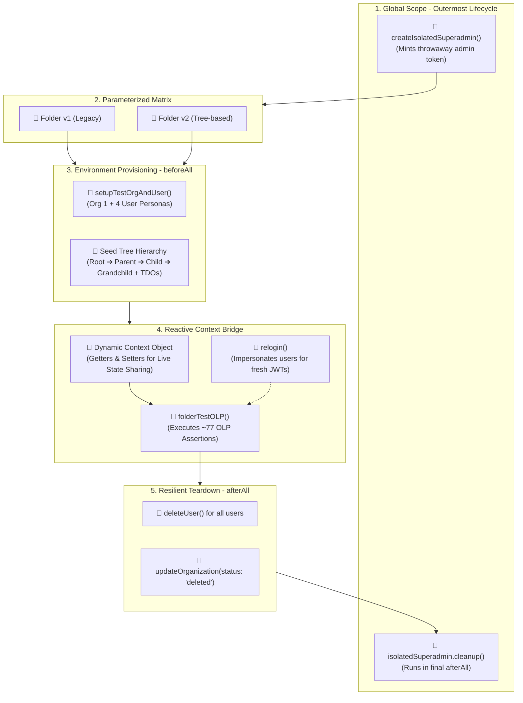

# Deep Dive Architecture & "Divide & Conquer" Breakdown of `folderOlpREP.spec.ts` (Lines 34–332)

> **Target File**: [`citest/tools/graphql-api/test/folder/RBAC/folderOlpREP.spec.ts:L34-L332`](file:///home/huycao/Repos/veritone-drug/core-graphql-server/citest/tools/graphql-api/test/folder/RBAC/folderOlpREP.spec.ts#L34-L332)  
> **Topic**: Complete structural breakdown of the Test Harness & Orchestration Engine for Object-Level Permissions (OLP)  
> **Audience**: QA Engineers, Test Architects, and Backend Developers building robust API test suites.

---

## Table of Contents
1. [The Big Picture: What is this Component?](#1-the-big-picture-what-is-this-component)
2. [High-Level Architecture Blueprint](#2-high-level-architecture-blueprint)
3. [Divide & Conquer: Every Part Explained](#3-divide--conquer-every-part-explained)
   - [Part 1: Global Bootstrap & Superadmin Isolation (L35–L44, L327–L331)](#part-1-global-bootstrap--superadmin-isolation-l35l44-l327l331)
   - [Part 2: Parameterized Multi-Version Matrix (L46, L325)](#part-2-parameterized-multi-version-matrix-l46-l325)
   - [Part 3: Test State Declaration & Dynamic Token Refresh (`relogin`) (L47–L68)](#part-3-test-state-declaration--dynamic-token-refresh-relogin-l47l68)
   - [Part 4: Tenant Provisioning & Folder Tree Seeding (L70–L219)](#part-4-tenant-provisioning--folder-tree-seeding-l70l219)
   - [Part 5: The Reactive Context Bridge (Getters/Setters Pattern) (L221–L289)](#part-5-the-reactive-context-bridge-getterssetters-pattern-l221l289)
   - [Part 6: Resilient Multi-Tenant Teardown (L291–L324)](#part-6-resilient-multi-tenant-teardown-l291l324)
4. [How to Apply This Pattern in Your Own Project](#4-how-to-apply-this-pattern-in-your-own-project)
5. [Complete Reusable Test Harness Skeleton](#5-complete-reusable-test-harness-skeleton)
6. [Design Patterns Summary](#6-design-patterns-summary)

---

# 1. The Big Picture: What is this Component?

Lines 34–332 of [`folderOlpREP.spec.ts`](file:///home/huycao/Repos/veritone-drug/core-graphql-server/citest/tools/graphql-api/test/folder/RBAC/folderOlpREP.spec.ts#L34-L332) represent the **Test Harness & Orchestration Engine** for the entire folder security test suite.

Think of it like building a movie set before filming:
- Instead of writing test assertions directly, this block **builds the entire sandbox world**: creates a dedicated company (tenant), sets up 4 user accounts with different privilege levels, seeds a 3-tier folder tree filled with video files, coordinates dynamic token refreshing, and delegates the actual security assertions to `folderTestOLP`.
- When all tests finish, it acts as the **demolition crew**, cleanly tearing down all users and organizations without leaving junk data behind or crashing other test suites running in parallel.

---

# 2. High-Level Architecture Blueprint



---

# 3. Divide & Conquer: Every Part Explained

Let's divide lines 34–332 into **6 logical parts** and conquer each one in detail.

---

## Part 1: Global Bootstrap & Superadmin Isolation (L35–L44, L327–L331)

### 📄 The Code
```typescript
describe('citest_folder: olp folder test', () => {
  let superToken: string;

  beforeAll(async () => {
    const env = config.env;
    gqlClient = await createGraphqlClient(AuthType.SESSION_TOKEN, env);

    isolatedSuperadmin = await createIsolatedSuperadmin(gqlClient);
    superToken = isolatedSuperadmin.token;
  });

  // ... (Test Matrix executes here) ...

  afterAll(async () => {
    await safe('cleanup isolated superadmin', () =>
      isolatedSuperadmin.cleanup()
    );
  });
});
```

### 🔍 Beginner Explanation
1. **`createGraphqlClient`**: Establishes a connection to the GraphQL API server based on the active test environment.
2. **`createIsolatedSuperadmin`**: Creates a **brand-new, temporary superadmin account** specifically for this test file.
3. **`superToken`**: Holds the temporary superadmin's JWT bearer token.

### 💡 Why is this Done? (The Problem & The Fix)
* **The Danger**: If every test suite uses the shared system superadmin (`admin@veritone.com`), and this test suite deletes its test organization at the end, the backend will terminate all sessions attached to that organization GUID. This invalidates the shared superadmin token, causing all other parallel tests in CI to crash with `token invalid or expired`.
* **The Solution**: By creating an isolated superadmin for this test run only, destroying the test org only affects this isolated session. The global CI session remains untouched.

---

## Part 2: Parameterized Multi-Version Matrix (L46, L325)

### 📄 The Code
```typescript
  describe.each(['v1', 'v2'])('OLP Folder %s', (folderVersion: string) => {
    // ... all setup, tests, and teardown run once for 'v1', then once for 'v2' ...
  });
```

### 🔍 Beginner Explanation
* `describe.each(['v1', 'v2'])` is a Jest/Mocha parameterization feature.
* It instructs the test runner: **"Run this entire test suite twice: first pass with `folderVersion = 'v1'`, second pass with `folderVersion = 'v2'`."**

### 💡 Why is this Done?
The backend supports two folder implementations:
- **v1**: Traditional relational database folders.
- **v2**: Optimized tree hierarchy folders (`treeObjectId`).
Instead of writing two separate test files with duplicated code, this single loop guarantees 100% feature parity and backwards compatibility across both versions with zero duplication.

---

## Part 3: Test State Declaration & Dynamic Token Refresh (`relogin`) (L47–L68)

### 📄 The Code
```typescript
    let testSetup: any, testSetup2: any;
    let testOrg: any, testOrg2: any;
    let adminUser: any, adminUser2: any, regularUser: any, restrictedUser: any;
    let adminOptions: any,
      adminOptions2: any,
      regularOptions: any,
      restrictedOptions: any;
    let adminOrg2Options: any, regularUserOrg2Options: any;
    let testFolderData: any;
    let rbac: any;

    async function relogin(
      userId: string,
      organizationGuid: string
    ): Promise<Record<string, string>> {
      const impersonated = await impersonateUser(
        superToken,
        userId,
        organizationGuid
      );
      return impersonated.requestOptions;
    }
```

### 🔍 Beginner Explanation
1. **Scoped Variables**: Defines containers for:
   - `testOrg` & `testOrg2`: Organizations for Tenant 1 and Tenant 2.
   - `adminUser`, `regularUser`, `restrictedUser`: User identity objects.
   - `adminOptions`, `restrictedOptions`: HTTP Request Headers containing `{ Authorization: 'Bearer <token>' }`.
   - `testFolderData`: Dictionary holding generated folder IDs (`parentFolderId`, `childFolderId`, `tdoId`).
   - `rbac`: Holds authorization IDs (`authGroupId`, `permissionSetId`).

2. **The `relogin` Function**:
   - Takes a `userId` and `organizationGuid`.
   - Calls [`impersonateUser`](file:///home/huycao/Repos/veritone-drug/core-graphql-server/citest/tools/graphql-api/src/helpers/commonHelper.ts) using the `superToken`.
   - Returns a fresh set of request headers with a newly minted JWT token for that specific user.

### 💡 Why is `relogin` Essential for RBAC Testing?
When a user logs in, their current permissions and group memberships are **baked directly into their session token context**.  
If an administrator later adds that user to an `AuthGroup` or grants them an ACE, their **current session token has no idea**. Calling `relogin()` mints a fresh token that reflects the newly granted permissions.

---

## Part 4: Tenant Provisioning & Folder Tree Seeding (L70–L219)

### 📄 The Code Walkthrough
In `beforeAll(async () => { ... })`:

#### Step 4.1: Provision Organization & 4 User Personas
```typescript
const createOrgAndUserInput = getOrgAndUserInput(folderVersion);
testSetup = await setupTestOrgAndUser(isoClient, createOrgAndUserInput);
testOrg = testSetup.org;

adminUser = testSetup.listOptions.find(u => u.userName?.includes('first-admin-user'));
adminOptions = adminUser?.requestOptions;

adminUser2 = testSetup.listOptions.find(u => u.userName?.includes('second-admin-user'));
adminOptions2 = adminUser2?.requestOptions;

regularUser = testSetup.listOptions.find(u => u.userName?.includes('first-regular-user'));
regularOptions = regularUser?.requestOptions;

restrictedUser = testSetup.listOptions.find(u => u.userName?.includes('first-restrict-user'));
restrictedOptions = restrictedUser?.requestOptions;
```
* **`adminUser`**: Primary admin / data creator.
* **`adminUser2`**: Secondary admin (verifies organization-wide admin rights).
* **`regularUser`**: Normal CMS Viewer role.
* **`restrictedUser`**: Role-less user (starts with zero access; used as the OLP probe).

---

#### Step 4.2: Create Root Folders
```typescript
const createRootRes = await gqlClient.sdk.createRootFolders(
  { rootFolderType: RootFolderType.Cms },
  adminOptions
);
const rootFolders = createRootRes?.data?.createRootFolders ?? [];
const orgRootFolder = rootFolders.find(f => !f?.ownerId);
const adminRootFolder = rootFolders.find(f => f?.ownerId === adminUser.userId);

testFolderData.rootFolderId = orgRootFolder?.id;
testFolderData.rootFolderId2 = adminRootFolder?.id;
```
* Creates two root folders:
  1. **Organization Root Folder** (Shared across the org, no owner ID).
  2. **Admin Root Folder** (Private root owned by `adminUser`).

---

#### Step 4.3: Seed 3-Tier Folder Tree with Media Content (TDOs)
```typescript
// 1. Parent Folder 1 + Media
const folderRes = await gqlClient.sdk.createFolder({ input: { name: '...', parentId: testFolderData.rootFolderId } }, adminOptions);
testFolderData.parentFolderId = folderRes?.data?.createFolder?.id;

const tdoRes = await gqlClient.sdk.createTDOWithAsset({ input: { name: '...', parentFolderId: testFolderData.parentFolderId } }, adminOptions);
testFolderData.tdoId = tdoRes?.data?.createTDOWithAsset?.id;

// 2. Parent Folder 2 (For multi-folder ACE tests)
const parentFolder2Res = await gqlClient.sdk.createFolder({ input: { name: '...', parentId: testFolderData.rootFolderId } }, adminOptions);
testFolderData.parentFolderId2 = parentFolder2Res?.data?.createFolder?.id;

// 3. Child Folder 1 + Media
const childFolderRes = await gqlClient.sdk.createFolder({ input: { name: '...', parentId: testFolderData.parentFolderId } }, adminOptions);
testFolderData.childFolderId = childFolderRes?.data?.createFolder?.id;

const childTdoRes = await gqlClient.sdk.createTDOWithAsset({ input: { name: '...', parentFolderId: testFolderData.childFolderId } }, adminOptions);
testFolderData.childTdoId = childTdoRes?.data?.createTDOWithAsset?.id;

// 4. Grandchild Folder 1 + Media
const grandChildFolderRes = await gqlClient.sdk.createFolder({ input: { name: '...', parentId: testFolderData.childFolderId } }, adminOptions);
testFolderData.grandChildFolderId = grandChildFolderRes?.data?.createFolder?.id;

const grandChildTdoRes = await gqlClient.sdk.createTDOWithAsset({ input: { name: '...', parentFolderId: testFolderData.grandChildFolderId } }, adminOptions);
testFolderData.grandChildTdoId = grandChildTdoRes?.data?.createTDOWithAsset?.id;
```

### 🌳 Visualizing the Seeded Tree:
```
[Organization Root Folder] (rootFolderId)
│
├── [Parent Folder 1] (parentFolderId)
│   ├── 📄 TDO 1 (tdoId - Video Asset)
│   │
│   └── [Child Folder 1] (childFolderId)
│       ├── 📄 Child TDO 1 (childTdoId)
│       │
│       └── [Grandchild Folder 1] (grandChildFolderId)
│           └── 📄 Grandchild TDO 1 (grandChildTdoId)
│
└── [Parent Folder 2] (parentFolderId2)
```

---

#### Step 4.4: Sanity Check
```typescript
const restrictedMeRes = await gqlClient.sdk.me({}, restrictedOptions);
expect(restrictedMeRes?.data?.me?.name).toContain('first-restrict-user');
```
* Queries `me` using `restrictedOptions` to ensure the restricted user's token is alive, authenticates cleanly, and resides in the newly created organization.

---

## Part 5: The Reactive Context Bridge (Getters/Setters Pattern) (L221–L289)

### 📄 The Code
```typescript
    folderTestOLP(folderVersion, {
      get testSetup() { return testSetup; },
      set testSetup2(v: any) { testSetup2 = v; },
      get testSetup2() { return testSetup2; },
      get testOrg() { return testOrg; },
      set testOrg2(v: any) { testOrg2 = v; },
      get testOrg2() { return testOrg2; },
      get adminUser() { return adminUser; },
      get adminUser2() { return adminUser2; },
      get regularUser() { return regularUser; },
      get restrictedUser() { return restrictedUser; },
      get adminOptions() { return adminOptions; },
      get adminOptions2() { return adminOptions2; },
      get regularOptions() { return regularOptions; },
      set regularOptions(v: any) { regularOptions = v; },
      get restrictedOptions() { return restrictedOptions; },
      set restrictedOptions(v: any) { restrictedOptions = v; },
      get adminOrg2Options() { return adminOrg2Options; },
      set adminOrg2Options(v: any) { adminOrg2Options = v; },
      get regularUserOrg2Options() { return regularUserOrg2Options; },
      set regularUserOrg2Options(v: any) { regularUserOrg2Options = v; },
      get testFolderData() { return testFolderData; },
      get rbac() { return rbac; },
      relogin
    });
```

### 🔍 Beginner Explanation
Instead of passing plain static values, `folderTestOLP` is given an object with **JavaScript Getters (`get`) and Setters (`set`)**.

### 💡 Why is this Architectural Genius?
In JavaScript, primitives and reassigned objects are passed by value/reference at invocation time.  
- Later in the test suite (e.g., in Flow 3 and Flow 4), tests will **reassign** `restrictedOptions = newHeaders`, create a second organization (`testOrg2 = newOrg`), or change `regularOptions`.
- If we passed a plain object `{ restrictedOptions }`, the child tests would only see the *initial* token and miss any subsequent token refreshes.
- **Getters and Setters create a dynamic two-way bridge**: When the child test reads `ctx.restrictedOptions`, the getter evaluates `return restrictedOptions` in real time, always fetching the latest updated value!

---

## Part 6: Resilient Multi-Tenant Teardown (L291–L324)

### 📄 The Code
```typescript
    afterAll(async () => {
      const org2ListOptions = testSetup2?.listOptions ?? [];
      const allListOptions = [
        ...(testSetup?.listOptions ?? []),
        ...org2ListOptions
      ];

      for (const user of allListOptions) {
        await safe(`delete user ${user.userId}`, () =>
          gqlClient.sdk.deleteUser(
            { id: user.userId },
            helpers.requestOptions(superToken).headers
          )
        );
      }

      if (testOrg?.id) {
        await safe(`delete testOrg ${testOrg.id}`, () =>
          isolatedSuperadmin.client.sdk.updateOrganization(
            { input: { id: testOrg.id, status: OrganizationStatus.Deleted } },
            isolatedSuperadmin.options
          )
        );
      }

      if (testOrg2?.id) {
        await safe(`delete testOrg2 ${testOrg2.id}`, () =>
          isolatedSuperadmin.client.sdk.updateOrganization(
            { input: { id: testOrg2.id, status: OrganizationStatus.Deleted } },
            isolatedSuperadmin.options
          )
        );
      }
    });
```

### 🔍 Beginner Explanation
When all tests in a version finish, this `afterAll` hook:
1. Combines the user lists from Org 1 (`testSetup`) and Org 2 (`testSetup2`).
2. Deletes every user account created during the test run.
3. Soft-deletes `testOrg` and `testOrg2` by setting `status = OrganizationStatus.Deleted`.

### 💡 Two Critical Senior QA Techniques:
1. **The `safe(label, fn)` Wrapper**:
   - Standard `await fn()` crashes the entire afterAll hook if an error occurs.
   - `safe()` catches errors and logs a warning, ensuring that if deleting User 1 fails, the script continues to delete User 2, User 3, Org 1, and Org 2.
2. **Soft Deletion vs Hard Deletion**:
   - Calling REST hard-delete (`helpers.deleteOrganization`) terminates active sessions indexed under the org's GUID.
   - Using GraphQL soft-delete (`updateOrganization(status: 'deleted')`) cleanly deactivates the org without triggering destructive session termination events.

---

# 4. How to Apply This Pattern in Your Own Project

You can apply this exact architectural pattern whenever you need to test:
- **RBAC / Fine-Grained Permissions (Folders, Files, Documents, Collections, Assets)**
- **Multi-Tenant / Cross-Company Sharing**
- **API Version Compatibility (v1 vs v2)**

### 5-Step Implementation Checklist:
```
[ ] 1. Bootstrap: Create an isolated superadmin/root session in the outer beforeAll.
[ ] 2. Parameterize: Use describe.each(['v1', 'v2']) to run identical tests across API versions.
[ ] 3. Persona Setup: Create a dynamic org with at least 3 personas (Admin, Standard, Restricted).
[ ] 4. Context Bridge: Use Getters & Setters to pass mutable tokens and IDs to assertion functions.
[ ] 5. Resilient Cleanup: Wrap all teardown calls in safe() and clean users before organizations.
```

---

# 5. Complete Reusable Test Harness Skeleton

Here is a clean, modern TypeScript skeleton based on lines 34–332 that you can copy and adapt directly into your own project:

```typescript
import { v4 as uuidv4 } from 'uuid';
import { createGraphqlClient, AuthType, GraphqlClient } from '@api/src/graphqlUtil';
import { createIsolatedSuperadmin } from '@api/test/helpers/superadminSession';
import { setupTestOrgAndUser } from '@api/test/helpers/organization.helper';
import { impersonateUser, safe } from '@api/src/helpers/commonHelper';
import { OrganizationStatus } from '@api/src/gql';

// Import your dedicated assertion suite function
// import { runFeatureSecurityTests, FeatureTestContext } from './featureTests.helper';

let gqlClient: GraphqlClient;
let isolatedSuperadmin: Awaited<ReturnType<typeof createIsolatedSuperadmin>>;

describe('Security Suite: Feature Access Control', () => {
  let superToken: string;

  // -----------------------------------------------------------------
  // 1. GLOBAL BOOTSTRAP: Isolated Superadmin
  // -----------------------------------------------------------------
  beforeAll(async () => {
    gqlClient = await createGraphqlClient(AuthType.SESSION_TOKEN, 'stage');
    isolatedSuperadmin = await createIsolatedSuperadmin(gqlClient);
    superToken = isolatedSuperadmin.token;
  });

  afterAll(async () => {
    await safe('cleanup global superadmin', () => isolatedSuperadmin.cleanup());
  });

  // -----------------------------------------------------------------
  // 2. PARAMETERIZED MULTI-VERSION MATRIX
  // -----------------------------------------------------------------
  describe.each(['v1', 'v2'])('Feature Version: %s', (version: string) => {
    let testSetup: any, testSetup2: any;
    let testOrg: any, testOrg2: any;
    let adminUser: any, regularUser: any, restrictedUser: any;
    let adminOptions: any, regularOptions: any, restrictedOptions: any;
    let adminOrg2Options: any;
    let seededData: Record<string, string>;
    let rbacState: Record<string, string>;

    // -----------------------------------------------------------------
    // 3. DYNAMIC TOKEN REFRESH FUNCTION
    // -----------------------------------------------------------------
    async function relogin(userId: string, organizationGuid: string) {
      const imp = await impersonateUser(superToken, userId, organizationGuid);
      return imp.requestOptions;
    }

    // -----------------------------------------------------------------
    // 4. ENVIRONMENT PROVISIONING & DATA SEEDING
    // -----------------------------------------------------------------
    beforeAll(async () => {
      seededData = {};
      rbacState = {};

      // Provision Organization & 3 Personas
      testSetup = await setupTestOrgAndUser(isolatedSuperadmin.client, {
        orgInput: {
          name: `test-org-${version}-${uuidv4()}`,
          metadata: { features: { enableRBACFeature: 'enabled' } }
        },
        userInputs: [
          { name: `admin-${version}-${uuidv4()}@test.com`, password: 'pwd', roleIds: ['ADMIN_ROLE_ID'] },
          { name: `regular-${version}-${uuidv4()}@test.com`, password: 'pwd', roleIds: ['VIEWER_ROLE_ID'] },
          { name: `restricted-${version}-${uuidv4()}@test.com`, password: 'pwd', roleIds: [] } // Zero roles
        ]
      });

      testOrg = testSetup.org;
      adminUser = testSetup.listOptions.find((u: any) => u.userName.includes('admin'));
      regularUser = testSetup.listOptions.find((u: any) => u.userName.includes('regular'));
      restrictedUser = testSetup.listOptions.find((u: any) => u.userName.includes('restricted'));

      adminOptions = adminUser.requestOptions;
      regularOptions = regularUser.requestOptions;
      restrictedOptions = restrictedUser.requestOptions;

      // Seed Initial Resources as Admin
      const resourceRes = await gqlClient.sdk.createFolder(
        { input: { name: `parent-${uuidv4()}` } },
        adminOptions
      );
      seededData.rootResourceId = resourceRes.data.createFolder.id;
    });

    // -----------------------------------------------------------------
    // 5. REACTIVE CONTEXT BRIDGE TO TEST SUITE
    // -----------------------------------------------------------------
    /*
    runFeatureSecurityTests(version, {
      get testOrg() { return testOrg; },
      set testOrg2(v: any) { testOrg2 = v; },
      get testOrg2() { return testOrg2; },
      get adminUser() { return adminUser; },
      get regularUser() { return regularUser; },
      get restrictedUser() { return restrictedUser; },
      get adminOptions() { return adminOptions; },
      get regularOptions() { return regularOptions; },
      set regularOptions(v: any) { regularOptions = v; },
      get restrictedOptions() { return restrictedOptions; },
      set restrictedOptions(v: any) { restrictedOptions = v; },
      get seededData() { return seededData; },
      get rbacState() { return rbacState; },
      relogin
    });
    */

    // -----------------------------------------------------------------
    // 6. RESILIENT MULTI-TENANT TEARDOWN
    // -----------------------------------------------------------------
    afterAll(async () => {
      const allUsers = [...(testSetup?.listOptions ?? []), ...(testSetup2?.listOptions ?? [])];

      for (const user of allUsers) {
        await safe(`delete user ${user.userId}`, () =>
          gqlClient.sdk.deleteUser({ id: user.userId }, adminOptions)
        );
      }

      if (testOrg?.id) {
        await safe(`delete testOrg ${testOrg.id}`, () =>
          isolatedSuperadmin.client.sdk.updateOrganization(
            { input: { id: testOrg.id, status: OrganizationStatus.Deleted } },
            isolatedSuperadmin.options
          )
        );
      }

      if (testOrg2?.id) {
        await safe(`delete testOrg2 ${testOrg2.id}`, () =>
          isolatedSuperadmin.client.sdk.updateOrganization(
            { input: { id: testOrg2.id, status: OrganizationStatus.Deleted } },
            isolatedSuperadmin.options
          )
        );
      }
    });
  });
});
```

---

# 6. Design Patterns Summary

| Pattern Name | How It's Used in L34–L332 | Why It Matters |
| :--- | :--- | :--- |
| **Isolated Session Pattern** | `createIsolatedSuperadmin` in outer `beforeAll` | Prevents CI test shard failures caused by session termination cascades. |
| **Parameterized Matrix** | `describe.each(['v1', 'v2'])` | Tests legacy vs modern folder architectures with zero code duplication. |
| **Multi-Persona Testing** | Admin, Standard Viewer, Restricted (Zero-Role) | Ensures every permission level (Owner, Admin, Viewer, Guest) is validated. |
| **Reactive Context Bridge** | Object with JavaScript `get` & `set` accessors | Enables dynamic state synchronization (relogin tokens, new orgs) across nested test files. |
| **Resilient Teardown (`safe`)** | `safe('label', () => cleanupPromise)` | Prevents cleanup failures in one entity from stopping the deletion of other entities. |
| **Non-Destructive Soft Delete** | `updateOrganization(status: 'deleted')` | Cleans up test organizations safely without killing global JWT session caches. |
