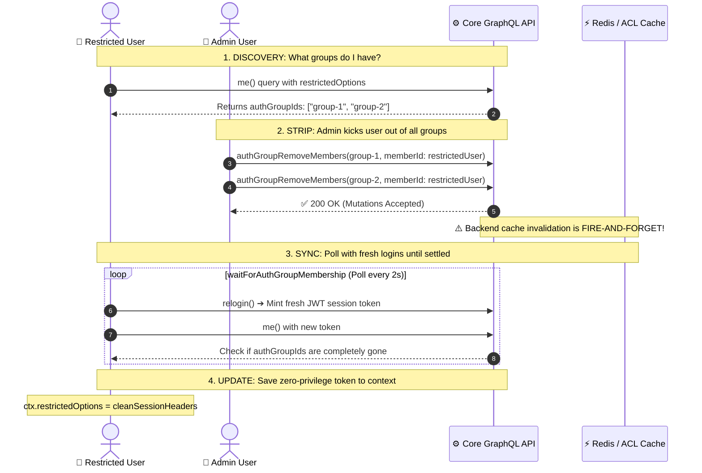
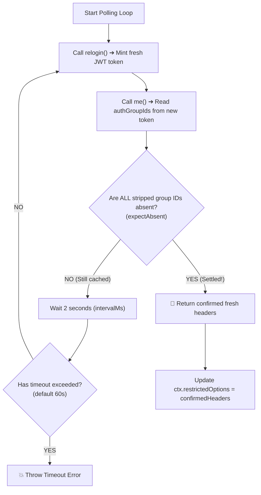

# Divide & Conquer Breakdown: Stripping Default Auth Groups (`folderOlp.spec.ts:L474-L498`)

> **Target Code Block**: [`citest/tools/graphql-api/test/folder/RBAC/folderOlp.spec.ts:L474-L498`](file:///home/huycao/Repos/veritone-drug/core-graphql-server/citest/tools/graphql-api/test/folder/RBAC/folderOlp.spec.ts#L474-L498)  
> **Topic**: Why and How to enforce a true "Default Deny" baseline in RBAC/OLP Testing  
> **Audience**: QA Engineers, Test Automation Developers, and Backend Engineers

---

## Table of Contents
1. [The Big Picture: Why Does This Test Exist?](#1-the-big-picture-why-does-this-test-exist)
2. [Visual Architecture: The 4-Step Flow](#2-visual-architecture-the-4-step-flow)
3. [Divide & Conquer: Line-by-Line Breakdown](#3-divide--conquer-line-by-line-breakdown)
   - [Part 1: Discovery & Group Inspection (L475–L476)](#part-1-discovery--group-inspection-l475l476)
   - [Part 2: Parallel Removal via Admin Privileges (L478–L488)](#part-2-parallel-removal-via-admin-privileges-l478l488)
   - [Part 3: The Backend Asynchronous Trap (The "Why")](#part-3-the-backend-asynchronous-trap-the-why)
   - [Part 4: The Polling & Session-Sync Solution (L489–L497)](#part-4-the-polling--session-sync-solution-l489l497)
4. [Real-World Analogy: The Hotel Keycard](#4-real-world-analogy-the-hotel-keycard)
5. [How to Apply This in Your Own Project](#5-how-to-apply-this-in-your-own-project)
6. [Complete Reusable Helper Code](#6-complete-reusable-helper-code)
7. [Summary Cheat Sheet](#7-summary-cheat-sheet)

---

# 1. The Big Picture: Why Does This Test Exist?

In security and **Object-Level Permissions (OLP)** testing, you need a **"Restricted User"** (a user with **absolute zero permissions**) to act as a **test probe**.

```
Expected Security Stance: "DEFAULT DENY"
Restricted User ─── attempts to access Folder ───► ❌ HTTP 403 / "No authorization access"
```

### ⚠️ The Hidden Problem:
When you create a new user in most enterprise systems, the backend **automatically enrolls them into default groups** (e.g. *"All Company Employees"*, *"Default CMS Group"*, *"General Members"*).  
If your `restrictedUser` is silently enrolled in one of these default groups, that group might have ambient read access to folders. As a result:
- Your negative tests (like `FO5: restricted user cannot get folder`) will **fail falsely** because the user unexpectedly has access via the default group!

### 🎯 The Mission of this Code Block:
1. **Find** all default authorization groups (`AuthGroup` / AG) automatically assigned to the restricted user.
2. **Remove** the user from all of them using administrator rights.
3. **Wait & Verify** that the backend caches and session tokens have fully synchronized.
4. **Store** the clean, zero-privilege session token back into `ctx.restrictedOptions` so every subsequent OLP test runs with a true "Default Deny" baseline.

---

# 2. Visual Architecture: The 4-Step Flow



---

# 3. Divide & Conquer: Line-by-Line Breakdown

Here is the exact code block divided into its core components:

```typescript
it('should removes restricted users from default AGs', async () => {
  // [PART 1: DISCOVERY]
  const meRes = await gqlClient.sdk.me({}, ctx.restrictedOptions);
  const authGroupIds = meRes?.data?.me?.authGroupIds ?? [];

  if (authGroupIds.length > 0) {
    // [PART 2: PARALLEL ADMIN REMOVAL]
    const result = await Promise.all(
      authGroupIds.map((id: string) =>
        gqlClient.sdk.authGroupRemoveMembers(
          { id, memberIds: [ctx.restrictedUser.userId] },
          ctx.adminOptions
        )
      )
    );
    expect(result.length).toEqual(authGroupIds.length);

    // [PART 3 & 4: POLLING & SESSION SYNC]
    // relogin restricted user — the removal is fire-and-forget on the
    // server, so relog in until the session no longer reports the groups.
    // Every OLP assertion in this block runs against this session.
    ctx.restrictedOptions = await waitForAuthGroupMembership(
      gqlClient,
      () => ctx.relogin(ctx.restrictedUser.userId, ctx.testOrg.guid),
      { expectAbsent: authGroupIds, label: 'restricted user' }
    );
  }
});
```

---

## Part 1: Discovery & Group Inspection (L475–L476)

```typescript
const meRes = await gqlClient.sdk.me({}, ctx.restrictedOptions);
const authGroupIds = meRes?.data?.me?.authGroupIds ?? [];
```

### What happens here:
1. `gqlClient.sdk.me({}, ctx.restrictedOptions)` sends a `Query.me` request authenticated as the **restricted user**.
2. The response contains `me.authGroupIds`, which is an array of IDs of all `AuthGroup`s the user belongs to (e.g. `['ag-101', 'ag-202']`).
3. If no default groups exist, `authGroupIds` defaults to an empty array `[]`, and the `if` block is safely skipped.

---

## Part 2: Parallel Removal via Admin Privileges (L478–L488)

```typescript
if (authGroupIds.length > 0) {
  const result = await Promise.all(
    authGroupIds.map((id: string) =>
      gqlClient.sdk.authGroupRemoveMembers(
        { id, memberIds: [ctx.restrictedUser.userId] },
        ctx.adminOptions
      )
    )
  );
  expect(result.length).toEqual(authGroupIds.length);
```

### What happens here:
1. **Admin Authority**: Only an administrator can remove users from authorization groups. Notice the call passes `ctx.adminOptions` (not `restrictedOptions`).
2. **`Promise.all` + `.map()`**: If the user belongs to 3 default groups, it fires all 3 `authGroupRemoveMembers` mutations **in parallel**, speeding up test execution.
3. `expect(result.length).toEqual(authGroupIds.length)` verifies that every removal mutation completed successfully.

---

## Part 3: The Backend Asynchronous Trap (The "Why")

> [!WARNING]
> Calling `authGroupRemoveMembers` returns HTTP 200 immediately, but **the backend has NOT finished updating the user's session cache!**

### Why is there a delay on the server?
When an admin removes a member from a group on the backend:
1. **Database Update**: The row is deleted from `auth_group_member` table (synchronous).
2. **Redis Invalidation**: An asynchronous dirty-bit event (`_invalidateAnyAuthGroupRelatedCaches`) is published to Redis.
3. **Session Rebuild**: A background fire-and-forget worker (`reloadSessionAuthGroupsForMembers`) eventually rebuilds the active user sessions.

### Why standard tests fail here:
If your test immediately runs the next test case or just uses `await sleep(1000)`:
- The restricted user's existing JWT token still carries the old `authGroups` array inside its internal payload (`context._authInfo.authGroups`).
- The authorization engine evaluates the request against the **old token snapshot** and grants access.
- Result: **Flaky CI test failures!**

---

## Part 4: The Polling & Session-Sync Solution (L489–L497)

```typescript
ctx.restrictedOptions = await waitForAuthGroupMembership(
  gqlClient,
  () => ctx.relogin(ctx.restrictedUser.userId, ctx.testOrg.guid),
  { expectAbsent: authGroupIds, label: 'restricted user' }
);
```

### How `waitForAuthGroupMembership` solves the race condition:
Instead of guessing with a blind `sleep()`, it executes a **bounded retry polling loop**:



1. **Mint New Session**: Calls `ctx.relogin(...)` to create a brand-new token.
2. **Inspect Token Context**: Queries `me { authGroupIds }`.
3. **Verify Absence**: Checks `expectAbsent: authGroupIds`. If any stripped ID is still present, it means the server cache hasn't settled yet. It waits 2 seconds and tries again.
4. **Save Confirmed Headers**: Once the session confirms that zero default groups remain, it returns the headers and saves them directly into `ctx.restrictedOptions`.

---

# 4. Real-World Analogy: The Hotel Keycard

Think of this process like checking into a hotel:

```
+---------------------------------------------------------------------------------------+
|  HOTEL ANALOGY                                                                        |
|                                                                                       |
|  1. Default Assignment:                                                              |
|     When the front desk creates your guest account, the system automatically marks   |
|     you as a "VIP Guest" with pool & gym access.                                     |
|                                                                                       |
|  2. Stripping Permissions:                                                           |
|     The manager removes your "VIP" status in the hotel database.                      |
|                                                                                       |
|  3. The Stale Keycard (The Trap):                                                     |
|     Your physical keycard (your JWT Session Token) STILL has the VIP chip coded on it!|
|     The pool door will still open until you get a NEW keycard re-encoded.             |
|                                                                                       |
|  4. Relogin & Sync (The Fix):                                                         |
|     You go back to the front desk, get a brand-new keycard (relogin), and tap the     |
|     reader to verify that access to the VIP lounge is officially blocked.             |
+---------------------------------------------------------------------------------------+
```

---

# 5. How to Apply This in Your Own Project

You should apply this pattern whenever:
1. **Testing Negative Authorization (Default Deny)**: Ensuring a user cannot view, edit, or delete items without explicit rights.
2. **Testing Role / Group Revocation**: Verifying that removing a user from an Admin, Editor, or Manager group immediately revokes their privileges.
3. **Preventing Flaky CI Tests**: Eliminating arbitrary `sleep(3000)` calls when waiting for Redis, JWT, or database replication events.

---

# 6. Complete Reusable Helper Code

You can copy and adapt this standalone TypeScript helper directly into your test automation framework:

```typescript
import { GraphqlClient } from '@api/src/graphqlUtil';

export interface EnsureZeroPrivilegeOptions {
  timeoutMs?: number;
  intervalMs?: number;
}

/**
 * Strips all default groups from a test user and polls until the session token
 * confirms the user has zero group memberships.
 *
 * @param gqlClient The GraphQL client instance
 * @param adminHeaders Request headers of an admin user (to perform removal)
 * @param userHeaders Request headers of the restricted user (to inspect groups)
 * @param userId ID of the restricted user
 * @param reloginFn Callback function to mint a fresh session for the user
 */
export async function ensureZeroPrivilegeUser(
  gqlClient: GraphqlClient,
  adminHeaders: Record<string, string>,
  userHeaders: Record<string, string>,
  userId: string,
  reloginFn: () => Promise<Record<string, string>>,
  options: EnsureZeroPrivilegeOptions = {}
): Promise<Record<string, string>> {
  const timeoutMs = options.timeoutMs ?? 30000;
  const intervalMs = options.intervalMs ?? 1500;

  // 1. Discover current groups
  const meRes = await gqlClient.sdk.me({}, userHeaders);
  const authGroupIds: string[] = meRes?.data?.me?.authGroupIds ?? [];

  if (authGroupIds.length === 0) {
    return userHeaders; // Already zero privilege
  }

  // 2. Remove user from all groups in parallel as Admin
  await Promise.all(
    authGroupIds.map((groupId) =>
      gqlClient.sdk.authGroupRemoveMembers(
        { id: groupId, memberIds: [userId] },
        adminHeaders
      )
    )
  );

  // 3. Poll with fresh logins until the session reflects zero groups
  const deadline = Date.now() + timeoutMs;
  let freshHeaders = userHeaders;

  while (Date.now() < deadline) {
    try {
      freshHeaders = await reloginFn();
      const checkRes = await gqlClient.sdk.me({}, freshHeaders);
      const remainingGroups: string[] = checkRes?.data?.me?.authGroupIds ?? [];

      const isClean = authGroupIds.every((id) => !remainingGroups.includes(id));
      if (isClean) {
        return freshHeaders; // Success! Session is completely clean
      }
    } catch {
      // Transient 5xx or network errors during token minting are ignored during polling
    }

    await new Promise((resolve) => setTimeout(resolve, intervalMs));
  }

  throw new Error(
    `ensureZeroPrivilegeUser: Failed to strip groups [${authGroupIds.join(', ')}] ` +
      `from user ${userId} within ${timeoutMs}ms.`
  );
}
```

### Usage Example in a Test:
```typescript
it('sets up clean restricted user baseline', async () => {
  ctx.restrictedOptions = await ensureZeroPrivilegeUser(
    gqlClient,
    ctx.adminOptions,
    ctx.restrictedOptions,
    ctx.restrictedUser.userId,
    () => ctx.relogin(ctx.restrictedUser.userId, ctx.testOrg.guid)
  );
  
  // Now you are 100% guaranteed to be in a true "Default Deny" state!
});
```

---

# 7. Summary Cheat Sheet

| Step | Action | Role Used | Why It's Necessary |
| :--- | :--- | :--- | :--- |
| **1. Inspect** | `gqlClient.sdk.me()` | `restrictedOptions` | Finds all auto-assigned default groups. |
| **2. Remove** | `authGroupRemoveMembers()` in `Promise.all` | `adminOptions` | Removes the user from all groups efficiently in parallel. |
| **3. Relogin** | `impersonateUser` / `relogin()` | SuperAdmin | Mints a new JWT token reflecting the updated DB state. |
| **4. Poll & Sync** | `waitForAuthGroupMembership` | `restrictedOptions` | Waits for Redis cache dirty-marking to finish; prevents CI flakiness. |
| **5. Save** | `ctx.restrictedOptions = cleanHeaders` | Test Context | Updates the live test context with the verified zero-privilege session. |
