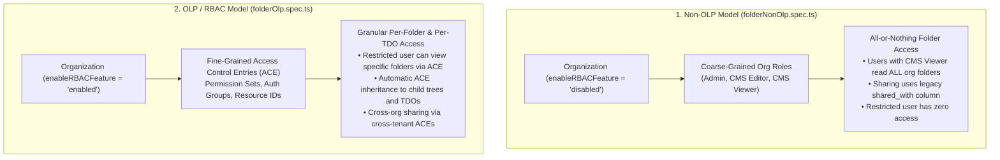
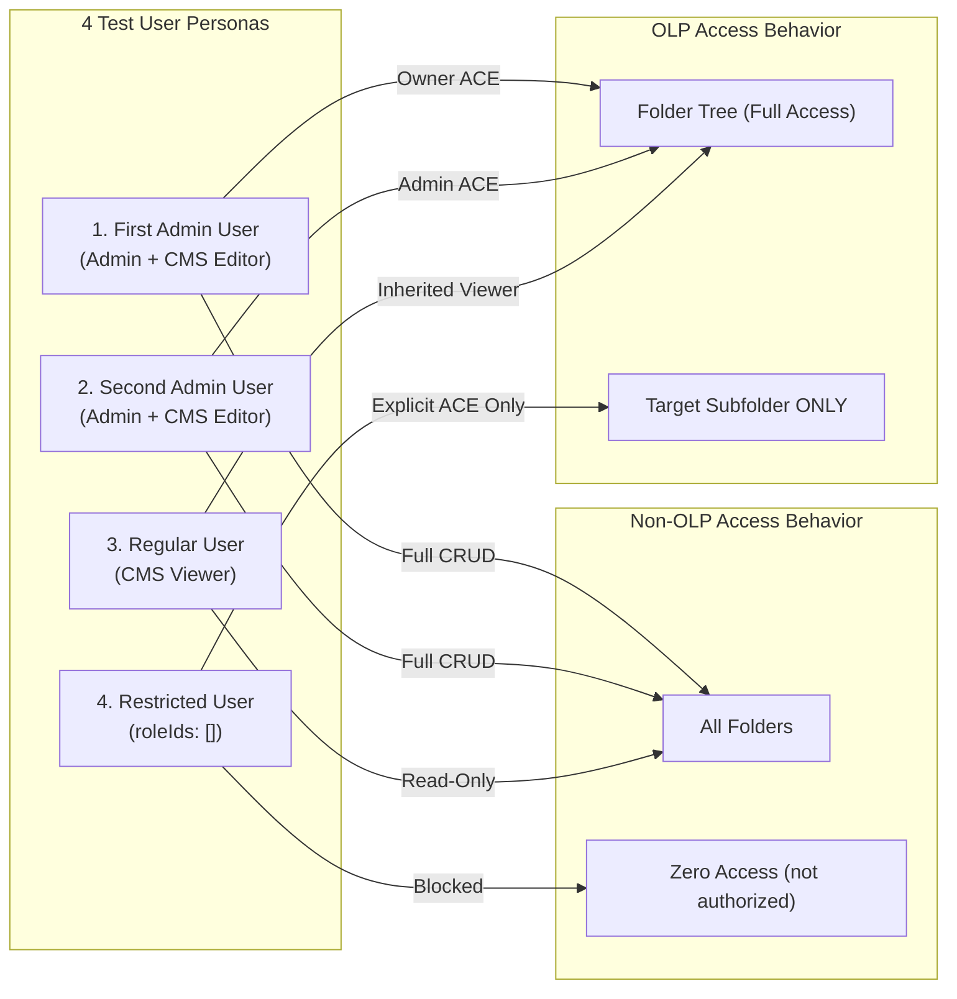
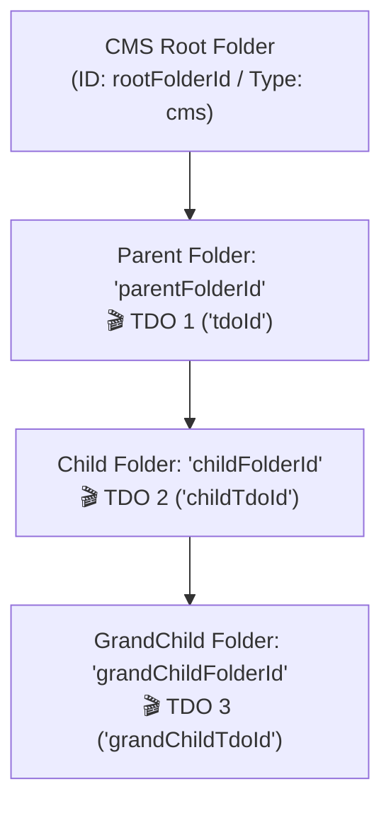
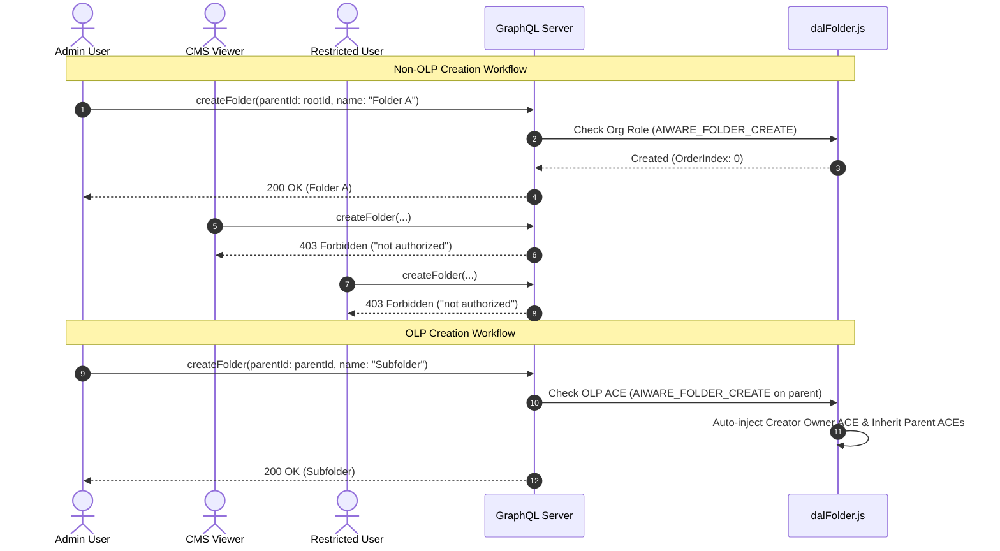
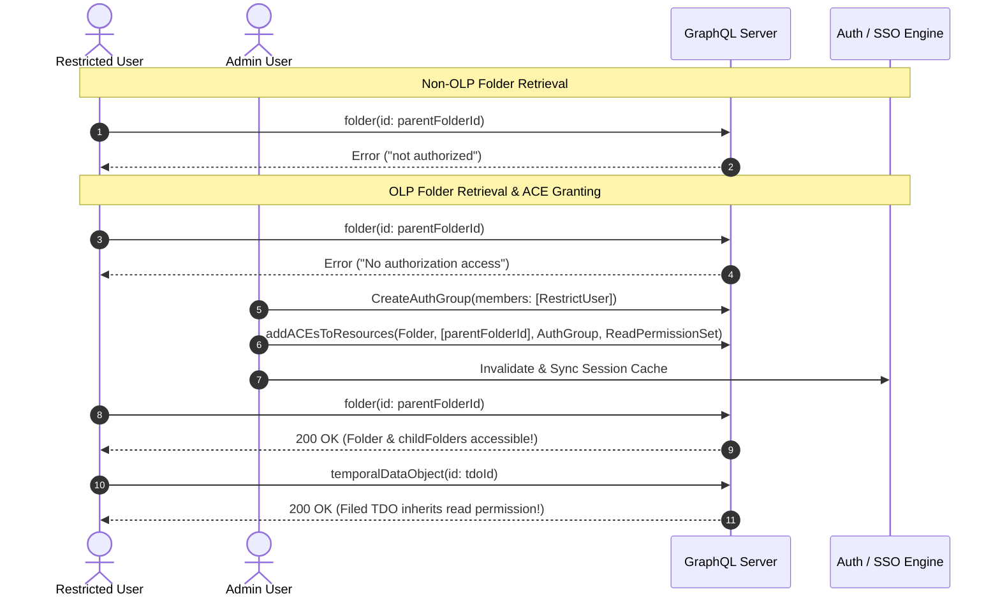
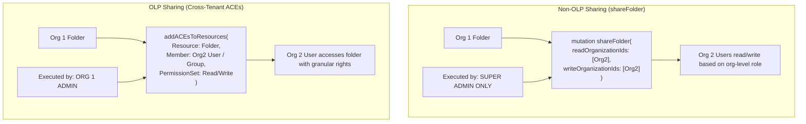
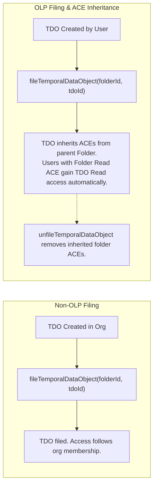

# Comparative Analysis: `folderNonOlp.spec.ts` vs `folderOlp.spec.ts`

> **Audience**: Senior API QA Engineers, Automation Leads & Developers joining the Veritone Folder & RBAC Core Team  
> **Source Files Under Comparison**:  
> 1. Non-OLP Suite: [`citest/tools/graphql-api/test/folder/folderNonOlp.spec.ts`](file:///home/huycao/Repos/veritone-drug/core-graphql-server/citest/tools/graphql-api/test/folder/folderNonOlp.spec.ts) (1,847 lines)  
> 2. OLP / RBAC Suite: [`citest/tools/graphql-api/test/folder/RBAC/folderOlp.spec.ts`](file:///home/huycao/Repos/veritone-drug/core-graphql-server/citest/tools/graphql-api/test/folder/RBAC/folderOlp.spec.ts) (2,257 lines)  
> **Target Service**: GraphQL Core Server (`core-graphql-server`)  
> **Author**: Senior API QA / Automation Lead  

---

## Table of Contents
1. [Executive Summary & High-Level Architecture](#1-executive-summary--high-level-architecture)
2. [Specification Comparison Matrix](#2-specification-comparison-matrix)
   - [2.1 Organization Metadata & Feature Flags](#21-organization-metadata--feature-flags)
   - [2.2 User Personas & Role Provisioning](#22-user-personas--role-provisioning)
   - [2.3 Permission & Authorization Models](#23-permission--authorization-models)
3. [End-to-End Test Workflow Comparison](#3-end-to-end-test-workflow-comparison)
   - [3.1 Test Suite Setup & Hierarchy Initialization](#31-test-suite-setup--hierarchy-initialization)
   - [3.2 Workflow 1: Folder Creation & Ingestion](#32-workflow-1-folder-creation--ingestion)
   - [3.3 Workflow 2: Folder Retrieval & Child Traversal](#33-workflow-2-folder-retrieval--child-traversal)
   - [3.4 Workflow 3: Folder Mutation & Hierarchy Reparenting (`Move`)](#34-workflow-3-folder-mutation--hierarchy-reparenting-move)
   - [3.5 Workflow 4: Cross-Organization Sharing](#35-workflow-4-cross-organization-sharing)
   - [3.6 Workflow 5: Content Filing (`TDO` Lifecycle & Inheritance)](#36-workflow-5-content-filing-tdo-lifecycle--inheritance)
   - [3.7 Workflow 6: Folder Deletion & Cascade Cleanup](#37-workflow-6-folder-deletion--cascade-cleanup)
4. [Granular Test Case Comparison Matrix](#4-granular-test-case-comparison-matrix)
5. [Senior QA Engineering Insights & Best Practices](#5-senior-qa-engineering-insights--best-practices)

---

## 1. Executive Summary & High-Level Architecture

The two test suites—[`folderNonOlp.spec.ts`](file:///home/huycao/Repos/veritone-drug/core-graphql-server/citest/tools/graphql-api/test/folder/folderNonOlp.spec.ts) and [`folderOlp.spec.ts`](file:///home/huycao/Repos/veritone-drug/core-graphql-server/citest/tools/graphql-api/test/folder/RBAC/folderOlp.spec.ts)—validate the two distinct authorization paradigms governing folder management and media organization in Veritone aiWARE:

### Key Differences at a Glance:
1. **Security Paradigm**:
   - **`folderNonOlp.spec.ts`**: Tests the **legacy organization-level authorization**. Permissions are coarse-grained: if a user has the `CMS Viewer` role in Organization A, they can read *all* folders in Organization A. Sharing across organizations relies on the legacy `shareFolder` mutation and the `shared_with` JSON array in `tree_object`.
   - **`folderOlp.spec.ts`**: Tests **Object-Level Permissions (OLP)**. Access is evaluated per resource (`Folder`, `TemporalDataObject`, etc.) through Access Control Entries (ACEs). A user can be completely restricted organization-wide but granted granular access to a single subfolder and its contents.
2. **Execution Scope**:
   - Both test suites evaluate both **Folder V1** (closure table / tree objects) and **Folder V2** (nested folders) using `describe.each(['v1', 'v2'])`.
   - `folderOlp.spec.ts` incorporates asynchronous propagation handling (`waitForAuthGroupMembership`, `impersonateUser` relogin) to ensure Redis/SSO cache invalidations complete before asserting permission boundaries.

---

## 2. Specification Comparison Matrix

### 2.1 Organization Metadata & Feature Flags

| Dimension | `folderNonOlp.spec.ts` | `folderOlp.spec.ts` | Technical Rationale |
| :--- | :--- | :--- | :--- |
| **`enableRBACFeature`** | `'disabled'` | `'enabled'` | Toggles the authorization engine in `dalFolder.js` and `Folder.js` resolver between standard org-role checks and fine-grained OLP ACE checks. |
| **`v2FoldersEnabled`** | Parameterized (`'enabled'` for v2, `'disabled'` for v1) | Parameterized (`'enabled'` for v2, `'disabled'` for v1) | Allows both suites to test backwards compatibility on V1 and performance on V2. |
| **Applications Enabled** | • `cms` • `aiWARE Desktop` • `discovery` | • `cms` • `aiWARE Desktop` • `admin` • `developer` • `discovery` | OLP tests require `admin` and `developer` apps to register permission sets (`authPermissionSetCreate`) and auth groups (`CreateAuthGroup`). |
| **Organization Types** | `['agency', 'broadcaster']` | `['agency', 'broadcaster']` | Standard enterprise media platform tenant classification. |

---

### 2.2 User Personas & Role Provisioning

Both suites provision 4 standardized user personas per organization, but assign different operational roles and test different access boundaries:

| User Persona | Role Configuration in Both Suites | Behavior in `folderNonOlp.spec.ts` | Behavior in `folderOlp.spec.ts` |
| :--- | :--- | :--- | :--- |
| **Admin User 1** | `Admin` (`ddca9b68...`), `CMS Editor` (`cf2ed945...`) | Can create, update, move, delete, and file into any org folder. | Receives default **Owner ACE** on user root; has full OLP CRUD permissions. |
| **Admin User 2** | `Admin` (`ddca9b68...`), `CMS Editor` (`cf2ed945...`) | Same permissions as Admin User 1 across the organization. | Acts as secondary admin to verify shared administrative ACE rights. |
| **Regular User** | `CMS Viewer` (`555033d1...`) | Can read all org folders and child TDOs. Cannot create/update/delete. | Reads folders where granted `AIWARE_FOLDER_READ` ACE (or inherited from root). Can move permitted folders. |
| **Restricted User** | `roleIds: []` (Zero initial roles) | **Permanently locked out**: All queries/mutations return `not authorized`. | **Dynamically grantable**: Initially blocked (`No authorization access`), but can be granted granular ACEs on specific folders. |

---

### 2.3 Permission & Authorization Models

| Capability | Non-OLP (`folderNonOlp.spec.ts`) | OLP (`folderOlp.spec.ts`) |
| :--- | :--- | :--- |
| **Permission Primitives** | Static JWT/Token scopes (`cms.media.read`, `aiware.folder.read`). | Dynamic `AuthPermissionType` (`AiwareFolderRead`, `AiwareFolderCreate`, `AiwareTdoCreate`, etc.). |
| **Grouping & Delegation** | N/A (Standard organization roles). | `AuthGroup` (`AuthGroupMemberType.User` / `Group`) and `AuthPermissionSet`. |
| **Permission Inheritance** | Implicit at organization scope. | Cascading from parent folders to child folders and filed TDOs via closure/tree structure. |
| **Session Cache Handling** | Simple request options per user. | Requires session relogin (`impersonateUser`) and propagation wait (`waitForAuthGroupMembership`) when ACEs change. |

---

## 3. End-to-End Test Workflow Comparison

---

### 3.1 Test Suite Setup & Hierarchy Initialization

Both test files construct an identical 3-level folder and TDO hierarchy in their `beforeAll` hooks before running test cases:

#### Differences in Setup Execution:
1. **Restricted User Cleanup in OLP**:
   - In `folderOlp.spec.ts`, an initial test case (`should removes restricted users from default AGs`) explicitly queries `me.authGroupIds` for the restricted user, removes them from any default auto-assigned Auth Groups via `authGroupRemoveMembers`, and waits for cache invalidation using `waitForAuthGroupMembership`.
   - In `folderNonOlp.spec.ts`, this step is unnecessary because non-OLP organizations do not evaluate Auth Groups.

---

### 3.2 Workflow 1: Folder Creation & Ingestion

#### Key Workflow Differences:
* **Creation Validation**:
  - `folderNonOlp.spec.ts` tests missing fields (`name` not provided, `description` not provided) and invalid root folder types (`RootFolderType.Watchlist` under CMS root).
  - `folderOlp.spec.ts` tests granular ACE permissions: A user with `AiwareFolderCreate` on a parent folder can create subfolders, and the system automatically links default ACEs.

---

### 3.3 Workflow 2: Folder Retrieval & Child Traversal

#### Key Workflow Differences:
* **Retrieval Verification**:
  - `folderNonOlp.spec.ts` checks that `admin` and `regularUser` can read all org folders, while `restrictedUser` receives `"not authorized"`.
  - `folderOlp.spec.ts` (cases `FO1` to `FO15`) methodically walks through the entire OLP permission lifecycle:
    1. Restricted user fails initial read (`FO5`).
    2. Admin creates an Auth Group and adds a Read ACE on the parent folder (`FO6`).
    3. Restricted user relogs in and now **successfully reads** the parent folder (`FO7`), child folder (`FO8`), and filed TDO (`FO9`).
    4. Admin removes the ACE (`FO10`).
    5. Restricted user is immediately **locked out again** (`FO11`-`FO15`).

---

### 3.4 Workflow 3: Folder Mutation & Hierarchy Reparenting (`Move`)

| Scenario | Non-OLP (`folderNonOlp.spec.ts`) | OLP (`folderOlp.spec.ts`) |
| :--- | :--- | :--- |
| **Rename / Update Folder** | Only Admins can rename; CMS Viewer fails with `not authorized`. Entity tags can be updated simultaneously. | Owner and Admin can rename. CMS Viewer updating another's folder fails with `not_allowed`. |
| **Move Single Folder (`moveFolder`)** | Admin moves child folder to root or parent. System validates tree closure and depth limit. | Admin and permitted CMS Viewers (`FO19.2`) can move folders. Validates permissions on both source and destination parents. |
| **Circular / Loop Move Prevention** | Tested in both: Moving a parent folder into its own child folder is rejected with `resource_conflict` / invalid move. | Same validation enforced; verified under OLP context (`FO17`). |
| **Bulk Move (`moveFolders`)** | Dedicated describe block (`non OLP move multi folders`, lines 1154-1376) testing multi-ID moving, partial failures, and order indexes. | Covered under single/multi move operations. |

---

### 3.5 Workflow 4: Cross-Organization Sharing

#### Major Differences:
1. **Caller Privilege**:
   - In Non-OLP (`A59`), **only Super Admin** has permission to execute `shareFolder`. An Org Admin attempting to call `shareFolder` receives `not authorized`.
   - In OLP (`FO31`-`FO51`), the **Folder Owner / Org Admin** can share folders across organizations by granting cross-organization ACEs or calling `shareFolder`.
2. **Granularity**:
   - Non-OLP shares the folder with the entire target organization ID (`readOrganizationIds: [102]`). Every user with `CMS Viewer` in Org 102 gains read access.
   - OLP allows sharing with specific external users or groups from Org 102 without exposing the folder to the entire second organization.

---

### 3.6 Workflow 5: Content Filing (`TDO` Lifecycle & Inheritance)

#### Key Workflow Differences:
* **Filing Permissions**:
  - In Non-OLP, filing is an administrative organization operation.
  - In OLP (`FO52`-`FO60`), filing requires specific permissions (`AiwareTdoCreate` / `AiwareTdoUpdate` on the TDO and `AiwareFolderFile` on the target folder).
* **Inherited Asset Protection**:
  - In OLP, when a TDO is filed into a restricted folder, users without ACEs on that folder cannot access the TDO even if they know its direct UUID.

---

### 3.7 Workflow 6: Folder Deletion & Cascade Cleanup

| Metric | `folderNonOlp.spec.ts` | `folderOlp.spec.ts` |
| :--- | :--- | :--- |
| **Describe Block** | `describe('non OLP delete folder')` (lines 1713-1845) | `describe('OLP delete folder')` (lines 1968-2255) |
| **Deletion Rules Tested** | • Admin deletes child folder. • Deleting parent with children. • Non-admin deletion fails with `not authorized`. • OrderIndex validation on deletion. | • Admin/Owner deletes folder. • Restricted user without Delete ACE fails. • Cleanup of ACE records and closure records upon folder removal. |
| **Cleanup Tracking** | Uses `deleteFolders: Array<{ folderId, orderIndex }>` array to clean up artifacts in `afterEach`/`afterAll`. | Cleans up test folders and Auth Groups during suite teardown. |

---

## 4. Granular Test Case Comparison Matrix

| Functional Area | `folderNonOlp.spec.ts` Test Cases | `folderOlp.spec.ts` Test Cases | Core Contrast |
| :--- | :--- | :--- | :--- |
| **Folder Creation** | `A1` - `A10` | `FO61` - `FO69` | Non-OLP tests schema validation & org roles; OLP tests ACE generation & owner assignment. |
| **Folder Retrieval** | Covered within CRUD blocks | `FO1` - `FO15` | OLP has a massive dedicated suite proving ACE grant, traversal, and revocation. |
| **Folder Updating** | `A11` - `A24` | `FO16` - `FO30` | Non-OLP focuses on EntityTags replacement; OLP focuses on update permissions per role. |
| **Folder Moving** | `A25` - `A57` (Single & Multi Move) | `FO16`, `FO17`, `FO18`, `FO19.2` | Non-OLP has exhaustive bulk `moveFolders` coverage; OLP tests cross-parent ACE recalculation. |
| **Cross-Org Sharing** | `A58` - `A72` (`shareFolder`) | `FO31` - `FO51` (Share & Cross-Org OLP) | Non-OLP tests SuperAdmin-only `shared_with`; OLP tests Org-Admin delegation & cross-tenant ACEs. |
| **Content Filing (TDO)** | `A73` - `A84` (`fileTemporalDataObject`) | `FO52` - `FO60` (OLP Filing & Unfiling) | OLP tests permission inheritance down from Folder to filed TDO. |
| **Folder Deletion** | `A85` - `A96` (`deleteFolder`) | `FO70` - `FO85` (`deleteFolder`) | OLP tests deletion access control and cascading ACE removal. |

---

## 5. Senior QA Engineering Insights & Best Practices

### 1. The Propagation Trap in OLP Testing
In `folderOlp.spec.ts`, adding or removing members from Auth Groups (`authGroupRemoveMembers` / `addACEsToResources`) is processed asynchronously across SSO and Redis caching layers.
> **Senior QA Tip**: Always use `waitForAuthGroupMembership` and re-impersonate the user token (`ctx.relogin`) after modifying permissions. Testing immediately without waiting will cause intermittent test flakiness due to stale token claims.

### 2. State Isolation Across Iterations (`describe.each(['v1', 'v2'])`)
Both test suites iterate through V1 and V2 folder implementations.
> **Senior QA Tip**: Notice how `testFolderData` is wiped clean (`testFolderData = {}`) inside `beforeAll` of each iteration. Failing to reset shared variables causes V2 tests to inherit orphaned V1 folder IDs and fail with `not_found`.

### 3. Entity Tag Collision Prevention
In `folderNonOlp.spec.ts`, entity tag mutations create entries in the global `entity_tags` database table.
> **Senior QA Tip**: Use timestamped dynamic tag keys (`generateTagKey = (suffix) => tagkey_${Date.now()}_${version}_${suffix}`) to prevent primary key collision errors during parallel test runs.

---

### 📚 Related Documentation Links
- [`business.OLP_Complete_Guide.md`](file:///home/huycao/Repos/veritone-drug/core-graphql-server/citest/tools/graphql-api/test/folder/Exploring/business.OLP_Complete_Guide.md)
- [`business.OLP_ACE_Example.md`](file:///home/huycao/Repos/veritone-drug/core-graphql-server/citest/tools/graphql-api/test/folder/Exploring/business.OLP_ACE_Example.md)
- [`business.folderTypes.md`](file:///home/huycao/Repos/veritone-drug/core-graphql-server/citest/tools/graphql-api/test/folder/Exploring/business.folderTypes.md)
- [`code.Folders.md`](file:///home/huycao/Repos/veritone-drug/core-graphql-server/citest/tools/graphql-api/test/folder/Exploring/code.Folders.md)
