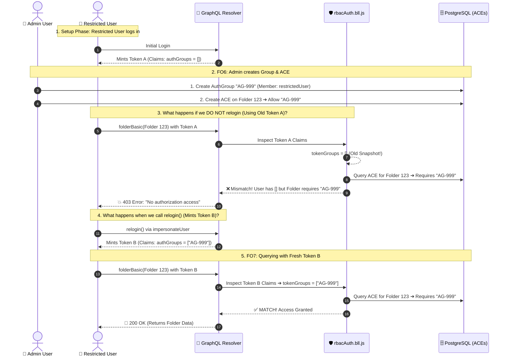

Searched for "_authInfo.authGroups"
Viewed rbacAuth.bll.js:2970-3020
Viewed rbacAuth.bll.js:3200-3240

Your intuition is completely natural: **"An ACE is just a database record attached to a Folder, so why should my user session token need to change?"**

Here is the exact architectural reason why `relogin()` is required in this codebase.

---

### The Short Answer

In Veritone's OLP architecture, authorization is a **two-sided handshake**:

```
[Side A: On the Resource (Database)]          [Side B: On the User (JWT Session Token)]
      Access Control Entry (ACE)                        Signed Token Claims
 "Folder 123 allows AuthGroup-ABC to Read"    VS.    "User holds AuthGroups: [ AuthGroup-ABC ]"
```

When you grant permissions in tests (e.g. in `FO6`, `FO10`, `FO63`):
1. The Admin creates an **`AuthGroup`** and assigns the user to it.
2. The Admin attaches an **ACE** to the folder linking it to that `AuthGroup`.
3. **The problem**: The user's **existing session token was minted earlier** when they belonged to `authGroups: []`. The token's cryptographically signed payload **does not have the new `AuthGroup` ID** inside it.
4. If you do not call `relogin()`, the server looks at the old token, sees `authGroups: []`, compares it with the ACE (`AuthGroup-ABC`), finds no match, and **rejects the request with 403 Forbidden**.

---

### The Step-by-Step Flow: What Happens Inside the Backend

Let's trace what happens when `FO6` runs:



---

### Proof from the Server Codebase

In [`modules/rbacAuth/bll/rbacAuth.bll.js:L2991-L3005`](file:///home/huycao/Repos/veritone-drug/core-graphql-server/modules/rbacAuth/bll/rbacAuth.bll.js#L2991-L3005), you can see how the backend evaluates the user's groups on every incoming request:

```javascript
// Extract the groups signed inside the JWT token
let tokenGroups;
if (_.get(context, 'requestContext.authTokenType') === 'jwt') {
  tokenGroups = _.get(context, 'requestContext.jwtToken.authGroups');
}

// Intersect token groups with DB groups to prevent token tampering
if (tokenGroups) {
  _.set(
    context,
    '_authInfo.authGroups',
    _.intersection(tokenGroups, context._authInfo.authGroups)
  );
}
```

Because the server calculates `_authInfo.authGroups` using `_.intersection(tokenGroups, ...)`, **a user can NEVER exercise the permissions of a group that is missing from their active JWT token claims**.

---

### Real-World Analogy: The Hotel Keycard

Think of it like an electronic door lock:
* **The ACE on the folder** is like installing a new lock on Room 101 that says: *"Open only for Gold Members"*.
* **Your Database record** says you were just upgraded to a Gold Member.
* **Your Session Token** is the physical RFID keycard in your pocket. Because it was encoded yesterday, its magnetic chip still says *"Standard Guest"*.
* When you tap your keycard on Room 101, the door stays locked until you go to the front desk and **re-encode your keycard (`relogin`)**!

---

### Summary
| Action | Database State | Old Session Token | New Token (After `relogin`) |
| :--- | :--- | :--- | :--- |
| **Before `FO6`** | User has no groups | `authGroups: []` | — |
| **Admin creates Group & ACE** | User is in `AG-999`<br>Folder ACE allows `AG-999` | `authGroups: []` *(Stale)* ❌ **Denied** | — |
| **`ctx.relogin()` executed** | User is in `AG-999`<br>Folder ACE allows `AG-999` | — | `authGroups: ['AG-999']` ✅ **Allowed** |