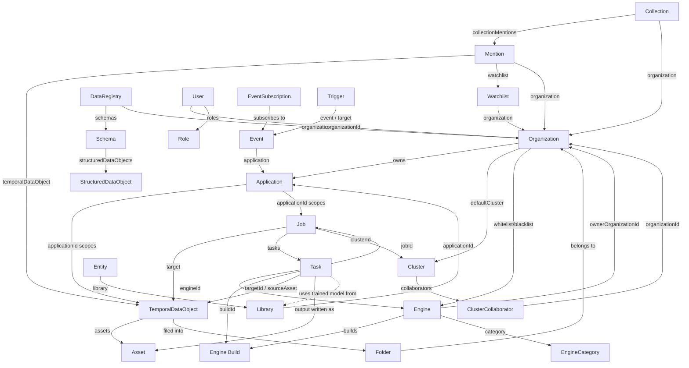

# GraphQL API — How the Topics Work Together

This document explains how the topics described in
[`graphql-topics-overview.md`](graphql-topics-overview.md) reference and depend on each
other. Field names below are taken directly from `schema/schema.graphql` (and
`modules/v3DataModel/v3DataModel.graphql` for `Cluster`/`Library`/`Entity`).

## The big picture

Almost everything in the schema is scoped by **Organization → Application**, and almost
all processing flows through **Job → Task → Engine**, landing its output back on a
**TemporalDataObject (TDO) → Asset**. Compute placement for that processing is chosen via
**Cluster**. Everything else (folders, collections, watchlists, mentions, events, RBAC)
exists to organize, secure, search, or react to that core flow.



## Topic-by-topic relationships

### Organization ↔ Application
`Organization` is the tenant root. `Application` records carry both
`organizationId` (current owner) and `ownerOrganizationId` (original creator), and act as
the authorization boundary most other content is scoped to: many queries accept either
`organizationId` or `applicationId` interchangeably (e.g. `temporalDataObjects`), because
an application ID "maps directly to organization ID" per the schema docs. An
`Application` can be shared to another org (`applicationAddToOrg`,
`sharedWithOrganizationId`) without changing ownership.

### Job ↔ Task ↔ Engine ↔ Build
- A `Job` is created against a `target` (a `TemporalDataObject`, via `targetId`) and is
  scoped to an `applicationId`.
- `createJob` (or `launchSingleEngineJob` / `launchDAGTemplate`) expands into one or more
  `Task`s, each pointing back to its parent `job` (`jobId`) and to the `Engine`
  (`engineId`) and specific `Engine` `Build` (`buildId`) that will run it.
- A `Task` reads from a target (`targetId`/`target`, or `sourceAsset` for asset-level
  input) and, on completion, its `output`/`taskOutput` is typically materialized as a new
  `Asset` on the source TDO (via `createAsset`, driven by the engine).
- `Task`s can be chained: `parentTaskId`/`childTaskIds` model DAG-style dependencies
  (used by `launchDAGTemplate` and `ProcessTemplate`).
- An `Engine` belongs to an `EngineCategory`/`EngineClass`, is owned by an organization
  (`ownerOrganizationId`), and can be public or restricted. Organizations can restrict
  which engines they'll run via `Organization.whitelist`/`blacklist`
  (`addToEngineWhitelist`/`addToEngineBlacklist`), and a `Cluster` can further restrict
  via `Cluster.allowedEngines`.

### Cluster ↔ Job/Task ↔ Organization
- `Job` and `Task` both accept a `clusterId` to pin execution to a specific `Cluster`
  ("Both the organization and the engine must have access to the cluster" — schema doc on
  `createJob`). If omitted, the job runs on the organization's `defaultCluster`.
- `Cluster.jobs` is the inverse lookup — list jobs currently running on a given cluster.
- A `Cluster` is owned by one `organizationId` but can be shared to other organizations as
  a `ClusterCollaborator` (with `owner`/`viewer` permission), which is how one org can let
  another run work on its compute.
- A `Cluster` is composed of `ClusterNode`s (the actual machines/containers); node
  `status` (`running`, `offline`, `paused`, …) reflects real-time health.

### TemporalDataObject (TDO) ↔ Asset ↔ Folder ↔ Mention
- A TDO is the media/content record; `Asset`s (`container` → TDO) hold the actual
  files/data — original media, thumbnails, and **every engine's output** (transcripts,
  detections, etc.) is stored as an `Asset` linked back to the TDO that was processed.
- TDOs are organized into `Folder`s (`fileTemporalDataObject`/`unfileTemporalDataObject`,
  `moveTemporalDataObject`); folders nest and are scoped to an organization/user.
- A `Mention` references a specific `temporalDataObject` (the media where a match was
  found) plus the `watchlist` that produced it and the `organization` it belongs to. This
  is the bridge between raw media/engine-output (TDO/Asset) and monitoring/search
  (Watchlist/Collection below).

### Watchlist ↔ Mention ↔ Collection
- A `Watchlist` defines an ongoing search (brand/advertiser/keyword, `query`,
  `sourceIds`) scoped to an `Organization`; matches are materialized as `Mention`
  records (`Watchlist.mentions`).
- A `Collection` groups `Mention`s for review via `CollectionMention` join records
  (`createCollectionMention`), independent of which watchlist produced them, and can be
  shared externally (`shareCollection` → `SharedCollection`).
- `CognitiveSearch` and `SavedSearch` are alternate, more ad-hoc ways to define/replay a
  search rather than a standing `Watchlist`.

### Library ↔ Entity ↔ Engine/Dataset
- A `Library` (scoped to an `applicationId`, optionally an `organizationId`) holds
  `Entity` records; each `Entity` carries `EntityIdentifier`s (biometric/matching
  templates) of a given `EntityIdentifierType`.
- Recognition-style `Engine`s (face, voice, etc.) are configured with a `libraryId` /
  `LibraryEngineModel` (a trained model built from the library's entities) so that
  `Task`s executed by that engine can match against the library — i.e., Library/Entity is
  the *reference data* that certain Engines consume, distinct from the TDO/Asset content
  being scanned.
- `Dataset` similarly attaches to a `Schema` (see below) and can back a
  `LibraryDataset`, used for training/evaluation rather than live matching.

### DataRegistry ↔ Schema ↔ StructuredDataObject
- A `DataRegistry` (scoped to an organization) owns one or more `Schema` versions
  (`majorVersion`/`minorVersion`); one is marked `publishedSchema`.
- `StructuredDataObject` instances validate against a specific `Schema` and hold
  arbitrary JSON `data` — this is the general-purpose mechanism other topics reuse when
  they need structured, schema-validated metadata rather than the fixed TDO/Asset shape
  (e.g. `Dataset.schema`, ingest pipeline metadata).

### Identity/RBAC ↔ everything else
- Every `User` belongs to an `organizationId` and holds `roles`/`permissions`; every
  mutation in the schema is additionally gated by `@scopes`/`@auth`/`@requireAuthRole`
  directives referencing these roles/permissions (see `schema/directives/`).
  `ApiToken`/`Token` are the credential objects presented on requests; `OpenIdProvider` /
  `InstanceLoginConfiguration` federate authentication to external identity providers per
  organization.
- Because almost all resource types (`TemporalDataObject`, `Folder`, `Job`, etc.) declare
  `@requireAuthRole(resourceType: ...)`, access control is enforced per-object, not just
  per-organization — e.g. `TemporalDataObject.@requireAuthRole` checks `AIWARE_TDO_READ`
  against the specific TDO `id`, not just the caller's org membership.

### Events/Triggers/Notifications ↔ everything else
- Most mutations across every topic above have a corresponding `Event` (or emit one via
  `emitEvent`/`emitSystemEvent`), scoped to an `application`. `EventSubscription` lets a
  consumer (often an `Application`) listen for those events; `EventCustomRule` filters
  which occurrences actually fire; `Trigger` routes a matched `event` to a `target`
  (webhook/consumer). `NotificationMailbox`/`NotificationTemplate` are the user-facing
  counterpart — e.g. notifying a user in-app when *their* job finishes or a mention is
  found.
- This makes Events the cross-cutting "glue" topic: it doesn't own primary data, but
  every other topic can be a source or a sink for it.

### Platform Operations ↔ Job/TDO
- `IngestSlug` / `ProcessingProject` / `ProcessingDeliverable` model managed-ingestion
  workflows that ultimately create TDOs and drive Jobs on behalf of a customer, with
  `AuditLog`/`auditEvents` recording who did what across all of the above.
- `ProcessTemplate` is a reusable `taskList` definition — effectively a saved DAG shape
  that `launchDAGTemplate` / job creation can instantiate against a specific target,
  connecting Platform Operations back to Job/Task.

### Media Cloning & Widgets ↔ Application/Collection
- `CloneRequest` copies TDOs between a `sourceApplicationId` and `destinationApplicationId`
  (optionally including their `Asset`s and `Job` history) — this is how demo/starter
  content gets duplicated into a new customer application, and it reuses the same
  TDO/Asset/Job model rather than being a separate content type.
- `Widget` wraps a `Collection` (`collectionId`) for public embedding — it's a *view* over
  Collections/Mentions, not a new source of data.

### Automation & Templates ↔ Job
- `ProcessTemplate.taskList` is a saved shape of the same `Task` graph that `createJob`
  would otherwise build ad hoc; `launchDAGTemplate` instantiates it against a real target,
  so this topic is best understood as "Job/Task creation, pre-recorded and replayable."
- `createAutomateFlow`/`automatePackage` are the on-ramp into Veritone's separate
  low-code Automate product; they don't return `Job`/`Task` types directly, but the flows
  they create typically end up calling this same Job/Task API themselves.

### Packages ↔ Applications/Engines
- A `Package` is a distribution unit that can reference engines, automate flows, or other
  resources (`packageUpdateResources`) and controls who can install them
  (`packageUpdateGrants`) — think of it as shrink-wrapping pieces of §4/§6/§14 for reuse
  across organizations, similar in spirit to how `ClusterCollaborator`/
  `LibraryCollaborator` share a single Cluster/Library.

### Email & Scheduled Subscriptions ↔ Notifications/Watchlists
- `EmailTemplate`/`PlatformEmailProvider` back both transactional mail (password resets in
  §7) and the scheduled `Subscription` type (§12) — e.g. a watchlist's recurring digest
  email is rendered from an `EmailTemplate` and delivered via `sendEmail`/the configured
  `PlatformEmailProvider`.
- Don't confuse the `Subscription` domain type with `EventSubscription` (§13):
  `EventSubscription` is "notify me in real time when X happens" (routed via `Trigger`),
  while `Subscription` is "send me a report on a schedule regardless of individual events."

## Practical implication for query design

Because Organization/Application scoping and per-object RBAC apply almost everywhere, a
typical multi-topic query (e.g. "TDOs in a folder, with their job history and any
mentions") ends up naturally nesting across these topics in one GraphQL request:

```graphql
query {
  folder(id: "123") {
    name
    # TDOs organized under this folder
  }
  temporalDataObjects(organizationId: "35521", scheduledJobId: "job-abc") {
    records {
      id
      name
      assets { records { id assetType } }
    }
  }
  jobs(targetId: "1570654874") {
    records {
      id
      status
      tasks { records { id engine { name } cluster: clusterId } }
    }
  }
}
```

This single-request composability — pulling from Job/Task/Engine/Cluster/TDO/Folder in
one query — is the main reason the schema is organized the way it is: each topic is a
thin, independently-authorized slice, and relationships are expressed as GraphQL fields
rather than requiring separate REST calls per topic.
