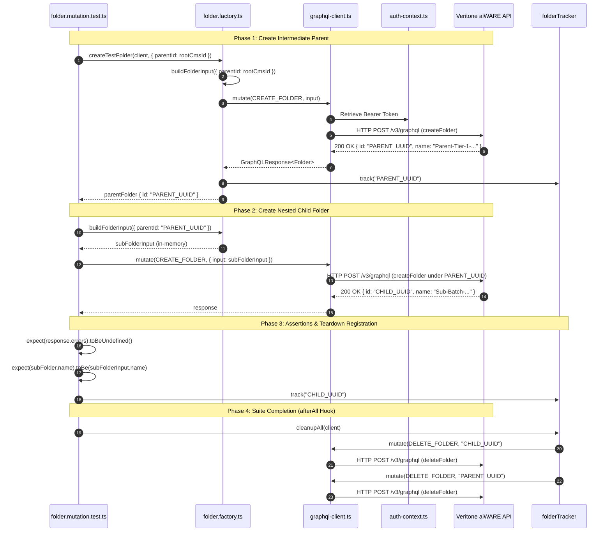

# Technical Report: Multi-Tier Folder Creation Test Execution & Component Workflow

**Test Case Under Analysis:** [`TC_CF_02: Multi-Tier Hierarchy Creation (Deeply Nested Child Folder)`](file:///home/huycao/Coding/Examples/Test-With-Jest/Codebase/tests/folder/folder.mutation.test.ts#L162-L185)  
**Location:** [`tests/folder/folder.mutation.test.ts:L162-L185`](file:///home/huycao/Coding/Examples/Test-With-Jest/Codebase/tests/folder/folder.mutation.test.ts#L162-L185)  
**Target System:** Veritone aiWARE GraphQL API (`https://api.stage.us-1.veritone.com/v3/graphql`)

---

## 1. Executive Summary

In Veritone aiWARE, virtual folders form a Directed Acyclic Graph (DAG) rooted at domain partition nodes (`cms`, `watchlist`, etc.). 

The purpose of **`TC_CF_02`** is to verify **multi-tier hierarchy expansion**:
- It validates that child folders can be created not only directly under the root anchor, but also under existing intermediate subfolders (Level 2+ nesting).
- It proves that the GraphQL resolver accepts an arbitrary intermediate folder ID as a valid `parentId`, links the foreign key hierarchy properly, and preserves domain boundaries (`rootFolderType: cms`).

---

## 2. Line-by-Line Technical Breakdown

```typescript
162: it("TC_CF_02: Multi-Tier Hierarchy Creation (Deeply Nested Child Folder)", async () => {
```
* **Line 162:** Declares an asynchronous Jest test block. Because it interacts with the live staging API, all helper calls and mutation dispatches return Promises (`async/await`).

---

```typescript
163:   const parentFolder = await createTestFolder(client, {
164:     name: `Parent-Tier-1-${Date.now()}`,
165:     parentId: rootCmsId,
166:   });
```
* **Lines 163–166 (Phase 1: Intermediate Parent Setup):**
  - Calls the [`createTestFolder`](file:///home/huycao/Coding/Examples/Test-With-Jest/Codebase/tests/factories/folder.factory.ts#L69) factory helper.
  - Generates a collision-free name using a millisecond timestamp (`Parent-Tier-1-1789099...`).
  - Sets `parentId: rootCmsId` (the tenant's root CMS folder discovered during `beforeAll`).
  - Dispatches the [`CREATE_FOLDER`](file:///home/huycao/Coding/Examples/Test-With-Jest/Codebase/tests/graphql/folder/mutations.ts#L31) mutation to the live API to create and persist this Level-1 parent.
  - Automatically registers `parentFolder.id` with [`folderTracker`](file:///home/huycao/Coding/Examples/Test-With-Jest/Codebase/tests/factories/folder.factory.ts#L18) for future cleanup.

---

```typescript
168:   const subFolderInput = buildFolderInput({
169:     name: `Sub-Batch-${Date.now()}`,
170:     parentId: parentFolder.id,
171:     rootFolderType: "cms",
172:   });
```
* **Lines 168–172 (Phase 2: Nested Child Input Generation):**
  - Calls the [`buildFolderInput`](file:///home/huycao/Coding/Examples/Test-With-Jest/Codebase/tests/factories/folder.factory.ts#L52) builder (Object Mother pattern).
  - Creates the payload **in-memory only** (without making an HTTP request).
  - Explicitly targets `parentId: parentFolder.id`, wiring this node as a Level-2 child under the folder created in lines 163–166.
  - Enforces `rootFolderType: "cms"` to match the parent's domain partition.

---

```typescript
174:   const response = await client.mutate<{ createFolder: { id: string; name: string } }>(
175:     CREATE_FOLDER,
176:     { input: subFolderInput }
177:   );
```
* **Lines 174–177 (Phase 3: Nested Child Mutation Dispatch):**
  - Uses the strongly-typed [`client.mutate()`](file:///home/huycao/Coding/Examples/Test-With-Jest/Codebase/tests/helpers/graphql-client.ts#L26) helper.
  - Dispatches the [`CREATE_FOLDER`](file:///home/huycao/Coding/Examples/Test-With-Jest/Codebase/tests/graphql/folder/mutations.ts#L31) document over HTTPS:
    ```graphql
    mutation CreateFolder($input: CreateFolder!) {
      createFolder(input: $input) {
        id
        name
        description
      }
    }
    ```
  - Attaches the session authorization header (`Authorization: Bearer <token>`) via [`auth-context.ts`](file:///home/huycao/Coding/Examples/Test-With-Jest/Codebase/tests/helpers/auth-context.ts).

---

```typescript
179:   expect(response.errors).toBeUndefined();
180:   const subFolder = response.data?.createFolder;
181:   expect(subFolder).toBeDefined();
182:   expect(subFolder!.name).toBe(subFolderInput.name);
```
* **Lines 179–182 (Phase 4: Behavioral Assertions):**
  - **Error check:** Asserts `response.errors` is `undefined` (verifying no schema rejection, foreign key violation, or permissions failure).
  - **Entity existence check:** Asserts `response.data.createFolder` exists and is non-null.
  - **Integrity check:** Asserts the created folder's `name` returned by the server matches the requested input name.

---

```typescript
184:   folderTracker.track(subFolder!.id);
185: });
```
* **Lines 184–185 (Phase 5: Teardown Registration):**
  - Registers `subFolder.id` with the singleton [`folderTracker`](file:///home/huycao/Coding/Examples/Test-With-Jest/Codebase/tests/factories/folder.factory.ts#L18).
  - When the entire test suite completes, `afterAll` calls `folderTracker.cleanupAll(client)` to delete both the child and parent folders, keeping the staging database pristine.

---

## 3. End-to-End Component Workflow

The following sequence diagram illustrates how each modular architectural layer interacts during the execution of this test:



---

## 4. Virtual Hierarchy State Progression

The test moves the virtual file system DAG through the following topology transitions:

```
[Initial State]
Root CMS (rootCmsId)
 └── (existing tenant assets)

[After Step 1 (Parent Creation)]
Root CMS (rootCmsId)
 └── Parent-Tier-1-xxx (parentFolder.id) [Level 1]

[After Step 2 (Child Creation & Assertion)]
Root CMS (rootCmsId)
 └── Parent-Tier-1-xxx (parentFolder.id) [Level 1]
      └── Sub-Batch-xxx (subFolder.id)   [Level 2 - Deeply Nested]

[After afterAll (Teardown Cleanup)]
Root CMS (rootCmsId)
 (Cleaned up: Sub-Batch deleted first, Parent-Tier-1 deleted second)
```

---

## 5. Architectural Design Principles Exhibited

1. **Separation of Concerns ([jets_setup_suggestion.md](file:///home/huycao/Coding/Examples/.agents/contexts/jets_setup_suggestion.md)):**
   - The test contains **0 lines of HTTP plumbing, headers, or JSON parsing**. All transport mechanics are encapsulated within [`graphql-client.ts`](file:///home/huycao/Coding/Examples/Test-With-Jest/Codebase/tests/helpers/graphql-client.ts).
2. **Object Mother Builder Pattern:**
   - Instead of hardcoding JSON fixtures, [`buildFolderInput`](file:///home/huycao/Coding/Examples/Test-With-Jest/Codebase/tests/factories/folder.factory.ts#L52) provides safe defaults with millisecond-based collision avoidance.
3. **Difference between `build` and `create`:**
   - `buildFolderInput`: Instant in-memory generation.
   - `createTestFolder`: Persisted directly to the database via API.
4. **Deterministic Teardown Guarantee:**
   - Both the intermediate parent and the nested leaf folder register with [`folderTracker`](file:///home/huycao/Coding/Examples/Test-With-Jest/Codebase/tests/factories/folder.factory.ts#L18), ensuring automated `Promise.allSettled` cleanup even if assertions fail.